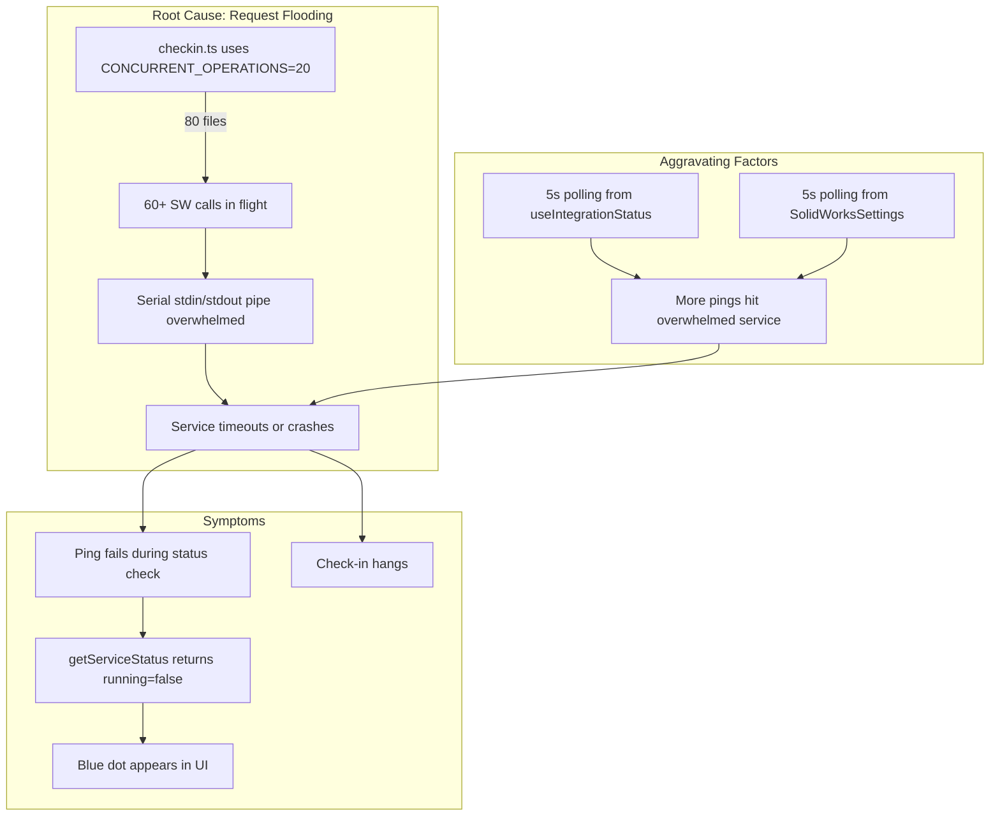

# SolidWorks Service Stability - Comprehensive Multi-Agent Fix

## Problem Summary

During batch operations (e.g., 80-file check-in), the SolidWorks service:
1. Crashes or becomes unresponsive from request flooding
2. Status UI flickers between green and blue every 5 seconds
3. Operations hang, then resume, then hang again

## Root Cause Analysis

### Issue 1: Wrong Concurrency Level (ROOT CAUSE)

[`src/lib/commands/handlers/checkin.ts`](src/lib/commands/handlers/checkin.ts) line 465 uses `CONCURRENT_OPERATIONS` (20) for ALL files, despite `SW_CONCURRENT_OPERATIONS` (3) existing in [`src/lib/concurrency.ts`](src/lib/concurrency.ts).

### Issue 2: No Process Existence Check

[`electron/handlers/solidworks.ts`](electron/handlers/solidworks.ts) line 628-648 reports `running: false` when ping fails, even if the process is alive but busy.

### Issue 3: No Request Queuing

All SW IPC calls go directly to the serial pipe with no rate limiting.

### Issue 4: Duplicate Status Polling

- [`src/hooks/useIntegrationStatus.ts`](src/hooks/useIntegrationStatus.ts) polls every 5s
- [`SolidWorksSettings.tsx`](src/features/settings/integrations/solidworks/SolidWorksSettings.tsx) line 99 also polls every 5s
- Combined: up to 2.5s average between pings when Settings is open

---

## Agent Overview

| Agent | Responsibility | Owns | Dependencies |
|-------|---------------|------|--------------|
| Agent 1 | Command layer concurrency fix | `src/lib/commands/handlers/*` | None |
| Agent 2 | Main process reliability | `electron/handlers/solidworks.ts` | None |
| Agent 3 | Renderer status management | `src/hooks/`, `src/stores/slices/`, SW components | None |
| Agent 4 | Integration testing | Reports only | Agent 1, 2, 3 |

---

## Shared Files

| File | Owner | Rule |
|------|-------|------|
| `src/lib/concurrency.ts` | Agent 1 | May add constants |
| `src/stores/pdmStore.ts` | Agent 3 | May add batch tracking state |
| `src/stores/types.ts` | Agent 3 | May add types for batch tracking |

---

## Agent 1: Command Layer Concurrency Fix

### Prompt

> Fix SolidWorks service flooding in check-in and checkout commands.
>
> **Scope:**
> 1. Modify [`src/lib/commands/handlers/checkin.ts`](src/lib/commands/handlers/checkin.ts) to:
>    - Split file processing into two phases: non-SW files at `CONCURRENT_OPERATIONS` (20), SW files at `SW_CONCURRENT_OPERATIONS` (3)
>    - Add timing logs for SW service call duration
>    - Import `SW_CONCURRENT_OPERATIONS` from concurrency.ts
>
> 2. Review [`src/lib/commands/handlers/checkout.ts`](src/lib/commands/handlers/checkout.ts) for the same issue
>
> **Boundaries:**
> - OWNS: `src/lib/commands/handlers/checkin.ts`, `src/lib/commands/handlers/checkout.ts`
> - MAY ADD TO: `src/lib/concurrency.ts` (new constants only)
> - Do NOT modify: UI components, electron handlers, stores
>
> **Quality Requirements:**
> - Enterprise-level code quality
> - No `any` types
> - Clear comments explaining the two-phase processing strategy
> - Maintain backward compatibility for non-SW files (keep high concurrency)
>
> **Deliverables:**
> - Fixed check-in with SW files processed at concurrency 3
> - Fixed checkout if same issue exists
> - Report in `.cursor/plans/sw-stability-agent1-report.md`
>
> **When complete:** Run `npm run typecheck` and report results.

### Boundary

- **OWNS:** `src/lib/commands/handlers/checkin.ts`, `src/lib/commands/handlers/checkout.ts`
- **MAY ADD TO:** `src/lib/concurrency.ts`
- **READS:** `src/stores/pdmStore.ts`, `electron/preload.ts`

### Tasks

- [ ] Import `SW_CONCURRENT_OPERATIONS` in checkin.ts
- [ ] Split file array into SW and non-SW files before processing
- [ ] Process non-SW files first at concurrency 20
- [ ] Process SW files second at concurrency 3
- [ ] Add timing logs for SW operations
- [ ] Review and fix checkout.ts if needed
- [ ] Run `npm run typecheck`

---

## Agent 2: Main Process Reliability

### Prompt

> Add defensive measures to the SolidWorks IPC handler to prevent false offline reports and manage request load.
>
> **Scope:**
> 1. Modify [`electron/handlers/solidworks.ts`](electron/handlers/solidworks.ts) to:
>    - Add OS-level process existence check using `process.kill(pid, 0)` before assuming offline
>    - Return `busy: true` flag when process exists but ping times out
>    - Use short 2-second timeout for status pings (not blocking timeout)
>    - Add request queue with max concurrent = 3 for SW commands
>    - Cache ping results for 1 second to avoid redundant checks
>    - Improve error messages to indicate busy/queue state
>
> **Boundaries:**
> - OWNS: `electron/handlers/solidworks.ts`
> - READS: `electron/main.ts`, `electron/preload.ts`, `electron/types.ts`
> - Do NOT modify: renderer code
>
> **Quality Requirements:**
> - Enterprise-level code quality
> - No `any` types
> - Clear logging for queue depth, timing, and process state
> - No breaking changes to IPC API signatures
>
> **Deliverables:**
> - Process existence check in getServiceStatus
> - Request queue limiting concurrent SW calls
> - Ping caching (1s TTL)
> - Report in `.cursor/plans/sw-stability-agent2-report.md`
>
> **When complete:** Run `npm run typecheck` and report results.

### Boundary

- **OWNS:** `electron/handlers/solidworks.ts`
- **READS:** `electron/main.ts`, `electron/preload.ts`, `electron/types.ts`

### Tasks

- [ ] Add `checkProcessExists(pid)` helper using signal 0
- [ ] Modify `solidworks:service-status` handler to:
  - [ ] Check if `swServiceProcess.pid` exists at OS level first
  - [ ] Use 2s timeout for ping (not default 5min)
  - [ ] Return `busy: true` if process alive but ping fails
- [ ] Add request queue data structure with max concurrent = 3
- [ ] Wrap `sendSWCommand` with queue management
- [ ] Add ping result caching (1s TTL) to avoid redundant status checks
- [ ] Add `queueDepth` to status response for debugging
- [ ] Add logging for queue and timing metrics
- [ ] Run `npm run typecheck`

---

## Agent 3: Renderer Status Management

### Prompt

> Consolidate SolidWorks status polling and handle busy state properly.
>
> **Scope:**
> 1. Create [`src/hooks/useSolidWorksStatus.ts`](src/hooks/useSolidWorksStatus.ts):
>    - Single source of truth for SW service status
>    - 15-second polling interval (reduced from 5s)
>    - Expose `pausePolling()` / `resumePolling()` for batch operations
>    - Handle `busy` flag from main process
>
> 2. Add batch operation tracking to store:
>    - Add `isBatchSWOperationRunning` flag to pdmStore
>    - Polling auto-pauses when flag is true
>
> 3. Update [`src/stores/slices/integrationsSlice.ts`](src/stores/slices/integrationsSlice.ts):
>    - Handle `busy` flag - don't mark offline when busy
>    - Skip check when `isBatchSWOperationRunning` is true
>
> 4. Migrate components to use consolidated hook:
>    - [`SolidWorksSettings.tsx`](src/features/settings/integrations/solidworks/SolidWorksSettings.tsx) - remove duplicate polling
>    - Other SW components as needed
>
> **Boundaries:**
> - OWNS: `src/hooks/useSolidWorksStatus.ts` (create), `src/stores/slices/integrationsSlice.ts`, listed components
> - MAY ADD TO: `src/stores/pdmStore.ts`, `src/stores/types.ts`, `src/hooks/index.ts`
> - Do NOT modify: command handlers, electron handlers
>
> **Quality Requirements:**
> - Enterprise-level code quality
> - No `any` types
> - JSDoc comments for new hook API
> - Minimal component changes (swap hooks, don't refactor)
>
> **Deliverables:**
> - New `useSolidWorksStatus` hook
> - Updated integrationsSlice with busy handling
> - Batch tracking in store
> - Report in `.cursor/plans/sw-stability-agent3-report.md`
>
> **When complete:** Run `npm run typecheck` and report results.

### Boundary

- **OWNS:** `src/hooks/useSolidWorksStatus.ts` (new), `src/stores/slices/integrationsSlice.ts`, `src/features/settings/integrations/solidworks/SolidWorksSettings.tsx`
- **MAY ADD TO:** `src/stores/pdmStore.ts`, `src/stores/types.ts`, `src/hooks/index.ts`
- **READS:** `electron/preload.ts`, command handlers

### Tasks

- [ ] Create `useSolidWorksStatus.ts` with 15s polling and pause/resume API
- [ ] Add `isBatchSWOperationRunning` and `setIsBatchSWOperationRunning` to pdmStore
- [ ] Update `checkSolidWorksStatus` in integrationsSlice to:
  - [ ] Handle `busy: true` response (don't mark offline)
  - [ ] Skip check when `isBatchSWOperationRunning` is true
- [ ] Remove duplicate polling from `SolidWorksSettings.tsx`
- [ ] Export hook from `src/hooks/index.ts`
- [ ] Run `npm run typecheck`

---

## Agent 4: Integration Testing

### Prompt

> Test and verify all SolidWorks service stability fixes work together.
>
> **Scope:**
> After Agents 1, 2, 3 complete:
> 1. Verify `npm run typecheck` passes
> 2. Test batch check-in of 80 files
> 3. Verify status UI remains stable (no flickering blue)
> 4. Verify service doesn't crash during batch operations
> 5. Verify single file operations still work normally
>
> **Test Scenarios:**
> 1. Check out 80 files, modify them, check them back in
> 2. Monitor status indicator during entire operation
> 3. Kill service externally during operation - verify detection and recovery
> 4. Open Settings during batch operation - verify no additional load
>
> **Deliverables:**
> - Test results in `.cursor/plans/sw-stability-final-report.md`
> - Update plan file with completion status

### Boundary

- **OWNS:** Report files only
- **READS:** All files modified by Agents 1, 2, 3

### Tasks

- [ ] Verify `npm run typecheck` passes
- [ ] Test 80-file batch check-in
- [ ] Verify no status flickering
- [ ] Verify service remains responsive
- [ ] Test single file operations
- [ ] Write final report

---

## Quality Requirements

- No `any` types introduced
- Proper error handling with try/catch
- Clear logging for debugging
- Follows existing patterns in the codebase
- `npm run typecheck` must pass for all agents

---

## Verification Checklist

- [ ] `npm run typecheck` passes
- [ ] Batch check-in (80 files) completes without service crash
- [ ] Status UI remains stable during batch operations
- [ ] No flickering blue dots
- [ ] Single file check-in/checkout unaffected
- [ ] Settings page doesn't cause additional service load