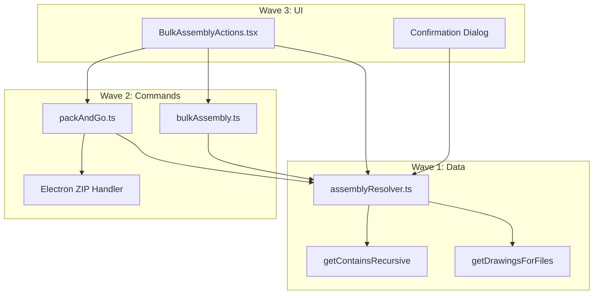

# Bulk Assembly Operations - Multi-Agent Plan

## Objective

Add an "Assembly" context menu submenu for `.sldasm` files that performs bulk operations (download, checkout, checkin, delete, pack and go) on the assembly AND all its associated files (recursive children, sub-assemblies, drawings).

## Agent Overview

| Agent | Wave | Responsibility | Owns | Dependencies |

|-------|------|---------------|------|--------------|

| Agent 1 | 1 | Data layer: queries + resolver | `src/lib/supabase/files/queries.ts`, `src/lib/fileOperations/assemblyResolver.ts` | None |

| Agent 2 | 2 | Bulk command handlers | `src/lib/commands/handlers/bulkAssembly.ts`, `src/lib/commands/types.ts` | Agent 1 |

| Agent 3 | 2 | Pack and Go (Electron IPC) | `electron/handlers/archive.ts`, `src/electron.d.ts` | None |

| Agent 4 | 3 | UI: context menu + dialog | `src/features/source/browser/components/ContextMenu/actions/BulkAssemblyActions.tsx` | Agent 1, 2, 3 |

## Shared Files

| File | Owner | Rule |

|------|-------|------|

| `src/lib/commands/handlers/index.ts` | Agent 2 | Agent 2 registers commands |

| `src/lib/i18n/locales/en.ts` | Agent 4 | Agent 4 adds translations |

| `src/features/source/browser/components/ContextMenu/FileContextMenu.tsx` | Agent 4 | Agent 4 integrates menu |

---

## Wave 1: Foundation (Data Layer)

### Agent 1: Supabase Queries + Assembly Resolver

#### Prompt

> Implement the data layer for bulk assembly operations in BluePLM with enterprise-level code quality.

>

> **Read the full plan:** `.cursor/plans/bulk-assembly-operations.plan.md`

>

> **Scope:**

> 1. Add `getDrawingsForFiles(fileIds: string[])` query to `src/lib/supabase/files/queries.ts`

>    - Find all drawings (`.slddrw`) that reference any of the given file IDs via `file_references` table

>    - Return lightweight file data

> 2. Create `src/lib/fileOperations/assemblyResolver.ts` with:

>    - `resolveAssociatedFiles(rootFileId, orgId, allFiles)` function

>    - Uses existing `getContainsRecursive()` for recursive BOM traversal

>    - Uses new `getDrawingsForFiles()` to find associated drawings

>    - Returns: `{ rootFile, children, drawings, allFiles, stats }`

>

> **Boundaries:**

> - OWNS: `src/lib/supabase/files/queries.ts` (append only), `src/lib/fileOperations/assemblyResolver.ts` (create)

> - READS: `src/stores/pdmStore.ts` (for LocalFile type)

> - Do NOT modify: Any other files

>

> **Quality Requirements:**

> - Enterprise-level code quality and organization

> - Proper TypeScript types (no `any`)

> - Error handling for missing references, circular dependencies

> - JSDoc comments on public functions

>

> **Deliverables:**

> - Working `getDrawingsForFiles()` query

> - Working `resolveAssociatedFiles()` function

> - Report in `AGENT1_REPORT.md`

>

> **When complete:** Run `npm run typecheck` and report results.

#### Boundary

- **OWNS (exclusive write):** `src/lib/fileOperations/assemblyResolver.ts`, append to `src/lib/supabase/files/queries.ts`
- **READS (no modify):** `src/stores/pdmStore.ts`, `src/lib/supabase/files/queries.ts` (existing code)

#### Tasks

- [x] Add `getDrawingsForFiles()` query to queries.ts
- [x] Create `assemblyResolver.ts` with `resolveAssociatedFiles()` function
- [x] Add types: `AssociatedFilesResult`, `AssociatedFilesStats`
- [x] Handle edge cases: no references, circular refs, missing files
- [x] Run typecheck and verify

**Status:** ✅ COMPLETE - See `AGENT1_REPORT.md`

#### Deliverables

- `getDrawingsForFiles()` - query to find drawings referencing a set of files
- `resolveAssociatedFiles()` - main resolver function
- `AGENT1_REPORT.md` with changes and verification results

---

## Wave 2: Commands & Electron (Backend)

### Agent 2: Bulk Command Handlers

#### Prompt

> Implement bulk assembly command handlers for BluePLM with enterprise-level code quality.

>

> **Read the full plan:** `.cursor/plans/bulk-assembly-operations.plan.md`

>

> **Prerequisite:** Wave 1 must be complete. Verify `src/lib/fileOperations/assemblyResolver.ts` exists.

>

> **Scope:**

> 1. Create `src/lib/commands/handlers/bulkAssembly.ts` with commands:

>    - `bulk-download-assembly` - download all associated files

>    - `bulk-checkout-assembly` - checkout all associated files

>    - `bulk-checkin-assembly` - checkin all associated files

>    - `bulk-delete-assembly` - delete all associated local files

> 2. Add param types to `src/lib/commands/types.ts`

> 3. Register commands in `src/lib/commands/handlers/index.ts`

>

> **Pattern:** Each command should:

> - Call `resolveAssociatedFiles()` to get file list

> - Delegate to existing command's `.execute()` method (don't duplicate logic)

> - Use existing `ProgressTracker` for progress UI

>

> **Boundaries:**

> - OWNS: `src/lib/commands/handlers/bulkAssembly.ts` (create), `src/lib/commands/types.ts` (append), `src/lib/commands/handlers/index.ts` (append)

> - READS: `src/lib/commands/handlers/download.ts`, `checkout.ts`, `checkin.ts`, `delete.ts`

> - Do NOT modify: Existing command files

>

> **Quality Requirements:**

> - Enterprise-level code quality

> - Follow existing command patterns exactly (see checkout.ts for reference)

> - Proper error handling and progress tracking

>

> **Deliverables:**

> - 4 working bulk commands

> - Report in `AGENT2_REPORT.md`

>

> **When complete:** Run `npm run typecheck` and report results.

#### Boundary

- **OWNS (exclusive write):** `src/lib/commands/handlers/bulkAssembly.ts`, append to `types.ts`, append to `handlers/index.ts`
- **READS (no modify):** Existing command handlers (`download.ts`, `checkout.ts`, etc.)

#### Tasks

- [ ] Add `BulkAssemblyParams` type to types.ts
- [ ] Create `bulkAssembly.ts` with 4 command handlers
- [ ] Register commands in handlers/index.ts
- [ ] Run typecheck and verify

#### Deliverables

- 4 bulk command handlers
- `AGENT2_REPORT.md`

---

### Agent 3: Pack and Go (Electron IPC)

#### Prompt

> Implement Pack and Go (ZIP export) functionality for BluePLM with enterprise-level code quality.

>

> **Read the full plan:** `.cursor/plans/bulk-assembly-operations.plan.md`

>

> **Scope:**

> 1. Create/extend Electron handler for ZIP creation:

>    - Add `createZipFromFiles(files: Array<{path: string, relativePath: string}>, outputPath: string)` IPC handler

>    - Use `jszip` package (already a dependency) to create ZIP

>    - Preserve relative folder structure in ZIP

> 2. Add TypeScript types to `src/electron.d.ts`

> 3. Create `pack-and-go` command in `src/lib/commands/handlers/packAndGo.ts`:

>    - Opens save dialog for destination

>    - Calls Electron IPC to create ZIP

>    - Shows progress during ZIP creation

>

> **Boundaries:**

> - OWNS: `electron/handlers/` (create archive handler or extend existing), `src/electron.d.ts` (append), `src/lib/commands/handlers/packAndGo.ts` (create)

> - READS: `electron/handlers/index.ts` (for registration pattern)

> - Do NOT modify: Other Electron handlers

>

> **Quality Requirements:**

> - Handle large files efficiently (streaming)

> - Error handling for disk full, permission denied

> - Progress reporting during ZIP creation

>

> **Deliverables:**

> - Working ZIP creation IPC handler

> - Working `pack-and-go` command

> - Report in `AGENT3_REPORT.md`

>

> **When complete:** Run `npm run typecheck` and report results.

#### Boundary

- **OWNS (exclusive write):** `electron/handlers/` (archive), `src/electron.d.ts` (append), `src/lib/commands/handlers/packAndGo.ts`
- **READS (no modify):** `electron/handlers/index.ts`, `electron/main.ts`

#### Tasks

- [ ] Add `createZipFromFiles` IPC handler to Electron
- [ ] Add types to electron.d.ts
- [ ] Create packAndGo.ts command handler
- [ ] Register command in handlers/index.ts
- [ ] Run typecheck and verify

#### Deliverables

- ZIP creation IPC handler
- `pack-and-go` command
- `AGENT3_REPORT.md`

---

## Wave 3: UI (Frontend)

### Agent 4: Context Menu + Integration

#### Prompt

> Implement the "Assembly" context menu submenu for BluePLM with enterprise-level code quality.

>

> **Read the full plan:** `.cursor/plans/bulk-assembly-operations.plan.md`

>

> **Prerequisite:** Waves 1 and 2 must be complete. Verify:

> - `src/lib/fileOperations/assemblyResolver.ts` exists

> - `src/lib/commands/handlers/bulkAssembly.ts` exists

> - `src/lib/commands/handlers/packAndGo.ts` exists

>

> **Scope:**

> 1. Create `src/features/source/browser/components/ContextMenu/actions/BulkAssemblyActions.tsx`:

>    - "Assembly" submenu with items: Download All, Check Out All, Check In All, Delete All, Pack and Go

>    - Only show for single synced `.sldasm` files

>    - Position: immediately after "Insert into Assembly" in context menu

> 2. Add confirmation dialog before bulk operations:

>    - Show file count and breakdown (assemblies, parts, drawings)

>    - Show warnings for checked-out-by-others, cloud-only files

> 3. Integrate into `FileContextMenu.tsx`

> 4. Export from `actions/index.ts`

> 5. Add translations to `src/lib/i18n/locales/en.ts`

>

> **Boundaries:**

> - OWNS: `BulkAssemblyActions.tsx` (create), modify `FileContextMenu.tsx`, modify `actions/index.ts`, append to `en.ts`

> - READS: Existing action components for patterns

> - Do NOT modify: Other action components

>

> **Quality Requirements:**

> - Match existing context menu patterns exactly

> - Accessible keyboard navigation

> - Proper loading states during file resolution

>

> **Deliverables:**

> - Working "Assembly" context menu submenu

> - Confirmation dialog

> - Report in `AGENT4_REPORT.md`

>

> **When complete:** Run `npm run typecheck` and report results.

#### Boundary

- **OWNS (exclusive write):** `BulkAssemblyActions.tsx`, `FileContextMenu.tsx`, `actions/index.ts`, append to `en.ts`
- **READS (no modify):** Other action components, `ContextSubmenu.tsx`

#### Tasks

- [ ] Create BulkAssemblyActions.tsx component
- [ ] Add confirmation dialog with file preview
- [ ] Integrate into FileContextMenu.tsx (after AssemblyActions)
- [ ] Export from actions/index.ts
- [ ] Add i18n translations
- [ ] Run typecheck and verify

#### Deliverables

- Working context menu submenu
- Confirmation dialog
- `AGENT4_REPORT.md`

---

## Verification Checklist

After all waves complete:

- [ ] `npm run typecheck` passes
- [ ] Right-click on `.sldasm` shows "Assembly" submenu
- [ ] "Download All" downloads assembly + all children + drawings
- [ ] "Check Out All" checks out all associated files
- [ ] "Check In All" checks in all associated files  
- [ ] "Delete All" removes local copies of all associated files
- [ ] "Pack and Go" creates ZIP with correct folder structure
- [ ] Confirmation dialog shows accurate file counts
- [ ] Error cases handled gracefully (missing refs, checked out by others)

---

## Architecture Reference

