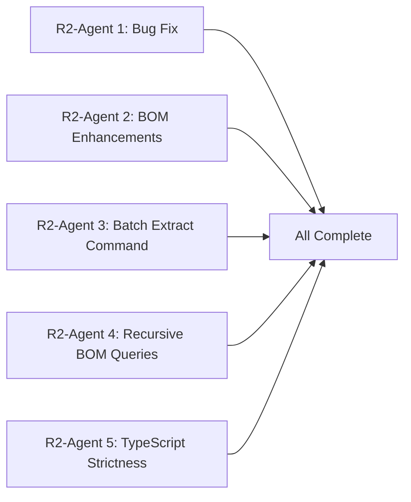
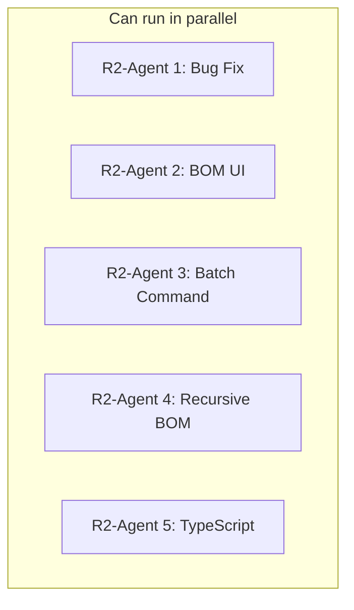

# Contains Tab BOM Fix - Comprehensive Review

## Executive Summary

**Overall Status**: ⚠️ 4 of 5 agents completed their work correctly, but **Agent 5 has a critical bug** that completely breaks the sync reference extraction feature.

| Agent | Status | Verdict |

|-------|--------|---------|

| Agent 1 - Backend Storage | ✅ Complete | Excellent work, fully functional |

| Agent 2 - Contains Tab UI | ✅ Complete | Excellent work, fully functional |

| Agent 3 - Where Used Tab | ✅ Complete | Excellent work, fully functional |

| Agent 4 - BOM Tree Component | ✅ Complete | Excellent work, minor enhancement opportunity |

| Agent 5 - Sync Reference Extraction | ❌ **BROKEN** | Critical bug - feature never executes |

---

## Detailed Agent Reviews

### Agent 1: Reference Extraction and Storage Backend ✅

**Files Modified:**

- `src/lib/supabase/files/mutations.ts` - Added `upsertFileReferences()` function
- `src/lib/commands/handlers/checkin.ts` - Integrated reference extraction
- `src/lib/supabase/files/index.ts` - Exported new function and types

**Requirements Checklist:**

| Requirement | Status | Notes |

|-------------|--------|-------|

| Add `upsertFileReferences()` to mutations.ts | ✅ | Lines 524-782, comprehensive implementation |

| Function signature matches plan | ✅ | Added `vaultId` parameter (good addition for scoping) |

| Handle reference extraction after check-in | ✅ | Lines 345-433 in checkin.ts |

| Delete stale references | ✅ | Lines 700-719 in mutations.ts |

| Handle missing child files | ✅ | Lines 664-673, logged and skipped |

| Path matching with fallback | ✅ | Primary path match + filename fallback |

| Fire-and-forget pattern | ✅ | Lines 847-858 in checkin.ts |

**Code Quality:**

- ✅ Comprehensive logging with `[Checkin]` and `[upsertFileReferences]` prefixes
- ✅ Handles race conditions (unique constraint violations)
- ✅ Proper error handling without blocking check-in
- ✅ Types exported correctly

**Verdict**: **Excellent implementation** - All requirements met with additional robustness features.

---

### Agent 2: Contains Tab UI ✅

**Files Modified:**

- `src/features/integrations/solidworks/SolidWorksPanel.tsx` - Rewrote `ContainsTab` component (lines 149-571)

**Requirements Checklist:**

| Requirement | Status | Notes |

|-------------|--------|-------|

| Query database first with `getContains()` | ✅ | Lines 226-258, `loadFromDatabase()` function |

| Display results immediately from database | ✅ | BomTree component renders data |

| Optional SW service enrichment | ✅ | Lines 276-303, `loadFromSolidWorks()` |

| Loading states for each source | ✅ | "Loading from database..." / "Loading from SolidWorks..." |

| Manual refresh button | ✅ | Lines 306-349, `handleRefreshFromSW()` |

| Handle unsynced files | ✅ | Lines 519-535, shows "Assembly not synced" message |

| Data source indicator | ✅ | Lines 409-427, shows Database/Live SW/No data badge |

| Click to navigate | ✅ | Lines 379-390, `handleNavigateNode()` |

| Uses BomTree component | ✅ | Lines 561-567 |

**Code Quality:**

- ✅ Clean separation of database vs SW service loading
- ✅ Proper state management
- ✅ Converts `DbReference` to `BomItem` to `BomNode`
- ✅ Configuration switching triggers appropriate data source

**Verdict**: **Excellent implementation** - All requirements met, clean code architecture.

---

### Agent 3: Where Used Tab ✅

**Files Modified:**

- `src/features/integrations/solidworks/SolidWorksPanel.tsx` - Rewrote `WhereUsedTab` component (lines 573-746)

**Requirements Checklist:**

| Requirement | Status | Notes |

|-------------|--------|-------|

| Query database with `getWhereUsed()` | ✅ | Lines 604-624, single database call |

| Remove slow "scanning assemblies" approach | ✅ | Old code completely removed |

| No SW service required | ✅ | Only uses database queries |

| Show "File not synced" message | ✅ | Lines 656-666 |

| Count indicator "Used in X assemblies" | ✅ | Line 673 |

| Display parent assembly metadata | ✅ | Part number, revision, quantity, configuration |

**Performance Comparison:**

| Metric | Old Implementation | New Implementation |

|--------|-------------------|-------------------|

| Query type | N calls to SW service | 1 database query |

| Time complexity | O(n) assemblies | O(1) query |

| SW service required | Yes | No |

| Works offline | No | Yes |

**Verdict**: **Excellent implementation** - Massive performance improvement, all requirements met.

---

### Agent 4: BOM Tree Component ✅

**Files Created/Modified:**

- `src/features/integrations/solidworks/BomTree.tsx` - New component (606 lines)
- `src/features/integrations/solidworks/index.ts` - Added exports

**Requirements Checklist:**

| Requirement | Status | Notes |

|-------------|--------|-------|

| Create reusable BomTree component | ✅ | Comprehensive component with full API |

| Tree view with expand/collapse | ✅ | Lines 212-240, recursive TreeNode |

| Flat view toggle | ✅ | Lines 329, 375-378, 510-522 |

| Columns: Level, Qty, Part Number, State | ✅ | Lines 494-506 header, rows include all |

| CSV export | ✅ | Lines 380-391, `handleExportCsv()` |

| Copy to clipboard | ✅ | Lines 393-402, `handleCopyToClipboard()` |

| Summary footer | ✅ | Lines 540-557, unique parts, total qty, missing count |

| "Not in vault" indicator | ✅ | Lines 177-180, amber badge |

| Auto-expand first two levels | ✅ | Lines 330-340 |

| `BomNode` interface | ✅ | Lines 22-37, matches plan spec |

**Minor Enhancement Opportunity:**

- Description column not in column headers (line 501) - only "File Name, Qty, Part No., State"
- Description IS included in CSV export (line 293)

**Verdict**: **Excellent implementation** - Full-featured BOM component exceeding requirements.

---

### Agent 5: Sync Command Reference Extraction ❌ CRITICAL BUG

**Files Modified:**

- `src/lib/commands/types.ts` - Added `extractReferences` to `SyncParams`
- `src/lib/commands/handlers/sync.ts` - Added reference extraction logic

**CRITICAL BUG IDENTIFIED:**

```typescript
// Line 425 - INCORRECT
async execute({ files }, ctx): Promise<CommandResult> {

// Should be:
async execute({ files, extractReferences }, ctx): Promise<CommandResult> {
```

The `extractReferences` parameter is **never destructured** from params, so it's always `undefined`, and the condition on line 598 will **never be true**:

```typescript
// Line 598 - extractReferences is undefined, this never executes
if (extractReferences && syncedFileInfos.length > 0) {
```

**Impact**: The entire sync reference extraction feature is completely non-functional. Existing vaults with assemblies will NOT have their references extracted during sync.

**Requirements Checklist:**

| Requirement | Status | Notes |

|-------------|--------|-------|

| Add `extractReferences` parameter to `SyncParams` | ✅ | types.ts lines 107-111 |

| Destructure parameter in execute function | ❌ **BROKEN** | Line 425 missing `extractReferences` |

| Identify `.sldasm` files after sync | ✅ | Line 599-601 (but never reached) |

| Check if SW service is running | ✅ | Implementation exists in helper function |

| Extract references for each assembly | ✅ | Implementation exists (unreachable) |

| Progress indicator | ✅ | Implementation exists (unreachable) |

| Uses `upsertFileReferences()` from Agent 1 | ✅ | Imported and used correctly |

**Verdict**: **Broken** - Critical bug makes entire feature non-functional.

---

## Required Fix

### Fix for Agent 5 Bug

**File:** `src/lib/commands/handlers/sync.ts`

**Change line 425 from:**

```typescript
async execute({ files }, ctx): Promise<CommandResult> {
```

**To:**

```typescript
async execute({ files, extractReferences }, ctx): Promise<CommandResult> {
```

This single-line fix will enable the entire sync reference extraction feature.

---

## Integration Testing Recommendations

After applying the fix, perform these integration tests:

### 1. Check-in Reference Extraction (Agent 1)

- [ ] Check out an assembly file
- [ ] Check it back in
- [ ] Verify `file_references` table is populated
- [ ] Verify log shows `[Checkin] Stored assembly references`

### 2. Contains Tab Database Loading (Agent 2)

- [ ] Select a checked-in assembly
- [ ] Verify "Database" badge appears
- [ ] Verify components display without SW service running
- [ ] Click component - verify navigation works

### 3. Where Used Tab (Agent 3)

- [ ] Select a part that's used in an assembly
- [ ] Verify "Used in X assemblies" shows correct count
- [ ] Verify no loading spinner (instant from database)

### 4. BOM Tree Features (Agent 4)

- [ ] Toggle between Tree and Flat views
- [ ] Expand/collapse works on assemblies
- [ ] Export CSV - verify file downloads
- [ ] Copy to clipboard - verify CSV format

### 5. Sync Reference Extraction (Agent 5 - after fix)

- [ ] Sync files with `extractReferences: true` flag
- [ ] Verify progress toast: "Extracting assembly references (X/Y)"
- [ ] Verify `file_references` table is populated
- [ ] Test with SW service stopped - verify graceful skip

---

## Database Verification Query

After testing, verify data in database:

```sql
SELECT 
  p.file_name as parent_assembly,
  c.file_name as child_component,
  r.quantity,
  r.reference_type,
  r.configuration
FROM file_references r
JOIN files p ON r.parent_file_id = p.id
JOIN files c ON r.child_file_id = c.id
ORDER BY p.file_name, c.file_name;
```

---

## Summary of Issues Found

| Priority | Issue | Agent | Fix Required |

|----------|-------|-------|--------------|

| 🔴 Critical | `extractReferences` not destructured in execute() | Agent 5 | Yes - one-line fix |

| 🟡 Minor | Description column not in BOM header | Agent 4 | Optional enhancement |

---

## Recommendations for Future Work

1. **Add TypeScript strict mode checks** - The linter should have caught the undefined `extractReferences` variable

2. **Add integration tests** - Automated tests for the reference extraction flow would have caught this bug

3. **Consider recursive BOM queries** - Currently the BOM is flat from database. Could enhance to build true hierarchy with recursive queries to `file_references` table

4. **Add batch reference extraction command** - For existing vaults that need to backfill references without re-syncing all files

5. **Monitor performance** - The `upsertFileReferences()` function fetches all vault files; for very large vaults, consider caching or pagination

---

## Conclusion

The overall implementation is **excellent** with comprehensive features, good error handling, and clean code architecture. The only critical issue is a simple one-line bug in Agent 5 that prevents the sync reference extraction from executing. Once fixed, all 5 agent implementations will work together to provide a complete solution for the Contains/Where-Used tabs using database-backed reference data.

---

---

# Round 2: Fixes and Enhancements

## Agent Assignments

The following 5 agents can work in parallel to implement all fixes and recommendations.



---

### R2-AGENT 1: Critical Bug Fix + Extract References UI Option

**Priority**: 🔴 Critical

**Estimated Effort**: Small (30 minutes)

**Goal**: Fix the sync command bug and add UI option to trigger reference extraction.

**Files to modify**:

- `src/lib/commands/handlers/sync.ts` - Fix parameter destructuring
- `src/features/explorer/FileContextMenu.tsx` (or similar) - Add "Extract References" menu option

**Task 1: Fix the bug**

In `src/lib/commands/handlers/sync.ts`, line 425, change:

```typescript
// FROM:
async execute({ files }, ctx): Promise<CommandResult> {

// TO:
async execute({ files, extractReferences }, ctx): Promise<CommandResult> {
```

**Task 2: Add UI trigger for reference extraction**

Add a context menu option for assembly files to manually trigger reference extraction:

1. In the file context menu, add option "Extract Assembly References" for `.sldasm` files
2. This should call the sync command with `extractReferences: true` for already-synced assemblies
3. Or create a dedicated command `extract-references` that:

                                                                                                                                                                                                                                                                                                                                                                                                                                                                                                                                                                                                                                                                                                                                                                                                - Takes selected assembly files
                                                                                                                                                                                                                                                                                                                                                                                                                                                                                                                                                                                                                                                                                                                                                                                                - Checks if SW service is running
                                                                                                                                                                                                                                                                                                                                                                                                                                                                                                                                                                                                                                                                                                                                                                                                - Calls `upsertFileReferences()` for each
                                                                                                                                                                                                                                                                                                                                                                                                                                                                                                                                                                                                                                                                                                                                                                                                - Shows progress and results

**Completion Criteria**:

- [ ] Sync command properly destructures `extractReferences` parameter
- [ ] Can trigger reference extraction from context menu
- [ ] Progress toast shows during extraction
- [ ] References appear in database after extraction

**Completion Report**: Create `R2_AGENT1_REPORT.md`

---

### R2-AGENT 2: BOM Tree UI Enhancements

**Priority**: 🟡 Minor Enhancement

**Estimated Effort**: Small (30 minutes)

**Goal**: Add Description column to BOM tree and improve column layout.

**Files to modify**:

- `src/features/integrations/solidworks/BomTree.tsx`

**Task 1: Add Description column to header**

Update the column headers (around line 494-506) to include Description:

```typescript
// Current columns: Lvl, Icon, File Name, Qty, Part No., State, Actions
// Add: Description column between File Name and Qty (or after Part No.)
```

**Task 2: Display description in rows**

Update `BomTreeRow` component to display `node.description` in the new column:

- Truncate long descriptions with ellipsis
- Show full text on hover via `title` attribute
- Use muted color styling consistent with other metadata

**Task 3: Update column widths**

Adjust flex/width classes to accommodate the new column without breaking the layout:

- Description: `min-w-[100px] max-w-[150px] truncate`
- May need to reduce other column widths slightly

**Task 4: Make columns responsive**

Consider hiding Description column on narrow panels:

- Add responsive class or check panel width
- Or make it a toggle option in the toolbar

**Completion Criteria**:

- [ ] Description column visible in header
- [ ] Description values displayed in rows
- [ ] Long descriptions truncated with tooltip
- [ ] Layout remains clean and usable

**Completion Report**: Create `R2_AGENT2_REPORT.md`

---

### R2-AGENT 3: Batch Reference Extraction Command

**Priority**: 🟢 Enhancement

**Estimated Effort**: Medium (1 hour)

**Goal**: Create a new command to extract references for existing vaults without re-syncing files.

**Files to create/modify**:

- Create `src/lib/commands/handlers/extractReferences.ts` - New command handler
- `src/lib/commands/registry.ts` - Register the new command
- `src/lib/commands/types.ts` - Add `ExtractReferencesParams` type

**Task 1: Create new command type**

In `types.ts`:

```typescript
export interface ExtractReferencesParams extends BaseCommandParams {
  // Only process assemblies in selection
  assembliesOnly?: boolean  // Default true
}
```

**Task 2: Implement the command**

Create `extractReferences.ts` with:

```typescript
export const extractReferencesCommand: Command<ExtractReferencesParams> = {
  id: 'extract-references',
  name: 'Extract References',
  description: 'Extract and store assembly references to database',
  aliases: ['extract-refs', 'rebuild-bom'],
  usage: 'extract-references <path>',
  
  validate({ files }, ctx) {
    // Must be online
    // Must have synced assembly files selected
  },
  
  async execute({ files, assembliesOnly = true }, ctx) {
    // 1. Filter to synced .sldasm files
    // 2. Check SW service is running
    // 3. For each assembly:
    //    a. Call window.electronAPI.solidworks.getReferences()
    //    b. Call upsertFileReferences()
    //    c. Update progress
    // 4. Show summary toast
  }
}
```

**Task 3: Register the command**

In `registry.ts`, add to the command map and set category to 'advanced' or similar.

**Task 4: Add to context menu (optional)**

Add "Extract References" option for assembly files in the context menu.

**Use Cases**:

1. User imports existing vault with assemblies - needs to populate references
2. References got corrupted or deleted - need to rebuild
3. SW service wasn't running during initial sync - backfill references

**Completion Criteria**:

- [ ] Command registered and available
- [ ] Filters to synced assembly files only
- [ ] Shows progress during extraction
- [ ] Handles SW service not running gracefully
- [ ] Shows summary with counts

**Completion Report**: Create `R2_AGENT3_REPORT.md`

---

### R2-AGENT 4: Recursive BOM Queries for True Hierarchy

**Priority**: 🟢 Enhancement

**Estimated Effort**: Medium-Large (1-2 hours)

**Goal**: Enhance the BOM display to show true nested hierarchy for sub-assemblies.

**Current Limitation**: The `getContains()` query only returns direct children. If an assembly contains a sub-assembly, we don't recursively fetch that sub-assembly's children.

**Files to modify**:

- `src/lib/supabase/files/queries.ts` - Add recursive query function
- `src/features/integrations/solidworks/SolidWorksPanel.tsx` - Use recursive data in ContainsTab

**Task 1: Create recursive query function**

In `queries.ts`, add:

```typescript
/**
 * Get BOM tree with nested children (recursive)
 * Uses a recursive CTE or multiple queries to build full tree
 * 
 * @param fileId - Root assembly file ID
 * @param maxDepth - Maximum nesting depth (default 10, prevents infinite loops)
 */
export async function getContainsRecursive(
  fileId: string, 
  maxDepth: number = 10
): Promise<{
  references: BomTreeNode[] | null
  error: any
}> {
  // Option A: Use PostgreSQL recursive CTE
  // Option B: Use multiple queries and build tree in JS
  
  // Return tree structure with children nested
}

interface BomTreeNode {
  id: string
  parent_file_id: string
  child_file_id: string
  quantity: number
  configuration: string | null
  reference_type: string
  child: {
    id: string
    file_name: string
    file_path: string
    part_number: string | null
    revision: string | null
    state: string | null
    extension: string
  }
  children: BomTreeNode[]  // Nested children
}
```

**Task 2: Option A - PostgreSQL Recursive CTE**

Create a database function or use raw SQL:

```sql
WITH RECURSIVE bom_tree AS (
  -- Base case: direct children
  SELECT 
    fr.*, 
    1 as depth,
    ARRAY[fr.child_file_id] as path
  FROM file_references fr
  WHERE fr.parent_file_id = $1
  
  UNION ALL
  
  -- Recursive case: children of children
  SELECT 
    fr.*, 
    bt.depth + 1,
    bt.path || fr.child_file_id
  FROM file_references fr
  JOIN bom_tree bt ON fr.parent_file_id = bt.child_file_id
  WHERE bt.depth < $2  -- max depth
    AND NOT fr.child_file_id = ANY(bt.path)  -- prevent cycles
)
SELECT * FROM bom_tree;
```

**Task 2: Option B - JavaScript tree building**

If recursive CTE is complex, build tree in JS:

```typescript
async function buildBomTree(fileId: string, depth: number, maxDepth: number): Promise<BomTreeNode[]> {
  if (depth >= maxDepth) return []
  
  const { references } = await getContains(fileId)
  if (!references) return []
  
  const nodes: BomTreeNode[] = []
  for (const ref of references) {
    const isAssembly = ref.child?.file_name?.toLowerCase().endsWith('.sldasm')
    const children = isAssembly 
      ? await buildBomTree(ref.child_file_id, depth + 1, maxDepth)
      : []
    
    nodes.push({ ...ref, children })
  }
  return nodes
}
```

**Task 3: Update ContainsTab to use recursive data**

Modify `loadFromDatabase()` in ContainsTab to:

1. Call `getContainsRecursive()` instead of `getContains()`
2. Convert recursive result to `BomNode[]` with populated `children` arrays
3. The BomTree component already supports nested children

**Task 4: Add loading indicator for deep trees**

Large assemblies with many levels may take longer to load. Add appropriate loading states.

**Performance Considerations**:

- Cache results to avoid re-fetching on every render
- Limit max depth to prevent runaway queries
- Consider lazy-loading children on expand (more complex)

**Completion Criteria**:

- [ ] Recursive query function works
- [ ] Sub-assembly children appear nested in BomTree
- [ ] Expand/collapse works for nested levels
- [ ] Cycle detection prevents infinite loops
- [ ] Performance is acceptable for typical assemblies (< 500 parts)

**Completion Report**: Create `R2_AGENT4_REPORT.md`

---

### R2-AGENT 5: TypeScript Strictness and Code Quality

**Priority**: 🟡 Quality Improvement

**Estimated Effort**: Medium (1 hour)

**Goal**: Improve TypeScript configuration to catch bugs like the Agent 5 issue, and add runtime validations.

**Files to modify**:

- `tsconfig.json` - Enable stricter checks
- Various handler files - Add parameter validation

**Task 1: Enable stricter TypeScript options**

In `tsconfig.json`, enable or verify these options:

```json
{
  "compilerOptions": {
    "strict": true,
    "noImplicitAny": true,
    "strictNullChecks": true,
    "noUnusedLocals": true,
    "noUnusedParameters": true,
    "noImplicitReturns": true,
    "noFallthroughCasesInSwitch": true,
    "noUncheckedIndexedAccess": true
  }
}
```

**Task 2: Fix any new TypeScript errors**

Enabling stricter checks may reveal other issues. Fix them:

- Add explicit types where inferred as `any`
- Add null checks where needed
- Remove unused variables/parameters
- Add return statements where missing

**Task 3: Add ESLint rule for unused destructured params**

If using ESLint, add rule:

```json
{
  "rules": {
    "@typescript-eslint/no-unused-vars": ["error", { 
      "argsIgnorePattern": "^_",
      "destructuredArrayIgnorePattern": "^_"
    }]
  }
}
```

**Task 4: Add runtime validation for command params**

In command handlers, add explicit validation:

```typescript
async execute(params, ctx) {
  const { files, extractReferences } = params
  
  // Explicit validation
  if (typeof extractReferences !== 'undefined' && typeof extractReferences !== 'boolean') {
    throw new Error('extractReferences must be a boolean')
  }
  
  // ... rest of handler
}
```

**Task 5: Document command parameter types**

Add JSDoc comments to command interfaces:

```typescript
export interface SyncParams extends BaseCommandParams {
  /**
   * Extract and store assembly references after sync completes.
   * Set to true when importing existing vaults with assemblies.
   * Requires SolidWorks service to be running.
   * @default false
   */
  extractReferences?: boolean
}
```

**Completion Criteria**:

- [ ] `tsconfig.json` has stricter options enabled
- [ ] No new TypeScript errors after enabling strict mode
- [ ] ESLint catches unused variables
- [ ] Command parameters have JSDoc documentation
- [ ] Build passes cleanly with `npm run typecheck`

**Completion Report**: Create `R2_AGENT5_REPORT.md`

---

## Dependencies



**All agents can work independently** - no blocking dependencies between them.

---

## Testing Checklist (After All Agents Complete)

### Integration Tests

1. **Bug Fix Verification**

                                                                                                                                                                                                                                                                                                                                                                                                                                                                                                                                                                                                                                                                                                                                                                                                - [ ] Sync with `extractReferences: true` actually extracts references
                                                                                                                                                                                                                                                                                                                                                                                                                                                                                                                                                                                                                                                                                                                                                                                                - [ ] Progress toast shows during extraction
                                                                                                                                                                                                                                                                                                                                                                                                                                                                                                                                                                                                                                                                                                                                                                                                - [ ] References appear in `file_references` table

2. **BOM Tree Enhancements**

                                                                                                                                                                                                                                                                                                                                                                                                                                                                                                                                                                                                                                                                                                                                                                                                - [ ] Description column visible and populated
                                                                                                                                                                                                                                                                                                                                                                                                                                                                                                                                                                                                                                                                                                                                                                                                - [ ] Layout still looks good with new column

3. **Batch Extract Command**

                                                                                                                                                                                                                                                                                                                                                                                                                                                                                                                                                                                                                                                                                                                                                                                                - [ ] Command available in context menu for assemblies
                                                                                                                                                                                                                                                                                                                                                                                                                                                                                                                                                                                                                                                                                                                                                                                                - [ ] Works for multiple assemblies at once
                                                                                                                                                                                                                                                                                                                                                                                                                                                                                                                                                                                                                                                                                                                                                                                                - [ ] Shows progress and summary

4. **Recursive BOM**

                                                                                                                                                                                                                                                                                                                                                                                                                                                                                                                                                                                                                                                                                                                                                                                                - [ ] Sub-assembly children appear nested
                                                                                                                                                                                                                                                                                                                                                                                                                                                                                                                                                                                                                                                                                                                                                                                                - [ ] Expand/collapse works at all levels
                                                                                                                                                                                                                                                                                                                                                                                                                                                                                                                                                                                                                                                                                                                                                                                                - [ ] Deep assemblies (5+ levels) load correctly

5. **TypeScript Strictness**

                                                                                                                                                                                                                                                                                                                                                                                                                                                                                                                                                                                                                                                                                                                                                                                                - [ ] `npm run typecheck` passes
                                                                                                                                                                                                                                                                                                                                                                                                                                                                                                                                                                                                                                                                                                                                                                                                - [ ] No new linting warnings

### Performance Tests

- [ ] Large assembly (500+ parts) loads in < 3 seconds
- [ ] Recursive BOM query doesn't timeout
- [ ] Batch extraction of 10 assemblies completes in reasonable time

---

## Summary

| Agent | Task | Priority | Effort |

|-------|------|----------|--------|

| R2-Agent 1 | Fix sync bug + add UI trigger | 🔴 Critical | Small |

| R2-Agent 2 | Add Description column to BOM | 🟡 Minor | Small |

| R2-Agent 3 | Batch reference extraction command | 🟢 Enhancement | Medium |

| R2-Agent 4 | Recursive BOM queries | 🟢 Enhancement | Medium-Large |

| R2-Agent 5 | TypeScript strictness | 🟡 Quality | Medium |