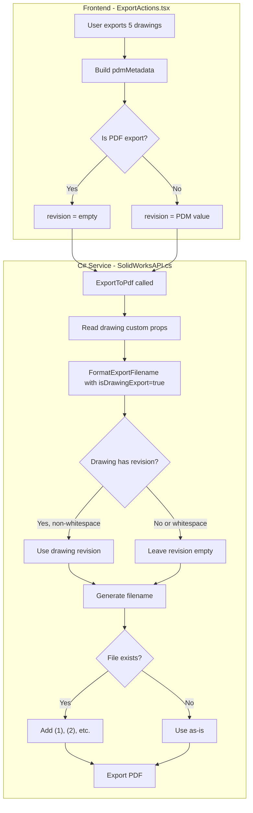

# Drawing PDF Export Fixes

## Root Cause Analysis

From the logs, I identified three distinct issues:

### Issue 1: Revision Source Problem

The current code reads revision from the drawing's custom properties, then falls back to PDM metadata. But for drawings, **revisions are driven by drawing revision tables** - the PDM revision (which may come from the parent part) should NOT be used as fallback.

Log evidence:

```
[Export] Found 6 SW file properties:
[Export]   'Revision' = ' '          <-- Drawing has whitespace-only revision
[Export] PDM metadata fallback: revision='A'    <-- PDM has revision from parent part
[Export] Final resolved: revision=' '  <-- Used SW prop (wrong - whitespace should be empty)
```

### Issue 2: Whitespace-Only Revision Not Handled

The `GetRevision()` function trims the value, but the check `value.Length > 0` happens BEFORE trim, so `" "` passes the check and returns `""` after trim. However, the fallback logic at line 2372 uses `string.IsNullOrEmpty(revision)` which correctly identifies `""` as empty. The real problem is that for drawings, we should NOT fall back to PDM revision at all.

### Issue 3: Missing File Due to Filename Collision

Two drawings with the same part number and tab number generate identical filenames. The second export overwrites the first. No collision detection exists.

---

## Implementation Plan

### 1. SolidWorksAPI.cs - Drawing-Only Revision Logic

In `FormatExportFilename()`, add a `isDrawingExport` parameter to distinguish drawing exports:

```csharp
// For drawings: ONLY use drawing's own Revision property
// Do NOT fall back to PDM revision (it comes from parent part)
if (isDrawingExport)
{
    // Revision for drawings is authoritative from the drawing file
    // If drawing has no revision, leave it empty - don't inherit from PDM
}
else
{
    // For parts/assemblies: PDM fallback is acceptable
    if (string.IsNullOrWhiteSpace(revision) && !string.IsNullOrWhiteSpace(pdmMetadata?.Revision))
    {
        revision = pdmMetadata.Revision.Trim();
    }
}
```

Key changes in [SolidWorksAPI.cs](solidworks-service/BluePLM.SolidWorksService/SolidWorksAPI.cs):

- Line ~2315: Add `bool isDrawingExport = false` parameter to `FormatExportFilename`
- Line ~2358: Use `string.IsNullOrWhiteSpace()` instead of `string.IsNullOrEmpty()` for revision check
- Line ~2372: Skip PDM revision fallback when `isDrawingExport == true`
- Line ~1115: Pass `isDrawingExport: true` when calling from `ExportToPdf`

### 2. SolidWorksAPI.cs - Filename Collision Handling

Add a helper method to generate unique filenames:

```csharp
private string GetUniqueFilePath(string basePath)
{
    if (!File.Exists(basePath))
        return basePath;
    
    var dir = Path.GetDirectoryName(basePath)!;
    var name = Path.GetFileNameWithoutExtension(basePath);
    var ext = Path.GetExtension(basePath);
    
    int counter = 1;
    string newPath;
    do
    {
        newPath = Path.Combine(dir, $"{name} ({counter}){ext}");
        counter++;
    } while (File.Exists(newPath));
    
    return newPath;
}
```

Apply in `ExportToPdf()` at line ~1116:

```csharp
finalOutputPath = GetUniqueFilePath(Path.Combine(outputDir, fileName));
```

### 3. ExportActions.tsx - Remove PDM Revision for Drawings

The frontend currently sends `pdmMetadata.revision` from the PDM database. For drawings, we should explicitly NOT send this:

In [ExportActions.tsx](src/features/source/browser/components/ContextMenu/actions/ExportActions.tsx) around line 128:

```typescript
const pdmMetadata = {
  partNumber: fullItemNumber,
  tabNumber,
  // For drawings: don't send revision - let drawing's own property be authoritative
  revision: format === 'pdf' ? '' : revision,
  description
}
```

### 4. Rebuild Service Binary

The C# changes require rebuilding the SolidWorks service. The current binary is stale and doesn't include even the earlier trim fixes.

---

## Data Flow After Fix



---

## Files to Modify

1. **[SolidWorksAPI.cs](solidworks-service/BluePLM.SolidWorksService/SolidWorksAPI.cs)**

   - Add `isDrawingExport` parameter to `FormatExportFilename`
   - Use `string.IsNullOrWhiteSpace()` for revision checks
   - Skip PDM revision fallback for drawing exports
   - Add `GetUniqueFilePath()` collision handler
   - Apply collision handler in `ExportToPdf`

2. **[ExportActions.tsx](src/features/source/browser/components/ContextMenu/actions/ExportActions.tsx)**

   - Don't send PDM revision for PDF (drawing) exports

3. **Rebuild service binary** after C# changes

---

## UI Enhancement: Property Source Icons

Currently, all locked drawing fields use the same `FileInput` icon with muted styling. The user wants distinct icons to show WHERE the data comes from:

### Current State

All three cells use: `<FileInput size={12} className="text-plm-fg-muted/50" />`

### Proposed Icons

**Model-Driven Properties (Item Number, Description)**

- Icon: Arrow + Box composite (shows data flows from 3D model)
- Lucide icons: `ArrowRight` + `Box` or use `BoxSelect`
- Tooltip: "Inherited from referenced model"

**Drawing-File-Driven Property (Revision)**

- Icon: Arrow + File (shows data comes from drawing file/revision table)  
- Lucide icons: `ArrowRight` + `FileText` or composite
- Tooltip: "Driven by drawing revision table"

### Files to Modify

1. **[ItemNumberCell.tsx](src/features/source/browser/components/FileList/cells/ItemNumberCell.tsx)** line 380

   - Replace: `<FileInput size={12} className="ml-1 text-plm-fg-muted/50" />`
   - With: Arrow + Box composite icon

2. **[DescriptionCell.tsx](src/features/source/browser/components/FileList/cells/DescriptionCell.tsx)**

   - Add similar Arrow + Box icon when `isDrawingLocked`

3. **[RevisionCell.tsx](src/features/source/browser/components/FileList/cells/RevisionCell.tsx)** line 95

   - Replace: `<FileInput size={12} className="text-plm-fg-muted/50" />`
   - With: Arrow + File composite icon (keep current style but make more visible)

### Icon Implementation

```tsx
// Model-driven icon (for ItemNumber, Description)
<span className="inline-flex items-center gap-0.5 text-plm-fg-muted">
  <ArrowRight size={10} />
  <Box size={12} />
</span>

// File-driven icon (for Revision)
<span className="inline-flex items-center gap-0.5 text-plm-fg-muted">
  <ArrowRight size={10} />
  <FileText size={12} />
</span>
```