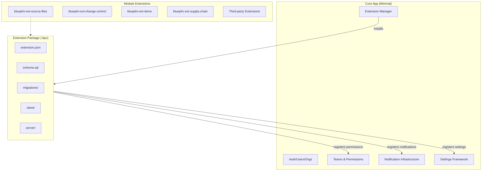
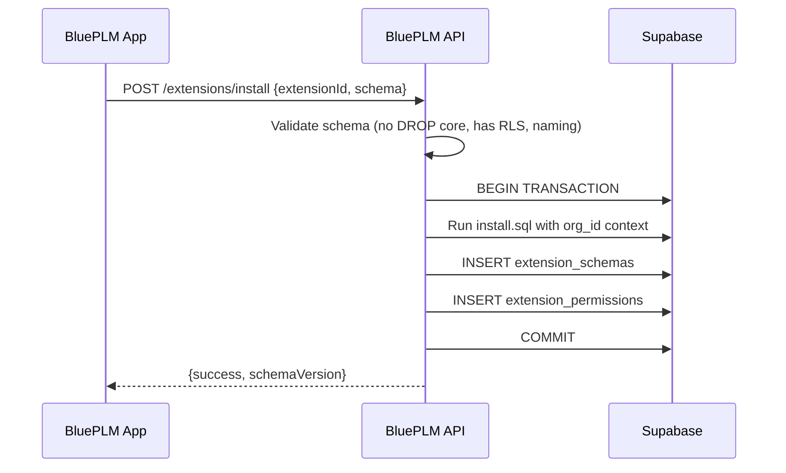
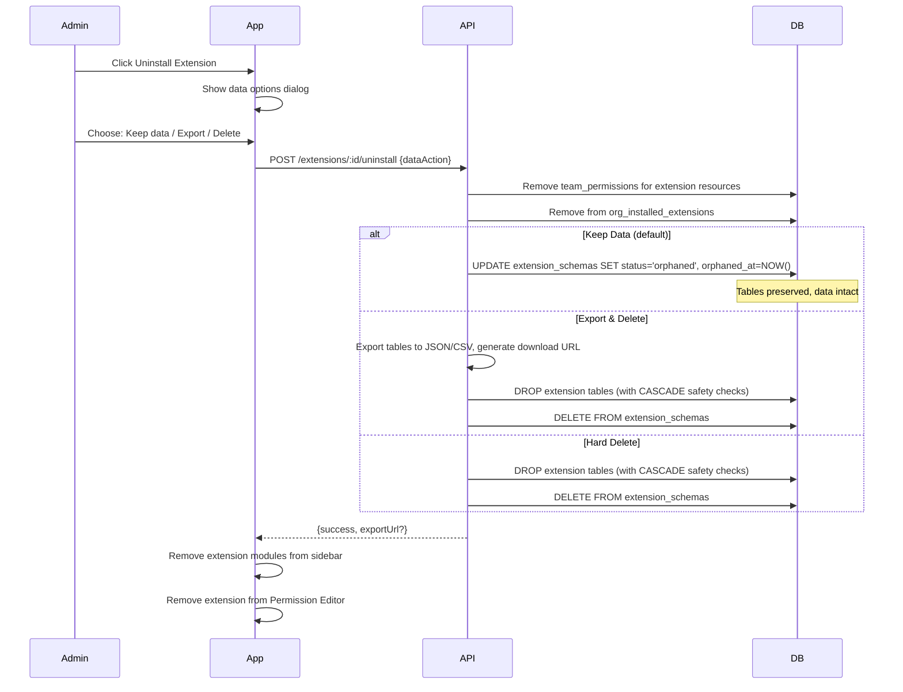
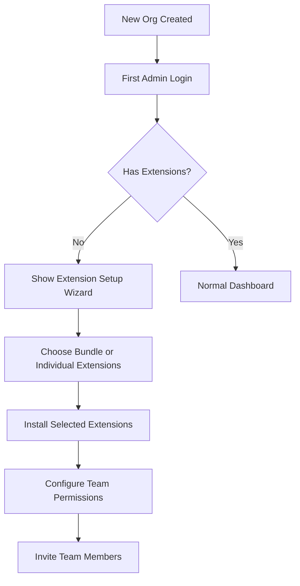

# Extensible Module Architecture

Transform BluePLM into a fully extensible platform where business modules (source files, change control, items, supply chain) become installable extensions with their own repositories, schemas, and permissions.

## Architecture Overview



## Two-Level Access Control Model

Extensions use a **two-level access control model**: org-level installation and team-level access.

### Level 1: Organization Installation (Admin Only)

Only organization administrators can install or uninstall extensions. When installed:

- The extension's database schema is deployed to the organization's Supabase instance
- The extension's permission resources are registered in `extension_permissions`
- The extension appears in the admin's Extension Manager and Permission Editor

**Key principle**: Schema is deployed once per organization, not per team or per user.

### Level 2: Team Access Control (Admin Configures)

After installation, admins control which teams can access each extension:

- Grant/revoke permissions per team via the existing `team_permissions` table
- Control action granularity (view, create, edit, delete, admin)
- Support scoped permissions (e.g., per-vault access for Source Files)

**Key principle**: Users only see modules in the sidebar if their team has at least `view` permission.

### Visual Model

```
┌─────────────────────────────────────────────────────────────────────┐
│                         ORGANIZATION                                 │
│                                                                      │
│  ADMIN INSTALLS (org-wide, schema deployed once):                   │
│  ┌────────────────────────────────────────────────────────────────┐ │
│  │  Source Files    Change Control    Items    Quality            │ │
│  └────────────────────────────────────────────────────────────────┘ │
│                                                                      │
│  ADMIN CONFIGURES TEAM ACCESS:                                       │
│  ┌────────────────┐  ┌────────────────┐  ┌────────────────┐        │
│  │  Engineering   │  │    Finance     │  │    Quality     │        │
│  │     Team       │  │     Team       │  │     Team       │        │
│  ├────────────────┤  ├────────────────┤  ├────────────────┤        │
│  │ Source Files   │  │ Items (view)   │  │ Source Files   │        │
│  │   (full)       │  │                │  │   (view only)  │        │
│  │ Change Control │  │                │  │ Quality (full) │        │
│  │   (full)       │  │                │  │ Change Control │        │
│  │ Items (full)   │  │                │  │   (edit)       │        │
│  └────────────────┘  └────────────────┘  └────────────────┘        │
│                                                                      │
│  USER SEES: Only modules their team has permission for               │
└─────────────────────────────────────────────────────────────────────┘
```

### Database Flow

```sql
-- 1. Admin installs "Source Files" extension
--    API deploys schema, then:
INSERT INTO org_installed_extensions (org_id, extension_id, version, manifest, ...)
VALUES ('org-uuid', 'blueplm.source-files', '1.0.0', '{...}');

INSERT INTO extension_schemas (org_id, extension_id, schema_version, status)
VALUES ('org-uuid', 'blueplm.source-files', 1, 'active');

-- 2. Extension's declared permissions are registered (global, not per-org)
INSERT INTO extension_permissions (extension_id, resource, actions, description, scoped)
VALUES 
  ('blueplm.source-files', 'source-files:files', '{view,create,edit,delete,admin}', 'File access', true),
  ('blueplm.source-files', 'source-files:vaults', '{view,create,edit,delete,admin}', 'Vault management', false),
  ('blueplm.source-files', 'source-files:workflows', '{view,create,edit,delete,admin}', 'Workflows', false);

-- 3. Admin grants team permissions (per-org, per-team)
INSERT INTO team_permissions (team_id, resource, vault_id, actions)
VALUES
  -- Engineering: full access to all vaults
  ('engineering-team', 'source-files:files', NULL, '{view,create,edit,delete}'),
  ('engineering-team', 'source-files:vaults', NULL, '{view,create,edit,delete,admin}'),
  
  -- Quality: view-only for files, but only in "Released" vault
  ('quality-team', 'source-files:files', 'released-vault-id', '{view}');
```

### Sidebar Visibility Logic

```typescript
// src/components/layout/Sidebar.tsx (conceptual)

function shouldShowModule(moduleId: string, user: User): boolean {
  const module = installedModules[moduleId]
  
  // 1. Extension must be installed for this org
  if (!module) return false
  
  // 2. User's team must have at least 'view' permission on this extension
  const extensionResources = getExtensionResources(module.extensionId)
  const hasAnyAccess = extensionResources.some(resource => 
    user.hasPermission(resource, 'view')
  )
  
  return hasAnyAccess
}

// Result: Finance team user sees NO source files modules
// Result: Quality team user sees source files modules (view-only UI)
// Result: Engineering team user sees source files modules (full UI)
```

### Permission Editor Integration

When admin opens Team Permissions for a team:

1. **Core permissions** (always shown): `system:users`, `system:teams`, `system:org-settings`
2. **Extension permissions** (dynamic): Only shown if extension is installed

   - "Source Files" section appears with its declared resources
   - "Change Control" section appears with its declared resources
   - Uninstalled extensions don't appear
```typescript
// PermissionsEditor.tsx (conceptual)

// Fetch installed extensions for this org
const { data: installedExts } = await supabase
  .from('org_installed_extensions')
  .select('extension_id')
  .eq('org_id', orgId)

// Fetch permission declarations for installed extensions
const { data: extPermissions } = await supabase
  .from('extension_permissions')
  .select('*')
  .in('extension_id', installedExts.map(e => e.extension_id))

// Build dynamic permission groups
const permissionGroups = [
  { name: 'Core', resources: coreResources },
  ...groupBy(extPermissions, 'extension_id').map(group => ({
    name: getExtensionName(group.extension_id),
    resources: group.resources
  }))
]
```


## 1. Extension Package Structure

Each module extension will have this structure in its repository:

```
blueplm-ext-source-files/
├── extension.json           # Manifest with permissions, contributions
├── schema/
│   ├── install.sql          # Tables, types, functions for fresh install
│   ├── uninstall.sql        # Cleanup (soft-delete by default)
│   └── migrations/
│       ├── 001_initial.sql
│       ├── 002_add_workflows.sql
│       └── ...
├── client/                  # UI components
│   ├── index.ts
│   └── components/
├── server/                  # API handlers
│   ├── index.ts
│   └── handlers/
└── README.md
```

## 2. Enhanced extension.json Manifest

Extend the current manifest to include schema and permission declarations:

```json
{
  "id": "blueplm.source-files",
  "name": "Source Files",
  "version": "1.0.0",
  "category": "module",
  
  "schema": {
    "version": 1,
    "install": "schema/install.sql",
    "uninstall": "schema/uninstall.sql",
    "migrations": "schema/migrations/"
  },
  
  "permissions": {
    "declares": [
      {
        "resource": "source-files:files",
        "actions": ["view", "create", "edit", "delete", "admin"],
        "description": "Access to files in vaults",
        "scoped": true
      },
      {
        "resource": "source-files:vaults",
        "actions": ["view", "create", "edit", "delete", "admin"],
        "description": "Vault management"
      },
      {
        "resource": "source-files:workflows",
        "actions": ["view", "create", "edit", "delete", "admin"],
        "description": "Workflow templates and transitions"
      }
    ],
    "client": ["ui:toast", "storage:local", "..."],
    "server": ["storage:database", "..."]
  },
  
  "contributes": {
    "modules": [
      { "id": "explorer", "name": "Explorer", "icon": "FolderTree", "view": "..." },
      { "id": "pending", "name": "Pending Changes", "icon": "ArrowDownUp", "view": "..." }
    ],
    "moduleGroups": [
      { "id": "source-files", "name": "Source Files", "isMasterToggle": true }
    ],
    "notificationTypes": [
      { "id": "file-checked-out", "title": "File Checked Out", "category": "source-files" },
      { "id": "workflow-approval-needed", "title": "Approval Needed", "category": "source-files" }
    ],
    "settings": [...],
    "commands": [...]
  }
}
```

## 3. Schema Management System

### 3.1 New Database Tables (in core)

Add to [`supabase/core.sql`](bluePLM/supabase/core.sql):

```sql
-- Extension schema registry
CREATE TABLE IF NOT EXISTS extension_schemas (
  org_id UUID NOT NULL REFERENCES organizations(id) ON DELETE CASCADE,
  extension_id TEXT NOT NULL,
  schema_version INTEGER NOT NULL,
  installed_at TIMESTAMPTZ DEFAULT NOW(),
  installed_by UUID REFERENCES users(id),
  migration_history JSONB DEFAULT '[]',
  status TEXT DEFAULT 'active' CHECK (status IN ('active', 'orphaned', 'migrating')),
  orphaned_at TIMESTAMPTZ,
  PRIMARY KEY (org_id, extension_id)
);

-- Extension permission declarations
CREATE TABLE IF NOT EXISTS extension_permissions (
  extension_id TEXT NOT NULL,
  resource TEXT NOT NULL,
  actions permission_action[] NOT NULL,
  description TEXT,
  scoped BOOLEAN DEFAULT false,  -- true = per-vault permissions
  PRIMARY KEY (extension_id, resource)
);
```

### 3.2 API Schema Execution Flow



### 3.3 API Endpoints for Schema Management

Add to [`api/routes/extensions.ts`](bluePLM/api/routes/extensions.ts):

- `POST /extensions/:id/schema/install` - Run install.sql for org
- `POST /extensions/:id/schema/migrate` - Run pending migrations
- `POST /extensions/:id/schema/uninstall` - Soft-delete (mark orphaned)
- `DELETE /extensions/:id/schema/purge` - Hard delete (admin only)
- `GET /extensions/:id/schema/status` - Get schema version, migration status

## 4. Dynamic Permission System

This section details the technical implementation of the permission system described in the Two-Level Access Control Model above.

### 4.1 Permission Declaration vs. Permission Grant

**Important distinction:**

- `extension_permissions` = **Declaration** (what permissions exist, global)
- `team_permissions` = **Grant** (what teams have access, per-org per-team)

When an extension is installed:

1. Its permission declarations are registered in `extension_permissions` (if not already there)
2. The admin can then grant those permissions to teams via `team_permissions`
3. When uninstalled, declarations remain (idempotent), but team grants can be cleaned up

### 4.2 Permission Registration on Install

```typescript
// In API: POST /extensions/:id/schema/install
async function installExtensionSchema(orgId: string, extensionId: string, manifest: ExtensionManifest) {
  // 1. Deploy schema (transactional)
  await deploySchema(orgId, manifest.schema.install)
  
  // 2. Register permission declarations (global, upsert)
  for (const perm of manifest.permissions.declares) {
    await supabase.from('extension_permissions').upsert({
      extension_id: extensionId,
      resource: perm.resource,
      actions: perm.actions,
      description: perm.description,
      scoped: perm.scoped ?? false
    }, { onConflict: 'extension_id,resource' })
  }
  
  // 3. Record schema installation for this org
  await supabase.from('extension_schemas').upsert({
    org_id: orgId,
    extension_id: extensionId,
    schema_version: manifest.schema.version,
    status: 'active',
    installed_at: new Date().toISOString(),
    installed_by: currentUserId
  })
  
  // 4. Add to org's installed extensions
  await supabase.from('org_installed_extensions').upsert({
    org_id: orgId,
    extension_id: extensionId,
    version: manifest.version,
    manifest: manifest,
    // ... other fields
  })
}
```

### 4.3 Permission Check Flow

The existing `user_has_permission()` function works unchanged because it queries `team_permissions`:

```sql
-- Existing function (no changes needed)
CREATE OR REPLACE FUNCTION user_has_permission(
  p_user_id UUID,
  p_resource TEXT,
  p_action permission_action,
  p_vault_id UUID DEFAULT NULL
) RETURNS BOOLEAN AS $$
BEGIN
  -- Admins always have access
  IF is_org_admin(p_user_id) THEN RETURN true; END IF;
  
  -- Check team permissions (works for both core AND extension resources)
  RETURN EXISTS(
    SELECT 1 FROM team_members tm
    JOIN team_permissions tp ON tm.team_id = tp.team_id
    WHERE tm.user_id = p_user_id
      AND tp.resource = p_resource
      AND p_action = ANY(tp.actions)
      AND (tp.vault_id IS NULL OR tp.vault_id = p_vault_id)
  );
END;
$$ LANGUAGE plpgsql SECURITY DEFINER;
```

**Key insight**: Extension permissions use the same `team_permissions` table as core permissions. The only difference is the resource naming convention:

- Core: `system:users`, `system:teams`, `system:org-settings`
- Extensions: `source-files:files`, `change-control:ecos`, `items:boms`

### 4.4 Permissions UI Integration

Modify [`PermissionsEditor.tsx`](bluePLM/src/features/settings/organization/PermissionsEditor.tsx) to:

1. Query `extension_permissions` for installed extensions
2. Dynamically build permission groups based on what's installed
3. Show/hide permission sections when extensions are installed/uninstalled
```typescript
// PermissionsEditor.tsx

interface PermissionGroup {
  id: string
  name: string
  icon: string
  resources: Array<{
    resource: string
    actions: PermissionAction[]
    description: string
    scoped: boolean
  }>
}

async function loadPermissionGroups(orgId: string): Promise<PermissionGroup[]> {
  // 1. Core permissions (always present)
  const coreGroup: PermissionGroup = {
    id: 'core',
    name: 'System',
    icon: 'Settings',
    resources: [
      { resource: 'system:users', actions: ['view', 'create', 'edit', 'delete', 'admin'], description: 'User management', scoped: false },
      { resource: 'system:teams', actions: ['view', 'create', 'edit', 'delete', 'admin'], description: 'Team management', scoped: false },
      { resource: 'system:org-settings', actions: ['view', 'edit', 'admin'], description: 'Organization settings', scoped: false },
    ]
  }
  
  // 2. Fetch installed extensions for this org
  const { data: installedExts } = await supabase
    .from('org_installed_extensions')
    .select('extension_id, manifest')
    .eq('org_id', orgId)
    .eq('enabled', true)
  
  if (!installedExts?.length) return [coreGroup]
  
  // 3. Fetch permission declarations for installed extensions
  const { data: extPermissions } = await supabase
    .from('extension_permissions')
    .select('*')
    .in('extension_id', installedExts.map(e => e.extension_id))
  
  // 4. Group permissions by extension
  const extGroups = installedExts.map(ext => ({
    id: ext.extension_id,
    name: ext.manifest.name,
    icon: ext.manifest.icon || 'Package',
    resources: extPermissions
      .filter(p => p.extension_id === ext.extension_id)
      .map(p => ({
        resource: p.resource,
        actions: p.actions,
        description: p.description,
        scoped: p.scoped
      }))
  }))
  
  return [coreGroup, ...extGroups]
}
```


## 5. Module Registry Integration

### 5.1 Dynamic Module Types

Currently, `ModuleId` is a static union type. Transform to a registry pattern:

```typescript
// src/types/modules.ts - Add dynamic module support
interface DynamicModule {
  id: string
  extensionId: string
  name: string
  icon: string
  group: string
  viewComponent: string  // Path to component in extension
  defaultEnabled: boolean
}

// In store
installedModules: Record<string, DynamicModule>
```

### 5.2 Sidebar Registration

When an extension registers modules via `contributes.modules`, the sidebar dynamically includes them:

```typescript
// In modulesSlice.ts
function registerExtensionModules(extensionId: string, modules: ExtensionModule[]) {
  for (const mod of modules) {
    set(state => ({
      installedModules: {
        ...state.installedModules,
        [mod.id]: {
          id: mod.id,
          extensionId,
          name: mod.name,
          icon: mod.icon,
          group: mod.group,
          viewComponent: mod.view,
          defaultEnabled: mod.defaultEnabled ?? true
        }
      }
    }))
  }
}
```

## 6. Core Refactoring

### 6.1 What Stays in Core

[`supabase/core.sql`](bluePLM/supabase/core.sql) remains as-is with additions:

- Organizations, Users, Teams, Team Members
- Team Permissions, User Permissions, Permission Presets
- Notifications table (generic)
- User Sessions, Admin Recovery Codes
- Extension management tables (schemas, permissions)

### 6.2 What Becomes Extensions

| Current Module | New Extension ID | Repository |

|----------------|------------------|------------|

| Source Files | `blueplm.source-files` | `blueplm-ext-source-files` |

| Change Control | `blueplm.change-control` | `blueplm-ext-change-control` |

| Items/BOMs | `blueplm.items` | `blueplm-ext-items` |

| Supply Chain | `blueplm.supply-chain` | `blueplm-ext-supply-chain` |

| Quality | `blueplm.quality` | `blueplm-ext-quality` |

| Production | `blueplm.production` | `blueplm-ext-production` |

## 7. Uninstall & Data Lifecycle

### 7.1 What Gets Cleaned Up

When an extension is uninstalled, different things happen at different levels:

| Level | What Happens | Reversible? |

|-------|--------------|-------------|

| `org_installed_extensions` | Row removed | Yes (reinstall) |

| `team_permissions` | Grants for extension resources removed | Yes (re-grant) |

| `extension_schemas` | Status set to 'orphaned' (soft delete) | Yes (reconnect) |

| Actual schema tables | Kept (soft delete) or dropped (hard delete) | Depends |

| `extension_permissions` | Kept (global declarations) | N/A |

**Key insight**: Permission declarations in `extension_permissions` are NOT removed on uninstall. They're global (not per-org) and idempotent. Only the team grants are removed.

### 7.2 Soft Delete Flow (Default)



### 7.3 Permission Cleanup on Uninstall

```typescript
// In API: POST /extensions/:id/uninstall
async function uninstallExtension(orgId: string, extensionId: string, dataAction: 'keep' | 'export' | 'delete') {
  // 1. Get extension's declared resources
  const { data: extPerms } = await supabase
    .from('extension_permissions')
    .select('resource')
    .eq('extension_id', extensionId)
  
  const resources = extPerms.map(p => p.resource)
  
  // 2. Remove team permission grants for this org's teams
  const { data: orgTeams } = await supabase
    .from('teams')
    .select('id')
    .eq('org_id', orgId)
  
  await supabase
    .from('team_permissions')
    .delete()
    .in('team_id', orgTeams.map(t => t.id))
    .in('resource', resources)
  
  // 3. Remove from org's installed extensions
  await supabase
    .from('org_installed_extensions')
    .delete()
    .eq('org_id', orgId)
    .eq('extension_id', extensionId)
  
  // 4. Handle schema based on dataAction
  if (dataAction === 'keep') {
    await supabase
      .from('extension_schemas')
      .update({ status: 'orphaned', orphaned_at: new Date().toISOString() })
      .eq('org_id', orgId)
      .eq('extension_id', extensionId)
  } else {
    // Export if requested, then drop tables
    if (dataAction === 'export') {
      await exportExtensionData(orgId, extensionId)
    }
    await dropExtensionTables(orgId, extensionId)
    await supabase
      .from('extension_schemas')
      .delete()
      .eq('org_id', orgId)
      .eq('extension_id', extensionId)
  }
}
```

### 7.4 Orphaned Data Recovery

When reinstalling an extension that has orphaned data:

```typescript
// In API: POST /extensions/:id/schema/install
async function installExtensionSchema(orgId: string, extensionId: string, manifest: ExtensionManifest) {
  // Check for orphaned schema
  const { data: orphaned } = await supabase
    .from('extension_schemas')
    .select('*')
    .eq('org_id', orgId)
    .eq('extension_id', extensionId)
    .eq('status', 'orphaned')
    .single()
  
  if (orphaned) {
    // Return prompt to client
    return {
      needsConfirmation: true,
      message: 'Found existing data from previous installation',
      options: [
        { id: 'reconnect', label: 'Reconnect to existing data' },
        { id: 'fresh', label: 'Start fresh (delete old data)' }
      ],
      orphanedAt: orphaned.orphaned_at,
      schemaVersion: orphaned.schema_version
    }
  }
  
  // No orphaned data, proceed with fresh install
  return await deployFreshSchema(orgId, extensionId, manifest)
}

// If user chooses 'reconnect'
async function reconnectOrphanedSchema(orgId: string, extensionId: string, manifest: ExtensionManifest) {
  // Check if migration needed
  const { data: orphaned } = await supabase
    .from('extension_schemas')
    .select('schema_version')
    .eq('org_id', orgId)
    .eq('extension_id', extensionId)
    .single()
  
  if (orphaned.schema_version < manifest.schema.version) {
    // Run migrations to bring schema up to date
    await runMigrations(orgId, extensionId, orphaned.schema_version, manifest.schema.version)
  }
  
  // Reactivate
  await supabase
    .from('extension_schemas')
    .update({ status: 'active', orphaned_at: null })
    .eq('org_id', orgId)
    .eq('extension_id', extensionId)
}
```

### 7.5 Data Retention Policy

For orphaned data, implement a configurable retention policy:

```sql
-- Add to extension_schemas table
ALTER TABLE extension_schemas ADD COLUMN retention_days INTEGER DEFAULT 90;

-- Cleanup job (run daily via pg_cron or external scheduler)
CREATE OR REPLACE FUNCTION cleanup_orphaned_extension_data()
RETURNS INTEGER AS $$
DECLARE
  cleaned_count INTEGER := 0;
  orphan RECORD;
BEGIN
  FOR orphan IN
    SELECT org_id, extension_id
    FROM extension_schemas
    WHERE status = 'orphaned'
      AND orphaned_at < NOW() - (retention_days || ' days')::INTERVAL
  LOOP
    -- Drop tables and clean up
    PERFORM drop_extension_tables(orphan.org_id, orphan.extension_id);
    DELETE FROM extension_schemas 
    WHERE org_id = orphan.org_id AND extension_id = orphan.extension_id;
    cleaned_count := cleaned_count + 1;
  END LOOP;
  
  RETURN cleaned_count;
END;
$$ LANGUAGE plpgsql SECURITY DEFINER;
```

## 8. New Organization Onboarding

When a new organization is created, they start with only the core schema. Extensions must be installed to add functionality.

### 8.1 Pre-Bundled Extensions

For a good out-of-box experience, BluePLM can offer "bundles" or recommend default extensions:

```typescript
// Default extensions offered during org setup
const RECOMMENDED_BUNDLES = {
  'pdm-starter': {
    name: 'PDM Starter',
    description: 'Essential file management for engineering teams',
    extensions: ['blueplm.source-files']
  },
  'plm-standard': {
    name: 'PLM Standard',
    description: 'Full product lifecycle management',
    extensions: ['blueplm.source-files', 'blueplm.change-control', 'blueplm.items']
  },
  'plm-enterprise': {
    name: 'PLM Enterprise',
    description: 'Complete enterprise PLM suite',
    extensions: [
      'blueplm.source-files',
      'blueplm.change-control',
      'blueplm.items',
      'blueplm.supply-chain',
      'blueplm.quality',
      'blueplm.production'
    ]
  }
}
```

### 8.2 First Admin Setup Flow



### 8.3 Extension Installation During Onboarding

```typescript
// In onboarding flow
async function setupOrganizationExtensions(orgId: string, bundle: string) {
  const extensions = RECOMMENDED_BUNDLES[bundle].extensions
  
  for (const extensionId of extensions) {
    // 1. Fetch extension from store
    const ext = await fetchExtensionFromStore(extensionId)
    
    // 2. Install schema
    await api.post(`/extensions/${extensionId}/schema/install`, {
      orgId,
      manifest: ext.manifest
    })
    
    // 3. Install extension code
    await api.post(`/extensions/${extensionId}/install`, {
      orgId,
      version: ext.latestVersion
    })
  }
  
  // 4. Grant all permissions to Administrators team by default
  const adminTeam = await getAdministratorsTeam(orgId)
  for (const extensionId of extensions) {
    await grantAllPermissions(adminTeam.id, extensionId)
  }
}

async function grantAllPermissions(teamId: string, extensionId: string) {
  const { data: perms } = await supabase
    .from('extension_permissions')
    .select('resource, actions')
    .eq('extension_id', extensionId)
  
  for (const perm of perms) {
    await supabase.from('team_permissions').insert({
      team_id: teamId,
      resource: perm.resource,
      actions: perm.actions
    })
  }
}
```

### 8.4 Extension Store Integration

The existing extension store ([`ExtensionStoreView.tsx`](bluePLM/src/features/extensions/ExtensionStoreView.tsx)) will need to distinguish between:

1. **Integration extensions** (Google Drive, SolidWorks) - add capabilities to existing modules
2. **Module extensions** (Source Files, Change Control) - add entirely new modules
```typescript
// Extension categories
type ExtensionCategory = 
  | 'module'        // Adds new modules/features (Source Files, Change Control)
  | 'integration'   // Integrates with external services (Google Drive, Odoo)
  | 'utility'       // Adds utilities (export formats, automation)
  | 'theme'         // UI customization

// Store filtering
const moduleExtensions = storeExtensions.filter(e => e.category === 'module')
const integrationExtensions = storeExtensions.filter(e => e.category === 'integration')
```


## 9. Security Considerations

### 9.1 SQL Validation Rules

The API must validate extension SQL before execution to prevent malicious or buggy extensions from damaging the database:

```typescript
// In API: validateExtensionSQL()
const FORBIDDEN_PATTERNS = [
  /DROP\s+(TABLE|SCHEMA|DATABASE|FUNCTION|TRIGGER)\s+(?!IF EXISTS\s+ext_)/i,  // Can't drop non-extension objects
  /ALTER\s+TABLE\s+(organizations|users|teams|team_members|team_permissions)/i,  // Can't modify core tables
  /TRUNCATE\s+(?!ext_)/i,  // Can only truncate extension tables
  /DELETE\s+FROM\s+(organizations|users|teams)/i,  // Can't delete from core tables
  /CREATE\s+EXTENSION/i,  // Can't install PG extensions
  /SET\s+ROLE/i,  // Can't change roles
  /SECURITY\s+DEFINER/i,  // Must review SECURITY DEFINER functions
]

const REQUIRED_PATTERNS = [
  /^ext_\w+$/,  // Table names must start with ext_
  /ENABLE ROW LEVEL SECURITY/,  // RLS required on all tables
  /CREATE POLICY/,  // Must have RLS policies
]

function validateExtensionSQL(sql: string, extensionId: string): ValidationResult {
  const errors: string[] = []
  
  // Check forbidden patterns
  for (const pattern of FORBIDDEN_PATTERNS) {
    if (pattern.test(sql)) {
      errors.push(`Forbidden pattern detected: ${pattern}`)
    }
  }
  
  // Verify table naming convention
  const tableNames = extractTableNames(sql)
  const prefix = `ext_${extensionId.replace(/\./g, '_')}_`
  for (const table of tableNames) {
    if (!table.startsWith(prefix)) {
      errors.push(`Table ${table} must start with ${prefix}`)
    }
  }
  
  // Verify RLS
  for (const table of tableNames) {
    if (!sql.includes(`ALTER TABLE ${table} ENABLE ROW LEVEL SECURITY`)) {
      errors.push(`Table ${table} must have RLS enabled`)
    }
  }
  
  return { valid: errors.length === 0, errors }
}
```

### 9.2 Extension Table Naming Convention

All extension tables must follow a naming convention to prevent conflicts:

```
ext_{extension_id}_{table_name}

Examples:
- ext_blueplm_source_files_vaults
- ext_blueplm_source_files_files
- ext_blueplm_change_control_ecos
- ext_blueplm_items_boms
```

### 9.3 RLS Requirements

All extension tables must:

1. Have RLS enabled
2. Have policies that scope data to the organization
3. Respect the user's team permissions
```sql
-- Example RLS policy for extension table
CREATE POLICY "Org members can view vaults"
  ON ext_blueplm_source_files_vaults
  FOR SELECT
  USING (org_id IN (SELECT org_id FROM users WHERE id = auth.uid()));

CREATE POLICY "Users with permission can modify vaults"
  ON ext_blueplm_source_files_vaults
  FOR ALL
  USING (
    org_id IN (SELECT org_id FROM users WHERE id = auth.uid())
    AND user_has_permission(auth.uid(), 'source-files:vaults', 'edit')
  );
```


### 9.4 Schema Execution Context

Extension schemas are executed with a transaction and org_id context:

```typescript
// In API
async function executeExtensionSchema(orgId: string, sql: string) {
  // Validate first
  const validation = validateExtensionSQL(sql)
  if (!validation.valid) {
    throw new Error(`Schema validation failed: ${validation.errors.join(', ')}`)
  }
  
  // Execute in transaction with org context
  await supabase.rpc('execute_extension_schema', {
    p_org_id: orgId,
    p_sql: sql
  })
}
```
```sql
-- In core.sql
CREATE OR REPLACE FUNCTION execute_extension_schema(
  p_org_id UUID,
  p_sql TEXT
) RETURNS VOID AS $$
BEGIN
  -- Set session variable for org_id (used by RLS policies)
  PERFORM set_config('app.current_org_id', p_org_id::text, true);
  
  -- Execute the SQL
  EXECUTE p_sql;
END;
$$ LANGUAGE plpgsql SECURITY DEFINER;

-- Only service role can execute
REVOKE ALL ON FUNCTION execute_extension_schema FROM PUBLIC;
GRANT EXECUTE ON FUNCTION execute_extension_schema TO service_role;
```

## 10. Migration from v3.4 to v4.0

This section covers the one-time migration for existing BluePLM installations. The goal is a **clean cutover** with no legacy code paths.

### 10.1 Migration Overview

**Current State (v3.4):**

- Only **Source Files** has real data (vaults, files, workflows, etc.)
- Change Control, Supply Chain, Integrations tables exist but are **empty/unused**
- Empty tables can be dropped - they'll be created fresh when extensions are installed
```
v3.4 (Current)                         v4.0 (Target)
┌─────────────────────┐                ┌──────────────────────────────────────┐
│ Source Files:       │    RENAME      │ Source Files (with data):            │
│   vaults ✓ has data │ ───────────►   │   ext_blueplm_source_files_vaults    │
│   files ✓ has data  │                │   ext_blueplm_source_files_files     │
│   workflows ✓       │                │   ext_blueplm_source_files_workflows │
│   ...               │                │   ...                                │
├─────────────────────┤                ├──────────────────────────────────────┤
│ Change Control:     │                │                                      │
│   eco_requests ✗    │    DROP        │   (created when extension installed) │
│   deviations ✗      │ ───────────►   │                                      │
├─────────────────────┤                ├──────────────────────────────────────┤
│ Supply Chain:       │                │                                      │
│   suppliers ✗       │    DROP        │   (created when extension installed) │
│   rfq_requests ✗    │ ───────────►   │                                      │
├─────────────────────┤                ├──────────────────────────────────────┤
│ Integrations:       │                │                                      │
│   odoo_conn ✗       │    DROP        │   (created when extension installed) │
│   webhooks ✗        │ ───────────►   │                                      │
└─────────────────────┘                └──────────────────────────────────────┘

✓ = has data (migrate)    ✗ = empty (drop)
```


### 10.2 Pre-Migration Checklist

Before running migration:

1. **Full database backup** - Export entire Supabase database
2. **Export all storage buckets** - Files in Supabase Storage
3. **Document current schema version** - Note current `schema_version` value
4. **Notify users** - Schedule maintenance window
5. **Stop all app instances** - No writes during migration
```bash
# Backup commands (run before migration)
supabase db dump -f backup_v34_$(date +%Y%m%d).sql
supabase storage ls | xargs -I {} supabase storage cp {} ./backup_storage/
```


### 10.3 Migration Script

```sql
-- =====================================================================
-- BluePLM v3.4 → v4.0 Migration Script
-- =====================================================================
-- 
-- SCOPE:
--   - MIGRATE: Source Files tables (has real data)
--   - DROP: Change Control, Supply Chain, Integrations (empty, unused)
--
-- PREREQUISITES:
--   1. Full database backup completed
--   2. All app instances stopped
--   3. Run core.sql first (adds extension_schemas, extension_permissions)
--
-- RUN AS: service_role (via Supabase SQL Editor or psql)
-- =====================================================================

BEGIN;

-- =====================================================================
-- STEP 1: Verify prerequisites
-- =====================================================================

-- Confirm extension metadata tables exist
DO $$
BEGIN
  IF NOT EXISTS (SELECT 1 FROM pg_tables WHERE tablename = 'extension_schemas') THEN
    RAISE EXCEPTION 'extension_schemas table not found. Run updated core.sql first!';
  END IF;
END $$;

-- =====================================================================
-- STEP 2: DROP empty/unused module tables (Change Control, Supply Chain, Integrations)
-- =====================================================================

-- Change Control (empty - not built yet)
DROP TABLE IF EXISTS eco_reviews CASCADE;
DROP TABLE IF EXISTS eco_affected_files CASCADE;
DROP TABLE IF EXISTS eco_requests CASCADE;
DROP TABLE IF EXISTS deviations CASCADE;

-- Supply Chain (empty - not built yet)
DROP TABLE IF EXISTS rfq_quotes CASCADE;
DROP TABLE IF EXISTS rfq_line_items CASCADE;
DROP TABLE IF EXISTS rfq_requests CASCADE;
DROP TABLE IF EXISTS part_suppliers CASCADE;
DROP TABLE IF EXISTS supplier_certifications CASCADE;
DROP TABLE IF EXISTS supplier_contacts CASCADE;
DROP TABLE IF EXISTS suppliers CASCADE;

-- Integrations (empty - not built yet)
DROP TABLE IF EXISTS webhook_deliveries CASCADE;
DROP TABLE IF EXISTS webhooks CASCADE;
DROP TABLE IF EXISTS woocommerce_connections CASCADE;
DROP TABLE IF EXISTS odoo_connections CASCADE;

-- Drop related enums if they exist and are unused
-- (These will be recreated by extensions when installed)
DROP TYPE IF EXISTS eco_status CASCADE;
DROP TYPE IF EXISTS rfq_status CASCADE;
DROP TYPE IF EXISTS quote_status CASCADE;

-- =====================================================================
-- STEP 3: Rename Source Files tables (HAS DATA - preserve!)
-- =====================================================================

-- Core file tables
ALTER TABLE IF EXISTS vaults RENAME TO ext_blueplm_source_files_vaults;
ALTER TABLE IF EXISTS files RENAME TO ext_blueplm_source_files_files;
ALTER TABLE IF EXISTS file_versions RENAME TO ext_blueplm_source_files_versions;
ALTER TABLE IF EXISTS file_references RENAME TO ext_blueplm_source_files_references;
ALTER TABLE IF EXISTS file_activity RENAME TO ext_blueplm_source_files_activity;
ALTER TABLE IF EXISTS file_comments RENAME TO ext_blueplm_source_files_comments;
ALTER TABLE IF EXISTS file_watchers RENAME TO ext_blueplm_source_files_watchers;
ALTER TABLE IF EXISTS share_links RENAME TO ext_blueplm_source_files_share_links;
ALTER TABLE IF EXISTS metadata_columns RENAME TO ext_blueplm_source_files_metadata_columns;
ALTER TABLE IF EXISTS file_locks RENAME TO ext_blueplm_source_files_locks;

-- Workflow tables
ALTER TABLE IF EXISTS workflow_templates RENAME TO ext_blueplm_source_files_workflow_templates;
ALTER TABLE IF EXISTS workflow_states RENAME TO ext_blueplm_source_files_workflow_states;
ALTER TABLE IF EXISTS workflow_transitions RENAME TO ext_blueplm_source_files_workflow_transitions;
ALTER TABLE IF EXISTS workflow_gates RENAME TO ext_blueplm_source_files_workflow_gates;
ALTER TABLE IF EXISTS workflow_gate_reviewers RENAME TO ext_blueplm_source_files_workflow_gate_reviewers;
ALTER TABLE IF EXISTS workflow_reviews RENAME TO ext_blueplm_source_files_workflow_reviews;
ALTER TABLE IF EXISTS workflow_roles RENAME TO ext_blueplm_source_files_workflow_roles;
ALTER TABLE IF EXISTS workflow_role_members RENAME TO ext_blueplm_source_files_workflow_role_members;

-- Backup tables
ALTER TABLE IF EXISTS backup_schedules RENAME TO ext_blueplm_source_files_backup_schedules;
ALTER TABLE IF EXISTS backup_history RENAME TO ext_blueplm_source_files_backup_history;

-- =====================================================================
-- STEP 4: Migrate permission resource names (Source Files only)
-- =====================================================================

-- Update existing permission grants to new naming convention
UPDATE team_permissions SET resource = 'source-files:files' WHERE resource = 'files';
UPDATE team_permissions SET resource = 'source-files:vaults' WHERE resource = 'vaults';
UPDATE team_permissions SET resource = 'source-files:workflows' WHERE resource = 'workflows';
UPDATE team_permissions SET resource = 'source-files:backups' WHERE resource = 'backups';

-- Remove any permissions for dropped modules (they had no data anyway)
DELETE FROM team_permissions WHERE resource IN (
  'eco', 'ecos', 'deviations', 'suppliers', 'rfq', 'rfqs',
  'odoo', 'module:odoo', 'webhooks', 'woocommerce'
);

-- =====================================================================
-- STEP 5: Register Source Files permission declarations
-- =====================================================================

INSERT INTO extension_permissions (extension_id, resource, actions, description, scoped) VALUES
  ('blueplm.source-files', 'source-files:files', '{view,create,edit,delete,admin}', 'File access', true),
  ('blueplm.source-files', 'source-files:vaults', '{view,create,edit,delete,admin}', 'Vault management', false),
  ('blueplm.source-files', 'source-files:workflows', '{view,create,edit,delete,admin}', 'Workflow templates', false),
  ('blueplm.source-files', 'source-files:backups', '{view,create,edit,delete,admin}', 'Backup management', false)
ON CONFLICT (extension_id, resource) DO NOTHING;

-- =====================================================================
-- STEP 6: Register Source Files as installed for each org
-- =====================================================================

-- Add to extension_schemas
INSERT INTO extension_schemas (org_id, extension_id, schema_version, status, installed_at)
SELECT id, 'blueplm.source-files', 1, 'active', NOW()
FROM organizations
ON CONFLICT (org_id, extension_id) DO NOTHING;

-- Add to org_installed_extensions
INSERT INTO org_installed_extensions (org_id, extension_id, version, enabled, manifest, handlers)
SELECT 
  id,
  'blueplm.source-files',
  '1.0.0',
  true,
  '{
    "id": "blueplm.source-files",
    "name": "Source Files",
    "version": "1.0.0",
    "category": "module",
    "description": "Core PDM file management with vaults, versioning, and workflows"
  }'::jsonb,
  '{}'::jsonb
FROM organizations
ON CONFLICT (org_id, extension_id) DO NOTHING;

-- =====================================================================
-- STEP 7: Update schema version
-- =====================================================================

UPDATE schema_version SET 
  version = 50,
  description = 'v4.0 Migration: Extensible module architecture - Source Files migrated',
  applied_at = NOW();

COMMIT;

-- =====================================================================
-- POST-MIGRATION VERIFICATION
-- =====================================================================

-- Run these queries to verify migration success:

-- 1. Check Source Files tables renamed correctly
SELECT tablename FROM pg_tables 
WHERE schemaname = 'public' AND tablename LIKE 'ext_blueplm_source_files_%'
ORDER BY tablename;

-- 2. Check empty module tables were dropped
SELECT tablename FROM pg_tables 
WHERE schemaname = 'public' AND tablename IN (
  'suppliers', 'eco_requests', 'webhooks', 'odoo_connections'
);
-- Should return 0 rows

-- 3. Check Source Files registered for all orgs
SELECT o.name as org_name, es.extension_id, es.status 
FROM organizations o
LEFT JOIN extension_schemas es ON o.id = es.org_id
ORDER BY o.name;

-- 4. Check permissions migrated
SELECT DISTINCT resource FROM team_permissions 
WHERE resource LIKE 'source-files:%'
ORDER BY resource;

-- 5. Verify data integrity (compare to pre-migration counts!)
SELECT 'vaults' as table_name, COUNT(*) as row_count FROM ext_blueplm_source_files_vaults
UNION ALL SELECT 'files', COUNT(*) FROM ext_blueplm_source_files_files
UNION ALL SELECT 'versions', COUNT(*) FROM ext_blueplm_source_files_versions
UNION ALL SELECT 'workflows', COUNT(*) FROM ext_blueplm_source_files_workflow_templates;
```

### 10.4 App Code Updates

After database migration, the app code needs updates:

```typescript
// Before (v3.4)
const { data } = await supabase.from('vaults').select('*')
const { data } = await supabase.from('files').select('*')

// After (v4.0)
const { data } = await supabase.from('ext_blueplm_source_files_vaults').select('*')
const { data } = await supabase.from('ext_blueplm_source_files_files').select('*')

// Or use a table name helper:
import { getExtTable } from '@/lib/extensions'
const { data } = await supabase.from(getExtTable('source-files', 'vaults')).select('*')
```

### 10.5 Rollback Plan

If migration fails, restore from backup:

```bash
# Stop all app instances
# Drop all tables (nuclear option)
psql $DATABASE_URL -c "DROP SCHEMA public CASCADE; CREATE SCHEMA public;"

# Restore from backup
psql $DATABASE_URL < backup_v34_YYYYMMDD.sql

# Restore storage
supabase storage cp ./backup_storage/* supabase://
```

### 10.6 Migration Checklist

**Pre-Migration:**

- [ ] Full database backup completed (`supabase db dump`)
- [ ] Storage backup completed (if using Supabase Storage)
- [ ] Record current row counts for Source Files tables
- [ ] All users notified of maintenance window
- [ ] All app instances stopped

**Migration:**

- [ ] Run updated `core.sql` (adds extension metadata tables)
- [ ] Run migration script
- [ ] Verify empty tables dropped (Change Control, Supply Chain, etc.)
- [ ] Verify Source Files tables renamed to `ext_blueplm_source_files_*`
- [ ] Verify row counts match pre-migration
- [ ] Verify permissions migrated to `source-files:*` format

**Post-Migration:**

- [ ] Deploy app code v4.0 with new table names
- [ ] Smoke test: Can browse vaults?
- [ ] Smoke test: Can view files?
- [ ] Smoke test: Can check out/in files?
- [ ] Smoke test: Workflows work?
- [ ] Re-enable user access

**Tables Affected:**

| Action | Tables |

|--------|--------|

| **RENAME** (has data) | vaults, files, file_versions, file_references, file_activity, file_comments, file_watchers, share_links, metadata_columns, file_locks, workflow_templates, workflow_states, workflow_transitions, workflow_gates, workflow_gate_reviewers, workflow_reviews, workflow_roles, workflow_role_members, backup_schedules, backup_history |

| **DROP** (empty) | eco_requests, eco_affected_files, eco_reviews, deviations, suppliers, supplier_contacts, supplier_certifications, part_suppliers, rfq_requests, rfq_line_items, rfq_quotes, webhooks, webhook_deliveries, odoo_connections, woocommerce_connections |

## 11. Implementation Phases

### Phase 1: Core Infrastructure (Foundation)

- Add `extension_schemas` and `extension_permissions` tables to core.sql
- Add `execute_extension_schema()` RPC function
- Add schema validation and execution endpoints to API
- Implement SQL validation rules

### Phase 2: v3.4 → v4.0 Migration

- Finalize migration script (rename all tables, update FKs, policies)
- Test migration on staging database
- Document pre-migration backup procedures
- Execute production migration during maintenance window
- Update all app table references to `ext_` names

### Phase 3: Permission System

- Modify `PermissionsEditor.tsx` to query dynamic permissions from `extension_permissions`
- Implement permission cleanup on extension uninstall
- Update sidebar visibility based on team permissions

### Phase 4: Module Registry

- Convert static `ModuleId` to dynamic registry pattern
- Update sidebar to render extension-provided modules
- Add module registration/unregistration on install/uninstall

### Phase 5: Onboarding & Store

- Add extension bundles for new org setup
- Update Extension Store to show module vs integration extensions
- Implement first-admin setup wizard

### Phase 6: Extract to Separate Repositories

- Create `blueplm-ext-source-files` repository with extracted code
- Create `blueplm-ext-change-control` repository
- Create `blueplm-ext-supply-chain` repository
- Create `blueplm-ext-integrations` repository
- Each becomes a standalone installable extension

## Key Files to Modify

| File | Changes |

|------|---------|

| [`supabase/core.sql`](bluePLM/supabase/core.sql) | Add extension_schemas, extension_permissions tables |

| [`api/routes/extensions.ts`](bluePLM/api/routes/extensions.ts) | Add schema install/migrate/uninstall endpoints |

| [`src/stores/types.ts`](bluePLM/src/stores/types.ts) | Add DynamicModule types, permission registry types |

| [`src/stores/slices/extensionsSlice.ts`](bluePLM/src/stores/slices/extensionsSlice.ts) | Add schema/permission registration |

| [`src/types/modules.ts`](bluePLM/src/types/modules.ts) | Convert to dynamic registry pattern |

| [`src/features/settings/organization/PermissionsEditor.tsx`](bluePLM/src/features/settings/organization/PermissionsEditor.tsx) | Dynamic permission groups |

| [`electron/handlers/extensions.ts`](bluePLM/electron/handlers) | Schema deployment IPC handlers |