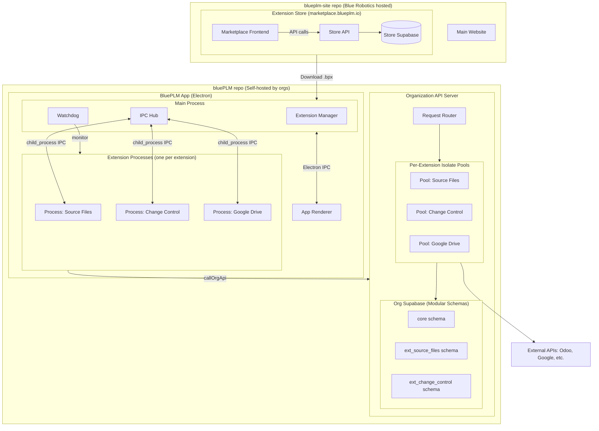
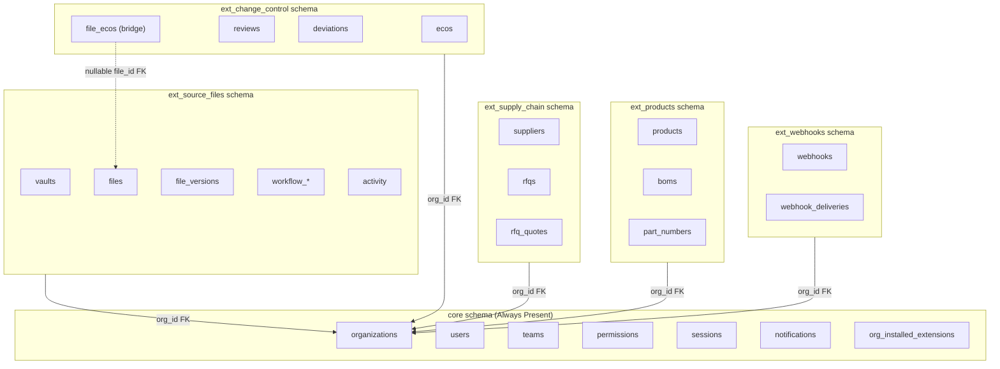
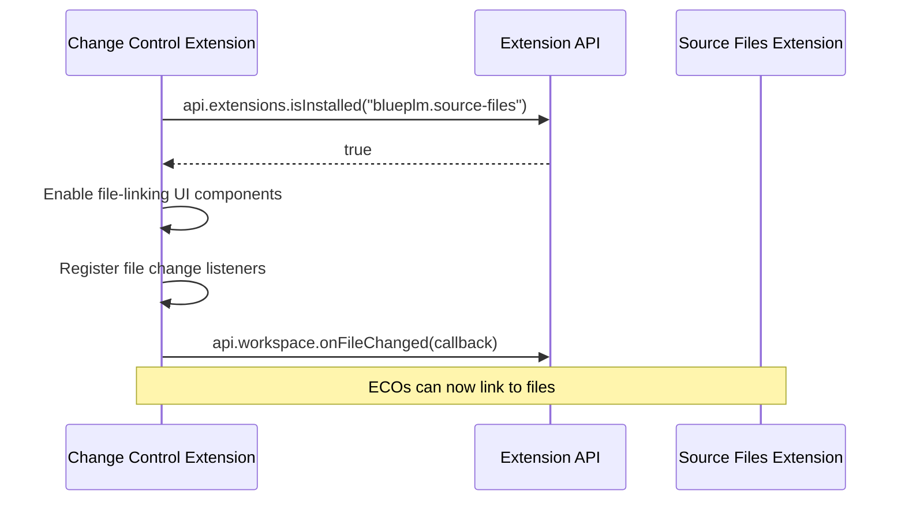
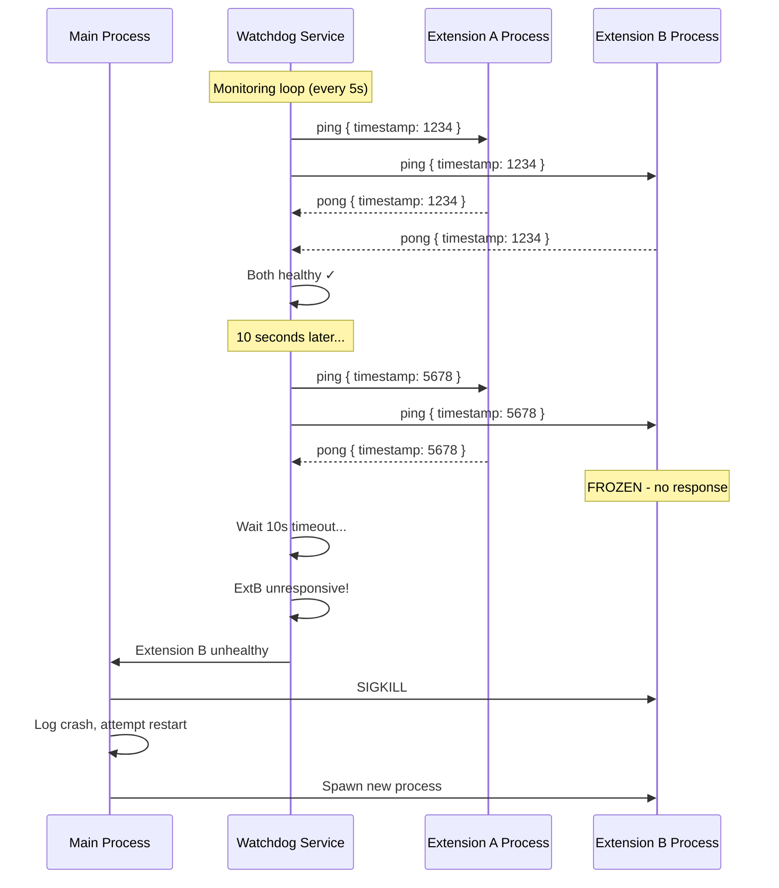
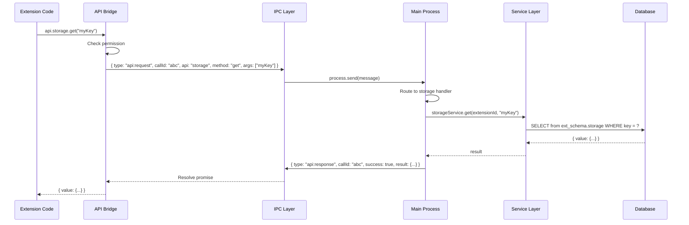
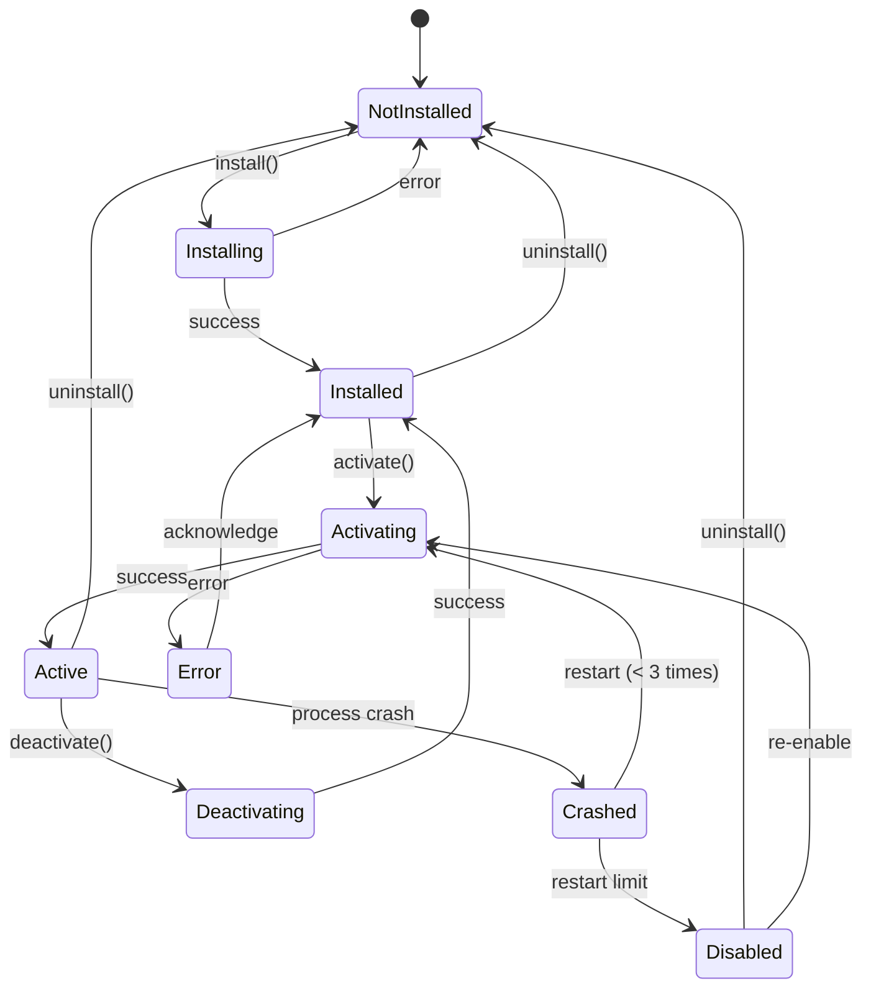

# BluePLM Extension System Architecture

> **Goal:** Transform BluePLM into an enterprise-grade extensible platform with VS Code/Atlassian Forge-style architecture.

---

## Executive Summary

| Aspect | Decision |

|--------|----------|

| **Terminology** | Extensions (not modules) |

| **Client Isolation** | Process per extension with external watchdog (Chrome model) |

| **Server Isolation** | Per-extension V8 isolate pools on org's API |

| **IPC Technology** | Node.js `child_process.fork()` built-in IPC |

| **Trust Model** | Full isolation for ALL extensions (trust no one) |

| **Marketplace** | marketplace.blueplm.io (Cloudflare Pages + Supabase) - in `blueplm-site` repo |

| **Package Format** | `.bpx` files (zip archive) |

| **Verification** | Verified (Blue Robotics) / Community |

| **Pricing** | All free, all open source |

| **Install UX** | One-click (~3-5 seconds) |

| **Native Extensions** | Verified-only, for integrations like SolidWorks |

---

## Architecture Diagram



> **Repository Split:** The marketplace (Store API, Store Database, Marketplace Frontend) lives in the `blueplm-site` repository, maintained by Blue Robotics. The BluePLM application and Org API live in the `bluePLM` repository, self-hosted by organizations.

> **Process Isolation (Chrome Model):** Each extension runs in its own OS process via `child_process.fork()`. If Extension C crashes, Extensions A and B continue running unaffected. The Watchdog in the Main Process monitors all extension processes externally.

> **Database Isolation:** Each extension has its own Postgres schema (e.g., `ext_source_files`, `ext_change_control`). Core tables live in the `core` schema. Extensions can reference core tables and optionally enhance other extensions via nullable foreign keys.

---

## Extension Database Architecture

Extensions use **separate Postgres schemas** for isolation. Core functionality is always present; extension schemas are created on install and soft-disabled (not dropped) on uninstall.

### Schema Hierarchy



### Extension List

| Extension | Schema Name | Tables | Enhances |

|-----------|-------------|--------|----------|

| **Source Files** | `ext_source_files` | vaults, files, file_versions, workflows, activity | Core |

| **Change Control** | `ext_change_control` | ecos, reviews, deviations, file_ecos | Core, Source Files |

| **Supply Chain** | `ext_supply_chain` | suppliers, rfqs, rfq_quotes, rfq_items | Core |

| **Products** | `ext_products` | products, boms, part_numbers | Core |

| **Webhooks** | `ext_webhooks` | webhooks, webhook_deliveries | Core |

| **Odoo** | `ext_odoo` | odoo_config, odoo_sync_log | Core |

| **SolidWorks** | `ext_solidworks` | sw_licenses, sw_assignments | Core, Source Files |

| **Google Drive** | `ext_google_drive` | gdrive_tokens, gdrive_sync_state | Core, Source Files |

### Schema Lifecycle

| Event | Action |

|-------|--------|

| **Extension Install** | `CREATE SCHEMA ext_{name}`, run migrations, grant permissions |

| **Extension Uninstall** | Mark `enabled = false` in `org_installed_extensions` (soft disable) |

| **Extension Re-enable** | Mark `enabled = true`, data preserved |

| **Hard Delete (admin)** | `DROP SCHEMA ext_{name} CASCADE` (optional, explicit action) |

### Extension Schema Declaration

Extensions declare their schema in `extension.json`:

```json
{
  "id": "blueplm.source-files",
  "schema": {
    "name": "ext_source_files",
    "migrations": [
      "migrations/001_initial.sql",
      "migrations/002_workflows.sql",
      "migrations/003_activity.sql"
    ]
  }
}
```

---

## Cross-Extension Enhancement Pattern

Extensions can **optionally enhance** other extensions without hard dependencies. Features are enabled at runtime based on what's installed.

### How It Works



### Manifest Declaration

Extensions declare what they can enhance:

```json
{
  "id": "blueplm.change-control",
  "enhances": ["blueplm.source-files"],
  "enhancementFeatures": {
    "blueplm.source-files": [
      "eco-file-linking",
      "file-change-tracking",
      "affected-items-list"
    ]
  }
}
```

### Runtime Detection API

```typescript
interface ExtensionClientAPI {
  extensions: {
    /** Check if another extension is installed and enabled */
    isInstalled(extensionId: string): Promise<boolean>
    
    /** Get list of all installed extension IDs */
    getInstalledExtensions(): Promise<string[]>
    
    /** Listen for extension state changes */
    onExtensionStateChange(
      callback: (id: string, state: ExtensionState) => void
    ): Disposable
  }
}
```

### Bridge Tables Pattern

When an extension enhances another, bridge tables live in the **enhancing extension's schema** with **nullable foreign keys**:

```sql
-- In ext_change_control schema
CREATE TABLE file_ecos (
  id UUID PRIMARY KEY DEFAULT gen_random_uuid(),
  eco_id UUID NOT NULL REFERENCES ecos(id) ON DELETE CASCADE,
  
  -- Nullable FK to Source Files extension (may not be installed)
  file_id UUID REFERENCES ext_source_files.files(id) ON DELETE SET NULL,
  file_version_id UUID REFERENCES ext_source_files.file_versions(id) ON DELETE SET NULL,
  
  change_type TEXT CHECK (change_type IN ('added', 'modified', 'removed')),
  notes TEXT,
  created_at TIMESTAMPTZ DEFAULT NOW()
);
```

**Why nullable FKs?**

- If Source Files is uninstalled, links become NULL but ECO data is preserved
- Change Control continues to work without file linking
- Re-installing Source Files restores the relationship capability

---

## Agent Overview

### Wave 1: Foundation (Parallel)

| Agent | Name | Deliverables | Key Files |

|-------|------|--------------|-----------|

| 1 | Types & Schema | TypeScript types, JSON Schema, manifest parser, signing types | `src/lib/extensions/types.ts`, `schemas/` |

| 2 | Extension Process Manager | Process-per-extension isolation, external watchdog, IPC | `electron/extension-processes/`, `electron/watchdog/` |

| 3 | Client API | Sandboxed API: UI, storage, network, commands, extensions | `src/lib/extensions/api/` |

### Wave 2: Infrastructure (Parallel)

| Agent | Name | Deliverables | Key Files |

|-------|------|--------------|-----------|

| 4 | Registry | Extension lifecycle, one-click install, update/rollback | `src/lib/extensions/registry/` |

| 5 | IPC Bridge | Multi-process IPC hub, message routing, heartbeat | `electron/handlers/extensions.ts`, `src/lib/extensions/ipc/` |

| 6 | Store Database | Supabase schema for marketplace, reports, deprecations | `blueplm-site/supabase-store/` |

| 7 | API Sandbox | Per-extension V8 isolate pools, rate limits, routing | `api/src/extensions/` |

| 7B | Schema Manager | Extension Postgres schemas, migrations, cross-refs | `api/src/extensions/schema/` |

### Wave 3: Marketplace (Depends on Wave 2)

> **Note:** Agents 6, 8, and 9 work in the `blueplm-site` repository (not `bluePLM`), as the marketplace is a centralized Blue Robotics service.

>

> **Migration Required:** Agent 6 was initially completed in `bluePLM/supabase-store/`. These files need to be moved to `blueplm-site/supabase-store/` before proceeding.

| Agent | Name | Deliverables | Key Files |

|-------|------|--------------|-----------|

| 8 | Store API | REST endpoints for marketplace | `blueplm-site/api/` |

| 9 | Marketplace Site | Marketplace frontend on Cloudflare | `blueplm-site/src/pages/marketplace/` |

### Wave 4: App Integration (Depends on Waves 1-3)

| Agent | Name | Deliverables | Key Files |

|-------|------|--------------|-----------|

| 10 | App UI | In-app store, install dialogs, Zustand slice | `src/features/extensions/` |

| 11 | Settings | Navigation reorganization | `src/features/settings/` |

### Wave 5: Reference Implementation

| Agent | Name | Deliverables | Key Files |

|-------|------|--------------|-----------|

| 12 | Google Drive | First extension migration with feature flags | `src/extensions/google-drive/` |

---

## Performance Budgets

| Operation | Budget |

|-----------|--------|

| Extension process spawn | < 300ms per extension |

| Extension activate | < 200ms per extension |

| IPC round-trip (Main ↔ Extension) | < 10ms |

| Heartbeat response | < 100ms |

| Server pool cold start | < 100ms |

| Server handler warm execution | < 50ms (excluding business logic) |

| Store API response (cached) | < 200ms |

| Store API response (uncached) | < 500ms |

| Extension install (< 1MB bundle) | < 5 seconds |

| Schema creation | < 2 seconds |

| Memory per extension process | < 100MB default |

---

## Process Isolation Deep Dive

### Watchdog Monitoring Flow



### API Call Flow (Extension to Main to Service)



### Extension Lifecycle



---

## Extension Package Format

Extensions are distributed as **`.bpx`** files (BluePLM Extension):

```
my-extension-1.0.0.bpx  (zip archive)
├── extension.json        <- Manifest (required)
├── README.md             <- Documentation
├── LICENSE               <- Open source license (required)
├── icon.png              <- 128x128 icon
├── SIGNATURE             <- Ed25519 signature (verified only)
├── client/               <- Runs in Extension Host
│   ├── index.js          <- Entry: activate(context, api), deactivate()
│   └── components/
│       ├── Panel.js
│       └── Settings.js
└── server/               <- Runs on Org's API (sandboxed)
    ├── connect.js        <- POST /extensions/{id}/connect
    ├── sync.js           <- POST /extensions/{id}/sync
    └── webhook.js        <- POST /extensions/{id}/webhook (public)
```

---

## Extension Categories

| Category | Where It Runs | Use Case | Trust Level |

|----------|---------------|----------|-------------|

| **Sandboxed** (default) | Extension Host + V8 isolate | Most extensions | Community or Verified |

| **Native** | Main process | SolidWorks, native integrations | Verified only |

Native extensions require explicit user approval with security warning.

---

## One-Click Install Flow

```
User clicks [Install]
        │
        ▼
┌─────────────────────────────────────────────────────────┐
│ 1. Download .bpx (~1-2 seconds)                         │
│    GET marketplace.blueplm.io/api/.../download          │
├─────────────────────────────────────────────────────────┤
│ 2. Verify (~100ms)                                      │
│    - Check SHA256 hash                                  │
│    - Validate signature (if verified)                   │
│    - Check revocation list                              │
│    - Parse extension.json                               │
├─────────────────────────────────────────────────────────┤
│ 3. Load client (~200ms)                                 │
│    - Extract to Extension Host                          │
│    - Register views, commands, configuration            │
├─────────────────────────────────────────────────────────┤
│ 4. Deploy server (~1-2 seconds)                         │
│    POST {org-api}/admin/extensions/install              │
│    - Upload handlers to org's API                       │
│    - Register routes in V8 sandbox                      │
│    - Create org_installed_extensions record             │
├─────────────────────────────────────────────────────────┤
│ 5. Done!                                                │
│    - Record in local registry                           │
│    - Report analytics (anonymous)                       │
└─────────────────────────────────────────────────────────┘

User sees: Progress bar -> "Installed successfully!" -> Open Settings
Total time: ~3-5 seconds
```

---

## Verification & Security

### Verification Tiers

| Tier | Badge | Meaning |

|------|-------|---------|

| **Verified** | Checkmark | Code reviewed and signed by Blue Robotics |

| **Community** | Warning | Not reviewed - use at your own risk |

| **Sideloaded** | Alert | Installed from file - prominent warning |

### Security Layers

| Layer | Protection |

|-------|------------|

| **Client Process** | OS-level process isolation per extension (Chrome model) |

| **Watchdog** | External monitoring in Main Process (heartbeat, memory, CPU) |

| **Server Pools** | Per-extension V8 isolate pools (no cross-extension interference) |

| **Database** | Separate Postgres schemas per extension, RLS policies |

| **Rate limits** | 100 req/min per extension (configurable), per-pool enforcement |

| **Request size** | 1MB max per request |

| **Data** | Extension can only access its own schema + declared cross-refs |

| **Network** | HTTP requests logged, declared domains only |

| **Secrets** | Encrypted, 50 max per extension, 10KB max each, access audited |

| **Signatures** | Ed25519, public key registry, revocation list |

| **Trust Model** | Full isolation for ALL extensions (verified and community alike) |

### Signature Verification

| Aspect | Implementation |

|--------|----------------|

| **Algorithm** | Ed25519 |

| **Key Registry** | Blue Robotics maintains trusted public keys |

| **Key Rotation** | Annual rotation, 90-day overlap period |

| **Revocation** | CRL checked at install time |

| **Sideloaded** | Prominent warning, user must acknowledge |

---

## Settings Reorganization

```
ACCOUNT
├── Profile
├── Preferences
├── Keybindings
├── Sidebar               <- Renamed from "Modules"
└── Delete Account

ORGANIZATION
├── Supabase         ●    <- Moved up (core infrastructure)
├── Backups          ●    <- Moved up
├── Vaults
├── Members & Teams
├── Company Profile
├── Sign-In Methods
├── Serialization
├── Export Options
├── File Metadata
├── RFQ Settings
└── Recovery Codes

EXTENSIONS                 <- Renamed from "Integrations"
├── Extension Store        <- NEW
├── ─────────────
├── SolidWorks       ●     <- Native extension
├── Google Drive     ●
├── Odoo ERP         ●
├── ─────────────
├── REST API         ●
└── Webhooks         ●

SYSTEM
├── Performance
├── Logs
├── Dev Tools
└── About
```

---

# Agent Specifications

---

## Agent 1: Types & JSON Schema

### Overview

| Attribute | Value |

|-----------|-------|

| **Wave** | 1 (Foundation) |

| **Dependencies** | None |

| **Parallel With** | Agents 2, 3 |

| **Report** | `AGENT1_TYPES_REPORT.md` |

### Owns (Exclusive Write)

```
src/lib/extensions/
├── types.ts          <- All TypeScript interfaces
├── manifest.ts       <- Zod parser for extension.json
├── package.ts        <- .bpx extraction and verification
└── index.ts          <- Barrel exports

schemas/
└── extension-v1.schema.json   <- JSON Schema for autocomplete
```

### Reads (No Modify)

```
src/types/            <- Reference existing patterns
```

### Prompt

````markdown
# Agent 1: Types & JSON Schema

Implement the core type system and JSON Schema for BluePLM's enterprise 
extension architecture.

## Context

BluePLM is building a VS Code/Atlassian Forge-style extension system where:
- Extensions declare capabilities via JSON manifests (extension.json)
- Extensions can have client code (Extension Host) and server code (API sandbox)
- Extensions are distributed as .bpx packages (zip archives)
- Two categories: "sandboxed" (default) and "native" (verified only)
- Verification tiers: Verified (signed by Blue Robotics) and Community

## Deliverables

### 1. src/lib/extensions/types.ts

```typescript
// Extension categories
type ExtensionCategory = 'sandboxed' | 'native'

// Manifest structure
interface ExtensionManifest {
  // Identity
  id: string                              // e.g., "blueplm.google-drive"
  name: string                            // Display name
  version: string                         // Semver
  publisher: string                       // Publisher slug
  
  // Metadata
  description?: string
  icon?: string
  repository?: string
  license: string                         // OSI-approved
  
  // Category (default: sandboxed)
  category?: ExtensionCategory
  
  // For native extensions only
  native?: {
    platforms: ('win32' | 'darwin' | 'linux')[]
    electronMain?: string
    requiresAdmin?: boolean
  }
  
  // Dependencies
  engines: { blueplm: string }            // e.g., "^1.0.0"
  extensionDependencies?: string[]        // e.g., ["blueplm.core-utils@^1.0.0"]
  extensionPack?: string[]                // Bundle multiple extensions
  
  // Entry points
  main?: string                           // Client entry
  serverMain?: string                     // Server entry
  
  // Capabilities
  activationEvents: ActivationEvent[]
  contributes: ExtensionContributions
  permissions: ExtensionPermissions
}

// What extensions can contribute
interface ExtensionContributions {
  views?: ViewContribution[]
  commands?: CommandContribution[]
  settings?: SettingsContribution[]
  apiRoutes?: ApiRouteContribution[]
  configuration?: ConfigurationContribution      // <- NEW
}

// Typed configuration schema (VS Code pattern)
interface ConfigurationContribution {
  title: string
  properties: Record<string, ConfigurationProperty>
}

interface ConfigurationProperty {
  type: 'string' | 'number' | 'boolean' | 'array' | 'object'
  default?: unknown
  description?: string
  enum?: unknown[]
  minimum?: number
  maximum?: number
}

// Activation events
type ActivationEvent =
  | 'onExtensionEnabled'
  | 'onStartup'
  | `onNavigate:${string}`
  | `onCommand:${string}`
  | `onView:${string}`

// Permissions
interface ExtensionPermissions {
  client?: ClientPermission[]
  server?: ServerPermission[]
}

type ClientPermission =
  | 'ui:toast'
  | 'ui:dialog'
  | 'ui:status'
  | 'ui:progress'
  | 'storage:local'
  | 'network:orgApi'
  | 'network:storeApi'
  | 'network:fetch'
  | 'commands:register'
  | 'commands:execute'
  | 'workspace:files'
  | 'telemetry'

type ServerPermission =
  | 'storage:database'
  | 'secrets:read'
  | 'secrets:write'
  | 'http:fetch'
  | `http:domain:${string}`               // Declared allowed domains

// Extension context (passed to activate)
interface ExtensionContext {
  extensionId: string
  extensionPath: string                   // Path to extension files
  storagePath: string                     // Path for extension data
  subscriptions: Disposable[]             // Auto-disposed on deactivate
  
  log: {
    debug(message: string, ...args: unknown[]): void
    info(message: string, ...args: unknown[]): void
    warn(message: string, ...args: unknown[]): void
    error(message: string, ...args: unknown[]): void
  }
}

// Extension state machine
type ExtensionState = 
  | 'not-installed'
  | 'installed' 
  | 'loading' 
  | 'active' 
  | 'error'

// Loaded extension instance
interface LoadedExtension {
  manifest: ExtensionManifest
  state: ExtensionState
  verification: VerificationStatus
  error?: string
  installedAt?: Date
  activatedAt?: Date
}

// Verification status
type VerificationStatus = 'verified' | 'community' | 'sideloaded'

// Package contents after extraction
interface PackageContents {
  manifest: ExtensionManifest
  clientBundle?: string
  serverHandlers?: Record<string, string>
  signature?: string
  hash: string
}

// Disposable pattern (VS Code)
interface Disposable {
  dispose(): void
}
````

### 2. src/lib/extensions/manifest.ts

- `parseManifest(json: unknown): ExtensionManifest` - Parse and validate
- `validateManifest(manifest): ValidationResult` - Detailed validation
- Use Zod for runtime validation
- Helpful error messages with paths

### 3. src/lib/extensions/package.ts

- `extractPackage(bpxPath): Promise<PackageContents>`
- `verifyPackageHash(contents, expectedHash): boolean`
- `verifyPackageSignature(contents, publicKey): boolean`
- `checkRevocationList(keyId): Promise<boolean>`

### 4. schemas/extension-v1.schema.json

- Complete JSON Schema for extension.json
- $schema reference for editor autocomplete
- Comprehensive descriptions for each field
- All contribution types documented

## Quality Requirements

- Enterprise-level code quality
- Comprehensive JSDoc documentation on all exports
- No `any` types - proper generics throughout
- Zod schemas must match TypeScript types exactly
- Export everything needed by other agents

## When Complete

Run `npm run typecheck` and report results in AGENT1_TYPES_REPORT.md

Include in report:

- EXPORTS: All exported types and functions
- IPC CHANNELS: None
- API ENDPOINTS: None
- DATABASE TABLES: None
```

### Tasks

- [ ] Design ExtensionManifest with category and native support
- [ ] Design permission system (client + server)
- [ ] Design configuration contribution type
- [ ] Design verification and signing types with revocation
- [ ] Design ExtensionContext with subscriptions and logging
- [ ] Design extension dependencies
- [ ] Create JSON Schema with full validation
- [ ] Implement Zod manifest parser
- [ ] Implement .bpx package utilities
- [ ] Add comprehensive JSDoc
- [ ] Write completion report

---

## Agent 2: Extension Process Manager

### Overview

| Attribute | Value |
|-----------|-------|
| **Wave** | 1 (Foundation) |
| **Dependencies** | None |
| **Parallel With** | Agents 1, 3 |
| **Report** | `AGENT2_PROCESS_MANAGER_REPORT.md` |

### Owns (Exclusive Write)

```


electron/extension-processes/

├── manager.ts           <- Extension Process Manager (spawns/manages processes)

├── process-entry.ts     <- Entry point for each extension process

├── ipc-layer.ts         <- IPC message routing within extension process

├── api-bridge.ts        <- ExtensionClientAPI proxy implementation

├── heartbeat.ts         <- Heartbeat responder (in extension process)

└── index.ts             <- Barrel exports

electron/watchdog/

├── watchdog.ts          <- External watchdog (runs in Main Process)

├── health-monitor.ts    <- Memory, CPU, heartbeat monitoring

└── index.ts

```

### Modifies

```

electron/main.ts         <- Add process manager initialization

electron/handlers/       <- Add extension process handlers

````

### Architecture

```mermaid
flowchart TB
    subgraph MainProcess["Main Process (Electron)"]
        Manager[Extension Process Manager]
        Watchdog[Watchdog Service]
        IPCHub[IPC Hub]
    end
    
    subgraph ExtProcA["Extension Process A (child_process)"]
        IPCA[IPC Layer]
        HeartbeatA[Heartbeat Responder]
        BridgeA[API Bridge]
        SandboxA[Extension Sandbox]
        CodeA[Extension Code]
    end
    
    subgraph ExtProcB["Extension Process B (child_process)"]
        IPCB[IPC Layer]
        HeartbeatB[Heartbeat Responder]
        BridgeB[API Bridge]
        SandboxB[Extension Sandbox]
        CodeB[Extension Code]
    end
    
    Manager -->|"fork()"| ExtProcA
    Manager -->|"fork()"| ExtProcB
    IPCHub <-->|"process.send/on"| IPCA
    IPCHub <-->|"process.send/on"| IPCB
    Watchdog -->|"ping"| HeartbeatA
    Watchdog -->|"ping"| HeartbeatB
    HeartbeatA -->|"pong"| Watchdog
    HeartbeatB -->|"pong"| Watchdog
    BridgeA --> SandboxA
    BridgeB --> SandboxB
    SandboxA --> CodeA
    SandboxB --> CodeB
````

### Prompt

```markdown
# Agent 2: Extension Process Manager

Implement the Extension Process Manager for process-per-extension isolation (Chrome model).

## Context

Unlike VS Code's shared Extension Host, BluePLM uses **process-per-extension isolation** 
similar to Chrome's extension model. Each extension runs in its own OS process via 
`child_process.fork()`. This provides:

- **OS-level isolation**: One extension crash doesn't affect others
- **Independent resource limits**: Per-process memory/CPU monitoring
- **Clean restart**: Restart individual extensions without affecting others
- **Security**: Extensions cannot access each other's memory

## Architecture

```

┌─────────────────────────────────────────────────────────────┐

│                    MAIN PROCESS                              │

│  ┌─────────────────┐  ┌─────────────────┐                   │

│  │ Extension       │  │ Watchdog        │                   │

│  │ Process Manager │  │ Service         │                   │

│  └────────┬────────┘  └────────┬────────┘                   │

│           │                    │                             │

└───────────┼────────────────────┼─────────────────────────────┘

│                    │

┌───────┼────────────────────┼───────┐

│       │                    │       │

▼       ▼                    ▼       ▼

┌───────┐ ┌───────┐        ┌───────┐ ┌───────┐

│Proc A │ │Proc B │        │Proc A │ │Proc B │

│(IPC)  │ │(IPC)  │        │(ping) │ │(ping) │

└───────┘ └───────┘        └───────┘ └───────┘

````

## Key Requirements

### Process-Per-Extension Isolation

Each extension runs in its own Node.js child process:
- Spawned via `child_process.fork()`
- Has its own V8 heap (isolated memory)
- Communicates only via IPC messages
- Cannot access other extensions or main process memory

### External Watchdog (in Main Process)

The Watchdog runs in Main Process and monitors ALL extension processes externally:
- **Heartbeat**: Sends ping every 5s, expects pong within 10s
- **Memory**: Reads `process.memoryUsage()` of child processes
- **CPU**: Tracks CPU time via OS APIs
- **Crash detection**: Listens for `exit` event on child processes
- **Kill**: Can terminate unresponsive processes

### IPC Protocol

```typescript
// === FROM EXTENSION TO MAIN ===
type ApiRequest = {
  type: 'api:request'
  callId: string
  api: string        // 'ui', 'storage', 'network', etc.
  method: string     // 'showToast', 'get', 'fetch', etc.
  args: unknown[]
}

type Subscribe = {
  type: 'subscribe'
  event: string
  subscriptionId: string
}

type Log = {
  type: 'log'
  level: 'debug' | 'info' | 'warn' | 'error'
  message: string
  data?: unknown
}

// === FROM MAIN TO EXTENSION ===
type ApiResponse = {
  type: 'api:response'
  callId: string
  success: boolean
  result?: unknown
  error?: string
}

type EventPush = {
  type: 'event'
  event: string
  subscriptionId: string
  data: unknown
}

type Command = {
  type: 'command'
  command: 'activate' | 'deactivate' | 'execute-command'
  args?: unknown
}

// === HEARTBEAT ===
type Ping = { type: 'ping', timestamp: number }
type Pong = { type: 'pong', timestamp: number }
````

### Native Extension Support

For extensions with `category: 'native'`:

- Do NOT spawn as child process
- Main process loads them directly (handled by main.ts)
- Only allowed for verified extensions
- Require explicit user approval with security warning

## Deliverables

### 1. electron/extension-processes/manager.ts

```typescript
class ExtensionProcessManager {
  private processes = new Map<string, ChildProcess>()
  
  /** Spawn a new extension process */
  async spawn(extensionId: string, manifest: ExtensionManifest): Promise<void>
  
  /** Terminate an extension process */
  async terminate(extensionId: string, reason: string): Promise<void>
  
  /** Restart a crashed extension */
  async restart(extensionId: string): Promise<void>
  
  /** Send message to extension process */
  send(extensionId: string, message: MainToExtMessage): void
  
  /** Get all running extension IDs */
  getRunningExtensions(): string[]
  
  /** Handle incoming messages from extensions */
  private handleMessage(extensionId: string, message: ExtToMainMessage): void
}
```

### 2. electron/extension-processes/process-entry.ts

Entry point that runs in each extension process:

- Initialize IPC layer
- Set up heartbeat responder
- Create API bridge
- Load and activate extension code

### 3. electron/extension-processes/api-bridge.ts

Proxy implementation of ExtensionClientAPI that forwards all calls to Main via IPC.

### 4. electron/watchdog/watchdog.ts

```typescript
interface WatchdogConfig {
  heartbeatIntervalMs: number  // Default: 5000
  heartbeatTimeoutMs: number   // Default: 10000
  memoryLimitMB: number        // Default: 100
  checkIntervalMs: number      // Default: 1000
}

class WatchdogService {
  /** Start monitoring all extension processes */
  start(): void
  
  /** Stop monitoring */
  stop(): void
  
  /** Register a new extension process to monitor */
  register(extensionId: string, pid: number, config?: Partial<WatchdogConfig>): void
  
  /** Unregister an extension */
  unregister(extensionId: string): void
  
  /** Get health stats for an extension */
  getStats(extensionId: string): ExtensionHealthStats
  
  /** Event: extension became unhealthy */
  onUnhealthy(callback: (id: string, reason: string) => void): void
}
```

### 5. electron/watchdog/health-monitor.ts

- Heartbeat ping/pong logic
- Memory usage tracking via `process.memoryUsage()`
- CPU time tracking
- Decision logic for when to kill processes

## Extension Process Internal Structure

```
Extension Process (Node.js child_process)
├── IPC Layer
│   ├── Message Router (routes by message type)
│   ├── Heartbeat Responder (instant pong on ping)
│   └── Request Tracker (correlates request/response by callId)
├── API Bridge (BluePLM code - trusted)
│   ├── ui.* proxy → IPC → Main
│   ├── storage.* proxy → IPC → Main
│   ├── network.* proxy → IPC → Main
│   ├── commands.* proxy → IPC → Main
│   └── extensions.* proxy → IPC → Main (for isInstalled, etc.)
└── Extension Sandbox
    ├── Extension Loader (dynamic import)
    ├── Extension Context (subscriptions, logger)
    └── Extension Code (activate/deactivate from .bpx)
```

## Quality Requirements

- Enterprise-level code quality
- Extension process crash must NOT crash main app
- Individual extension crash must NOT affect other extensions
- Proper error handling and logging
- Clean shutdown handling (graceful termination)
- Restart limit (max 3 restarts in 5 minutes, then disable)

## When Complete

Run `npm run typecheck` and report results in AGENT2_PROCESS_MANAGER_REPORT.md

Include in report:

- EXPORTS: All exported types and functions
- IPC CHANNELS: All message types
- Performance: Process spawn time, IPC latency
```

### Tasks

- [ ] Create extension-processes directory structure
- [ ] Implement ExtensionProcessManager class
- [ ] Implement process-entry.ts (extension process entry point)
- [ ] Implement ipc-layer.ts with message routing
- [ ] Implement api-bridge.ts (ExtensionClientAPI proxy)
- [ ] Implement heartbeat responder
- [ ] Create watchdog directory structure
- [ ] Implement WatchdogService in Main Process
- [ ] Implement health-monitor.ts
- [ ] Update main.ts for process manager initialization
- [ ] Add native extension support (direct load in main)
- [ ] Add crash recovery with restart limits
- [ ] Write completion report

---

## Agent 3: Sandboxed Client API

### Overview

| Attribute | Value |
|-----------|-------|
| **Wave** | 1 (Foundation) |
| **Dependencies** | None |
| **Parallel With** | Agents 1, 2 |
| **Report** | `AGENT3_CLIENT_API_REPORT.md` |

### Owns (Exclusive Write)

```


src/lib/extensions/api/

├── types.ts          <- ExtensionClientAPI interface

├── ui.ts             <- showToast, showDialog, setStatus, showProgress, showQuickPick, showInputBox

├── storage.ts        <- Extension-scoped local storage

├── network.ts        <- callOrgApi, callStoreApi, fetch

├── events.ts         <- Event subscriptions

├── commands.ts       <- registerCommand, executeCommand

├── workspace.ts      <- onFileChanged, getOpenFiles, getCurrentVault

├── telemetry.ts      <- trackEvent, trackError, trackTiming

├── context.ts        <- Extension context

├── permissions.ts    <- Permission checking

└── index.ts          <- Barrel exports

```

### Reads (No Modify)

```

src/types/            <- Reference patterns

````

### Prompt

```markdown
# Agent 3: Sandboxed Client API

Implement the Sandboxed Client API that extensions use in the Extension Host.

## Context

Extensions running in the Extension Host cannot directly access BluePLM 
internals (store, Supabase, Electron APIs). They use ExtensionClientAPI - 
a controlled, permission-gated interface that forwards requests via IPC.

## Deliverables

### 1. src/lib/extensions/api/types.ts

```typescript
interface ExtensionClientAPI {
  // ----- UI Operations -----
  ui: {
    showToast(message: string, type: 'success' | 'error' | 'info'): void
    showDialog(options: DialogOptions): Promise<DialogResult>
    setStatus(status: 'online' | 'offline' | 'partial' | 'checking'): void
    
    // Progress indicator (VS Code pattern)
    showProgress<T>(
      options: ProgressOptions,
      task: (progress: Progress) => Promise<T>
    ): Promise<T>
    
    // Quick pick (VS Code pattern)
    showQuickPick(
      items: QuickPickItem[],
      options?: QuickPickOptions
    ): Promise<QuickPickItem | undefined>
    
    // Input box (VS Code pattern)
    showInputBox(options?: InputBoxOptions): Promise<string | undefined>
  }
  
  // ----- Extension-Scoped Storage (local) -----
  storage: {
    get<T>(key: string): Promise<T | undefined>
    set<T>(key: string, value: T): Promise<void>
    delete(key: string): Promise<void>
    keys(): Promise<string[]>
  }
  
  // ----- Network -----
  callOrgApi<T>(endpoint: string, options?: RequestInit): Promise<T>
  callStoreApi<T>(endpoint: string): Promise<T>
  fetch(url: string, options?: RequestInit): Promise<Response>
  
  // ----- Commands (VS Code pattern) -----
  commands: {
    registerCommand(
      id: string, 
      handler: (...args: unknown[]) => unknown
    ): Disposable
    executeCommand<T>(id: string, ...args: unknown[]): Promise<T>
    getCommands(): Promise<string[]>
  }
  
  // ----- Workspace -----
  workspace: {
    onFileChanged(callback: (events: FileChangeEvent[]) => void): Disposable
    getOpenFiles(): Promise<OpenFile[]>
    getCurrentVault(): Promise<Vault | undefined>
  }
  
  // ----- Events -----
  events: {
    on(event: ExtensionEvent, callback: (...args: unknown[]) => void): Disposable
  }
  
  // ----- Telemetry (privacy-respecting, anonymous) -----
  telemetry: {
    trackEvent(name: string, properties?: Record<string, string | number>): void
    trackError(error: Error, context?: Record<string, string>): void
    trackTiming(name: string, durationMs: number): void
  }
  
  // ----- Context (read-only) -----
  context: {
    extensionId: string
    version: string
    user: { id: string; email: string }
    organization: { id: string; name: string }
  }
}

// Supporting types
interface ProgressOptions {
  title: string
  cancellable?: boolean
}

interface Progress {
  report(value: { message?: string; increment?: number }): void
}

interface QuickPickItem {
  label: string
  description?: string
  detail?: string
  picked?: boolean
  data?: unknown
}

interface QuickPickOptions {
  title?: string
  placeholder?: string
  canPickMany?: boolean
}

interface InputBoxOptions {
  title?: string
  placeholder?: string
  value?: string
  password?: boolean
  validateInput?(value: string): string | undefined
}

interface FileChangeEvent {
  type: 'created' | 'changed' | 'deleted'
  path: string
  vaultId: string
}

interface OpenFile {
  path: string
  vaultId: string
}
````

### 2. Individual API Implementations

Each file implements stubs that forward requests via IPC to the main process.

All methods must check permissions before executing.

### 3. src/lib/extensions/api/permissions.ts

```typescript
function checkPermission(
  extensionId: string, 
  api: string, 
  method: string
): boolean

function hasPermissions(
  extensionId: string, 
  required: Permission[]
): boolean

function getGrantedPermissions(extensionId: string): Permission[]
```

## Quality Requirements

- Enterprise-level code quality
- Every method must have JSDoc with examples
- Proper TypeScript generics
- No `any` types
- All methods async (IPC is async)
- Permission checks on every method

## When Complete

Run `npm run typecheck` and report results in AGENT3_CLIENT_API_REPORT.md

Include in report:

- EXPORTS: All exported types and functions
- IPC CHANNELS: All channels this API uses
```

### Tasks

- [ ] Design complete ExtensionClientAPI interface
- [ ] Implement UI API (toast, dialog, status, progress, quickpick, inputbox)
- [ ] Implement Storage API
- [ ] Implement Network API (callOrgApi, callStoreApi, fetch)
- [ ] Implement Commands API (registerCommand, executeCommand)
- [ ] Implement Workspace API (onFileChanged, getOpenFiles, getCurrentVault)
- [ ] Implement Telemetry API (trackEvent, trackError, trackTiming)
- [ ] Implement Events API
- [ ] Create permission checking utilities
- [ ] Add JSDoc documentation with examples
- [ ] Write completion report

---

## Agent 4: Extension Registry & Lifecycle

### Overview

| Attribute | Value |
|-----------|-------|
| **Wave** | 2 (Infrastructure) |
| **Dependencies** | Agents 1, 2, 3 |
| **Parallel With** | Agents 5, 6, 7 |
| **Report** | `AGENT4_REGISTRY_REPORT.md` |

### Owns (Exclusive Write)

```


src/lib/extensions/registry/

├── ExtensionRegistry.ts    <- Singleton registry class

├── lifecycle.ts            <- State machine

├── activation.ts           <- Activation event handling

├── installer.ts            <- Install/uninstall logic

├── updater.ts              <- Update/rollback logic

├── discovery.ts            <- Local and store discovery

└── index.ts                <- Barrel exports

```

### Imports From

```

src/lib/extensions/types.ts     (Agent 1)

src/lib/extensions/api/         (Agent 3)

````

### Prompt

```markdown
# Agent 4: Extension Registry & Lifecycle

Implement the Extension Registry and Lifecycle Manager.

## Context

The Extension Registry is the central coordinator for all extensions. It 
handles discovery, installation, activation, deactivation, updates, and 
rollback. Supports lazy activation based on events (like VS Code).

## Deliverables

### 1. src/lib/extensions/registry/ExtensionRegistry.ts

```typescript
class ExtensionRegistry {
  // ----- Discovery -----
  async discoverLocalExtensions(path: string): Promise<ExtensionManifest[]>
  async fetchStoreExtensions(): Promise<StoreExtension[]>
  
  // ----- Installation (one-click flow) -----
  async install(extensionId: string, version?: string): Promise<void>
  async installFromFile(bpxPath: string): Promise<void>  // Sideload
  async uninstall(extensionId: string): Promise<void>
  
  // ----- Updates -----
  async checkForUpdates(): Promise<ExtensionUpdate[]>
  async updateExtension(extensionId: string, version?: string): Promise<void>
  async rollbackExtension(extensionId: string): Promise<void>
  async pinVersion(extensionId: string, version: string): Promise<void>
  async unpinVersion(extensionId: string): Promise<void>
  
  // ----- Lifecycle -----
  async activate(extensionId: string): Promise<void>
  async deactivate(extensionId: string): Promise<void>
  async activateByEvent(event: ActivationEvent): Promise<void>
  
  // ----- Queries -----
  getExtension(id: string): LoadedExtension | undefined
  getAllExtensions(): LoadedExtension[]
  getInstalledExtensions(): LoadedExtension[]
  getActiveExtensions(): LoadedExtension[]
  
  // ----- Events -----
  onExtensionStateChange(callback: (id: string, state: ExtensionState) => void): () => void
  onUpdateAvailable(callback: (updates: ExtensionUpdate[]) => void): () => void
}

interface ExtensionUpdate {
  extensionId: string
  currentVersion: string
  newVersion: string
  changelog?: string
  breaking: boolean  // Major version bump
}
````

### 2. src/lib/extensions/registry/lifecycle.ts

State machine:

```
[not-installed] --install()--> [installed] --activate()--> [active]
                                    |                         |
                               uninstall()              deactivate()
                                    |                         |
                                    v                         v
                            [not-installed]             [installed]
```

### 3. src/lib/extensions/registry/installer.ts

One-click install flow:

1. Download .bpx from store
2. Verify hash and signature
3. Check revocation list
4. Extract client code to Extension Host
5. Deploy server handlers to org's API
6. Record in local registry

### 4. src/lib/extensions/registry/updater.ts

Update flow:

- Auto-update check on app startup (configurable)
- Version pinning for enterprise orgs
- Keep previous version for rollback (7 days)
- Breaking update detection (major version)

## Quality Requirements

- Enterprise-level code quality
- Proper error handling for each lifecycle transition
- No memory leaks - proper subscription cleanup
- Logging for debugging
- Rollback must always work

## When Complete

Run `npm run typecheck` and report results in AGENT4_REGISTRY_REPORT.md

```

### Tasks

- [ ] Implement ExtensionRegistry singleton
- [ ] Implement lifecycle state machine
- [ ] Implement activation events
- [ ] Implement one-click installer
- [ ] Implement server handler deployment (calls org API)
- [ ] Implement sideloading
- [ ] Implement update checker
- [ ] Implement rollback mechanism
- [ ] Implement version pinning
- [ ] Add error handling and logging
- [ ] Write completion report

---

## Agent 5: IPC Bridge

### Overview

| Attribute | Value |
|-----------|-------|
| **Wave** | 2 (Infrastructure) |
| **Dependencies** | Agents 1, 2 |
| **Parallel With** | Agents 4, 6, 7 |
| **Report** | `AGENT5_IPC_REPORT.md` |

### Owns (Exclusive Write)

```

electron/handlers/extensions.ts    <- Main process handlers for renderer

src/lib/extensions/ipc/

├── client.ts                      <- Renderer-side client

├── protocol.ts                    <- Complete message type definitions

├── hub.ts                         <- IPC Hub for routing to extension processes

└── index.ts

```

### Modifies

```

electron/preload.ts           <- Add extensions section

electron/handlers/index.ts    <- Register handler

src/electron.d.ts             <- Add types

````

### Architecture

```mermaid
flowchart TB
    subgraph MainProcess["Main Process"]
        IPCHub[IPC Hub]
        Handlers[Extension Handlers]
        ProcessMgr[Process Manager]
    end
    
    subgraph ExtProcA["Extension Process A"]
        IPCA[IPC Client]
    end
    
    subgraph ExtProcB["Extension Process B"]
        IPCB[IPC Client]
    end
    
    subgraph Renderer["App Renderer"]
        Client[IPC Client]
        Preload[Preload API]
    end
    
    Client -->|"ipcRenderer.invoke"| Handlers
    Handlers --> IPCHub
    IPCHub <-->|"process.send/on"| IPCA
    IPCHub <-->|"process.send/on"| IPCB
    ProcessMgr --> IPCHub
````

### Prompt

```markdown
# Agent 5: IPC Bridge

Implement the IPC Bridge connecting Main Process, Extension Processes, and Renderer.

## Context

The IPC Bridge routes messages between multiple processes:
- **Main Process** (Electron main) - Central hub
- **Extension Processes** (multiple child_process instances) - One per extension
- **App Renderer** (main UI) - User interface

With process-per-extension architecture, the IPC Hub must:
- Route messages to the correct extension process by extensionId
- Handle multiple concurrent IPC channels
- Aggregate events from all extensions for the renderer
- Coordinate with Process Manager and Watchdog

## IPC Message Flow

```

Renderer                Main Process               Extension Processes

│                         │                            │

│──extensions:install────>│                            │

│                         │──spawn process────────────>│ (Process A)

│                         │<─ready─────────────────────│

│                         │──activate─────────────────>│

│                         │<─activated─────────────────│

│<──state:active──────────│                            │

│                         │                            │

│                         │<─api:request───────────────│

│                         │   (ui.showToast)           │

│                         │──api:response─────────────>│

````

## Deliverables

### 1. src/lib/extensions/ipc/protocol.ts

```typescript
// === EXTENSION PROCESS → MAIN ===
type ExtToMainMessage =
  | { type: 'ready' }
  | { type: 'api:request'; callId: string; api: string; method: string; args: unknown[] }
  | { type: 'subscribe'; event: string; subscriptionId: string }
  | { type: 'unsubscribe'; subscriptionId: string }
  | { type: 'log'; level: LogLevel; message: string; data?: unknown }
  | { type: 'pong'; timestamp: number }

// === MAIN → EXTENSION PROCESS ===
type MainToExtMessage =
  | { type: 'load'; bundlePath: string; manifest: ExtensionManifest }
  | { type: 'activate' }
  | { type: 'deactivate' }
  | { type: 'api:response'; callId: string; success: boolean; result?: unknown; error?: string }
  | { type: 'event'; event: string; subscriptionId: string; data: unknown }
  | { type: 'ping'; timestamp: number }
  | { type: 'shutdown' }

// === RENDERER → MAIN (Electron IPC) ===
type RendererToMainMessage =
  | { channel: 'extensions:get-all' }
  | { channel: 'extensions:install'; extensionId: string; version?: string }
  | { channel: 'extensions:uninstall'; extensionId: string }
  | { channel: 'extensions:activate'; extensionId: string }
  | { channel: 'extensions:deactivate'; extensionId: string }
  | { channel: 'extensions:check-updates' }
  | { channel: 'extensions:update'; extensionId: string; version?: string }
  | { channel: 'extensions:rollback'; extensionId: string }
  | { channel: 'extensions:is-installed'; extensionId: string }
````

### 2. src/lib/extensions/ipc/hub.ts

```typescript
class IPCHub {
  private channels = new Map<string, ChildProcess>()
  private pendingRequests = new Map<string, PendingRequest>()
  private subscriptions = new Map<string, Set<string>>() // event → extensionIds
  
  /** Register an extension process's IPC channel */
  registerChannel(extensionId: string, process: ChildProcess): void
  
  /** Unregister when process terminates */
  unregisterChannel(extensionId: string): void
  
  /** Send message to specific extension */
  send(extensionId: string, message: MainToExtMessage): void
  
  /** Broadcast event to all subscribed extensions */
  broadcast(event: string, data: unknown): void
  
  /** Forward API request from extension to appropriate handler */
  async handleApiRequest(extensionId: string, request: ApiRequest): Promise<unknown>
  
  /** Handle incoming message from any extension */
  private handleMessage(extensionId: string, message: ExtToMainMessage): void
}
```

### 3. electron/handlers/extensions.ts

- Handle all `extensions:*` IPC channels from renderer
- Coordinate with Process Manager for lifecycle operations
- Forward API calls from extensions to appropriate services
- Aggregate extension state for renderer

### 4. Update electron/preload.ts

```typescript
extensions: {
  // Lifecycle
  getAll: () => ipcRenderer.invoke('extensions:get-all'),
  install: (id, version?) => ipcRenderer.invoke('extensions:install', id, version),
  uninstall: (id) => ipcRenderer.invoke('extensions:uninstall', id),
  activate: (id) => ipcRenderer.invoke('extensions:activate', id),
  deactivate: (id) => ipcRenderer.invoke('extensions:deactivate', id),
  
  // Updates
  checkUpdates: () => ipcRenderer.invoke('extensions:check-updates'),
  update: (id, version?) => ipcRenderer.invoke('extensions:update', id, version),
  rollback: (id) => ipcRenderer.invoke('extensions:rollback', id),
  
  // Cross-extension queries (for enhancement pattern)
  isInstalled: (id) => ipcRenderer.invoke('extensions:is-installed', id),
  getInstalledExtensions: () => ipcRenderer.invoke('extensions:get-installed'),
  
  // Events
  onStateChange: (callback) => {
    const handler = (_, data) => callback(data)
    ipcRenderer.on('extensions:state-change', handler)
    return () => ipcRenderer.removeListener('extensions:state-change', handler)
  }
}
```

### 5. Update src/electron.d.ts

Add comprehensive types for the extensions API.

## Quality Requirements

- Type-safe IPC with proper validation (Zod)
- Request/response correlation with unique callIds
- Timeout handling: 30s default, configurable per-call
- Error forwarding with stack traces (development mode)
- IPC round-trip < 10ms (excluding business logic)
- Handle extension process crash gracefully
- Clean up subscriptions when extension terminates

## When Complete

Run `npm run typecheck` and report results in AGENT5_IPC_REPORT.md

Include in report:

- All message types defined
- All IPC channels registered
- Performance: IPC latency measurements
```

### Tasks

- [ ] Define complete IPC protocol types
- [ ] Implement IPCHub class for multi-process routing
- [ ] Implement main process handlers for renderer
- [ ] Implement renderer-side client
- [ ] Update preload.ts with full API
- [ ] Update electron.d.ts
- [ ] Add timeout handling with configurable limits
- [ ] Add subscription management
- [ ] Handle extension process crash cleanup
- [ ] Write completion report

---

## Agent 6: Extension Store Database

### Overview

| Attribute | Value |
|-----------|-------|
| **Wave** | 2 (Infrastructure) |
| **Dependencies** | None |
| **Parallel With** | Agents 4, 5, 7 |
| **Repository** | `blueplm-site` (not bluePLM) |
| **Report** | `blueplm-site/AGENT6_STORE_DB_REPORT.md` |

### Owns (Exclusive Write)

```


blueplm-site/supabase-store/

├── schema.sql        <- Complete database schema

├── seed.sql          <- Test data

└── README.md         <- Documentation

`````

### Prompt

```markdown
# Agent 6: Extension Store Database

Create the Extension Store database schema for marketplace.blueplm.io.

**IMPORTANT:** This agent works in the `blueplm-site` repository, not `bluePLM`.

## Context

The Extension Store is a SEPARATE Supabase project hosted by Blue Robotics.
- Any organization can register as a publisher
- Publishers can submit extensions
- Verification tiers: Verified (Blue Robotics approved) / Community
- All extensions must be open source and free
- This is centralized infrastructure maintained by Blue Robotics, separate from the self-hosted BluePLM app

## Deliverables

### 1. blueplm-site/supabase-store/schema.sql

```sql
-- Publishers (organizations that submit extensions)
CREATE TABLE publishers (
  id UUID PRIMARY KEY DEFAULT gen_random_uuid(),
  name TEXT NOT NULL,
  slug TEXT UNIQUE NOT NULL,
  description TEXT,
  website_url TEXT,
  logo_url TEXT,
  verified BOOLEAN DEFAULT FALSE,
  verified_at TIMESTAMPTZ,
  created_at TIMESTAMPTZ DEFAULT NOW()
);

-- Extensions
CREATE TABLE extensions (
  id UUID PRIMARY KEY DEFAULT gen_random_uuid(),
  publisher_id UUID REFERENCES publishers(id),
  name TEXT NOT NULL,                    -- e.g., "blowdo"
  display_name TEXT NOT NULL,            -- e.g., "Blowdo Integration"
  description TEXT,
  icon_url TEXT,
  repository_url TEXT NOT NULL,          -- Required (open source)
  license TEXT NOT NULL,                 -- Must be OSI-approved
  category TEXT DEFAULT 'sandboxed',     -- 'sandboxed' or 'native'
  categories TEXT[],                     -- e.g., ['sync', 'erp']
  tags TEXT[],
  verified BOOLEAN DEFAULT FALSE,
  featured BOOLEAN DEFAULT FALSE,
  download_count INTEGER DEFAULT 0,
  created_at TIMESTAMPTZ DEFAULT NOW(),
  updated_at TIMESTAMPTZ DEFAULT NOW(),
  UNIQUE(publisher_id, name)
);

-- Extension Versions
CREATE TABLE extension_versions (
  id UUID PRIMARY KEY DEFAULT gen_random_uuid(),
  extension_id UUID REFERENCES extensions(id) ON DELETE CASCADE,
  version TEXT NOT NULL,                 -- semver
  changelog TEXT,
  bundle_url TEXT NOT NULL,              -- .bpx download URL
  bundle_hash TEXT NOT NULL,             -- SHA256
  bundle_size INTEGER,                   -- bytes
  min_app_version TEXT,
  manifest JSONB NOT NULL,               -- extension.json contents
  published_at TIMESTAMPTZ DEFAULT NOW(),
  UNIQUE(extension_id, version)
);

-- Abuse/security reports
CREATE TABLE extension_reports (
  id UUID PRIMARY KEY DEFAULT gen_random_uuid(),
  extension_id UUID REFERENCES extensions(id),
  reporter_email TEXT NOT NULL,
  reason TEXT NOT NULL,                  -- 'malicious', 'broken', 'spam', 'other'
  details TEXT,
  status TEXT DEFAULT 'pending',         -- 'pending', 'investigating', 'resolved', 'dismissed'
  resolved_at TIMESTAMPTZ,
  resolved_by TEXT,
  created_at TIMESTAMPTZ DEFAULT NOW()
);

-- Deprecation notices
CREATE TABLE extension_deprecations (
  id UUID PRIMARY KEY DEFAULT gen_random_uuid(),
  extension_id UUID REFERENCES extensions(id),
  deprecated_at TIMESTAMPTZ DEFAULT NOW(),
  reason TEXT,
  replacement_id UUID REFERENCES extensions(id),
  sunset_date DATE,                      -- When it will be removed
  created_at TIMESTAMPTZ DEFAULT NOW()
);

-- Analytics (anonymous)
CREATE TABLE extension_installs (
  id UUID PRIMARY KEY DEFAULT gen_random_uuid(),
  extension_id UUID REFERENCES extensions(id),
  version TEXT,
  app_version TEXT,
  platform TEXT,                         -- win32, darwin, linux
  installed_at TIMESTAMPTZ DEFAULT NOW()
);
````

### 2. RLS Policies

- Public read for extensions
- Publisher can only modify their own
- Admin-only verification and featuring
- Rate limit on reports (prevent spam)

### 3. Helper Functions

```sql
-- Increment download count atomically
CREATE FUNCTION increment_download_count(ext_id UUID)

-- Get latest version for an extension
CREATE FUNCTION get_latest_version(ext_id UUID)

-- Search extensions with full-text
CREATE FUNCTION search_extensions(
  query TEXT,
  categories TEXT[],
  verified_only BOOLEAN
)
`````

### 4. blueplm-site/supabase-store/seed.sql

Sample publishers and extensions for testing.

## When Complete

Write report in blueplm-site/AGENT6_STORE_DB_REPORT.md

Include:

- DATABASE TABLES: All tables created
- FUNCTIONS: All functions created
```

### Tasks

- [ ] Design publishers table
- [ ] Design extensions table with category field
- [ ] Design versions table with bundle storage
- [ ] Design extension_reports table
- [ ] Design extension_deprecations table
- [ ] Design installs analytics
- [ ] Create RLS policies
- [ ] Create helper functions
- [ ] Create seed data
- [ ] Write documentation
- [ ] Write completion report

---

## Agent 7: API Sandbox Runtime

### Overview

| Attribute | Value |
|-----------|-------|
| **Wave** | 2 (Infrastructure) |
| **Dependencies** | Agent 1 |
| **Parallel With** | Agents 4, 5, 6 |
| **Report** | `AGENT7_API_SANDBOX_REPORT.md` |

### Owns (Exclusive Write)

```


api/src/extensions/

├── pool-registry.ts     <- Per-extension isolate pool management

├── isolate-pool.ts      <- Single pool implementation

├── runtime.ts           <- ExtensionServerAPI implementation

├── loader.ts            <- Load handler code into isolate

├── router.ts            <- Route requests to correct pool

├── storage.ts           <- Extension-scoped storage (uses extension's schema)

├── secrets.ts           <- Encrypted secrets with audit

├── ratelimit.ts         <- Per-pool rate limiting

└── index.ts

api/routes/extensions.ts    <- Admin endpoints + routing

```

### Modifies

```

api/routes/index.ts   <- Register routes

````

### Architecture

```mermaid
flowchart TB
    subgraph APIServer["API Server"]
        Router[Request Router]
        PoolRegistry[Isolate Pool Registry]
        
        subgraph PoolSF["Pool: Source Files"]
            IsoSF1[Isolate]
            IsoSF2[Isolate]
        end
        
        subgraph PoolCC["Pool: Change Control"]
            IsoCC1[Isolate]
            IsoCC2[Isolate]
        end
        
        subgraph PoolGD["Pool: Google Drive"]
            IsoGD1[Isolate]
        end
    end
    
    subgraph Database["Org Supabase"]
        CoreSchema["core schema"]
        ExtSF["ext_source_files schema"]
        ExtCC["ext_change_control schema"]
        ExtGD["ext_google_drive schema"]
    end
    
    Router -->|"route by extensionId"| PoolRegistry
    PoolRegistry --> PoolSF
    PoolRegistry --> PoolCC
    PoolRegistry --> PoolGD
    
    PoolSF -->|"access own schema"| ExtSF
    PoolCC -->|"access own schema"| ExtCC
    PoolGD -->|"access own schema"| ExtGD
    
    PoolSF -->|"read core"| CoreSchema
    PoolCC -->|"read core"| CoreSchema
    PoolGD -->|"read core"| CoreSchema
````

### Prompt

```markdown
# Agent 7: API Sandbox Runtime

Implement the per-extension V8 isolate pool runtime for extension server handlers.

## Context

When extensions with server components are installed, their handlers run in 
**per-extension isolated V8 pools** on the org's API server. Unlike a shared pool,
each extension gets its own pool so:

- One extension's load can't starve another
- Crashes/memory leaks are contained
- Rate limits are enforced per pool
- Each pool only accesses its own database schema

## Per-Extension Pool Architecture

```

┌─────────────────────────────────────────────────────────────┐

│                    ISOLATE POOL REGISTRY                     │

│  ┌─────────────────┐ ┌─────────────────┐ ┌───────────────┐  │

│  │ Pool:           │ │ Pool:           │ │ Pool:         │  │

│  │ source-files    │ │ change-control  │ │ google-drive  │  │

│  │ [2 isolates]    │ │ [2 isolates]    │ │ [1 isolate]   │  │

│  │ 100 req/min     │ │ 100 req/min     │ │ 50 req/min    │  │

│  │ 128MB mem       │ │ 128MB mem       │ │ 64MB mem      │  │

│  └─────────────────┘ └─────────────────┘ └───────────────┘  │

└─────────────────────────────────────────────────────────────┘

````

## Security Model

- Handlers run in V8 isolates (no Node.js access)
- Limited to ExtensionServerAPI only
- Each extension isolated in its own pool
- Pools only access their own Postgres schema
- All HTTP requests logged
- Per-pool rate limiting (independent)
- Secret access audited

## Deliverables

### 1. api/src/extensions/pool-registry.ts

```typescript
interface PoolConfig {
  poolSize: number           // Default: 2
  memoryLimitMB: number      // Default: 128
  timeoutMs: number          // Default: 30000
  requestsPerMinute: number  // Default: 100
}

class IsolatePoolRegistry {
  private pools = new Map<string, IsolatePool>()
  
  /** Create pool for extension (on install) */
  async createPool(extensionId: string, config?: Partial<PoolConfig>): Promise<void>
  
  /** Destroy pool (on uninstall) */
  async destroyPool(extensionId: string): Promise<void>
  
  /** Get pool for routing */
  getPool(extensionId: string): IsolatePool | undefined
  
  /** Get or create pool (lazy initialization) */
  async ensurePool(extensionId: string, config?: Partial<PoolConfig>): Promise<IsolatePool>
  
  /** Get all pool stats */
  getAllStats(): Record<string, PoolStats>
  
  /** Graceful shutdown all pools */
  async dispose(): Promise<void>
}
````

### 2. api/src/extensions/isolate-pool.ts

```typescript
class IsolatePool {
  constructor(extensionId: string, config: PoolConfig)
  
  /** Execute handler in isolate from this pool */
  async execute(
    handlerCode: string,
    api: ExtensionServerAPI
  ): Promise<Response>
  
  /** Check rate limit for this pool */
  checkRateLimit(requestSize: number): { allowed: boolean; retryAfter?: number }
  
  /** Get pool stats */
  getStats(): PoolStats
  
  /** Dispose all isolates in pool */
  async dispose(): Promise<void>
}

interface PoolStats {
  extensionId: string
  poolSize: number
  activeIsolates: number
  requestsThisMinute: number
  memoryUsageMB: number
  avgExecutionMs: number
}
```

### 3. api/src/extensions/runtime.ts

```typescript
interface ExtensionServerAPI {
  // Extension-scoped storage (uses extension's Postgres schema)
  storage: {
    get<T>(key: string): Promise<T | undefined>
    set<T>(key: string, value: T): Promise<void>
    delete(key: string): Promise<void>
    list(prefix?: string): Promise<string[]>
  }
  
  // Encrypted secrets (API keys, tokens) - AUDITED
  secrets: {
    get(name: string): Promise<string | undefined>
    set(name: string, value: string): Promise<void>
    delete(name: string): Promise<void>
    // Limits: 50 secrets max, 10KB max per secret
  }
  
  // HTTP client (logged, domain-restricted)
  http: {
    fetch(url: string, options?: RequestInit): Promise<Response>
  }
  
  // Database access (scoped to extension's schema)
  db: {
    query<T>(sql: string, params?: unknown[]): Promise<T[]>
    execute(sql: string, params?: unknown[]): Promise<{ rowCount: number }>
  }
  
  // Request context
  request: {
    method: string
    path: string
    body: unknown
    headers: Record<string, string>
    query: Record<string, string>
  }
  
  // User context (null for public endpoints)
  user: {
    id: string
    email: string
    orgId: string
    role: string
  } | null
  
  // Response helpers
  response: {
    json(data: unknown, status?: number): Response
    error(message: string, status?: number): Response
    redirect(url: string, status?: number): Response
  }
}
```

### 4. api/routes/extensions.ts

```typescript
// Admin endpoints
POST /admin/extensions/install
  Body: { extensionId, version, handlers, routes, allowedDomains, poolConfig }
  -> Create isolate pool for extension
  -> Load handlers into pool
  -> Register routes
  -> Create/update org_installed_extensions record

DELETE /admin/extensions/:id
  -> Mark as disabled (soft delete)
  -> Destroy isolate pool
  -> Schema preserved for re-enable

POST /admin/extensions/:id/enable
  -> Re-enable extension
  -> Recreate isolate pool

GET /admin/extensions
  -> List installed extensions with pool stats

GET /admin/extensions/:id/stats
  -> Detailed pool stats, rate limit usage, storage size

// Extension routes (forwarded to correct pool)
ALL /extensions/:extensionId/*
  -> Get pool from registry
  -> Check pool rate limit
  -> Route to handler in pool
  -> Log request/response
```

### 5. Core Database Tables (in core schema)

```sql
-- Track installed extensions per org
CREATE TABLE core.org_installed_extensions (
  org_id UUID REFERENCES core.organizations(id) ON DELETE CASCADE,
  extension_id TEXT NOT NULL,
  version TEXT NOT NULL,
  installed_at TIMESTAMPTZ DEFAULT NOW(),
  installed_by UUID REFERENCES auth.users(id),
  pinned_version TEXT,           -- NULL = auto-update
  enabled BOOLEAN DEFAULT TRUE,
  pool_config JSONB DEFAULT '{}', -- Pool size, memory, rate limits
  PRIMARY KEY (org_id, extension_id)
);

-- Extension configuration per org
CREATE TABLE core.org_extension_config (
  org_id UUID,
  extension_id TEXT,
  config JSONB DEFAULT '{}',
  updated_at TIMESTAMPTZ DEFAULT NOW(),
  updated_by UUID,
  PRIMARY KEY (org_id, extension_id)
);

-- Extension secrets (encrypted) - in core for security
CREATE TABLE core.extension_secrets (
  org_id UUID,
  extension_id TEXT,
  name TEXT,
  encrypted_value TEXT,          -- AES-256-GCM
  version INTEGER DEFAULT 1,     -- For rotation
  created_at TIMESTAMPTZ DEFAULT NOW(),
  updated_at TIMESTAMPTZ DEFAULT NOW(),
  PRIMARY KEY (org_id, extension_id, name)
);

-- Secret access audit log
CREATE TABLE core.extension_secret_access (
  id UUID PRIMARY KEY DEFAULT gen_random_uuid(),
  org_id UUID,
  extension_id TEXT,
  secret_name TEXT,
  action TEXT,                   -- 'read', 'write', 'delete'
  accessed_by TEXT,              -- user_id or 'system'
  accessed_at TIMESTAMPTZ DEFAULT NOW()
);

-- HTTP request log (for audit/debugging)
CREATE TABLE core.extension_http_log (
  id UUID PRIMARY KEY DEFAULT gen_random_uuid(),
  org_id UUID,
  extension_id TEXT,
  url TEXT,
  method TEXT,
  status_code INTEGER,
  duration_ms INTEGER,
  created_at TIMESTAMPTZ DEFAULT NOW()
);
```

## Quality Requirements

- Handlers cannot escape isolate sandbox
- Each pool isolated from others
- Timeout enforcement (default 30s)
- Memory limits per pool (configurable)
- Comprehensive logging
- Audit trail for secrets
- Pool health monitoring

## When Complete

Run `npm run typecheck` in api/ and report results in AGENT7_API_SANDBOX_REPORT.md

Include:

- DATABASE TABLES: All tables created
- API ENDPOINTS: All endpoints
- Performance: Pool cold start, warm execution times
```

### Tasks

- [ ] Implement IsolatePoolRegistry class
- [ ] Implement IsolatePool class with warm instances
- [ ] Implement ExtensionServerAPI with db access
- [ ] Implement extension-scoped storage (using extension schema)
- [ ] Implement encrypted secrets with audit logging
- [ ] Implement per-pool rate limiting
- [ ] Implement handler loader with domain restriction
- [ ] Create install/uninstall endpoints with pool lifecycle
- [ ] Create request router that routes to correct pool
- [ ] Create core database migration for extension tables
- [ ] Add pool health monitoring
- [ ] Write completion report

---

## Agent 7B: Extension Schema Manager

### Overview

| Attribute | Value |
|-----------|-------|
| **Wave** | 2 (Infrastructure) |
| **Dependencies** | Agent 1 |
| **Parallel With** | Agents 4, 5, 6, 7 |
| **Report** | `AGENT7B_SCHEMA_MANAGER_REPORT.md` |

### Owns (Exclusive Write)

```


api/src/extensions/schema/

├── manager.ts           <- Schema lifecycle management

├── migrator.ts          <- Run extension migrations

├── validator.ts         <- Validate migration SQL

├── cross-refs.ts        <- Handle cross-schema foreign keys

└── index.ts

supabase/core.sql        <- Add schema management tables (if needed)

````

### Architecture

```mermaid
flowchart TB
    subgraph SchemaManager["Extension Schema Manager"]
        Manager[Schema Manager]
        Migrator[Migration Runner]
        Validator[SQL Validator]
    end
    
    subgraph Database["Org Supabase"]
        CoreSchema["core schema"]
        ExtSF["ext_source_files schema"]
        ExtCC["ext_change_control schema"]
    end
    
    Manager -->|"CREATE SCHEMA"| ExtSF
    Manager -->|"CREATE SCHEMA"| ExtCC
    Migrator -->|"run migrations"| ExtSF
    Migrator -->|"run migrations"| ExtCC
    
    ExtSF -->|"FK to core.organizations"| CoreSchema
    ExtCC -->|"FK to core.organizations"| CoreSchema
    ExtCC -.->|"nullable FK"| ExtSF
````

### Prompt

```markdown
# Agent 7B: Extension Schema Manager

Implement the database schema manager for extension Postgres schemas.

## Context

Extensions have their own Postgres schemas that are created on install, preserved 
on soft-disable, and can be dropped on hard delete. The Schema Manager handles:

- Creating schemas on extension install
- Running extension migrations in order
- Setting up cross-schema foreign keys
- Managing schema permissions (RLS)
- Soft-disable (mark as disabled, preserve data)
- Hard delete (DROP SCHEMA CASCADE)

## Schema Lifecycle

```

Extension Install

│

▼

┌─────────────────────────────────────────┐

│ 1. Create schema: ext_{extension_name}  │

│ 2. Run migrations in order              │

│ 3. Set up RLS policies                  │

│ 4. Grant permissions to API role        │

│ 5. Record in org_installed_extensions   │

└─────────────────────────────────────────┘

│

▼

Extension Active

│

▼ (uninstall)

┌─────────────────────────────────────────┐

│ SOFT DISABLE (default)                  │

│ - Set enabled = false                   │

│ - Schema and data preserved             │

│ - Can re-enable later                   │

└─────────────────────────────────────────┘

│

▼ (hard delete - admin action)

┌─────────────────────────────────────────┐

│ HARD DELETE                             │

│ - DROP SCHEMA ext_{name} CASCADE        │

│ - All data permanently deleted          │

│ - Requires explicit confirmation        │

└─────────────────────────────────────────┘

````

## Deliverables

### 1. api/src/extensions/schema/manager.ts

```typescript
class ExtensionSchemaManager {
  /** Create schema for newly installed extension */
  async createSchema(
    orgId: string,
    extensionId: string,
    migrations: string[]
  ): Promise<void>
  
  /** Soft disable - preserve schema, mark as disabled */
  async disableSchema(orgId: string, extensionId: string): Promise<void>
  
  /** Re-enable a soft-disabled extension */
  async enableSchema(orgId: string, extensionId: string): Promise<void>
  
  /** Hard delete - DROP SCHEMA CASCADE */
  async deleteSchema(
    orgId: string, 
    extensionId: string,
    confirmation: string  // Must match "DELETE {extensionId}"
  ): Promise<void>
  
  /** Check if schema exists */
  async schemaExists(orgId: string, extensionId: string): Promise<boolean>
  
  /** Get schema info */
  async getSchemaInfo(orgId: string, extensionId: string): Promise<SchemaInfo>
}

interface SchemaInfo {
  name: string
  tableCount: number
  totalSizeBytes: number
  createdAt: Date
  enabled: boolean
}
````

### 2. api/src/extensions/schema/migrator.ts

```typescript
class ExtensionMigrator {
  /** Run all pending migrations for an extension */
  async runMigrations(
    orgId: string,
    extensionId: string,
    migrations: MigrationFile[]
  ): Promise<MigrationResult>
  
  /** Get current migration version */
  async getCurrentVersion(orgId: string, extensionId: string): Promise<number>
  
  /** Rollback to specific version (if supported) */
  async rollback(
    orgId: string,
    extensionId: string,
    targetVersion: number
  ): Promise<void>
}

interface MigrationFile {
  version: number
  name: string
  sql: string
}

interface MigrationResult {
  success: boolean
  migrationsRun: number
  errors?: string[]
}
```

### 3. api/src/extensions/schema/cross-refs.ts

Handle cross-schema foreign keys:

```typescript
/** 
 * Set up FK from extension table to core table 
 * E.g., ext_source_files.vaults.org_id → core.organizations.id
 */
async function createCoreReference(
  extensionSchema: string,
  table: string,
  column: string,
  coreTable: string,
  coreColumn: string,
  onDelete: 'CASCADE' | 'SET NULL' | 'RESTRICT'
): Promise<void>

/**
 * Set up nullable FK from one extension to another
 * E.g., ext_change_control.file_ecos.file_id → ext_source_files.files.id
 */
async function createExtensionReference(
  sourceSchema: string,
  sourceTable: string,
  sourceColumn: string,
  targetSchema: string,
  targetTable: string,
  targetColumn: string
): Promise<void>
```

### 4. Migration Table (in each extension schema)

```sql
-- Created automatically in each extension schema
CREATE TABLE {ext_schema}._migrations (
  version INTEGER PRIMARY KEY,
  name TEXT NOT NULL,
  applied_at TIMESTAMPTZ DEFAULT NOW(),
  checksum TEXT  -- SHA256 of migration SQL
);
```

### 5. Extension Manifest Schema Declaration

Extensions declare their schema requirements:

```json
{
  "id": "blueplm.change-control",
  "schema": {
    "name": "ext_change_control",
    "migrations": [
      "migrations/001_initial.sql",
      "migrations/002_reviews.sql",
      "migrations/003_file_bridge.sql"
    ],
    "coreReferences": [
      {
        "table": "ecos",
        "column": "org_id",
        "references": "core.organizations.id",
        "onDelete": "CASCADE"
      }
    ],
    "extensionReferences": [
      {
        "table": "file_ecos",
        "column": "file_id",
        "references": "ext_source_files.files.id",
        "optional": true
      }
    ]
  }
}
```

## Quality Requirements

- Migrations must be idempotent where possible
- Rollback support for failed migrations
- Comprehensive logging of all schema changes
- Validate SQL before execution (no DROP DATABASE, etc.)
- Handle cross-schema FK failures gracefully

## When Complete

Run `npm run typecheck` in api/ and report results in AGENT7B_SCHEMA_MANAGER_REPORT.md

Include:

- All schema management functions
- Migration runner implementation
- Cross-reference handling
```

### Tasks

- [ ] Implement ExtensionSchemaManager class
- [ ] Implement ExtensionMigrator class
- [ ] Implement cross-schema FK management
- [ ] Implement SQL validation (block dangerous operations)
- [ ] Create migration table template
- [ ] Add soft-disable logic
- [ ] Add hard-delete with confirmation
- [ ] Implement schema info queries
- [ ] Add comprehensive logging
- [ ] Write completion report

---

## Agent 8: Extension Store API

### Overview

| Attribute | Value |
|-----------|-------|
| **Wave** | 3 (Marketplace) |
| **Dependencies** | Agent 6 |
| **Parallel With** | Agent 9 |
| **Repository** | `blueplm-site` (not bluePLM) |
| **Report** | `blueplm-site/AGENT8_STORE_API_REPORT.md` |

### Owns (Exclusive Write)

```


blueplm-site/api/

├── server.ts             <- Hono server entry

├── routes/

│   ├── store.ts          <- Store endpoints

│   └── index.ts          <- Route registration

├── schemas/

│   └── store.ts          <- Zod validation

├── utils/

│   └── store.ts          <- Helpers

├── package.json

└── tsconfig.json

`````

### Prompt

```markdown
# Agent 8: Extension Store API

Implement the Extension Store API for marketplace.blueplm.io.

**IMPORTANT:** This agent works in the `blueplm-site` repository, not `bluePLM`.

## Context

This is a standalone API server for the marketplace, separate from the org API in bluePLM.
It will be deployed to Cloudflare Workers or similar serverless platform.

## Deliverables

### blueplm-site/api/routes/store.ts

```typescript
// ----- Public endpoints (no auth) -----
GET  /store/extensions                    // List/search extensions
GET  /store/extensions/:id                // Extension details
GET  /store/extensions/:id/versions       // Version history
GET  /store/extensions/:id/download       // Download .bpx (latest)
GET  /store/extensions/:id/download/:ver  // Download specific version
GET  /store/featured                      // Featured extensions
GET  /store/categories                    // List categories
GET  /store/extensions/:id/deprecation    // Check if deprecated

// ----- Publisher endpoints (auth required) -----
POST /store/publishers                    // Register as publisher
GET  /store/publishers/me                 // My publisher profile
PUT  /store/publishers/me                 // Update profile
POST /store/extensions                    // Submit new extension
PUT  /store/extensions/:id                // Update extension metadata
POST /store/extensions/:id/versions       // Publish new version

// ----- Report endpoints -----
POST /store/extensions/:id/report         // Report extension

// ----- Admin endpoints (Blue Robotics only) -----
POST /store/extensions/:id/verify         // Mark as verified
POST /store/extensions/:id/feature        // Mark as featured
POST /store/extensions/:id/deprecate      // Deprecate extension
GET  /store/reports                       // List reports
PUT  /store/reports/:id                   // Resolve report
````

Connect to the store Supabase project (Agent 6, same repo).

## Quality Requirements

- Proper input validation with Zod
- Rate limiting for downloads (prevent abuse)
- Caching for popular extensions
- Store API response < 200ms (cached), < 500ms (uncached)
- Deployable to Cloudflare Workers

## When Complete

Run `npm run typecheck` in blueplm-site/api/ and report in blueplm-site/AGENT8_STORE_API_REPORT.md

`````

### Tasks

- [ ] Set up Hono API server in blueplm-site/api/
- [ ] Create browse/search endpoint with pagination
- [ ] Create details endpoint
- [ ] Create download endpoint with rate limiting
- [ ] Create publisher endpoints
- [ ] Create submission endpoint
- [ ] Create report endpoint
- [ ] Create admin verification endpoint
- [ ] Create deprecation endpoint
- [ ] Add Zod validation
- [ ] Connect to store Supabase (from Agent 6)
- [ ] Configure for Cloudflare Workers deployment
- [ ] Write completion report

---

## Agent 9: Marketplace Frontend

### Overview

| Attribute | Value |

|-----------|-------|

| **Wave** | 3 (Marketplace) |

| **Dependencies** | Agent 8 |

| **Parallel With** | Agent 8 |

| **Repository** | `blueplm-site` (not bluePLM) |

| **Report** | `blueplm-site/AGENT9_MARKETPLACE_REPORT.md` |

### Owns (Exclusive Write)

```
blueplm-site/src/
├── pages/
│   └── marketplace/
│       ├── Index.tsx              <- /marketplace (browse/home)
│       ├── Extension.tsx          <- /marketplace/extensions/:id
│       ├── Publisher.tsx          <- /marketplace/publishers/:id
│       └── Submit.tsx             <- /marketplace/submit
├── components/
│   └── marketplace/
│       ├── ExtensionCard.tsx
│       ├── SearchFilters.tsx
│       ├── VerificationBadge.tsx
│       ├── NativeBadge.tsx
│       ├── InstallButton.tsx
│       └── DeprecationWarning.tsx
```

### Modifies

```
blueplm-site/src/App.tsx           <- Add marketplace routes
blueplm-site/public/_routes.json   <- Cloudflare subdomain routing
```

### Prompt

````markdown
# Agent 9: Marketplace Frontend

Add marketplace pages to the existing blueplm-site.

**IMPORTANT:** This agent works in the `blueplm-site` repository, not `bluePLM`.

## Context

The blueplm-site repo already has:
- Vite + React + TypeScript + Tailwind (no setup needed!)
- Layout component with Header/Footer
- Routing via react-router-dom
- Main website pages (Home, Downloads, Privacy)

You are adding marketplace functionality to this existing site.
The marketplace will be served at marketplace.blueplm.io via Cloudflare custom domain.

## Integration

Add routes to existing App.tsx:

```typescript
// In App.tsx, add new routes:
<Route path="/marketplace" element={<MarketplaceLayout />}>
  <Route index element={<MarketplaceIndex />} />
  <Route path="extensions/:id" element={<Extension />} />
  <Route path="publishers/:id" element={<Publisher />} />
  <Route path="submit" element={<Submit />} />
</Route>
````

## Pages

| Route | Page | Features |

|-------|------|----------|

| `/marketplace` | Browse/Home | Featured extensions, categories, search |

| `/marketplace/extensions/:id` | Detail | Description, screenshots, versions, install button |

| `/marketplace/publishers/:id` | Publisher | Profile, all their extensions |

| `/marketplace/submit` | Submit | Submit extension (authenticated) |

## Features

- Search with filters (category, verified only, etc.)
- Verification badges (Checkmark = Verified, Warning = Community)
- Native extension badge (for SolidWorks-type)
- Install button (deep link: `blueplm://install/{extensionId}`)
- Publisher profiles with all their extensions
- Download stats
- Deprecation warnings
- Report button

## Cloudflare Subdomain

Configure `marketplace.blueplm.io` as a custom domain in Cloudflare Pages.

The same deployment serves both blueplm.io and marketplace.blueplm.io.

Create `public/_routes.json` if needed for routing configuration.

## When Complete

Report in blueplm-site/AGENT9_MARKETPLACE_REPORT.md

```

### Tasks

- [ ] Create marketplace page components in blueplm-site/src/pages/marketplace/
- [ ] Create marketplace-specific components (cards, filters, badges)
- [ ] Add marketplace routes to existing App.tsx
- [ ] Create MarketplaceLayout component
- [ ] Style consistent with existing site design
- [ ] Configure API calls to Store API (Agent 8)
- [ ] Add deep link handler for `blueplm://install/{id}`
- [ ] Configure Cloudflare for marketplace.blueplm.io subdomain
- [ ] Write completion report

---

## Agent 10: App UI & Store Slice

### Overview

| Attribute | Value |

|-----------|-------|

| **Wave** | 4 (App Integration) |

| **Dependencies** | Agents 1, 4, 8 |

| **Parallel With** | Agent 11 |

| **Report** | `AGENT10_UI_REPORT.md` |

### Owns (Exclusive Write)

```

src/stores/slices/extensionsSlice.ts

src/features/extensions/

├── ExtensionStoreView.tsx      <- Browse marketplace in-app

├── ExtensionList.tsx

├── ExtensionCard.tsx

├── ExtensionDetailsDialog.tsx

├── InstallDialog.tsx           <- Permissions + progress

├── UpdateDialog.tsx            <- Update/rollback

├── SideloadDialog.tsx          <- Install from file

├── VerificationBadge.tsx

└── index.ts

src/hooks/useExtensions.ts

```

### Modifies

```

src/stores/types.ts           <- Add ExtensionsSlice

src/stores/pdmStore.ts        <- Add slice

src/stores/slices/index.ts    <- Export slice

`````

### Prompt

````markdown
# Agent 10: App UI & Store Slice

Implement in-app Extension Store UI and Zustand slice.

## Deliverables

### 1. src/stores/slices/extensionsSlice.ts

```typescript
interface ExtensionsSlice {
  // State
  installedExtensions: Record<string, LoadedExtension>
  extensionStates: Record<string, ExtensionState>
  storeExtensions: StoreExtension[]
  availableUpdates: ExtensionUpdate[]
  storeLoading: boolean
  
  // Actions
  setInstalledExtensions: (extensions: Record<string, LoadedExtension>) => void
  setStoreExtensions: (extensions: StoreExtension[]) => void
  setAvailableUpdates: (updates: ExtensionUpdate[]) => void
  
  // Async actions (call IPC)
  installExtension: (id: string, version?: string) => Promise<void>
  uninstallExtension: (id: string) => Promise<void>
  updateExtension: (id: string, version?: string) => Promise<void>
  rollbackExtension: (id: string) => Promise<void>
  checkForUpdates: () => Promise<void>
}
````

### 2. UI Components

- `ExtensionStoreView.tsx` - Browse marketplace in-app
- `InstallDialog.tsx` - Show permissions, progress, success/error
- `UpdateDialog.tsx` - Show changelog, update/rollback options
- `SideloadDialog.tsx` - Install from .bpx file with warning

## When Complete

Run `npm run typecheck` and report in AGENT10_UI_REPORT.md

`````

### Tasks

- [ ] Create extensionsSlice
- [ ] Add slice to store
- [ ] Create ExtensionStoreView
- [ ] Create InstallDialog with permissions and progress
- [ ] Create UpdateDialog with changelog
- [ ] Create SideloadDialog with warning
- [ ] Create VerificationBadge component
- [ ] Create useExtensions hook
- [ ] Write completion report

---

## Agent 11: Settings Reorganization

### Overview

| Attribute | Value |

|-----------|-------|

| **Wave** | 4 (App Integration) |

| **Dependencies** | None |

| **Parallel With** | Agent 10 |

| **Report** | `AGENT11_SETTINGS_REPORT.md` |

### Modifies

`````

src/features/settings/components/SettingsNavigation.tsx

src/types/settings.ts (if needed)

````

### Prompt

```markdown
# Agent 11: Settings Reorganization

Reorganize Settings navigation structure.

## Changes

1. Move Supabase from Integrations -> Organization (first item)
2. Move Backups to be right below Supabase
3. Rename "Modules" -> "Sidebar" in Account section
4. Rename "Integrations" -> "Extensions"
5. Add "Extension Store" as first item in Extensions section

## Final Structure

````

ACCOUNT

├── Profile

├── Preferences

├── Keybindings

├── Sidebar               <- Renamed

└── Delete Account

ORGANIZATION

├── Supabase         ●    <- Moved up

├── Backups          ●    <- Moved up

├── Vaults

├── Members & Teams

├── ...

EXTENSIONS                 <- Renamed

├── Extension Store        <- NEW

├── ─────────────

├── SolidWorks       ●

├── Google Drive     ●

├── ...

`````

## When Complete

Run `npm run typecheck` and report in AGENT11_SETTINGS_REPORT.md

```

### Tasks

- [ ] Move Supabase to Organization (first position)
- [ ] Move Backups below Supabase
- [ ] Rename Modules -> Sidebar
- [ ] Rename Integrations -> Extensions
- [ ] Add Extension Store navigation item
- [ ] Update types if needed
- [ ] Write completion report

---

## Agent 12: Google Drive Extension

### Overview

| Attribute | Value |

|-----------|-------|

| **Wave** | 5 (Reference Implementation) |

| **Dependencies** | All previous agents |

| **Parallel With** | None |

| **Report** | `AGENT12_GDRIVE_REPORT.md` |

### Owns (Exclusive Write)

```

src/extensions/google-drive/

├── extension.json

├── client/

│   ├── index.ts              <- activate(context, api), deactivate()

│   └── components/

│       ├── GoogleDrivePanel.tsx

│       └── GoogleDriveSettings.tsx

└── server/

├── connect.ts

└── oauth-callback.ts

```

### Reads (For Migration)

```

src/features/integrations/google-drive/

src/features/settings/integrations/google-drive/

`````

### Prompt

````markdown
# Agent 12: Google Drive Extension

Migrate Google Drive to the new extension system as reference implementation.

This is the FIRST extension and serves as the template for all others.

## Migration Strategy

Use feature flags for gradual rollout:

```typescript
// In app config
featureFlags: {
  'extensions.google_drive_v2': false  // Default off
}
````

When flag is true, use new extension. When false, use legacy integration.

## Deliverables

### 1. extension.json

```json
{
  "$schema": "../../schemas/extension-v1.schema.json",
  "id": "blueplm.google-drive",
  "name": "Google Drive",
  "version": "1.0.0",
  "publisher": "blueplm",
  "description": "Sync files with Google Drive",
  "icon": "icon.png",
  "repository": "https://github.com/bluerobotics/blueplm",
  "license": "MIT",
  "category": "sandboxed",
  "engines": { "blueplm": "^1.0.0" },
  "main": "client/index.js",
  "serverMain": "server/index.js",
  "activationEvents": [
    "onExtensionEnabled",
    "onNavigate:settings/extensions/google-drive"
  ],
  "contributes": {
    "views": [...],
    "settings": [...],
    "apiRoutes": [...],
    "configuration": {
      "title": "Google Drive",
      "properties": {
        "syncInterval": {
          "type": "number",
          "default": 300,
          "description": "Sync interval in seconds"
        }
      }
    }
  },
  "permissions": {
    "client": ["ui:toast", "ui:dialog", "ui:status", "storage:local", "network:orgApi"],
    "server": ["storage:database", "secrets:read", "secrets:write", "http:domain:googleapis.com"]
  }
}
`````

### 2. client/index.ts

```typescript
import type { ExtensionContext, ExtensionClientAPI } from '@blueplm/extension-api'

export async function activate(context: ExtensionContext, api: ExtensionClientAPI) {
  context.log.info('Google Drive extension activating')
  
  // Register commands
  context.subscriptions.push(
    api.commands.registerCommand('google-drive.sync', async () => {
      await api.ui.showProgress({ title: 'Syncing...' }, async (progress) => {
        // Sync logic
      })
    })
  )
  
  // Listen to file changes
  context.subscriptions.push(
    api.workspace.onFileChanged(async (events) => {
      // Handle file changes
    })
  )
  
  context.log.info('Google Drive extension activated')
}

export function deactivate() {
  // Cleanup (subscriptions auto-disposed)
}
```

### 3. Client components

- NO direct store access
- NO direct Supabase access
- ALL operations through ExtensionClientAPI

### 4. Server handlers

- OAuth flow via server handlers
- Credentials stored via api.secrets
- Use declared domain (googleapis.com)

## Quality Requirements

- Must work completely standalone
- No imports from @/stores, @/lib/supabase
- All external access through APIs
- Comprehensive error handling
- Feature flag for gradual rollout

## When Complete

Test full flow (install, configure, sync) and report in AGENT12_GDRIVE_REPORT.md

```

### Tasks

- [ ] Create extension directory structure
- [ ] Create extension.json manifest
- [ ] Implement client activate/deactivate with context.subscriptions
- [ ] Migrate UI components to use ExtensionClientAPI
- [ ] Implement server handlers
- [ ] Add feature flag for gradual rollout
- [ ] Test complete flow
- [ ] Write documentation
- [ ] Write completion report

---

## Execution Timeline

| Week | Wave | Agents | Focus |

|------|------|--------|-------|

| 1 | 1 | 1, 2, 3 | Foundation |

| 2 | 2 | 4, 5, 6, 7 | Infrastructure |

| 3 | 3 | 8, 9 | Marketplace |

| 4 | 4 | 10, 11 | App Integration |

| 5 | 5 | 12 | Reference Extension |

---

## Success Criteria

| Criteria | Measurement |

|----------|-------------|

| **Type Safety** | `npm run typecheck` passes |

| **One-Click Install** | Extension installs in < 5 seconds |

| **Client Isolation** | Extensions run in Extension Host with per-extension sandbox |

| **Server Isolation** | Handlers run in V8 isolate pool |

| **Rate Limits** | 100 req/min enforced per extension |

| **Marketplace Live** | marketplace.blueplm.io accessible |

| **Verification Works** | Badges display correctly |

| **Native Extensions** | SolidWorks-type supported (verified only) |

| **Sideloading Works** | Can install .bpx from file |

| **Update/Rollback** | Can update and rollback extensions |

| **Reference Complete** | Google Drive fully functional |

| **Settings Updated** | New navigation in place |

| **Performance** | All budgets met |

---

## Future Work

| Agent | Description |

|-------|-------------|

| 13 | Extension Developer CLI (`create-blueplm-extension`, `blueplm-ext dev/package/publish`) |

| 14 | Odoo Extension Migration |

| 15 | WooCommerce Extension Migration |

| 16 | SolidWorks Native Extension |

| 17 | Extension Developer Documentation |

| 18 | Publisher Portal (submit, analytics) |

| 19 | Extension Reviews & Ratings |

| 20 | `@blueplm/extension-api` npm package |