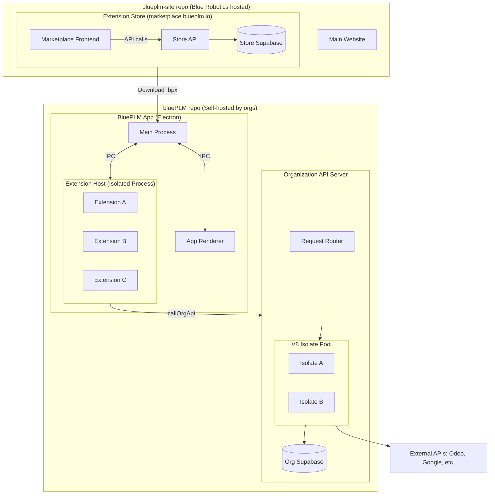

# BluePLM Extension System Architecture

> **Goal:** Transform BluePLM into an enterprise-grade extensible platform with VS Code/Atlassian Forge-style architecture.

---

## Executive Summary

| Aspect | Decision |

|--------|----------|

| **Terminology** | Extensions (not modules) |

| **Client Isolation** | Extension Host process with per-extension sandboxing |

| **Server Isolation** | V8 isolate pool on org's API (like Cloudflare Workers) |

| **Marketplace** | marketplace.blueplm.io (Cloudflare Pages + Supabase) - in `blueplm-site` repo |

| **Package Format** | `.bpx` files (zip archive) |

| **Verification** | Verified (Blue Robotics) / Community |

| **Pricing** | All free, all open source |

| **Install UX** | One-click (~3-5 seconds) |

| **Native Extensions** | Verified-only, for integrations like SolidWorks |

---

## Architecture Diagram



> **Repository Split:** The marketplace (Store API, Store Database, Marketplace Frontend) lives in the `blueplm-site` repository, maintained by Blue Robotics. The BluePLM application and Org API live in the `bluePLM` repository, self-hosted by organizations.

---

## Agent Overview

### Wave 1: Foundation (Parallel)

| Agent | Name | Deliverables | Key Files |

|-------|------|--------------|-----------|

| 1 | Types & Schema | TypeScript types, JSON Schema, manifest parser, signing types | `src/lib/extensions/types.ts`, `schemas/` |

| 2 | Extension Host | Isolated process with per-extension sandboxing, watchdog | `electron/extension-host/` |

| 3 | Client API | Sandboxed API: UI, storage, network, commands, telemetry | `src/lib/extensions/api/` |

### Wave 2: Infrastructure (Parallel)

| Agent | Name | Deliverables | Key Files |

|-------|------|--------------|-----------|

| 4 | Registry | Extension lifecycle, one-click install, update/rollback | `src/lib/extensions/registry/` |

| 5 | IPC Bridge | Main, Host, Renderer communication | `electron/handlers/extensions.ts` |

| 6 | Store Database | Supabase schema for marketplace, reports, deprecations | `blueplm-site/supabase-store/` |

| 7 | API Sandbox | V8 isolate pool, rate limits, org tables | `api/src/extensions/` |

### Wave 3: Marketplace (Depends on Wave 2)

> **Note:** Agents 6, 8, and 9 work in the `blueplm-site` repository (not `bluePLM`), as the marketplace is a centralized Blue Robotics service.

>

> **Migration Required:** Agent 6 was initially completed in `bluePLM/supabase-store/`. These files need to be moved to `blueplm-site/supabase-store/` before proceeding.

| Agent | Name | Deliverables | Key Files |

|-------|------|--------------|-----------|

| 8 | Store API | REST endpoints for marketplace | `blueplm-site/api/` |

| 9 | Marketplace Site | Marketplace frontend on Cloudflare | `blueplm-site/src/pages/marketplace/` |

### Wave 4: App Integration (Depends on Waves 1-3)

| Agent | Name | Deliverables | Key Files |

|-------|------|--------------|-----------|

| 10 | App UI | In-app store, install dialogs, Zustand slice | `src/features/extensions/` |

| 11 | Settings | Navigation reorganization | `src/features/settings/` |

### Wave 5: Reference Implementation

| Agent | Name | Deliverables | Key Files |

|-------|------|--------------|-----------|

| 12 | Google Drive | First extension migration with feature flags | `src/extensions/google-drive/` |

---

## Performance Budgets

| Operation | Budget |

|-----------|--------|

| Extension Host startup | < 500ms |

| Extension load time | < 200ms per extension |

| IPC round-trip | < 10ms |

| Server handler cold start | < 100ms |

| Server handler warm execution | < 50ms (excluding business logic) |

| Store API response (cached) | < 200ms |

| Store API response (uncached) | < 500ms |

| Extension install (< 1MB bundle) | < 5 seconds |

---

## Extension Package Format

Extensions are distributed as **`.bpx`** files (BluePLM Extension):

```
my-extension-1.0.0.bpx  (zip archive)
├── extension.json        <- Manifest (required)
├── README.md             <- Documentation
├── LICENSE               <- Open source license (required)
├── icon.png              <- 128x128 icon
├── SIGNATURE             <- Ed25519 signature (verified only)
├── client/               <- Runs in Extension Host
│   ├── index.js          <- Entry: activate(context, api), deactivate()
│   └── components/
│       ├── Panel.js
│       └── Settings.js
└── server/               <- Runs on Org's API (sandboxed)
    ├── connect.js        <- POST /extensions/{id}/connect
    ├── sync.js           <- POST /extensions/{id}/sync
    └── webhook.js        <- POST /extensions/{id}/webhook (public)
```

---

## Extension Categories

| Category | Where It Runs | Use Case | Trust Level |

|----------|---------------|----------|-------------|

| **Sandboxed** (default) | Extension Host + V8 isolate | Most extensions | Community or Verified |

| **Native** | Main process | SolidWorks, native integrations | Verified only |

Native extensions require explicit user approval with security warning.

---

## One-Click Install Flow

```
User clicks [Install]
        │
        ▼
┌─────────────────────────────────────────────────────────┐
│ 1. Download .bpx (~1-2 seconds)                         │
│    GET marketplace.blueplm.io/api/.../download          │
├─────────────────────────────────────────────────────────┤
│ 2. Verify (~100ms)                                      │
│    - Check SHA256 hash                                  │
│    - Validate signature (if verified)                   │
│    - Check revocation list                              │
│    - Parse extension.json                               │
├─────────────────────────────────────────────────────────┤
│ 3. Load client (~200ms)                                 │
│    - Extract to Extension Host                          │
│    - Register views, commands, configuration            │
├─────────────────────────────────────────────────────────┤
│ 4. Deploy server (~1-2 seconds)                         │
│    POST {org-api}/admin/extensions/install              │
│    - Upload handlers to org's API                       │
│    - Register routes in V8 sandbox                      │
│    - Create org_installed_extensions record             │
├─────────────────────────────────────────────────────────┤
│ 5. Done!                                                │
│    - Record in local registry                           │
│    - Report analytics (anonymous)                       │
└─────────────────────────────────────────────────────────┘

User sees: Progress bar -> "Installed successfully!" -> Open Settings
Total time: ~3-5 seconds
```

---

## Verification & Security

### Verification Tiers

| Tier | Badge | Meaning |

|------|-------|---------|

| **Verified** | Checkmark | Code reviewed and signed by Blue Robotics |

| **Community** | Warning | Not reviewed - use at your own risk |

| **Sideloaded** | Alert | Installed from file - prominent warning |

### Security Layers

| Layer | Protection |

|-------|------------|

| **Client code** | Extension Host (isolated process), per-extension sandbox |

| **Server code** | V8 isolate pool (no Node.js access), memory limits |

| **Rate limits** | 100 req/min per extension (configurable) |

| **Request size** | 1MB max per request |

| **Data** | Extension can only access its own storage |

| **Network** | HTTP requests logged, declared domains only |

| **Secrets** | Encrypted, 50 max per extension, 10KB max each, access audited |

| **Signatures** | Ed25519, public key registry, revocation list |

### Signature Verification

| Aspect | Implementation |

|--------|----------------|

| **Algorithm** | Ed25519 |

| **Key Registry** | Blue Robotics maintains trusted public keys |

| **Key Rotation** | Annual rotation, 90-day overlap period |

| **Revocation** | CRL checked at install time |

| **Sideloaded** | Prominent warning, user must acknowledge |

---

## Settings Reorganization

```
ACCOUNT
├── Profile
├── Preferences
├── Keybindings
├── Sidebar               <- Renamed from "Modules"
└── Delete Account

ORGANIZATION
├── Supabase         ●    <- Moved up (core infrastructure)
├── Backups          ●    <- Moved up
├── Vaults
├── Members & Teams
├── Company Profile
├── Sign-In Methods
├── Serialization
├── Export Options
├── File Metadata
├── RFQ Settings
└── Recovery Codes

EXTENSIONS                 <- Renamed from "Integrations"
├── Extension Store        <- NEW
├── ─────────────
├── SolidWorks       ●     <- Native extension
├── Google Drive     ●
├── Odoo ERP         ●
├── ─────────────
├── REST API         ●
└── Webhooks         ●

SYSTEM
├── Performance
├── Logs
├── Dev Tools
└── About
```

---

# Agent Specifications

---

## Agent 1: Types & JSON Schema

### Overview

| Attribute | Value |

|-----------|-------|

| **Wave** | 1 (Foundation) |

| **Dependencies** | None |

| **Parallel With** | Agents 2, 3 |

| **Report** | `AGENT1_TYPES_REPORT.md` |

### Owns (Exclusive Write)

```
src/lib/extensions/
├── types.ts          <- All TypeScript interfaces
├── manifest.ts       <- Zod parser for extension.json
├── package.ts        <- .bpx extraction and verification
└── index.ts          <- Barrel exports

schemas/
└── extension-v1.schema.json   <- JSON Schema for autocomplete
```

### Reads (No Modify)

```
src/types/            <- Reference existing patterns
```

### Prompt

````markdown
# Agent 1: Types & JSON Schema

Implement the core type system and JSON Schema for BluePLM's enterprise 
extension architecture.

## Context

BluePLM is building a VS Code/Atlassian Forge-style extension system where:
- Extensions declare capabilities via JSON manifests (extension.json)
- Extensions can have client code (Extension Host) and server code (API sandbox)
- Extensions are distributed as .bpx packages (zip archives)
- Two categories: "sandboxed" (default) and "native" (verified only)
- Verification tiers: Verified (signed by Blue Robotics) and Community

## Deliverables

### 1. src/lib/extensions/types.ts

```typescript
// Extension categories
type ExtensionCategory = 'sandboxed' | 'native'

// Manifest structure
interface ExtensionManifest {
  // Identity
  id: string                              // e.g., "blueplm.google-drive"
  name: string                            // Display name
  version: string                         // Semver
  publisher: string                       // Publisher slug
  
  // Metadata
  description?: string
  icon?: string
  repository?: string
  license: string                         // OSI-approved
  
  // Category (default: sandboxed)
  category?: ExtensionCategory
  
  // For native extensions only
  native?: {
    platforms: ('win32' | 'darwin' | 'linux')[]
    electronMain?: string
    requiresAdmin?: boolean
  }
  
  // Dependencies
  engines: { blueplm: string }            // e.g., "^1.0.0"
  extensionDependencies?: string[]        // e.g., ["blueplm.core-utils@^1.0.0"]
  extensionPack?: string[]                // Bundle multiple extensions
  
  // Entry points
  main?: string                           // Client entry
  serverMain?: string                     // Server entry
  
  // Capabilities
  activationEvents: ActivationEvent[]
  contributes: ExtensionContributions
  permissions: ExtensionPermissions
}

// What extensions can contribute
interface ExtensionContributions {
  views?: ViewContribution[]
  commands?: CommandContribution[]
  settings?: SettingsContribution[]
  apiRoutes?: ApiRouteContribution[]
  configuration?: ConfigurationContribution      // <- NEW
}

// Typed configuration schema (VS Code pattern)
interface ConfigurationContribution {
  title: string
  properties: Record<string, ConfigurationProperty>
}

interface ConfigurationProperty {
  type: 'string' | 'number' | 'boolean' | 'array' | 'object'
  default?: unknown
  description?: string
  enum?: unknown[]
  minimum?: number
  maximum?: number
}

// Activation events
type ActivationEvent =
  | 'onExtensionEnabled'
  | 'onStartup'
  | `onNavigate:${string}`
  | `onCommand:${string}`
  | `onView:${string}`

// Permissions
interface ExtensionPermissions {
  client?: ClientPermission[]
  server?: ServerPermission[]
}

type ClientPermission =
  | 'ui:toast'
  | 'ui:dialog'
  | 'ui:status'
  | 'ui:progress'
  | 'storage:local'
  | 'network:orgApi'
  | 'network:storeApi'
  | 'network:fetch'
  | 'commands:register'
  | 'commands:execute'
  | 'workspace:files'
  | 'telemetry'

type ServerPermission =
  | 'storage:database'
  | 'secrets:read'
  | 'secrets:write'
  | 'http:fetch'
  | `http:domain:${string}`               // Declared allowed domains

// Extension context (passed to activate)
interface ExtensionContext {
  extensionId: string
  extensionPath: string                   // Path to extension files
  storagePath: string                     // Path for extension data
  subscriptions: Disposable[]             // Auto-disposed on deactivate
  
  log: {
    debug(message: string, ...args: unknown[]): void
    info(message: string, ...args: unknown[]): void
    warn(message: string, ...args: unknown[]): void
    error(message: string, ...args: unknown[]): void
  }
}

// Extension state machine
type ExtensionState = 
  | 'not-installed'
  | 'installed' 
  | 'loading' 
  | 'active' 
  | 'error'

// Loaded extension instance
interface LoadedExtension {
  manifest: ExtensionManifest
  state: ExtensionState
  verification: VerificationStatus
  error?: string
  installedAt?: Date
  activatedAt?: Date
}

// Verification status
type VerificationStatus = 'verified' | 'community' | 'sideloaded'

// Package contents after extraction
interface PackageContents {
  manifest: ExtensionManifest
  clientBundle?: string
  serverHandlers?: Record<string, string>
  signature?: string
  hash: string
}

// Disposable pattern (VS Code)
interface Disposable {
  dispose(): void
}
````

### 2. src/lib/extensions/manifest.ts

- `parseManifest(json: unknown): ExtensionManifest` - Parse and validate
- `validateManifest(manifest): ValidationResult` - Detailed validation
- Use Zod for runtime validation
- Helpful error messages with paths

### 3. src/lib/extensions/package.ts

- `extractPackage(bpxPath): Promise<PackageContents>`
- `verifyPackageHash(contents, expectedHash): boolean`
- `verifyPackageSignature(contents, publicKey): boolean`
- `checkRevocationList(keyId): Promise<boolean>`

### 4. schemas/extension-v1.schema.json

- Complete JSON Schema for extension.json
- $schema reference for editor autocomplete
- Comprehensive descriptions for each field
- All contribution types documented

## Quality Requirements

- Enterprise-level code quality
- Comprehensive JSDoc documentation on all exports
- No `any` types - proper generics throughout
- Zod schemas must match TypeScript types exactly
- Export everything needed by other agents

## When Complete

Run `npm run typecheck` and report results in AGENT1_TYPES_REPORT.md

Include in report:

- EXPORTS: All exported types and functions
- IPC CHANNELS: None
- API ENDPOINTS: None
- DATABASE TABLES: None
```

### Tasks

- [ ] Design ExtensionManifest with category and native support
- [ ] Design permission system (client + server)
- [ ] Design configuration contribution type
- [ ] Design verification and signing types with revocation
- [ ] Design ExtensionContext with subscriptions and logging
- [ ] Design extension dependencies
- [ ] Create JSON Schema with full validation
- [ ] Implement Zod manifest parser
- [ ] Implement .bpx package utilities
- [ ] Add comprehensive JSDoc
- [ ] Write completion report

---

## Agent 2: Extension Host Process

### Overview

| Attribute | Value |
|-----------|-------|
| **Wave** | 1 (Foundation) |
| **Dependencies** | None |
| **Parallel With** | Agents 1, 3 |
| **Report** | `AGENT2_HOST_REPORT.md` |

### Owns (Exclusive Write)

```


electron/extension-host/

├── host.ts           <- Main host logic

├── loader.ts         <- Dynamic extension loading

├── sandbox.ts        <- Per-extension sandbox environment

├── watchdog.ts       <- Monitor CPU/memory per extension

├── ipc.ts            <- IPC message handling

├── preload.ts        <- Limited API exposure

├── host.html         <- Entry HTML

└── index.ts          <- Barrel exports

```

### Modifies

```

electron/main.ts      <- Add extension host window creation

````

### Prompt

```markdown
# Agent 2: Extension Host Process

Implement the Extension Host process for client-side extension isolation.

## Context

Like VS Code's Extension Host, client-side extension code runs in a separate 
Electron renderer process (hidden BrowserWindow). This isolates potentially 
untrusted code from the main application.

````

┌─────────────────────┐

│    Main Process     │

│  (electron/main.ts) │

└─────────┬───────────┘

│ IPC

▼

┌─────────────────────────────────────┐

│       Extension Host                │  <- Hidden BrowserWindow

│  ┌────────────────────────────────┐ │

│  │        Watchdog                │ │  <- Monitors all extensions

│  └────────────────────────────────┘ │

│  ┌──────────┐ ┌──────────┐ ┌─────┐ │

│  │ Sandbox  │ │ Sandbox  │ │ ... │ │  <- Per-extension isolation

│  │ Ext A    │ │ Ext B    │ │     │ │

│  └──────────┘ └──────────┘ └─────┘ │

└─────────────────────────────────────┘

````

## Key Requirements

### Per-Extension Isolation

Each extension runs in its own sandbox (using `isolated-vm` or similar):
- Extensions cannot access each other's data
- Extensions cannot access Node.js APIs
- Extensions only have access to ExtensionClientAPI

### Watchdog Process

Monitor all extensions for:
- **Memory budget**: Default 50MB per extension (configurable)
- **CPU timeout**: Default 5s per synchronous operation
- Kill mechanism for runaway extensions
- Report violations to main process

### Native Extension Support

For extensions with `category: 'native'`:
- Do NOT run in Extension Host
- Main process loads them directly (handled by main.ts)
- Only allowed for verified extensions

## Deliverables

### 1. electron/extension-host/host.ts

- Initialize extension runtime environment
- Handle extension loading/unloading
- Manage extension lifecycle
- Coordinate with watchdog

### 2. electron/extension-host/loader.ts

- `loadExtension(bundlePath, manifest): Promise<ExtensionModule>`
- Dynamic import of extension bundles
- Create sandbox for each extension
- Error handling for malformed extensions

### 3. electron/extension-host/sandbox.ts

- Create sandboxed environment per extension
- Inject ExtensionClientAPI
- Prevent access to Node.js APIs
- Memory isolation between extensions

### 4. electron/extension-host/watchdog.ts

```typescript
interface WatchdogConfig {
  memoryLimitMB: number      // Default: 50
  cpuTimeoutMs: number       // Default: 5000
  checkIntervalMs: number    // Default: 1000
}

class Watchdog {
  start(): void
  stop(): void
  registerExtension(id: string, config?: Partial<WatchdogConfig>): void
  unregisterExtension(id: string): void
  killExtension(id: string, reason: string): void
  getStats(id: string): ExtensionStats
  onViolation(callback: (id: string, violation: Violation) => void): void
}
````

### 5. electron/extension-host/ipc.ts

- Handle messages from main process
- Send status updates back to main
- Request/response correlation with unique IDs
- Report watchdog violations

### 6. electron/extension-host/preload.ts

- Expose limited IPC to host renderer
- No direct Node.js access
- Minimal surface area

### 7. electron/extension-host/host.html

- Entry HTML that loads host.ts
- No external resources

### 8. Update electron/main.ts

- Create hidden BrowserWindow on app ready
- Handle host lifecycle (restart on crash)
- Route IPC messages
- Handle native extension loading separately

## Quality Requirements

- Enterprise-level code quality
- Host crash should NOT crash main app
- Individual extension crash should NOT affect other extensions
- Proper error handling and logging
- Clean shutdown handling
- Memory leaks will be caught by watchdog

## When Complete

Run `npm run typecheck` and report results in AGENT2_HOST_REPORT.md

Include in report:

- EXPORTS: All exported types and functions
- IPC CHANNELS: All channels registered
- Performance: Startup time measurement
```

### Tasks

- [ ] Create extension-host directory structure
- [ ] Implement host.ts runtime
- [ ] Implement loader.ts for dynamic loading
- [ ] Implement per-extension sandbox environment
- [ ] Implement watchdog with memory/CPU monitoring
- [ ] Create preload.ts
- [ ] Create host.html
- [ ] Update main.ts for host management
- [ ] Add native extension support in main.ts
- [ ] Add crash recovery
- [ ] Write completion report

---

## Agent 3: Sandboxed Client API

### Overview

| Attribute | Value |
|-----------|-------|
| **Wave** | 1 (Foundation) |
| **Dependencies** | None |
| **Parallel With** | Agents 1, 2 |
| **Report** | `AGENT3_CLIENT_API_REPORT.md` |

### Owns (Exclusive Write)

```


src/lib/extensions/api/

├── types.ts          <- ExtensionClientAPI interface

├── ui.ts             <- showToast, showDialog, setStatus, showProgress, showQuickPick, showInputBox

├── storage.ts        <- Extension-scoped local storage

├── network.ts        <- callOrgApi, callStoreApi, fetch

├── events.ts         <- Event subscriptions

├── commands.ts       <- registerCommand, executeCommand

├── workspace.ts      <- onFileChanged, getOpenFiles, getCurrentVault

├── telemetry.ts      <- trackEvent, trackError, trackTiming

├── context.ts        <- Extension context

├── permissions.ts    <- Permission checking

└── index.ts          <- Barrel exports

```

### Reads (No Modify)

```

src/types/            <- Reference patterns

````

### Prompt

```markdown
# Agent 3: Sandboxed Client API

Implement the Sandboxed Client API that extensions use in the Extension Host.

## Context

Extensions running in the Extension Host cannot directly access BluePLM 
internals (store, Supabase, Electron APIs). They use ExtensionClientAPI - 
a controlled, permission-gated interface that forwards requests via IPC.

## Deliverables

### 1. src/lib/extensions/api/types.ts

```typescript
interface ExtensionClientAPI {
  // ----- UI Operations -----
  ui: {
    showToast(message: string, type: 'success' | 'error' | 'info'): void
    showDialog(options: DialogOptions): Promise<DialogResult>
    setStatus(status: 'online' | 'offline' | 'partial' | 'checking'): void
    
    // Progress indicator (VS Code pattern)
    showProgress<T>(
      options: ProgressOptions,
      task: (progress: Progress) => Promise<T>
    ): Promise<T>
    
    // Quick pick (VS Code pattern)
    showQuickPick(
      items: QuickPickItem[],
      options?: QuickPickOptions
    ): Promise<QuickPickItem | undefined>
    
    // Input box (VS Code pattern)
    showInputBox(options?: InputBoxOptions): Promise<string | undefined>
  }
  
  // ----- Extension-Scoped Storage (local) -----
  storage: {
    get<T>(key: string): Promise<T | undefined>
    set<T>(key: string, value: T): Promise<void>
    delete(key: string): Promise<void>
    keys(): Promise<string[]>
  }
  
  // ----- Network -----
  callOrgApi<T>(endpoint: string, options?: RequestInit): Promise<T>
  callStoreApi<T>(endpoint: string): Promise<T>
  fetch(url: string, options?: RequestInit): Promise<Response>
  
  // ----- Commands (VS Code pattern) -----
  commands: {
    registerCommand(
      id: string, 
      handler: (...args: unknown[]) => unknown
    ): Disposable
    executeCommand<T>(id: string, ...args: unknown[]): Promise<T>
    getCommands(): Promise<string[]>
  }
  
  // ----- Workspace -----
  workspace: {
    onFileChanged(callback: (events: FileChangeEvent[]) => void): Disposable
    getOpenFiles(): Promise<OpenFile[]>
    getCurrentVault(): Promise<Vault | undefined>
  }
  
  // ----- Events -----
  events: {
    on(event: ExtensionEvent, callback: (...args: unknown[]) => void): Disposable
  }
  
  // ----- Telemetry (privacy-respecting, anonymous) -----
  telemetry: {
    trackEvent(name: string, properties?: Record<string, string | number>): void
    trackError(error: Error, context?: Record<string, string>): void
    trackTiming(name: string, durationMs: number): void
  }
  
  // ----- Context (read-only) -----
  context: {
    extensionId: string
    version: string
    user: { id: string; email: string }
    organization: { id: string; name: string }
  }
}

// Supporting types
interface ProgressOptions {
  title: string
  cancellable?: boolean
}

interface Progress {
  report(value: { message?: string; increment?: number }): void
}

interface QuickPickItem {
  label: string
  description?: string
  detail?: string
  picked?: boolean
  data?: unknown
}

interface QuickPickOptions {
  title?: string
  placeholder?: string
  canPickMany?: boolean
}

interface InputBoxOptions {
  title?: string
  placeholder?: string
  value?: string
  password?: boolean
  validateInput?(value: string): string | undefined
}

interface FileChangeEvent {
  type: 'created' | 'changed' | 'deleted'
  path: string
  vaultId: string
}

interface OpenFile {
  path: string
  vaultId: string
}
````

### 2. Individual API Implementations

Each file implements stubs that forward requests via IPC to the main process.

All methods must check permissions before executing.

### 3. src/lib/extensions/api/permissions.ts

```typescript
function checkPermission(
  extensionId: string, 
  api: string, 
  method: string
): boolean

function hasPermissions(
  extensionId: string, 
  required: Permission[]
): boolean

function getGrantedPermissions(extensionId: string): Permission[]
```

## Quality Requirements

- Enterprise-level code quality
- Every method must have JSDoc with examples
- Proper TypeScript generics
- No `any` types
- All methods async (IPC is async)
- Permission checks on every method

## When Complete

Run `npm run typecheck` and report results in AGENT3_CLIENT_API_REPORT.md

Include in report:

- EXPORTS: All exported types and functions
- IPC CHANNELS: All channels this API uses
```

### Tasks

- [ ] Design complete ExtensionClientAPI interface
- [ ] Implement UI API (toast, dialog, status, progress, quickpick, inputbox)
- [ ] Implement Storage API
- [ ] Implement Network API (callOrgApi, callStoreApi, fetch)
- [ ] Implement Commands API (registerCommand, executeCommand)
- [ ] Implement Workspace API (onFileChanged, getOpenFiles, getCurrentVault)
- [ ] Implement Telemetry API (trackEvent, trackError, trackTiming)
- [ ] Implement Events API
- [ ] Create permission checking utilities
- [ ] Add JSDoc documentation with examples
- [ ] Write completion report

---

## Agent 4: Extension Registry & Lifecycle

### Overview

| Attribute | Value |
|-----------|-------|
| **Wave** | 2 (Infrastructure) |
| **Dependencies** | Agents 1, 2, 3 |
| **Parallel With** | Agents 5, 6, 7 |
| **Report** | `AGENT4_REGISTRY_REPORT.md` |

### Owns (Exclusive Write)

```


src/lib/extensions/registry/

├── ExtensionRegistry.ts    <- Singleton registry class

├── lifecycle.ts            <- State machine

├── activation.ts           <- Activation event handling

├── installer.ts            <- Install/uninstall logic

├── updater.ts              <- Update/rollback logic

├── discovery.ts            <- Local and store discovery

└── index.ts                <- Barrel exports

```

### Imports From

```

src/lib/extensions/types.ts     (Agent 1)

src/lib/extensions/api/         (Agent 3)

````

### Prompt

```markdown
# Agent 4: Extension Registry & Lifecycle

Implement the Extension Registry and Lifecycle Manager.

## Context

The Extension Registry is the central coordinator for all extensions. It 
handles discovery, installation, activation, deactivation, updates, and 
rollback. Supports lazy activation based on events (like VS Code).

## Deliverables

### 1. src/lib/extensions/registry/ExtensionRegistry.ts

```typescript
class ExtensionRegistry {
  // ----- Discovery -----
  async discoverLocalExtensions(path: string): Promise<ExtensionManifest[]>
  async fetchStoreExtensions(): Promise<StoreExtension[]>
  
  // ----- Installation (one-click flow) -----
  async install(extensionId: string, version?: string): Promise<void>
  async installFromFile(bpxPath: string): Promise<void>  // Sideload
  async uninstall(extensionId: string): Promise<void>
  
  // ----- Updates -----
  async checkForUpdates(): Promise<ExtensionUpdate[]>
  async updateExtension(extensionId: string, version?: string): Promise<void>
  async rollbackExtension(extensionId: string): Promise<void>
  async pinVersion(extensionId: string, version: string): Promise<void>
  async unpinVersion(extensionId: string): Promise<void>
  
  // ----- Lifecycle -----
  async activate(extensionId: string): Promise<void>
  async deactivate(extensionId: string): Promise<void>
  async activateByEvent(event: ActivationEvent): Promise<void>
  
  // ----- Queries -----
  getExtension(id: string): LoadedExtension | undefined
  getAllExtensions(): LoadedExtension[]
  getInstalledExtensions(): LoadedExtension[]
  getActiveExtensions(): LoadedExtension[]
  
  // ----- Events -----
  onExtensionStateChange(callback: (id: string, state: ExtensionState) => void): () => void
  onUpdateAvailable(callback: (updates: ExtensionUpdate[]) => void): () => void
}

interface ExtensionUpdate {
  extensionId: string
  currentVersion: string
  newVersion: string
  changelog?: string
  breaking: boolean  // Major version bump
}
````

### 2. src/lib/extensions/registry/lifecycle.ts

State machine:

```
[not-installed] --install()--> [installed] --activate()--> [active]
                                    |                         |
                               uninstall()              deactivate()
                                    |                         |
                                    v                         v
                            [not-installed]             [installed]
```

### 3. src/lib/extensions/registry/installer.ts

One-click install flow:

1. Download .bpx from store
2. Verify hash and signature
3. Check revocation list
4. Extract client code to Extension Host
5. Deploy server handlers to org's API
6. Record in local registry

### 4. src/lib/extensions/registry/updater.ts

Update flow:

- Auto-update check on app startup (configurable)
- Version pinning for enterprise orgs
- Keep previous version for rollback (7 days)
- Breaking update detection (major version)

## Quality Requirements

- Enterprise-level code quality
- Proper error handling for each lifecycle transition
- No memory leaks - proper subscription cleanup
- Logging for debugging
- Rollback must always work

## When Complete

Run `npm run typecheck` and report results in AGENT4_REGISTRY_REPORT.md

```

### Tasks

- [ ] Implement ExtensionRegistry singleton
- [ ] Implement lifecycle state machine
- [ ] Implement activation events
- [ ] Implement one-click installer
- [ ] Implement server handler deployment (calls org API)
- [ ] Implement sideloading
- [ ] Implement update checker
- [ ] Implement rollback mechanism
- [ ] Implement version pinning
- [ ] Add error handling and logging
- [ ] Write completion report

---

## Agent 5: IPC Bridge

### Overview

| Attribute | Value |
|-----------|-------|
| **Wave** | 2 (Infrastructure) |
| **Dependencies** | Agents 1, 2 |
| **Parallel With** | Agents 4, 6, 7 |
| **Report** | `AGENT5_IPC_REPORT.md` |

### Owns (Exclusive Write)

```

electron/handlers/extensions.ts    <- Main process handlers

src/lib/extensions/ipc/

├── client.ts                      <- Renderer-side client

├── protocol.ts                    <- Message type definitions

└── index.ts

```

### Modifies

```

electron/preload.ts           <- Add extensions section

electron/handlers/index.ts    <- Register handler

src/electron.d.ts             <- Add types

````

### Prompt

```markdown
# Agent 5: IPC Bridge

Implement the IPC Bridge connecting Main Process, Extension Host, and Renderer.

## Context

The IPC Bridge routes messages between three processes:
- Main Process (Electron main)
- Extension Host (hidden renderer with extensions)
- App Renderer (main UI)

## Deliverables

### 1. src/lib/extensions/ipc/protocol.ts

```typescript
// Main <-> Host messages
type HostMessage =
  | { type: 'extension:load'; extensionId: string; bundlePath: string }
  | { type: 'extension:activate'; extensionId: string }
  | { type: 'extension:deactivate'; extensionId: string }
  | { type: 'extension:kill'; extensionId: string; reason: string }
  | { type: 'api:call'; callId: string; api: string; method: string; args: unknown[] }

type HostResponse =
  | { type: 'extension:loaded'; extensionId: string }
  | { type: 'extension:activated'; extensionId: string }
  | { type: 'extension:error'; extensionId: string; error: string }
  | { type: 'extension:killed'; extensionId: string; reason: string }
  | { type: 'watchdog:violation'; extensionId: string; violation: Violation }
  | { type: 'api:result'; callId: string; result: unknown }
  | { type: 'api:error'; callId: string; error: string }
````

### 2. electron/handlers/extensions.ts

- Handle lifecycle commands (load, activate, deactivate, kill)
- Forward API calls from Host
- Route events to/from extensions
- Handle watchdog violations

### 3. src/lib/extensions/ipc/client.ts

Renderer-side client for calling extension system.

### 4. Update electron/preload.ts

```typescript
extensions: {
  getAll: () => ipcRenderer.invoke('extensions:get-all'),
  install: (id, version?) => ipcRenderer.invoke('extensions:install', id, version),
  uninstall: (id) => ipcRenderer.invoke('extensions:uninstall', id),
  activate: (id) => ipcRenderer.invoke('extensions:activate', id),
  deactivate: (id) => ipcRenderer.invoke('extensions:deactivate', id),
  checkUpdates: () => ipcRenderer.invoke('extensions:check-updates'),
  update: (id, version?) => ipcRenderer.invoke('extensions:update', id, version),
  rollback: (id) => ipcRenderer.invoke('extensions:rollback', id),
  onStateChange: (callback) => ...
}
```

### 5. Update src/electron.d.ts

Add all types for the extensions API.

## Quality Requirements

- Type-safe IPC with proper validation
- Request/response correlation with unique IDs
- Timeout handling for hung extensions (30s default)
- Error forwarding with stack traces
- IPC round-trip < 10ms

## When Complete

Run `npm run typecheck` and report results in AGENT5_IPC_REPORT.md

```

### Tasks

- [ ] Define IPC protocol types
- [ ] Implement main process handlers
- [ ] Implement renderer-side client
- [ ] Update preload.ts
- [ ] Update electron.d.ts
- [ ] Add timeout handling
- [ ] Add watchdog violation handling
- [ ] Write completion report

---

## Agent 6: Extension Store Database

### Overview

| Attribute | Value |
|-----------|-------|
| **Wave** | 2 (Infrastructure) |
| **Dependencies** | None |
| **Parallel With** | Agents 4, 5, 7 |
| **Repository** | `blueplm-site` (not bluePLM) |
| **Report** | `blueplm-site/AGENT6_STORE_DB_REPORT.md` |

### Owns (Exclusive Write)

```

blueplm-site/supabase-store/

├── schema.sql        <- Complete database schema

├── seed.sql          <- Test data

└── README.md         <- Documentation

`````

### Prompt

```markdown
# Agent 6: Extension Store Database

Create the Extension Store database schema for marketplace.blueplm.io.

**IMPORTANT:** This agent works in the `blueplm-site` repository, not `bluePLM`.

## Context

The Extension Store is a SEPARATE Supabase project hosted by Blue Robotics.
- Any organization can register as a publisher
- Publishers can submit extensions
- Verification tiers: Verified (Blue Robotics approved) / Community
- All extensions must be open source and free
- This is centralized infrastructure maintained by Blue Robotics, separate from the self-hosted BluePLM app

## Deliverables

### 1. blueplm-site/supabase-store/schema.sql

```sql
-- Publishers (organizations that submit extensions)
CREATE TABLE publishers (
  id UUID PRIMARY KEY DEFAULT gen_random_uuid(),
  name TEXT NOT NULL,
  slug TEXT UNIQUE NOT NULL,
  description TEXT,
  website_url TEXT,
  logo_url TEXT,
  verified BOOLEAN DEFAULT FALSE,
  verified_at TIMESTAMPTZ,
  created_at TIMESTAMPTZ DEFAULT NOW()
);

-- Extensions
CREATE TABLE extensions (
  id UUID PRIMARY KEY DEFAULT gen_random_uuid(),
  publisher_id UUID REFERENCES publishers(id),
  name TEXT NOT NULL,                    -- e.g., "blowdo"
  display_name TEXT NOT NULL,            -- e.g., "Blowdo Integration"
  description TEXT,
  icon_url TEXT,
  repository_url TEXT NOT NULL,          -- Required (open source)
  license TEXT NOT NULL,                 -- Must be OSI-approved
  category TEXT DEFAULT 'sandboxed',     -- 'sandboxed' or 'native'
  categories TEXT[],                     -- e.g., ['sync', 'erp']
  tags TEXT[],
  verified BOOLEAN DEFAULT FALSE,
  featured BOOLEAN DEFAULT FALSE,
  download_count INTEGER DEFAULT 0,
  created_at TIMESTAMPTZ DEFAULT NOW(),
  updated_at TIMESTAMPTZ DEFAULT NOW(),
  UNIQUE(publisher_id, name)
);

-- Extension Versions
CREATE TABLE extension_versions (
  id UUID PRIMARY KEY DEFAULT gen_random_uuid(),
  extension_id UUID REFERENCES extensions(id) ON DELETE CASCADE,
  version TEXT NOT NULL,                 -- semver
  changelog TEXT,
  bundle_url TEXT NOT NULL,              -- .bpx download URL
  bundle_hash TEXT NOT NULL,             -- SHA256
  bundle_size INTEGER,                   -- bytes
  min_app_version TEXT,
  manifest JSONB NOT NULL,               -- extension.json contents
  published_at TIMESTAMPTZ DEFAULT NOW(),
  UNIQUE(extension_id, version)
);

-- Abuse/security reports
CREATE TABLE extension_reports (
  id UUID PRIMARY KEY DEFAULT gen_random_uuid(),
  extension_id UUID REFERENCES extensions(id),
  reporter_email TEXT NOT NULL,
  reason TEXT NOT NULL,                  -- 'malicious', 'broken', 'spam', 'other'
  details TEXT,
  status TEXT DEFAULT 'pending',         -- 'pending', 'investigating', 'resolved', 'dismissed'
  resolved_at TIMESTAMPTZ,
  resolved_by TEXT,
  created_at TIMESTAMPTZ DEFAULT NOW()
);

-- Deprecation notices
CREATE TABLE extension_deprecations (
  id UUID PRIMARY KEY DEFAULT gen_random_uuid(),
  extension_id UUID REFERENCES extensions(id),
  deprecated_at TIMESTAMPTZ DEFAULT NOW(),
  reason TEXT,
  replacement_id UUID REFERENCES extensions(id),
  sunset_date DATE,                      -- When it will be removed
  created_at TIMESTAMPTZ DEFAULT NOW()
);

-- Analytics (anonymous)
CREATE TABLE extension_installs (
  id UUID PRIMARY KEY DEFAULT gen_random_uuid(),
  extension_id UUID REFERENCES extensions(id),
  version TEXT,
  app_version TEXT,
  platform TEXT,                         -- win32, darwin, linux
  installed_at TIMESTAMPTZ DEFAULT NOW()
);
````

### 2. RLS Policies

- Public read for extensions
- Publisher can only modify their own
- Admin-only verification and featuring
- Rate limit on reports (prevent spam)

### 3. Helper Functions

```sql
-- Increment download count atomically
CREATE FUNCTION increment_download_count(ext_id UUID)

-- Get latest version for an extension
CREATE FUNCTION get_latest_version(ext_id UUID)

-- Search extensions with full-text
CREATE FUNCTION search_extensions(
  query TEXT,
  categories TEXT[],
  verified_only BOOLEAN
)
`````

### 4. blueplm-site/supabase-store/seed.sql

Sample publishers and extensions for testing.

## When Complete

Write report in blueplm-site/AGENT6_STORE_DB_REPORT.md

Include:

- DATABASE TABLES: All tables created
- FUNCTIONS: All functions created
```

### Tasks

- [ ] Design publishers table
- [ ] Design extensions table with category field
- [ ] Design versions table with bundle storage
- [ ] Design extension_reports table
- [ ] Design extension_deprecations table
- [ ] Design installs analytics
- [ ] Create RLS policies
- [ ] Create helper functions
- [ ] Create seed data
- [ ] Write documentation
- [ ] Write completion report

---

## Agent 7: API Sandbox Runtime

### Overview

| Attribute | Value |
|-----------|-------|
| **Wave** | 2 (Infrastructure) |
| **Dependencies** | Agent 1 |
| **Parallel With** | Agents 4, 5, 6 |
| **Report** | `AGENT7_API_SANDBOX_REPORT.md` |

### Owns (Exclusive Write)

```


api/src/extensions/

├── sandbox.ts        <- V8 isolate pool management

├── runtime.ts        <- ExtensionServerAPI implementation

├── loader.ts         <- Load handler code

├── router.ts         <- Route requests to handlers

├── storage.ts        <- Extension-scoped storage

├── secrets.ts        <- Encrypted secrets with audit

├── ratelimit.ts      <- Per-extension rate limiting

└── index.ts

api/routes/extensions.ts    <- Admin endpoints + routing

supabase/migrations/xxx_extension_tables.sql  <- Org database tables

```

### Modifies

```

api/routes/index.ts   <- Register routes

````

### Prompt

```markdown
# Agent 7: API Sandbox Runtime

Implement the V8 sandbox runtime for extension server handlers.

## Context

When extensions with server components are installed, their handlers run in 
isolated V8 sandboxes on the org's API server. This is similar to Cloudflare 
Workers or Atlassian Forge functions.

## Security Model

- Handlers run in V8 isolates (no Node.js access)
- Limited to ExtensionServerAPI only
- Each extension isolated from others
- All HTTP requests logged
- Per-extension rate limiting
- Secret access audited

## Deliverables

### 1. api/src/extensions/sandbox.ts

V8 isolate pool management:

```typescript
interface IsolatePoolConfig {
  poolSize: number           // Default: 10
  memoryLimitMB: number      // Default: 128
  timeoutMs: number          // Default: 30000
}

class IsolatePool {
  constructor(config?: Partial<IsolatePoolConfig>)
  
  // Get warm isolate or create new one
  async acquire(): Promise<Isolate>
  
  // Return to pool or dispose if over limit
  release(isolate: Isolate): void
  
  // Execute handler in isolate
  async execute(
    extensionId: string,
    handlerCode: string,
    api: ExtensionServerAPI
  ): Promise<Response>
  
  // Graceful shutdown
  async dispose(): Promise<void>
  
  // Stats for monitoring
  getStats(): PoolStats
}
````

Performance targets:

- Cold start: < 100ms
- Warm execution: < 50ms (excluding business logic)
- Memory limit per isolate: 128MB

### 2. api/src/extensions/runtime.ts

```typescript
interface ExtensionServerAPI {
  // Extension-scoped storage (database)
  storage: {
    get<T>(key: string): Promise<T | undefined>
    set<T>(key: string, value: T): Promise<void>
    delete(key: string): Promise<void>
    list(prefix?: string): Promise<string[]>
  }
  
  // Encrypted secrets (API keys, tokens) - AUDITED
  secrets: {
    get(name: string): Promise<string | undefined>
    set(name: string, value: string): Promise<void>
    delete(name: string): Promise<void>
    // Limits: 50 secrets max, 10KB max per secret
  }
  
  // HTTP client (logged, domain-restricted)
  http: {
    fetch(url: string, options?: RequestInit): Promise<Response>
  }
  
  // Request context
  request: {
    method: string
    path: string
    body: unknown
    headers: Record<string, string>
    query: Record<string, string>
  }
  
  // User context (null for public endpoints)
  user: {
    id: string
    email: string
    orgId: string
    role: string
  } | null
  
  // Response helpers
  response: {
    json(data: unknown, status?: number): Response
    error(message: string, status?: number): Response
    redirect(url: string, status?: number): Response
  }
}
```

### 3. api/src/extensions/ratelimit.ts

```typescript
interface RateLimitConfig {
  requestsPerMinute: number  // Default: 100
  requestSizeBytes: number   // Default: 1MB
}

async function checkRateLimit(
  extensionId: string,
  requestSize: number
): Promise<{ allowed: boolean; retryAfter?: number }>
```

### 4. api/routes/extensions.ts

```typescript
// Admin endpoints
POST /admin/extensions/install
  Body: { extensionId, version, handlers, routes, allowedDomains }
  -> Load handlers into sandbox, register routes

DELETE /admin/extensions/:id
  -> Remove handlers and routes

GET /admin/extensions
  -> List installed extensions

GET /admin/extensions/:id/stats
  -> Rate limit stats, storage usage, etc.

// Extension routes (forwarded to sandbox)
ALL /extensions/:extensionId/*
  -> Check rate limit
  -> Route to appropriate handler in sandbox
  -> Log request/response
```

### 5. Org Database Tables

```sql
-- Track installed extensions per org
CREATE TABLE org_installed_extensions (
  org_id UUID REFERENCES organizations(id) ON DELETE CASCADE,
  extension_id TEXT NOT NULL,
  version TEXT NOT NULL,
  installed_at TIMESTAMPTZ DEFAULT NOW(),
  installed_by UUID REFERENCES auth.users(id),
  pinned_version TEXT,           -- NULL = auto-update
  enabled BOOLEAN DEFAULT TRUE,
  PRIMARY KEY (org_id, extension_id)
);

-- Extension configuration per org
CREATE TABLE org_extension_config (
  org_id UUID,
  extension_id TEXT,
  config JSONB DEFAULT '{}',
  updated_at TIMESTAMPTZ DEFAULT NOW(),
  updated_by UUID,
  PRIMARY KEY (org_id, extension_id)
);

-- Extension-scoped storage
CREATE TABLE extension_storage (
  org_id UUID,
  extension_id TEXT,
  key TEXT,
  value JSONB,
  updated_at TIMESTAMPTZ DEFAULT NOW(),
  PRIMARY KEY (org_id, extension_id, key)
);

-- Extension secrets (encrypted)
CREATE TABLE extension_secrets (
  org_id UUID,
  extension_id TEXT,
  name TEXT,
  encrypted_value TEXT,          -- AES-256-GCM
  created_at TIMESTAMPTZ DEFAULT NOW(),
  updated_at TIMESTAMPTZ DEFAULT NOW(),
  PRIMARY KEY (org_id, extension_id, name)
);

-- Secret access audit log
CREATE TABLE extension_secret_access (
  id UUID PRIMARY KEY DEFAULT gen_random_uuid(),
  org_id UUID,
  extension_id TEXT,
  secret_name TEXT,
  action TEXT,                   -- 'read', 'write', 'delete'
  accessed_by TEXT,              -- user_id or 'system'
  accessed_at TIMESTAMPTZ DEFAULT NOW()
);
```

## Quality Requirements

- Handlers cannot escape sandbox
- Timeout enforcement (default 30s)
- Memory limits per isolate (128MB)
- Comprehensive logging
- Audit trail for secrets

## When Complete

Run `npm run typecheck` in api/ and report results in AGENT7_API_SANDBOX_REPORT.md

Include:

- DATABASE TABLES: All tables created
- API ENDPOINTS: All endpoints
- Performance: Cold start and warm execution times
```

### Tasks

- [ ] Set up V8 isolate pool with warm instances
- [ ] Implement ExtensionServerAPI
- [ ] Implement extension-scoped storage
- [ ] Implement encrypted secrets with audit logging
- [ ] Implement per-extension rate limiting
- [ ] Implement handler loader with domain restriction
- [ ] Create install/uninstall endpoints
- [ ] Create request router with logging
- [ ] Create org database migration
- [ ] Add security controls
- [ ] Write completion report

---

## Agent 8: Extension Store API

### Overview

| Attribute | Value |
|-----------|-------|
| **Wave** | 3 (Marketplace) |
| **Dependencies** | Agent 6 |
| **Parallel With** | Agent 9 |
| **Repository** | `blueplm-site` (not bluePLM) |
| **Report** | `blueplm-site/AGENT8_STORE_API_REPORT.md` |

### Owns (Exclusive Write)

```


blueplm-site/api/

├── server.ts             <- Hono server entry

├── routes/

│   ├── store.ts          <- Store endpoints

│   └── index.ts          <- Route registration

├── schemas/

│   └── store.ts          <- Zod validation

├── utils/

│   └── store.ts          <- Helpers

├── package.json

└── tsconfig.json

`````

### Prompt

```markdown
# Agent 8: Extension Store API

Implement the Extension Store API for marketplace.blueplm.io.

**IMPORTANT:** This agent works in the `blueplm-site` repository, not `bluePLM`.

## Context

This is a standalone API server for the marketplace, separate from the org API in bluePLM.
It will be deployed to Cloudflare Workers or similar serverless platform.

## Deliverables

### blueplm-site/api/routes/store.ts

```typescript
// ----- Public endpoints (no auth) -----
GET  /store/extensions                    // List/search extensions
GET  /store/extensions/:id                // Extension details
GET  /store/extensions/:id/versions       // Version history
GET  /store/extensions/:id/download       // Download .bpx (latest)
GET  /store/extensions/:id/download/:ver  // Download specific version
GET  /store/featured                      // Featured extensions
GET  /store/categories                    // List categories
GET  /store/extensions/:id/deprecation    // Check if deprecated

// ----- Publisher endpoints (auth required) -----
POST /store/publishers                    // Register as publisher
GET  /store/publishers/me                 // My publisher profile
PUT  /store/publishers/me                 // Update profile
POST /store/extensions                    // Submit new extension
PUT  /store/extensions/:id                // Update extension metadata
POST /store/extensions/:id/versions       // Publish new version

// ----- Report endpoints -----
POST /store/extensions/:id/report         // Report extension

// ----- Admin endpoints (Blue Robotics only) -----
POST /store/extensions/:id/verify         // Mark as verified
POST /store/extensions/:id/feature        // Mark as featured
POST /store/extensions/:id/deprecate      // Deprecate extension
GET  /store/reports                       // List reports
PUT  /store/reports/:id                   // Resolve report
````

Connect to the store Supabase project (Agent 6, same repo).

## Quality Requirements

- Proper input validation with Zod
- Rate limiting for downloads (prevent abuse)
- Caching for popular extensions
- Store API response < 200ms (cached), < 500ms (uncached)
- Deployable to Cloudflare Workers

## When Complete

Run `npm run typecheck` in blueplm-site/api/ and report in blueplm-site/AGENT8_STORE_API_REPORT.md

`````

### Tasks

- [ ] Set up Hono API server in blueplm-site/api/
- [ ] Create browse/search endpoint with pagination
- [ ] Create details endpoint
- [ ] Create download endpoint with rate limiting
- [ ] Create publisher endpoints
- [ ] Create submission endpoint
- [ ] Create report endpoint
- [ ] Create admin verification endpoint
- [ ] Create deprecation endpoint
- [ ] Add Zod validation
- [ ] Connect to store Supabase (from Agent 6)
- [ ] Configure for Cloudflare Workers deployment
- [ ] Write completion report

---

## Agent 9: Marketplace Frontend

### Overview

| Attribute | Value |

|-----------|-------|

| **Wave** | 3 (Marketplace) |

| **Dependencies** | Agent 8 |

| **Parallel With** | Agent 8 |

| **Repository** | `blueplm-site` (not bluePLM) |

| **Report** | `blueplm-site/AGENT9_MARKETPLACE_REPORT.md` |

### Owns (Exclusive Write)

```
blueplm-site/src/
├── pages/
│   └── marketplace/
│       ├── Index.tsx              <- /marketplace (browse/home)
│       ├── Extension.tsx          <- /marketplace/extensions/:id
│       ├── Publisher.tsx          <- /marketplace/publishers/:id
│       └── Submit.tsx             <- /marketplace/submit
├── components/
│   └── marketplace/
│       ├── ExtensionCard.tsx
│       ├── SearchFilters.tsx
│       ├── VerificationBadge.tsx
│       ├── NativeBadge.tsx
│       ├── InstallButton.tsx
│       └── DeprecationWarning.tsx
```

### Modifies

```
blueplm-site/src/App.tsx           <- Add marketplace routes
blueplm-site/public/_routes.json   <- Cloudflare subdomain routing
```

### Prompt

````markdown
# Agent 9: Marketplace Frontend

Add marketplace pages to the existing blueplm-site.

**IMPORTANT:** This agent works in the `blueplm-site` repository, not `bluePLM`.

## Context

The blueplm-site repo already has:
- Vite + React + TypeScript + Tailwind (no setup needed!)
- Layout component with Header/Footer
- Routing via react-router-dom
- Main website pages (Home, Downloads, Privacy)

You are adding marketplace functionality to this existing site.
The marketplace will be served at marketplace.blueplm.io via Cloudflare custom domain.

## Integration

Add routes to existing App.tsx:

```typescript
// In App.tsx, add new routes:
<Route path="/marketplace" element={<MarketplaceLayout />}>
  <Route index element={<MarketplaceIndex />} />
  <Route path="extensions/:id" element={<Extension />} />
  <Route path="publishers/:id" element={<Publisher />} />
  <Route path="submit" element={<Submit />} />
</Route>
````

## Pages

| Route | Page | Features |

|-------|------|----------|

| `/marketplace` | Browse/Home | Featured extensions, categories, search |

| `/marketplace/extensions/:id` | Detail | Description, screenshots, versions, install button |

| `/marketplace/publishers/:id` | Publisher | Profile, all their extensions |

| `/marketplace/submit` | Submit | Submit extension (authenticated) |

## Features

- Search with filters (category, verified only, etc.)
- Verification badges (Checkmark = Verified, Warning = Community)
- Native extension badge (for SolidWorks-type)
- Install button (deep link: `blueplm://install/{extensionId}`)
- Publisher profiles with all their extensions
- Download stats
- Deprecation warnings
- Report button

## Cloudflare Subdomain

Configure `marketplace.blueplm.io` as a custom domain in Cloudflare Pages.

The same deployment serves both blueplm.io and marketplace.blueplm.io.

Create `public/_routes.json` if needed for routing configuration.

## When Complete

Report in blueplm-site/AGENT9_MARKETPLACE_REPORT.md

```

### Tasks

- [ ] Create marketplace page components in blueplm-site/src/pages/marketplace/
- [ ] Create marketplace-specific components (cards, filters, badges)
- [ ] Add marketplace routes to existing App.tsx
- [ ] Create MarketplaceLayout component
- [ ] Style consistent with existing site design
- [ ] Configure API calls to Store API (Agent 8)
- [ ] Add deep link handler for `blueplm://install/{id}`
- [ ] Configure Cloudflare for marketplace.blueplm.io subdomain
- [ ] Write completion report

---

## Agent 10: App UI & Store Slice

### Overview

| Attribute | Value |

|-----------|-------|

| **Wave** | 4 (App Integration) |

| **Dependencies** | Agents 1, 4, 8 |

| **Parallel With** | Agent 11 |

| **Report** | `AGENT10_UI_REPORT.md` |

### Owns (Exclusive Write)

```

src/stores/slices/extensionsSlice.ts

src/features/extensions/

├── ExtensionStoreView.tsx      <- Browse marketplace in-app

├── ExtensionList.tsx

├── ExtensionCard.tsx

├── ExtensionDetailsDialog.tsx

├── InstallDialog.tsx           <- Permissions + progress

├── UpdateDialog.tsx            <- Update/rollback

├── SideloadDialog.tsx          <- Install from file

├── VerificationBadge.tsx

└── index.ts

src/hooks/useExtensions.ts

```

### Modifies

```

src/stores/types.ts           <- Add ExtensionsSlice

src/stores/pdmStore.ts        <- Add slice

src/stores/slices/index.ts    <- Export slice

`````

### Prompt

````markdown
# Agent 10: App UI & Store Slice

Implement in-app Extension Store UI and Zustand slice.

## Deliverables

### 1. src/stores/slices/extensionsSlice.ts

```typescript
interface ExtensionsSlice {
  // State
  installedExtensions: Record<string, LoadedExtension>
  extensionStates: Record<string, ExtensionState>
  storeExtensions: StoreExtension[]
  availableUpdates: ExtensionUpdate[]
  storeLoading: boolean
  
  // Actions
  setInstalledExtensions: (extensions: Record<string, LoadedExtension>) => void
  setStoreExtensions: (extensions: StoreExtension[]) => void
  setAvailableUpdates: (updates: ExtensionUpdate[]) => void
  
  // Async actions (call IPC)
  installExtension: (id: string, version?: string) => Promise<void>
  uninstallExtension: (id: string) => Promise<void>
  updateExtension: (id: string, version?: string) => Promise<void>
  rollbackExtension: (id: string) => Promise<void>
  checkForUpdates: () => Promise<void>
}
````

### 2. UI Components

- `ExtensionStoreView.tsx` - Browse marketplace in-app
- `InstallDialog.tsx` - Show permissions, progress, success/error
- `UpdateDialog.tsx` - Show changelog, update/rollback options
- `SideloadDialog.tsx` - Install from .bpx file with warning

## When Complete

Run `npm run typecheck` and report in AGENT10_UI_REPORT.md

`````

### Tasks

- [ ] Create extensionsSlice
- [ ] Add slice to store
- [ ] Create ExtensionStoreView
- [ ] Create InstallDialog with permissions and progress
- [ ] Create UpdateDialog with changelog
- [ ] Create SideloadDialog with warning
- [ ] Create VerificationBadge component
- [ ] Create useExtensions hook
- [ ] Write completion report

---

## Agent 11: Settings Reorganization

### Overview

| Attribute | Value |

|-----------|-------|

| **Wave** | 4 (App Integration) |

| **Dependencies** | None |

| **Parallel With** | Agent 10 |

| **Report** | `AGENT11_SETTINGS_REPORT.md` |

### Modifies

`````

src/features/settings/components/SettingsNavigation.tsx

src/types/settings.ts (if needed)

````

### Prompt

```markdown
# Agent 11: Settings Reorganization

Reorganize Settings navigation structure.

## Changes

1. Move Supabase from Integrations -> Organization (first item)
2. Move Backups to be right below Supabase
3. Rename "Modules" -> "Sidebar" in Account section
4. Rename "Integrations" -> "Extensions"
5. Add "Extension Store" as first item in Extensions section

## Final Structure

````

ACCOUNT

├── Profile

├── Preferences

├── Keybindings

├── Sidebar               <- Renamed

└── Delete Account

ORGANIZATION

├── Supabase         ●    <- Moved up

├── Backups          ●    <- Moved up

├── Vaults

├── Members & Teams

├── ...

EXTENSIONS                 <- Renamed

├── Extension Store        <- NEW

├── ─────────────

├── SolidWorks       ●

├── Google Drive     ●

├── ...

`````

## When Complete

Run `npm run typecheck` and report in AGENT11_SETTINGS_REPORT.md

```

### Tasks

- [ ] Move Supabase to Organization (first position)
- [ ] Move Backups below Supabase
- [ ] Rename Modules -> Sidebar
- [ ] Rename Integrations -> Extensions
- [ ] Add Extension Store navigation item
- [ ] Update types if needed
- [ ] Write completion report

---

## Agent 12: Google Drive Extension

### Overview

| Attribute | Value |

|-----------|-------|

| **Wave** | 5 (Reference Implementation) |

| **Dependencies** | All previous agents |

| **Parallel With** | None |

| **Report** | `AGENT12_GDRIVE_REPORT.md` |

### Owns (Exclusive Write)

```

src/extensions/google-drive/

├── extension.json

├── client/

│   ├── index.ts              <- activate(context, api), deactivate()

│   └── components/

│       ├── GoogleDrivePanel.tsx

│       └── GoogleDriveSettings.tsx

└── server/

├── connect.ts

└── oauth-callback.ts

```

### Reads (For Migration)

```

src/features/integrations/google-drive/

src/features/settings/integrations/google-drive/

`````

### Prompt

````markdown
# Agent 12: Google Drive Extension

Migrate Google Drive to the new extension system as reference implementation.

This is the FIRST extension and serves as the template for all others.

## Migration Strategy

Use feature flags for gradual rollout:

```typescript
// In app config
featureFlags: {
  'extensions.google_drive_v2': false  // Default off
}
````

When flag is true, use new extension. When false, use legacy integration.

## Deliverables

### 1. extension.json

```json
{
  "$schema": "../../schemas/extension-v1.schema.json",
  "id": "blueplm.google-drive",
  "name": "Google Drive",
  "version": "1.0.0",
  "publisher": "blueplm",
  "description": "Sync files with Google Drive",
  "icon": "icon.png",
  "repository": "https://github.com/bluerobotics/blueplm",
  "license": "MIT",
  "category": "sandboxed",
  "engines": { "blueplm": "^1.0.0" },
  "main": "client/index.js",
  "serverMain": "server/index.js",
  "activationEvents": [
    "onExtensionEnabled",
    "onNavigate:settings/extensions/google-drive"
  ],
  "contributes": {
    "views": [...],
    "settings": [...],
    "apiRoutes": [...],
    "configuration": {
      "title": "Google Drive",
      "properties": {
        "syncInterval": {
          "type": "number",
          "default": 300,
          "description": "Sync interval in seconds"
        }
      }
    }
  },
  "permissions": {
    "client": ["ui:toast", "ui:dialog", "ui:status", "storage:local", "network:orgApi"],
    "server": ["storage:database", "secrets:read", "secrets:write", "http:domain:googleapis.com"]
  }
}
`````

### 2. client/index.ts

```typescript
import type { ExtensionContext, ExtensionClientAPI } from '@blueplm/extension-api'

export async function activate(context: ExtensionContext, api: ExtensionClientAPI) {
  context.log.info('Google Drive extension activating')
  
  // Register commands
  context.subscriptions.push(
    api.commands.registerCommand('google-drive.sync', async () => {
      await api.ui.showProgress({ title: 'Syncing...' }, async (progress) => {
        // Sync logic
      })
    })
  )
  
  // Listen to file changes
  context.subscriptions.push(
    api.workspace.onFileChanged(async (events) => {
      // Handle file changes
    })
  )
  
  context.log.info('Google Drive extension activated')
}

export function deactivate() {
  // Cleanup (subscriptions auto-disposed)
}
```

### 3. Client components

- NO direct store access
- NO direct Supabase access
- ALL operations through ExtensionClientAPI

### 4. Server handlers

- OAuth flow via server handlers
- Credentials stored via api.secrets
- Use declared domain (googleapis.com)

## Quality Requirements

- Must work completely standalone
- No imports from @/stores, @/lib/supabase
- All external access through APIs
- Comprehensive error handling
- Feature flag for gradual rollout

## When Complete

Test full flow (install, configure, sync) and report in AGENT12_GDRIVE_REPORT.md

```

### Tasks

- [ ] Create extension directory structure
- [ ] Create extension.json manifest
- [ ] Implement client activate/deactivate with context.subscriptions
- [ ] Migrate UI components to use ExtensionClientAPI
- [ ] Implement server handlers
- [ ] Add feature flag for gradual rollout
- [ ] Test complete flow
- [ ] Write documentation
- [ ] Write completion report

---

## Execution Timeline

| Week | Wave | Agents | Focus |

|------|------|--------|-------|

| 1 | 1 | 1, 2, 3 | Foundation |

| 2 | 2 | 4, 5, 6, 7 | Infrastructure |

| 3 | 3 | 8, 9 | Marketplace |

| 4 | 4 | 10, 11 | App Integration |

| 5 | 5 | 12 | Reference Extension |

---

## Success Criteria

| Criteria | Measurement |

|----------|-------------|

| **Type Safety** | `npm run typecheck` passes |

| **One-Click Install** | Extension installs in < 5 seconds |

| **Client Isolation** | Extensions run in Extension Host with per-extension sandbox |

| **Server Isolation** | Handlers run in V8 isolate pool |

| **Rate Limits** | 100 req/min enforced per extension |

| **Marketplace Live** | marketplace.blueplm.io accessible |

| **Verification Works** | Badges display correctly |

| **Native Extensions** | SolidWorks-type supported (verified only) |

| **Sideloading Works** | Can install .bpx from file |

| **Update/Rollback** | Can update and rollback extensions |

| **Reference Complete** | Google Drive fully functional |

| **Settings Updated** | New navigation in place |

| **Performance** | All budgets met |

---

## Future Work

| Agent | Description |

|-------|-------------|

| 13 | Extension Developer CLI (`create-blueplm-extension`, `blueplm-ext dev/package/publish`) |

| 14 | Odoo Extension Migration |

| 15 | WooCommerce Extension Migration |

| 16 | SolidWorks Native Extension |

| 17 | Extension Developer Documentation |

| 18 | Publisher Portal (submit, analytics) |

| 19 | Extension Reviews & Ratings |

| 20 | `@blueplm/extension-api` npm package |