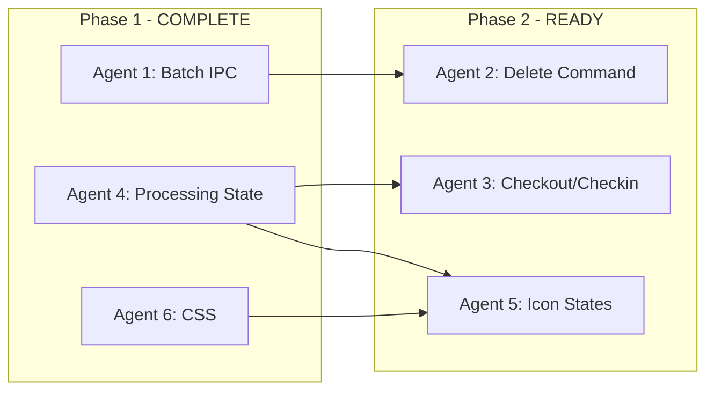

# File Operations Performance Fix

---

## Phase 1 Status: COMPLETE

| Agent | Status | Report |

|-------|--------|--------|

| Agent 1: Batch IPC | ✅ Complete | `BATCH_IPC_OPERATIONS_AGENT_REPORT.md` |

| Agent 4: Processing State | ✅ Complete | `AGENT4_PROCESSING_STATE_PRIORITY_REPORT.md` |

| Agent 6: CSS Animation | ✅ Complete | `CSS_ANIMATION_OPTIMIZATION_REPORT.md` |

**Verification:** `npm run typecheck` passes

**Key Deliverables:**

- `deleteBatch()` and `trashBatch()` APIs available in `electron/preload.ts`
- `addProcessingFoldersSync()` available for critical-path usage
- `FileStatusCell.tsx` now checks processing state FIRST
- GPU-accelerated spinner animations with `translateZ(0)`, `isolation: isolate`, `contain: layout style paint`

---

## Phase 2 Status: IN PROGRESS

| Agent | Status | Dependencies Met |

|-------|--------|-----------------|

| Agent 2: Delete Command | Ready | ✅ `deleteBatch()` API available |

| Agent 3: Checkout/Checkin | Ready | ✅ `addProcessingFoldersSync()` available |

| Agent 5: Icon States | ✅ Complete | `AGENT5_ICON_STATES_REPORT.md` - No code changes needed |

---

## Problem Summary

Six interconnected performance issues affecting user experience:

1. **Remove Local Files is slow** - Individual IPC calls per file, file watcher stop/restart overhead
2. **File tree update delay (5-10s)** - Full refresh instead of incremental updates, watcher restart latency
3. **Icon flickering** - Race conditions between state updates showing intermediate states
4. **Jittery spinner** - Main thread blocking during heavy JS work
5. **Green cloud during checkin** - Processing state not set before file state updates
6. **Slow checkin** - Unnecessary operations on unchanged files

## Root Cause Analysis


## Implementation Plan

### Agent 1: Batch IPC Operations ✅ COMPLETE

**Deliverables:**

- `fs:delete-batch` handler at line 1197 in `electron/handlers/fs.ts`
- `fs:trash-batch` handler at line 1348
- `deleteBatch()` and `trashBatch()` APIs in `electron/preload.ts`
- Single watcher stop/restart for entire batch

**API for Agent 2:**

```typescript
const result = await window.electronAPI.deleteBatch(paths, useTrash)
// Returns: { success, results: [{path, success, error?}], summary: {total, succeeded, failed, duration} }
```

---

### Agent 2: Optimize Delete Command

**Scope:** Update delete command to use batch operations and incremental store updates

**Boundaries:**

- OWNS: `src/lib/commands/handlers/delete.ts`
- READS: `src/stores/slices/filesSlice.ts`, `electron/preload.ts`

**Tasks:**

1. Use new `deleteBatch()` IPC instead of individual calls
2. Call `removeFilesFromStore()` immediately after deletion (don't wait for watcher)
3. Remove the delayed `onRefresh()` call - use incremental updates instead
4. Track processing state at operation start, clear at end (atomic)

**Key Changes:**

- [`src/lib/commands/handlers/delete.ts`](bluePLM/src/lib/commands/handlers/delete.ts) - Replace `processWithConcurrency` loop with batch call

---

### Agent 3: Optimize Checkout/Checkin Commands

**Scope:** Reduce jitter and improve performance of checkout/checkin operations

**Boundaries:**

- OWNS: `src/lib/commands/handlers/checkout.ts`, `src/lib/commands/handlers/checkin.ts`
- READS: `src/lib/concurrency.ts`, `src/stores/selectors.ts`

**Tasks:**

1. **Use `addProcessingFoldersSync()`** - Replace `addProcessingFolders()` + `setTimeout(0)` pattern with new sync function
2. Reduce `YIELD_INTERVAL` from 5 to 2 for more frequent event loop yields
3. Skip hash computation for files with unchanged `mtime` AND existing `localHash`
4. Early exit for unchanged files in checkin (same hash, no pending metadata)

**Key Changes:**

```typescript
// BEFORE:
ctx.addProcessingFolders(allPathsBeingProcessed, 'checkout')
await new Promise(resolve => setTimeout(resolve, 0))  // Yield to show spinner

// AFTER:
ctx.addProcessingFoldersSync(allPathsBeingProcessed, 'checkout')  // Sync update, no yield needed
```

**Key Files:**

- [`src/lib/commands/handlers/checkout.ts`](bluePLM/src/lib/commands/handlers/checkout.ts) - Lines 239-242
- [`src/lib/commands/handlers/checkin.ts`](bluePLM/src/lib/commands/handlers/checkin.ts) - Lines 443-446
- [`src/lib/concurrency.ts`](bluePLM/src/lib/concurrency.ts) - Change `YIELD_INTERVAL` to 2

---

### Agent 4: Fix Processing State Priority ✅ COMPLETE

**Deliverables:**

- Changed `scheduleProcessingFlush` from `requestIdleCallback` to `queueMicrotask`
- Added `addProcessingFoldersSync()` for critical-path usage
- `FileStatusCell.tsx` now checks processing state FIRST with operation labels
- Type exported in `types.ts`, exposed in `useProcessingState()` hook

**API for Agent 3:**

```typescript
// Use in checkout/checkin handlers BEFORE async work starts:
addProcessingFoldersSync(filePaths, 'checkin')  // UI updates NOW
await performAsyncWork()  // User sees spinner during this
removeProcessingFolders(filePaths)
```

---

### Agent 5: Fix Icon State Transitions (REDUCED SCOPE)

**Scope:** Verify and fix any remaining icon flickering issues

**Note:** Most of this work is ALREADY DONE:

- `FileStatusCell.tsx` - Agent 4 added processing check as highest priority
- `NameCell.tsx` - Already uses `operationType` for inline button spinners
- `TreeItemActions.tsx` - Already uses `operationType` for all action buttons

**Boundaries:**

- OWNS: Verification and edge case fixes only
- READS: `src/stores/slices/filesSlice.ts`, existing UI components

**Tasks (Reduced):**

1. ~~Check processing state FIRST in all icon/status rendering functions~~ (DONE by Agent 4)
2. ~~Add early return with spinner when file is being processed~~ (DONE - existing code)
3. Investigate the specific "green cloud + blue cloud" flickering issue after download
4. Add brief debounce (50ms) after operation completes IF testing shows it's still needed
5. Verify no edge cases remain after Phase 2 agents complete their work

**Key Files:**

- [`src/features/source/browser/components/FileList/cells/FileStatusCell.tsx`](bluePLM/src/features/source/browser/components/FileList/cells/FileStatusCell.tsx) - Verify Agent 4's changes work
- [`src/features/source/browser/components/FileList/cells/NameCell.tsx`](bluePLM/src/features/source/browser/components/FileList/cells/NameCell.tsx) - Already complete
- [`src/features/source/explorer/file-tree/TreeItemActions.tsx`](bluePLM/src/features/source/explorer/file-tree/TreeItemActions.tsx) - Already complete

---

### Agent 6: CSS Animation Optimization ✅ COMPLETE

**Deliverables:**

- `.spinner` class has `transform: translateZ(0)`, `isolation: isolate`, `contain: layout style paint`
- `@keyframes spin` updated with `translateZ(0)` for GPU layer
- `.animate-spin` enhanced with GPU acceleration properties
- `.spinner-paused` class added for declarative pause control

**Result:** Animations now run on GPU compositor thread, independent of main thread JavaScript work.

---

## Shared Files

| File | Owner | Rule |

|------|-------|------|

| `src/stores/types.ts` | Agent 4 | Others read only |

| `electron/preload.ts` | Agent 1 | Agent 2 reads after batch API added |

## Dependencies



## Expected Outcomes

| Issue | Current | Target |

|-------|---------|--------|

| Delete 33 files | ~10s + 5-10s UI update | ~1-2s + instant UI |

| Checkout 33 files | ~10s, jittery | ~5s, smooth |

| Checkin unchanged | ~10s | ~2s (skip unchanged) |

| Icon flickering | Green+Blue for 5s | Single transition |

| Spinner animation | Chunky | Smooth 60fps |

## Verification

Each agent should run `npm run typecheck` and manually verify:

- Delete operation is visibly faster
- Spinner animation is smooth during operations
- Icons update instantly without flickering
- No regression in existing functionality