# VS Code-Style Module System Architecture

## Objective

Transform BluePLM's integration and feature system into a VS Code-style modular architecture with:
- **JSON manifests** (`module.json`) for declarative module configuration
- **Process isolation** via a dedicated Module Host process for third-party safety
- **Sandboxed API** providing controlled access to app functionality
- **Module lifecycle management** with lazy activation and proper cleanup
- **Service ownership** where each module owns and manages its own background service

This enables third-party module development while maintaining security and stability.

---

## Architecture Overview

```
┌─────────────────────────────────────────────────────────────────────────┐
│                        MAIN PROCESS (Electron)                          │
│  ┌─────────────┐  ┌─────────────┐  ┌─────────────────────────────────┐ │
│  │   App Core  │  │  Module     │  │  IPC Bridge                     │ │
│  │             │  │  Registry   │  │  (Main ↔ Host ↔ Renderer)       │ │
│  └─────────────┘  └─────────────┘  └─────────────────────────────────┘ │
└─────────────────────────────────────────────────────────────────────────┘
          │                                      │
          │ IPC                                  │ IPC
          ▼                                      ▼
┌─────────────────────────────┐    ┌─────────────────────────────────────┐
│   RENDERER PROCESS (React)  │    │      MODULE HOST PROCESS            │
│  ┌───────────────────────┐  │    │  ┌─────────────────────────────┐   │
│  │  Module UI Components │  │    │  │  Sandboxed Module Runtime   │   │
│  │  (contributed views)  │  │    │  │  ┌───────┐ ┌───────┐       │   │
│  └───────────────────────┘  │    │  │  │ Mod A │ │ Mod B │ ...   │   │
│  ┌───────────────────────┐  │    │  │  └───────┘ └───────┘       │   │
│  │  Module API Client    │  │    │  └─────────────────────────────┘   │
│  │  (renderer-side)      │  │    │  ┌─────────────────────────────┐   │
│  └───────────────────────┘  │    │  │  Sandboxed API (exposed)    │   │
└─────────────────────────────┘    │  └─────────────────────────────┘   │
                                   └─────────────────────────────────────┘
```

---

## Agent Overview

| Agent | Responsibility | Owns | Dependencies | Wave |
|-------|---------------|------|--------------|------|
| Agent 1 | Core Types & JSON Schema | `src/lib/modules/types.ts`, `schemas/` | None | 1 |
| Agent 2 | Module Host Process | `electron/module-host/` | None | 1 |
| Agent 3 | Sandboxed API Definition | `src/lib/modules/api/` | None | 1 |
| Agent 4 | Module Registry & Lifecycle | `src/lib/modules/registry/` | Agents 1, 2, 3 | 2 |
| Agent 5 | IPC Bridge & Communication | `electron/handlers/modules.ts` | Agents 1, 2 | 2 |
| Agent 6 | UI Integration | `src/features/modules/`, store slice | Agents 1, 4 | 3 |
| Agent 7 | Google Drive Module Migration | `src/modules/google-drive/` | All above | 4 |

## Shared Files

| File | Owner | Rule |
|------|-------|------|
| `src/stores/types.ts` | Agent 6 | Agents append to designated section |
| `src/stores/pdmStore.ts` | Agent 6 | Only Agent 6 modifies |
| `electron/preload.ts` | Agent 5 | Only Agent 5 modifies |
| `electron/main.ts` | Agent 2 | Agent 5 may add IPC registrations |
| `src/types/modules.ts` | Agent 1 | Read-only for others (existing file, Agent 1 extends) |

---

## Wave 1: Foundation (Parallel - No Dependencies)

---

## Agent 1: Core Types & JSON Schema

### Prompt

> Implement the core type system and JSON Schema for BluePLM's VS Code-style module architecture with enterprise-level code quality.
>
> **Context:**
> BluePLM is adopting a VS Code-style module system where modules declare capabilities via JSON manifests (`module.json`). Each module can contribute sidebar views, settings panels, commands, and integration status indicators. Modules will run in an isolated process for third-party safety.
>
> **Scope:**
> 1. Create `src/lib/modules/types.ts` with all TypeScript interfaces:
>    - `ModuleManifest` - The JSON manifest structure
>    - `ModuleContributions` - What modules can contribute (views, commands, settings)
>    - `ActivationEvent` - When modules activate (onModuleEnabled, onNavigate, onCommand)
>    - `ModulePermission` - Permission system (network, storage, data.*, etc.)
>    - `ModuleContext` - Runtime context passed to activate()
>    - `ModuleState` - Runtime state (loaded, activating, active, deactivating, error)
>    - `LoadedModule` - A module instance with its manifest and state
>
> 2. Create `schemas/module-v1.schema.json` - JSON Schema for manifest validation:
>    - Full validation of all manifest fields
>    - $schema reference for editor autocomplete
>    - Proper descriptions for each field
>
> 3. Create `src/lib/modules/manifest.ts` - Manifest parsing and validation:
>    - `parseManifest(json: unknown): ModuleManifest` - Parse and validate
>    - `validateManifest(manifest: ModuleManifest): ValidationResult` - Deep validation
>    - Use Zod for runtime validation (already in project dependencies)
>
> 4. Create `src/lib/modules/index.ts` - Barrel exports
>
> **Reference existing types:**
> - Read `src/types/modules.ts` for existing ModuleId, ModuleDefinition patterns
> - The new system should be able to coexist with the existing system during migration
>
> **Boundaries:**
> - OWNS: `src/lib/modules/types.ts`, `src/lib/modules/manifest.ts`, `src/lib/modules/index.ts`, `schemas/module-v1.schema.json`
> - READS: `src/types/modules.ts`, `src/stores/types.ts`
> - Do NOT modify any existing files
>
> **Quality Requirements:**
> - Enterprise-level code quality and organization
> - Comprehensive TypeScript types with JSDoc comments
> - No `any` types - proper generics and type inference
> - JSON Schema must be complete enough for VS Code autocomplete
> - Zod schemas must match TypeScript types exactly
>
> **Deliverables:**
> - All type definitions with full documentation
> - Working JSON Schema with $id and $schema
> - Manifest parser with helpful error messages
> - Exports from index.ts
> - Report in `AGENT1_TYPES_REPORT.md`
>
> **When complete:** Run `npm run typecheck` and report results.

### Boundary

- **OWNS (exclusive write):**
  - `src/lib/modules/types.ts`
  - `src/lib/modules/manifest.ts`
  - `src/lib/modules/index.ts`
  - `schemas/module-v1.schema.json`
- **READS (no modify):**
  - `src/types/modules.ts`
  - `src/stores/types.ts`

### Tasks

- [ ] Design complete ModuleManifest interface with all contribution types
- [ ] Design ModuleContext interface for runtime
- [ ] Design permission system types
- [ ] Create JSON Schema with full validation
- [ ] Implement Zod-based manifest parser
- [ ] Add comprehensive JSDoc documentation
- [ ] Export from barrel index.ts
- [ ] Write completion report

### Deliverables

- `ModuleManifest` and related types for other agents to import
- JSON Schema for module developers
- `parseManifest()` function for registry to use

---

## Agent 2: Module Host Process

### Prompt

> Implement the Module Host process for BluePLM's VS Code-style module architecture with enterprise-level code quality.
>
> **Context:**
> BluePLM needs process isolation for third-party modules. Like VS Code's Extension Host, we'll run modules in a separate Electron renderer process (hidden BrowserWindow) that communicates with the main process via IPC. This isolates untrusted code from the main app.
>
> **Scope:**
> 1. Create `electron/module-host/` directory with:
>    - `host.ts` - Main module host logic (runs in hidden renderer)
>    - `loader.ts` - Dynamic module loading and instantiation
>    - `sandbox.ts` - Sandbox environment setup
>    - `ipc.ts` - IPC message handling for host process
>    - `index.ts` - Barrel exports
>
> 2. Create `electron/module-host/preload.ts` - Preload script for module host:
>    - Expose limited IPC to module host renderer
>    - No direct Node.js access
>
> 3. Update `electron/main.ts` to:
>    - Create hidden BrowserWindow for module host on app ready
>    - Handle module host lifecycle (restart on crash)
>    - Route IPC between main ↔ module host
>
> 4. Create `electron/module-host/host.html` - Entry HTML for module host process
>
> **Architecture:**
> ```
> Main Process
>     │
>     │ IPC: module:load, module:activate, module:call-api
>     ▼
> Module Host Process (hidden BrowserWindow)
>     │
>     ├── Loads module bundles dynamically
>     ├── Creates sandboxed environment per module
>     ├── Forwards API calls to main process
>     └── Reports status/errors back to main
> ```
>
> **Boundaries:**
> - OWNS: `electron/module-host/*` (new directory)
> - MODIFIES: `electron/main.ts` (add module host window creation)
> - READS: Types from Agent 1 (mock for now, will integrate later)
>
> **Quality Requirements:**
> - Enterprise-level code quality and organization
> - Proper error handling - host crash shouldn't crash main app
> - IPC message validation
> - Logging for debugging module issues
> - Clean shutdown handling
>
> **Deliverables:**
> - Module host process that can be spawned by main process
> - IPC protocol for main ↔ host communication
> - Module loader that can dynamically load JS bundles
> - Report in `AGENT2_HOST_REPORT.md`
>
> **When complete:** Run `npm run typecheck` and report results.

### Boundary

- **OWNS (exclusive write):**
  - `electron/module-host/` (entire new directory)
  - `electron/module-host/host.ts`
  - `electron/module-host/loader.ts`
  - `electron/module-host/sandbox.ts`
  - `electron/module-host/ipc.ts`
  - `electron/module-host/preload.ts`
  - `electron/module-host/host.html`
  - `electron/module-host/index.ts`
- **MODIFIES:**
  - `electron/main.ts` (add module host window creation only)
- **READS:**
  - `electron/preload.ts` (reference pattern)
  - `electron/handlers/` (reference pattern)

### Tasks

- [ ] Create module-host directory structure
- [ ] Implement host.ts with module runtime environment
- [ ] Implement loader.ts for dynamic module loading
- [ ] Implement sandbox.ts for isolation
- [ ] Implement IPC protocol between main and host
- [ ] Create preload.ts for module host
- [ ] Create host.html entry point
- [ ] Update main.ts to spawn module host
- [ ] Add crash recovery logic
- [ ] Write completion report

### Deliverables

- Working module host process
- IPC protocol for Agent 5 to use
- Module loader for dynamic loading

---

## Agent 3: Sandboxed API Definition

### Prompt

> Implement the Sandboxed Module API for BluePLM's VS Code-style module architecture with enterprise-level code quality.
>
> **Context:**
> Modules run in an isolated process and cannot directly access BluePLM's internals. Instead, they use a Sandboxed API - a controlled, limited set of functions that are safe to expose. This is like VS Code's `vscode` API that extensions import.
>
> **Scope:**
> 1. Create `src/lib/modules/api/` directory with:
>    - `types.ts` - API interface definitions
>    - `ui.ts` - UI API (showToast, showDialog, setStatus)
>    - `storage.ts` - Storage API (scoped to module)
>    - `network.ts` - Network API (logged, filterable)
>    - `data.ts` - Data API (read-only access to parts, files, etc.)
>    - `events.ts` - Events API (subscribe to app events)
>    - `index.ts` - Combined ModuleAPI type and barrel exports
>
> 2. Design the complete API surface:
>    ```typescript
>    interface ModuleAPI {
>      ui: UIApi           // Toast, dialogs, status
>      storage: StorageApi // Module-scoped key-value
>      network: NetworkApi // Fetch wrapper with logging
>      data: DataApi       // Read-only data access
>      events: EventsApi   // Subscribe to app events
>      context: ContextApi // Module info, permissions
>    }
>    ```
>
> 3. Create `src/lib/modules/api/permissions.ts`:
>    - Permission checking utilities
>    - Map permissions to API access
>
> **Security Considerations:**
> - All API calls will be forwarded via IPC to main process
> - Main process validates permissions before executing
> - Storage is namespaced per module (module can only access own data)
> - Network requests are logged and can be filtered by domain
> - Data access is read-only and scoped by permission
>
> **Boundaries:**
> - OWNS: `src/lib/modules/api/*` (new directory)
> - READS: `src/types/pdm.ts` for data types
> - READS: Types from Agent 1 (for permissions)
>
> **Quality Requirements:**
> - Enterprise-level code quality and organization
> - Every API method must have JSDoc with examples
> - Proper TypeScript generics for type-safe APIs
> - No `any` types
> - Consider future extensibility
>
> **Deliverables:**
> - Complete ModuleAPI interface definition
> - Individual API implementations (stubs - actual IPC forwarding comes later)
> - Permission checking utilities
> - Report in `AGENT3_API_REPORT.md`
>
> **When complete:** Run `npm run typecheck` and report results.

### Boundary

- **OWNS (exclusive write):**
  - `src/lib/modules/api/` (entire new directory)
  - `src/lib/modules/api/types.ts`
  - `src/lib/modules/api/ui.ts`
  - `src/lib/modules/api/storage.ts`
  - `src/lib/modules/api/network.ts`
  - `src/lib/modules/api/data.ts`
  - `src/lib/modules/api/events.ts`
  - `src/lib/modules/api/permissions.ts`
  - `src/lib/modules/api/index.ts`
- **READS:**
  - `src/types/pdm.ts`
  - `src/types/modules.ts`

### Tasks

- [ ] Design complete ModuleAPI interface
- [ ] Implement UIApi with toast, dialog, status methods
- [ ] Implement StorageApi with namespaced storage
- [ ] Implement NetworkApi with fetch wrapper
- [ ] Implement DataApi with read-only queries
- [ ] Implement EventsApi with subscription pattern
- [ ] Create permission checking utilities
- [ ] Add comprehensive JSDoc documentation
- [ ] Write completion report

### Deliverables

- `ModuleAPI` interface for modules to use
- Permission utilities for registry to use
- Type-safe API stubs ready for IPC integration

---

## Wave 2: Core Infrastructure (Depends on Wave 1)

---

## Agent 4: Module Registry & Lifecycle

### Prompt

> Implement the Module Registry and Lifecycle Manager for BluePLM's VS Code-style module architecture with enterprise-level code quality.
>
> **Context:**
> The Module Registry is the central coordinator for all modules. It handles discovery, loading, activation, and deactivation. Like VS Code's extension management, it supports lazy activation based on events.
>
> **Scope:**
> 1. Create `src/lib/modules/registry/` directory with:
>    - `ModuleRegistry.ts` - Main registry class (singleton)
>    - `lifecycle.ts` - Lifecycle state machine
>    - `activation.ts` - Activation event handling
>    - `discovery.ts` - Module discovery from filesystem
>    - `index.ts` - Barrel exports
>
> 2. Implement ModuleRegistry class:
>    ```typescript
>    class ModuleRegistry {
>      // Discovery
>      async discoverModules(modulesPath: string): Promise<ModuleManifest[]>
>      
>      // Registration
>      register(manifest: ModuleManifest): void
>      unregister(moduleId: string): void
>      
>      // Lifecycle
>      async activate(moduleId: string): Promise<void>
>      async deactivate(moduleId: string): Promise<void>
>      async activateByEvent(event: ActivationEvent): Promise<void>
>      
>      // Queries
>      getModule(moduleId: string): LoadedModule | undefined
>      getModulesByContribution(type: ContributionType): LoadedModule[]
>      getAllModules(): LoadedModule[]
>      
>      // Status
>      onModuleStateChange(callback: (moduleId: string, state: ModuleState) => void): () => void
>    }
>    ```
>
> 3. Implement lifecycle state machine:
>    ```
>    [not-loaded] → load() → [loaded] → activate() → [active]
>                                ↓                      ↓
>                            unload()              deactivate()
>                                ↓                      ↓
>                          [not-loaded]            [loaded]
>    ```
>
> 4. Implement activation event system:
>    - `onModuleEnabled` - When user enables module in settings
>    - `onNavigate:{viewId}` - When user navigates to contributed view
>    - `onCommand:{commandId}` - When command is invoked
>    - `onStartup` - On app startup (use sparingly)
>
> **Dependencies:**
> - Import types from Agent 1: `src/lib/modules/types.ts`
> - Will communicate with Module Host from Agent 2 via IPC (Agent 5 provides bridge)
> - Uses API types from Agent 3 for context creation
>
> **Boundaries:**
> - OWNS: `src/lib/modules/registry/*` (new directory)
> - IMPORTS FROM: `src/lib/modules/types.ts` (Agent 1)
> - IMPORTS FROM: `src/lib/modules/api/` (Agent 3)
> - READS: `src/stores/types.ts` for integration with store
>
> **Quality Requirements:**
> - Enterprise-level code quality and organization
> - Proper error handling for each lifecycle transition
> - Event-driven architecture with proper cleanup
> - Logging for debugging lifecycle issues
> - No memory leaks - proper subscription cleanup
>
> **Deliverables:**
> - Working ModuleRegistry singleton
> - Lifecycle state machine with proper transitions
> - Activation event system
> - Module discovery from filesystem
> - Report in `AGENT4_REGISTRY_REPORT.md`
>
> **When complete:** Run `npm run typecheck` and report results.

### Boundary

- **OWNS (exclusive write):**
  - `src/lib/modules/registry/` (entire new directory)
  - `src/lib/modules/registry/ModuleRegistry.ts`
  - `src/lib/modules/registry/lifecycle.ts`
  - `src/lib/modules/registry/activation.ts`
  - `src/lib/modules/registry/discovery.ts`
  - `src/lib/modules/registry/index.ts`
- **IMPORTS FROM:**
  - `src/lib/modules/types.ts` (Agent 1)
  - `src/lib/modules/api/` (Agent 3)
- **READS:**
  - `src/stores/types.ts`

### Tasks

- [ ] Implement ModuleRegistry singleton class
- [ ] Implement lifecycle state machine
- [ ] Implement activation event system
- [ ] Implement module discovery from filesystem
- [ ] Add proper error handling and logging
- [ ] Implement state change subscriptions
- [ ] Ensure no memory leaks in subscriptions
- [ ] Write completion report

### Deliverables

- `ModuleRegistry` class for use by store and UI
- `activateByEvent()` for lazy activation
- Module discovery for filesystem scanning

---

## Agent 5: IPC Bridge & Communication

### Prompt

> Implement the IPC Bridge connecting Main Process, Module Host, and Renderer for BluePLM's VS Code-style module architecture with enterprise-level code quality.
>
> **Context:**
> The IPC Bridge is the communication layer that connects all three processes. It routes API calls from modules (in Host) through Main to Renderer, and sends events back. This is the glue that makes the sandboxed API work.
>
> **Scope:**
> 1. Create `electron/handlers/modules.ts` - Main process IPC handlers:
>    - Handle module lifecycle commands (load, activate, deactivate)
>    - Forward API calls from Host to appropriate handlers
>    - Route events from Renderer to Host
>
> 2. Create `src/lib/modules/ipc/` directory with:
>    - `client.ts` - Renderer-side IPC client
>    - `protocol.ts` - IPC message type definitions
>    - `index.ts` - Barrel exports
>
> 3. Define IPC Protocol:
>    ```typescript
>    // Main ↔ Host
>    type HostMessage =
>      | { type: 'module:load', moduleId: string, bundlePath: string }
>      | { type: 'module:activate', moduleId: string }
>      | { type: 'module:deactivate', moduleId: string }
>      | { type: 'api:call', moduleId: string, api: string, method: string, args: unknown[] }
>    
>    type HostResponse =
>      | { type: 'module:loaded', moduleId: string }
>      | { type: 'module:activated', moduleId: string }
>      | { type: 'module:error', moduleId: string, error: string }
>      | { type: 'api:result', callId: string, result: unknown }
>      | { type: 'api:error', callId: string, error: string }
>    
>    // Renderer ↔ Main (via preload)
>    type RendererModuleAPI = {
>      getModules(): Promise<LoadedModule[]>
>      activateModule(moduleId: string): Promise<void>
>      deactivateModule(moduleId: string): Promise<void>
>      onModuleStateChange(callback: (moduleId: string, state: ModuleState) => void): () => void
>    }
>    ```
>
> 4. Update `electron/preload.ts` to expose module API:
>    ```typescript
>    modules: {
>      getModules: () => ipcRenderer.invoke('modules:get-all'),
>      activateModule: (id) => ipcRenderer.invoke('modules:activate', id),
>      // ... etc
>    }
>    ```
>
> 5. Update `src/electron.d.ts` with module API types
>
> **Dependencies:**
> - Uses types from Agent 1: `src/lib/modules/types.ts`
> - Communicates with Module Host from Agent 2
> - Executes API methods from Agent 3
>
> **Boundaries:**
> - OWNS: `electron/handlers/modules.ts`, `src/lib/modules/ipc/*`
> - MODIFIES: `electron/preload.ts` (add modules section)
> - MODIFIES: `src/electron.d.ts` (add module types)
> - MODIFIES: `electron/handlers/index.ts` (register new handler)
> - READS: Agent 1, 2, 3 outputs
>
> **Quality Requirements:**
> - Enterprise-level code quality and organization
> - Type-safe IPC with proper validation
> - Proper error handling and forwarding
> - Request/response correlation with unique IDs
> - Timeout handling for hung modules
>
> **Deliverables:**
> - Complete IPC bridge connecting all processes
> - Type-safe protocol definitions
> - Renderer API for store/components to use
> - Report in `AGENT5_IPC_REPORT.md`
>
> **When complete:** Run `npm run typecheck` and report results.

### Boundary

- **OWNS (exclusive write):**
  - `electron/handlers/modules.ts` (new file)
  - `src/lib/modules/ipc/` (new directory)
  - `src/lib/modules/ipc/client.ts`
  - `src/lib/modules/ipc/protocol.ts`
  - `src/lib/modules/ipc/index.ts`
- **MODIFIES:**
  - `electron/preload.ts` (add modules section only)
  - `src/electron.d.ts` (add module API types only)
  - `electron/handlers/index.ts` (register handler)
- **IMPORTS FROM:**
  - `src/lib/modules/types.ts` (Agent 1)
  - `src/lib/modules/api/` (Agent 3)

### Tasks

- [ ] Define complete IPC protocol types
- [ ] Implement main process handlers in modules.ts
- [ ] Implement renderer-side IPC client
- [ ] Update preload.ts with modules API
- [ ] Update electron.d.ts with types
- [ ] Register handler in index.ts
- [ ] Add request/response correlation
- [ ] Add timeout handling
- [ ] Write completion report

### Deliverables

- Working IPC bridge
- Type definitions for other agents
- Renderer API for Agent 6 to use

---

## Wave 3: Integration (Depends on Wave 2)

---

## Agent 6: UI Integration & Store

### Prompt

> Implement UI Integration and Store slice for BluePLM's VS Code-style module architecture with enterprise-level code quality.
>
> **Context:**
> This agent connects the module system to the React UI and Zustand store. It handles:
> - Module management UI in Settings
> - Sidebar contributions from modules
> - Integration status from module services
> - Store slice for module state
>
> **Scope:**
> 1. Create `src/stores/slices/modulesSlice.ts`:
>    ```typescript
>    interface ModulesSlice {
>      // State
>      loadedModules: Record<string, LoadedModule>
>      moduleStates: Record<string, ModuleState>
>      
>      // Actions
>      setModuleState: (moduleId: string, state: ModuleState) => void
>      setLoadedModules: (modules: LoadedModule[]) => void
>      
>      // Integration with existing integrations slice
>      syncModuleStatus: (moduleId: string) => void
>    }
>    ```
>
> 2. Create `src/features/modules/` directory with:
>    - `ModuleManagerView.tsx` - Settings panel for module management
>    - `ModuleList.tsx` - List of installed modules
>    - `ModuleCard.tsx` - Individual module display
>    - `ModulePermissionsDialog.tsx` - Permission review dialog
>    - `index.ts` - Barrel exports
>
> 3. Create `src/hooks/useModules.ts`:
>    - Hook for accessing module state
>    - Hook for module activation/deactivation
>
> 4. Update Settings navigation to include Modules section
>
> 5. Create contribution renderers:
>    - `src/features/modules/contributions/SidebarViewRenderer.tsx`
>    - Renders module-contributed sidebar views
>
> **Dependencies:**
> - Uses types from Agent 1
> - Uses registry from Agent 4
> - Uses IPC client from Agent 5
>
> **Boundaries:**
> - OWNS: `src/stores/slices/modulesSlice.ts`, `src/features/modules/*`, `src/hooks/useModules.ts`
> - MODIFIES: `src/stores/types.ts` (add ModulesSlice)
> - MODIFIES: `src/stores/pdmStore.ts` (add slice)
> - MODIFIES: `src/stores/slices/index.ts` (export slice)
> - READS: All Wave 1 and Wave 2 outputs
>
> **Quality Requirements:**
> - Enterprise-level code quality and organization
> - Follow existing component patterns in codebase
> - Proper loading states and error handling
> - Accessible UI (keyboard navigation, screen readers)
> - Match existing BluePLM design language
>
> **Deliverables:**
> - Working store slice with module state
> - Module management UI in Settings
> - Contribution renderers for sidebar
> - Report in `AGENT6_UI_REPORT.md`
>
> **When complete:** Run `npm run typecheck` and report results.

### Boundary

- **OWNS (exclusive write):**
  - `src/stores/slices/modulesSlice.ts` (new file)
  - `src/features/modules/` (new directory)
  - `src/hooks/useModules.ts` (new file)
- **MODIFIES:**
  - `src/stores/types.ts` (add ModulesSlice type)
  - `src/stores/pdmStore.ts` (add slice to store)
  - `src/stores/slices/index.ts` (export new slice)
- **IMPORTS FROM:**
  - `src/lib/modules/types.ts` (Agent 1)
  - `src/lib/modules/registry/` (Agent 4)
  - `src/lib/modules/ipc/` (Agent 5)

### Tasks

- [ ] Create modulesSlice with proper typing
- [ ] Add slice to store composition
- [ ] Create ModuleManagerView settings panel
- [ ] Create ModuleList and ModuleCard components
- [ ] Create ModulePermissionsDialog
- [ ] Create useModules hook
- [ ] Create SidebarViewRenderer for contributions
- [ ] Integrate with existing settings navigation
- [ ] Write completion report

### Deliverables

- Store slice for module state
- UI components for module management
- Contribution rendering system

---

## Wave 4: Migration (Depends on Wave 3)

---

## Agent 7: Google Drive Module Migration

### Prompt

> Migrate Google Drive integration to the new module system as the reference implementation with enterprise-level code quality.
>
> **Context:**
> Google Drive will be the first integration migrated to the new module system. This serves as the reference implementation that other modules will follow. It demonstrates the complete pattern: manifest, service, UI contributions, and settings.
>
> **Scope:**
> 1. Create `src/modules/google-drive/` directory with VS Code-style structure:
>    ```
>    src/modules/google-drive/
>    ├── module.json           # JSON manifest
>    ├── src/
>    │   ├── index.ts         # Entry point (activate/deactivate)
>    │   ├── service/
>    │   │   ├── GoogleDriveService.ts
>    │   │   └── types.ts
>    │   ├── components/
>    │   │   ├── GoogleDrivePanel.tsx
>    │   │   └── index.ts
>    │   └── settings/
>    │       └── GoogleDriveSettings.tsx
>    └── dist/                 # Built output (gitignored)
>    ```
>
> 2. Create `module.json` manifest:
>    ```json
>    {
>      "$schema": "../../schemas/module-v1.schema.json",
>      "id": "google-drive",
>      "name": "Google Drive",
>      "version": "1.0.0",
>      "publisher": "blueplm",
>      "icon": "Cloud",
>      "activationEvents": ["onModuleEnabled"],
>      "contributes": {
>        "sidebarViews": [{ "id": "google-drive.main", "name": "Google Drive" }],
>        "settingsPanel": { "id": "google-drive", "label": "Google Drive" },
>        "integrationStatus": { "id": "google-drive" }
>      },
>      "permissions": ["network", "storage", "ui.toasts"]
>    }
>    ```
>
> 3. Implement module entry point:
>    ```typescript
>    // src/modules/google-drive/src/index.ts
>    import type { ModuleAPI, ModuleContext } from '@/lib/modules'
>    
>    export async function activate(context: ModuleContext, api: ModuleAPI) {
>      const service = new GoogleDriveService(api)
>      await service.start()
>      context.subscriptions.push(service)
>    }
>    
>    export function deactivate() {
>      // Cleanup handled by subscriptions
>    }
>    ```
>
> 4. Migrate existing code:
>    - Move `src/features/integrations/google-drive/` to module structure
>    - Adapt to use ModuleAPI instead of direct store access
>    - Keep backward compatibility during transition
>
> 5. Create build configuration for module bundling
>
> **Boundaries:**
> - OWNS: `src/modules/google-drive/*` (new directory)
> - READS: `src/features/integrations/google-drive/*` (migrate from)
> - READS: All module system types and APIs
> - Do NOT delete old code yet (coexistence during transition)
>
> **Quality Requirements:**
> - Enterprise-level code quality and organization
> - Module must work standalone via the sandboxed API
> - No direct imports from `@/stores` or `@/lib/supabase`
> - All external access through ModuleAPI
> - Comprehensive error handling
>
> **Deliverables:**
> - Complete Google Drive module in new structure
> - Working module.json manifest
> - Service using ModuleAPI
> - Documentation as reference for other modules
> - Report in `AGENT7_GDRIVE_REPORT.md`
>
> **When complete:** Run `npm run typecheck` and report results.

### Boundary

- **OWNS (exclusive write):**
  - `src/modules/google-drive/` (entire new directory)
- **READS (for migration):**
  - `src/features/integrations/google-drive/*`
  - `src/features/settings/integrations/google-drive/*`
- **IMPORTS FROM:**
  - `src/lib/modules/` (all module system code)

### Tasks

- [ ] Create module directory structure
- [ ] Create module.json manifest
- [ ] Implement activate/deactivate entry point
- [ ] Migrate GoogleDriveService to use ModuleAPI
- [ ] Migrate UI components
- [ ] Migrate settings panel
- [ ] Create build configuration
- [ ] Test module in isolation
- [ ] Write detailed documentation
- [ ] Write completion report

### Deliverables

- Reference module implementation
- Documentation for module developers
- Proof that the architecture works end-to-end

---

## Execution Order

```mermaid
gantt
    title Module System Implementation
    dateFormat X
    axisFormat %s
    
    section Wave 1
    Agent 1 Types & Schema      :a1, 0, 1
    Agent 2 Module Host         :a2, 0, 1
    Agent 3 Sandboxed API       :a3, 0, 1
    
    section Wave 2
    Agent 4 Registry            :a4, after a1 a2 a3, 1
    Agent 5 IPC Bridge          :a5, after a1 a2, 1
    
    section Wave 3
    Agent 6 UI Integration      :a6, after a4 a5, 1
    
    section Wave 4
    Agent 7 Google Drive        :a7, after a6, 1
```



**Wave 1:** Agents 1, 2, 3 run in parallel (no dependencies)
**Wave 2:** Agents 4, 5 run in parallel (depend on Wave 1)
**Wave 3:** Agent 6 runs (depends on Wave 2)
**Wave 4:** Agent 7 runs (depends on Wave 3)

---

## Future Agents (After Core Complete)

After the core system is working with Google Drive:

- **Agent 8:** SolidWorks Module Migration
- **Agent 9:** Odoo Module Migration
- **Agent 10:** WooCommerce Module Migration
- **Agent 11:** Documentation & Module Development Guide
- **Agent 12:** Module Marketplace UI (if third-party modules are public)

---

## Success Criteria

1. **Type Safety:** `npm run typecheck` passes with no errors
2. **Isolation:** Module code cannot directly access app internals
3. **Lifecycle:** Modules can be loaded, activated, deactivated cleanly
4. **Lazy Loading:** Modules only load when their activation event fires
5. **Status Indicators:** Integration status dots work via module services (no more flickering!)
6. **Reference Implementation:** Google Drive module works completely in new architecture
7. **Documentation:** Other developers can create modules following the pattern

---

## Rollback Plan

If issues arise:
1. Module system is additive - old integrations code remains untouched
2. Feature flag can disable new module loading
3. Each agent's work is isolated to specific directories
4. No breaking changes to existing store or components

---

## Notes for Agents

1. **Read the rules files** before starting:
   - `.cursor/rules/architecture.mdc`
   - `.cursor/rules/zustand.mdc`
   - `.cursor/rules/electron.mdc`

2. **Follow existing patterns** - look at similar code in the codebase

3. **Enterprise quality** - no shortcuts, proper types, good error messages

4. **Report format** - Use the template from `plans.mdc`

5. **Typecheck** - Run `npm run typecheck` before declaring complete
