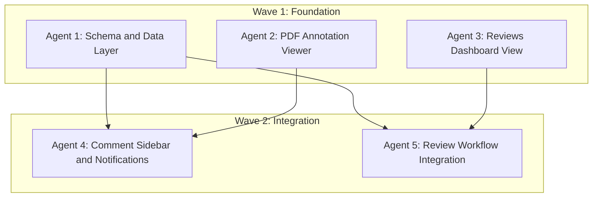

# PDF Commenting & Review System Multi-Agent Plan

## Objective

Build a comprehensive PDF commenting and review system for BluePLM that replicates Google Drive-style PDF commenting (area-based comments anchored to PDF positions with threaded replies), adds a dedicated Reviews sidebar view under Source Files, integrates with the notification system, and connects to the workflow engine so that moving a file to a review state triggers the review flow.

## Architecture Overview




## Agent Overview


| Agent   | Wave | Responsibility                                                                                | Owns                                                                                                                    | Dependencies     |
| ------- | ---- | --------------------------------------------------------------------------------------------- | ----------------------------------------------------------------------------------------------------------------------- | ---------------- |
| Agent 1 | 1    | Schema migration, Supabase CRUD for annotations                                               | `supabase/modules/10-source-files.sql` (file_comments section), `src/lib/supabase/annotations.ts`                       | None             |
| Agent 2 | 1    | PDF viewer component with react-pdf-highlighter-plus                                          | `src/features/source/details/components/PdfAnnotationViewer.tsx`                                                        | None             |
| Agent 3 | 1    | Reviews dashboard sidebar view and module registration                                        | `src/features/source/reviews/*`                                                                                         | None             |
| Agent 4 | 2    | Comment sidebar UI, threading, notification triggers, Realtime                                | `src/features/source/details/components/CommentSidebar.tsx`, `src/features/source/details/components/CommentThread.tsx` | Agent 1, Agent 2 |
| Agent 5 | 2    | Enhanced review request modal (teams + individuals), workflow-triggered reviews, context menu | `src/features/source/browser/components/Modals/ReviewRequestModal.tsx` (enhance), workflow integration                  | Agent 1, Agent 3 |


## Shared Files


| File                                           | Owner                              | Rule                                                                                    |
| ---------------------------------------------- | ---------------------------------- | --------------------------------------------------------------------------------------- |
| `src/stores/types.ts`                          | Agent 3 (Wave 1), Agent 4 (Wave 2) | Agent 3 adds `SidebarView` and `ModuleId` entries; Agent 4 adds `AnnotationsSlice` type |
| `src/types/modules.ts`                         | Agent 3                            | Only Agent 3 modifies                                                                   |
| `src/types/database.ts`                        | Agent 1                            | Only Agent 1 adds annotation types                                                      |
| `src/types/supabase.ts`                        | Agent 1                            | Updated via `npm run gen:types` after schema change                                     |
| `src/stores/pdmStore.ts`                       | Agent 4                            | Agent 4 registers annotationsSlice                                                      |
| `src/components/layout/Sidebar/Sidebar.tsx`    | Agent 3                            | Only Agent 3 adds lazy import + case                                                    |
| `src/features/source/details/DetailsPanel.tsx` | Agent 2 (Wave 1), Agent 4 (Wave 2) | Agent 2 replaces iframe with PdfAnnotationViewer; Agent 4 adds CommentSidebar           |
| `src/lib/supabase/notifications.ts`            | Agent 5                            | Agent 5 adds review-from-workflow helper                                                |
| `supabase/modules/10-source-files.sql`         | Agent 1                            | Only Agent 1 modifies                                                                   |
| `src/lib/schemaVersion.ts`                     | Agent 1                            | Only Agent 1 bumps version                                                              |
| `package.json`                                 | Agent 2                            | Only Agent 2 adds react-pdf-highlighter-plus dependency                                 |


---

## Agents


| ID      | Name                            | Wave         | Status  | Dependencies     | Est. Time |
| ------- | ------------------------------- | ------------ | ------- | ---------------- | --------- |
| Agent 1 | Schema & Data Layer             | 1 (parallel) | DONE | None             | 15-20 min |
| Agent 2 | PDF Annotation Viewer           | 1 (parallel) | DONE | None             | 20-30 min |
| Agent 3 | Reviews Dashboard View          | 1 (parallel) | DONE | None             | 20-30 min |
| Agent 4 | Comment Sidebar & Notifications | 2 (parallel) | DONE | Agent 1, Agent 2 | 25-35 min |
| Agent 5 | Review Workflow Integration     | 2 (parallel) | DONE | Agent 1, Agent 3 | 20-30 min |


**Wave 1** launches Agents 1, 2, 3 simultaneously (no cross-dependencies).
**Wave 2** launches Agents 4, 5 simultaneously after Wave 1 completes (they depend on Wave 1 outputs but not on each other).

---

## Wave 1: Foundation (Parallel)

All three agents run simultaneously. No cross-dependencies within this wave.

---

## Agent 1: Schema & Data Layer

### Prompt

> Implement the database schema changes and Supabase data layer for PDF annotation commenting in BluePLM with enterprise-level code quality.
>
> **Context:**
>
> - BluePLM is an Electron 39 + React 19 + Vite + Tailwind + Zustand app
> - There is an existing `file_comments` table in `supabase/modules/10-source-files.sql` (around line 1086) with columns: `id UUID, file_id UUID, user_id UUID, comment TEXT, created_at TIMESTAMPTZ`. It has NO spatial/position data and NO threading support.
> - The current schema version is 50 (`src/lib/schemaVersion.ts` line 29, `EXPECTED_SCHEMA_VERSION = 50`)
> - Notification types already include `'comment_added'` and `'review_comment'` in `src/types/database.ts`
> - Supabase client is accessed via `getSupabaseClient()` from `src/lib/supabase/client.ts`
> - Follow patterns in existing query files like `src/lib/supabase/files/queries.ts` and `src/lib/supabase/files/mutations.ts`
>
> **Scope:**
>
> 1. **Extend `file_comments` table** in `supabase/modules/10-source-files.sql` (the FILE COMMENTS section around line 1082-1095). Add these columns:

```sql
>    page_number INTEGER,                    -- PDF page (1-indexed), NULL for file-level comments
>    position JSONB,                         -- {x, y, width, height, pageWidth, pageHeight} for area highlights
>    annotation_type TEXT DEFAULT 'text',    -- 'area', 'text', 'highlight', or 'file' (file-level)
>    parent_id UUID REFERENCES file_comments(id) ON DELETE CASCADE,  -- for threaded replies
>    resolved BOOLEAN DEFAULT FALSE,
>    resolved_by UUID REFERENCES users(id) ON DELETE SET NULL,
>    resolved_at TIMESTAMPTZ,
>    file_version INTEGER,                  -- version the comment was made on
>    edited_at TIMESTAMPTZ                  -- tracks if comment was edited
>    

```

>    Also add indexes: `idx_file_comments_parent_id`, `idx_file_comments_resolved`
>
> 1. **Add annotation types** to `src/types/database.ts`:

```typescript
>    export type AnnotationType = 'area' | 'text' | 'highlight' | 'file'
>    
>    export interface AnnotationPosition {
>      x: number
>      y: number
>      width: number
>      height: number
>      pageWidth: number
>      pageHeight: number
>    }
>    
>    export interface FileAnnotation {
>      id: string
>      file_id: string
>      user_id: string
>      comment: string
>      page_number: number | null
>      position: AnnotationPosition | null
>      annotation_type: AnnotationType
>      parent_id: string | null
>      resolved: boolean
>      resolved_by: string | null
>      resolved_at: string | null
>      file_version: number | null
>      edited_at: string | null
>      created_at: string
>      // Joined fields
>      user?: { email: string; full_name: string | null; avatar_url: string | null }
>      replies?: FileAnnotation[]
>    }
>    

```

> 1. **Create `src/lib/supabase/annotations.ts`** with CRUD operations:
>   - `getFileAnnotations(fileId: string, version?: number)` -- fetch all annotations for a file, with user details, structured as threads (top-level + nested replies)
>   - `createAnnotation(params: { fileId, userId, comment, pageNumber?, position?, annotationType, parentId?, fileVersion? })` -- insert annotation
>   - `updateAnnotation(annotationId: string, comment: string)` -- edit comment text, set edited_at
>   - `deleteAnnotation(annotationId: string)` -- delete (cascades replies)
>   - `resolveAnnotation(annotationId: string, userId: string)` -- set resolved + resolved_by + resolved_at
>   - `unresolveAnnotation(annotationId: string)` -- clear resolved fields
>   - `getAnnotationCount(fileId: string)` -- count of unresolved annotations (for badge display)
>    All functions should use `getSupabaseClient()` and follow error handling patterns from existing files.
> 2. **Export from `src/lib/supabase/index.ts**` -- add `export * from './annotations'`
> 3. **Bump schema version:**
>   - `src/lib/schemaVersion.ts`: Change `EXPECTED_SCHEMA_VERSION` from 50 to 51
>   - Add entry: `51: 'Extended file_comments with spatial annotations, threading, and resolve tracking'`
>   - `supabase/core.sql`: Find the INSERT INTO schema_version and bump to 51
>
> **Boundaries:**
>
> - OWNS: `supabase/modules/10-source-files.sql` (file_comments section only), `src/lib/supabase/annotations.ts`, `src/types/database.ts` (annotation types section)
> - MODIFIES: `src/lib/schemaVersion.ts` (version bump only), `supabase/core.sql` (version INSERT only), `src/lib/supabase/index.ts` (add export)
> - Do NOT modify: store files, component files, other supabase query files
>
> **Quality Requirements:**
>
> - Enterprise-level code quality and organization
> - Proper TypeScript types (no `any`)
> - Error handling on every Supabase call
> - JSDoc comments on all exported functions
> - Follow existing patterns exactly (check `src/lib/supabase/files/queries.ts` for reference)
>
> **Deliverables:**
>
> - Extended file_comments table schema
> - Complete annotations.ts CRUD module
> - Type definitions in database.ts
> - Schema version bumped to 51
> - Report in `.cursor/plans/AGENT1_REPORT.md`
>
> **When complete:** Run `npm run typecheck` and report results.

### Boundary

- **OWNS (exclusive write):** `supabase/modules/10-source-files.sql` (file_comments section), `src/lib/supabase/annotations.ts` (new), annotation types in `src/types/database.ts`
- **MODIFIES:** `src/lib/schemaVersion.ts` (version bump), `supabase/core.sql` (version INSERT), `src/lib/supabase/index.ts` (add export)
- **READS (no modify):** `src/lib/supabase/files/queries.ts` (pattern reference), `src/lib/supabase/client.ts`

### Tasks

- Extend file_comments table with spatial, threading, and resolve columns
- Add indexes for parent_id and resolved
- Create AnnotationType, AnnotationPosition, FileAnnotation types in database.ts
- Create src/lib/supabase/annotations.ts with full CRUD
- Export annotations from supabase/index.ts
- Bump schema version to 51 in both files

### Deliverables

- Extended `file_comments` schema ready for annotation storage
- Type-safe annotation CRUD functions consumed by Agent 4
- Schema version 51

---

## Agent 2: PDF Annotation Viewer

### Prompt

> Implement a PDF annotation viewer component for BluePLM using react-pdf-highlighter-plus, replacing the current iframe-based PDF preview with enterprise-level code quality.
>
> **Context:**
>
> - BluePLM is an Electron 39 + React 19 + Vite + Tailwind + Zustand app
> - Current PDF preview is in `src/features/source/details/DetailsPanel.tsx` (lines 886-913). It uses Chromium's built-in viewer via `<iframe src={pdfDataUrl}>` where `pdfDataUrl` is a `data:application/pdf;base64,...` URL
> - PDF files are loaded via `window.electronAPI.readFile(file.path)` which returns `{ success: boolean, data: string }` where `data` is base64
> - The preview section is inside a conditional: `isPDFFile ? ( ... iframe code ... )` at line 886
> - The DetailsPanel has state: `pdfDataUrl` (string | null), `pdfLoading` (boolean), loaded in a useEffect at lines 211-235
> - File info available: `file.path`, `file.name`, `file.extension`, `file.pdmData?.version`
>
> **Scope:**
>
> 1. **Install react-pdf-highlighter-plus** via `npm install react-pdf-highlighter-plus`
> 2. **Create `src/features/source/details/components/PdfAnnotationViewer.tsx`:**
>   - Props: `{ filePath: string; fileName: string; fileVersion?: number; onAnnotationCreate?: (annotation: NewAnnotationData) => void }`
>   - Where `NewAnnotationData = { pageNumber: number; position: { x: number; y: number; width: number; height: number; pageWidth: number; pageHeight: number }; selectedText?: string; annotationType: 'area' | 'text' | 'highlight' }`
>   - Load PDF from file path using `window.electronAPI.readFile()`, convert base64 to ArrayBuffer/Uint8Array for pdf.js
>   - Render using `<PdfLoader>` and `<PdfHighlighter>` from react-pdf-highlighter-plus
>   - Support area highlights (the Google Drive-style rectangle selection)
>   - Include a simple toolbar: zoom in/out, fit width, fit page
>   - On area/text selection, call `onAnnotationCreate` with position data (the parent will handle showing the comment input and saving to DB)
>   - Show existing annotation highlights as overlays (accept `annotations` prop with position data)
>   - Props for annotations: `annotations?: Array<{ id: string; pageNumber: number; position: AnnotationPosition; color?: string; resolved?: boolean }>`
>   - Resolved annotations should render with reduced opacity
>   - Clicking an annotation highlight should emit `onAnnotationClick?: (annotationId: string) => void`
>   - Import the library's CSS: `import "react-pdf-highlighter-plus/style/style.css"`
>   - Handle loading state with a spinner matching the existing pattern (Loader2 icon)
>   - Handle errors with fallback to "Open Externally" button matching existing pattern
>   - Style with Tailwind using plm-* theme tokens
> 3. **Update `src/features/source/details/DetailsPanel.tsx`:**
>   - Replace the iframe-based PDF section (lines 886-913) with `<PdfAnnotationViewer>`
>   - Keep the existing loading state and error handling patterns
>   - Pass the file path, name, and version
>   - For now, leave `onAnnotationCreate` as a no-op or console.log (Agent 4 will wire it up)
>   - Do NOT touch any other sections of DetailsPanel (CAD preview, image preview, etc.)
>   - The PDF loading useEffect (lines 211-235) can be simplified since PdfAnnotationViewer handles its own loading, but keep backward compatibility
> 4. **Handle Electron + pdf.js compatibility:**
>   - pdf.js needs a worker. Configure the worker URL appropriately for Electron/Vite
>   - The base64 data from `readFile` needs to be converted to a URL that pdf.js can consume (either a blob URL or data URL)
>   - Test that the worker loads correctly in the Electron renderer
>
> **Boundaries:**
>
> - OWNS: `src/features/source/details/components/PdfAnnotationViewer.tsx` (new), `package.json` (add dependency)
> - MODIFIES: `src/features/source/details/DetailsPanel.tsx` (PDF section only, lines ~886-913)
> - READS (no modify): `src/stores/types.ts`, `src/types/`
>
> **Quality Requirements:**
>
> - Enterprise-level code quality and organization
> - Proper TypeScript types (no `any`)
> - Error handling and loading states
> - Clean, readable, documented code
> - Responsive layout that fills the available space
> - Accessible (keyboard navigation for zoom)
>
> **Deliverables:**
>
> - Working PdfAnnotationViewer component with area highlight support
> - DetailsPanel updated to use new viewer instead of iframe
> - Annotation position data emitted on selection (ready for Agent 4 to consume)
> - Report in `.cursor/plans/AGENT2_REPORT.md`
>
> **When complete:** Run `npm run typecheck` and report results.

### Boundary

- **OWNS (exclusive write):** `src/features/source/details/components/PdfAnnotationViewer.tsx` (new), `package.json` (dependency)
- **MODIFIES:** `src/features/source/details/DetailsPanel.tsx` (PDF preview section only, ~lines 886-913)
- **READS (no modify):** store types, existing component patterns

### Tasks

- Install react-pdf-highlighter-plus
- Create PdfAnnotationViewer component with area highlight support
- Configure pdf.js worker for Electron/Vite
- Add zoom toolbar (in/out, fit width, fit page)
- Render annotation overlays from props
- Emit annotation position data on area selection
- Replace iframe in DetailsPanel with PdfAnnotationViewer
- Handle loading and error states

### Deliverables

- Drop-in PDF viewer with annotation support
- Position data API for Agent 4 to wire up comment creation
- Annotation overlay rendering for Agent 4 to populate

---

## Agent 3: Reviews Dashboard View

### Prompt

> Implement a Reviews Dashboard sidebar view for BluePLM under the Source Files group, showing files out for review with status tracking and user filtering, with enterprise-level code quality.
>
> **Context:**
>
> - BluePLM is an Electron 39 + React 19 + Vite + Tailwind + Zustand app
> - There is an EXISTING `ReviewsView` at `src/features/change-control/reviews/ReviewsView.tsx` (under change-control). It has tabs: Notifications, Pending Reviews, My Requests. This component should NOT be modified -- we are creating a NEW, separate Reviews Dashboard specifically for the source-files group.
> - Sidebar views are registered via: `SidebarView` type in `src/stores/types.ts`, `ModuleId` in `src/types/modules.ts`, module definition in MODULES array, DEFAULT_MODULE_ORDER, DEFAULT_MODULE_PARENT_MAP, module label in `src/constants/moduleLabels.ts`, lazy import + case in `src/components/layout/Sidebar/Sidebar.tsx`
> - Review data comes from Supabase tables: `reviews` (id, org_id, file_id, vault_id, requested_by, status, title, message, file_version, due_date, priority, completed_at), `review_responses` (review_id, reviewer_id, status, comment, responded_at)
> - Existing review query functions in `src/lib/supabase/notifications.ts`: `getMyReviews()`, `getPendingReviewsForUser()`, `respondToReview()`, `cancelReview()`
> - Review statuses: `'pending' | 'approved' | 'rejected' | 'cancelled'`
> - Users/teams available via `getOrgUsers(orgId)` from `src/lib/supabase/organizations.ts` and `getOrgTeams(orgId)` from `src/lib/supabase/teams.ts`
> - File navigation: `usePDMStore(s => s.navigateToFile)` to jump to a file in the explorer
>
> **Scope:**
>
> 1. **Register the module** -- Add `'reviews'` to:
>   - `src/types/modules.ts`: Add to `ModuleId` type (after `'trash'` in Source Files section), add to MODULES array with: `{ id: 'reviews', name: 'Reviews', group: 'source-files', icon: 'MessageSquareCheck', defaultEnabled: true, implemented: true }`, add to DEFAULT_MODULE_ORDER (after 'workflows'), add to DEFAULT_MODULE_PARENT_MAP as `'group-source-files'`
>   - `src/stores/types.ts`: Add `| 'reviews'` to SidebarView (after `'workflows'` in Source Files section)
>   - `src/constants/moduleLabels.ts`: Add `reviews: 'Reviews'`
>   - `src/components/layout/Sidebar/Sidebar.tsx`: Add lazy import and case for ReviewsDashboard
> 2. **Create `src/features/source/reviews/` folder** with:
>   `**ReviewsDashboard.tsx`** (main view component):
>   - Header: "Reviews" title with refresh button
>   - Filter bar:
>     - Toggle: "My Reviews" (default) / "All Reviews" (shows other users' reviews)
>     - Status filter: All, Pending, Approved, Rejected
>     - Search box to filter by file name
>   - Stats row: Pending count, Approved count, Rejected count, Overdue count
>   - File list showing reviews:
>     - Each row: file icon, file name, version, requester avatar + name, reviewer avatars, status badge, due date (red if overdue), priority indicator
>     - Click to navigate to file (`navigateToFile`)
>     - Double-click to open file externally
>     - Expandable row showing individual reviewer responses
>   - Empty state: "No reviews found" with appropriate messaging
>   - Loading state with skeleton/spinner
>    `**components/ReviewFileRow.tsx**`:
>   - File name with extension icon
>   - Requester info (avatar, name)
>   - Reviewer chips (avatar circles, tooltip with name + status)
>   - Overall status badge (Pending=yellow, Approved=green, Rejected=red)
>   - Due date with overdue styling
>   - Priority indicator (low=gray, normal=blue, high=orange, urgent=red)
>   - Expand chevron to show detailed reviewer responses
>    `**components/ReviewerResponseList.tsx**`:
>   - List of individual reviewer responses
>   - Each: avatar, name, status, comment (if any), responded_at timestamp
>   - Action buttons if the current user is a pending reviewer: Approve, Reject, Request Changes
>    `**hooks/useReviewsDashboard.ts**`:
>   - Fetches reviews using existing `getMyReviews()` and `getPendingReviewsForUser()`
>   - Manages filter state (my reviews vs all, status filter, search)
>   - Auto-refresh on interval (60 seconds)
>   - Computed stats (pending/approved/rejected/overdue counts)
>    `**index.ts**` barrel export
> 3. **Style** using Tailwind with plm-* theme tokens, matching existing sidebar views like the Pending Changes or History views for layout consistency.
>
> **Boundaries:**
>
> - OWNS: `src/features/source/reviews/`* (new folder), module registration files
> - MODIFIES: `src/types/modules.ts` (add reviews module), `src/stores/types.ts` (add SidebarView entry), `src/constants/moduleLabels.ts` (add label), `src/components/layout/Sidebar/Sidebar.tsx` (add lazy import + case)
> - READS (no modify): `src/lib/supabase/notifications.ts` (review queries), `src/features/change-control/reviews/ReviewsView.tsx` (reference for patterns, do NOT modify)
>
> **Quality Requirements:**
>
> - Enterprise-level code quality and organization
> - Proper TypeScript types (no `any`)
> - Error handling and loading states
> - Clean, readable, documented code
> - Responsive within the sidebar width constraints
> - Follow existing view patterns (see how other sidebar views like explorer, pending, history are structured)
>
> **Deliverables:**
>
> - Working ReviewsDashboard view registered in sidebar under Source Files
> - Review file list with status tracking, filtering, user toggle
> - Individual reviewer response display with action buttons
> - Report in `.cursor/plans/AGENT3_REPORT.md`
>
> **When complete:** Run `npm run typecheck` and report results.

### Boundary

- **OWNS (exclusive write):** `src/features/source/reviews/`* (new)
- **MODIFIES:** `src/types/modules.ts`, `src/stores/types.ts` (SidebarView), `src/constants/moduleLabels.ts`, `src/components/layout/Sidebar/Sidebar.tsx`
- **READS (no modify):** `src/lib/supabase/notifications.ts`, `src/features/change-control/reviews/ReviewsView.tsx`

### Tasks

- Add 'reviews' to ModuleId, SidebarView, MODULES, DEFAULT_MODULE_ORDER, DEFAULT_MODULE_PARENT_MAP
- Add module label and lazy import in Sidebar.tsx
- Create ReviewsDashboard with filter bar, stats, and file list
- Create ReviewFileRow with status badges, reviewer avatars, due dates
- Create ReviewerResponseList with action buttons
- Create useReviewsDashboard hook for data fetching and filtering
- Handle loading, empty, and error states

### Deliverables

- Fully registered Reviews sidebar module under Source Files group
- Dashboard with review tracking, consumed by Agent 5 for workflow integration

---

## Wave 2: Integration (Parallel)

Both agents run simultaneously after Wave 1 completes. They depend on Wave 1 outputs but not on each other.

---

## Agent 4: Comment Sidebar & Notifications

### Prompt

> Implement the Comment Sidebar UI, threaded commenting, and notification integration for PDF annotations in BluePLM with enterprise-level code quality.
>
> **Context:**
>
> - BluePLM is an Electron 39 + React 19 + Vite + Tailwind + Zustand app
> - **Agent 1 completed:** `src/lib/supabase/annotations.ts` has CRUD functions: `getFileAnnotations()`, `createAnnotation()`, `updateAnnotation()`, `deleteAnnotation()`, `resolveAnnotation()`, `unresolveAnnotation()`, `getAnnotationCount()`. Types `FileAnnotation`, `AnnotationPosition`, `AnnotationType` are in `src/types/database.ts`.
> - **Agent 2 completed:** `src/features/source/details/components/PdfAnnotationViewer.tsx` renders PDFs with annotation overlays. It exposes: `onAnnotationCreate(data: NewAnnotationData)` when user selects an area, `onAnnotationClick(annotationId: string)` when clicking a highlight, and accepts `annotations` prop for overlay rendering.
> - DetailsPanel currently renders PdfAnnotationViewer (Agent 2's work) in the PDF preview section.
> - Notification creation uses `sendFileNotification()` or `createCustomNotification()` from `src/lib/supabase/notifications.ts`. Existing notification types include `'comment_added'`, `'review_comment'`. Category `'collaboration'`.
> - File watchers exist: `file_watchers` table with `notify_on`_* flags. Query via `getFileWatchers(fileId)`.
> - Zustand store pattern: slices in `src/stores/slices/`, registered in `src/stores/pdmStore.ts`, types in `src/stores/types.ts`. See the existing `operationsSlice.ts` for patterns.
> - Current user: `usePDMStore(s => s.user)`, org: `usePDMStore(s => s.organization)`
>
> **Scope:**
>
> 1. **Create `src/stores/slices/annotationsSlice.ts`:**

```typescript
>    interface AnnotationsSlice {
>      // State
>      annotations: FileAnnotation[]
>      annotationsLoading: boolean
>      activeAnnotationId: string | null  // which comment is selected/scrolled to
>      annotationFileId: string | null    // which file's annotations are loaded
>      showCommentInput: boolean          // whether the new comment input is visible
>      pendingAnnotation: NewAnnotationData | null  // annotation being created (before comment text added)
>      
>      // Actions
>      setAnnotations: (annotations: FileAnnotation[]) => void
>      addAnnotation: (annotation: FileAnnotation) => void
>      updateAnnotationInStore: (id: string, updates: Partial<FileAnnotation>) => void
>      removeAnnotation: (id: string) => void
>      setActiveAnnotationId: (id: string | null) => void
>      setAnnotationFileId: (fileId: string | null) => void
>      setShowCommentInput: (show: boolean) => void
>      setPendingAnnotation: (data: NewAnnotationData | null) => void
>      clearAnnotations: () => void
>    }
>    

```

> - Register in `src/stores/pdmStore.ts` and add to `PDMStoreState` type
> - Do NOT persist annotations (session data only)
>
> 1. **Create `src/features/source/details/components/CommentSidebar.tsx`:**
>   - Renders as a right-side panel next to the PDF viewer (or below on narrow layouts)
>   - Header: "Comments" title, count badge, toggle resolved comments visibility
>   - Comment list: sorted by page number then position (top to bottom)
>   - Each comment shows: user avatar, name, timestamp, comment text, page number
>   - Clicking a comment scrolls the PDF to that annotation and highlights it
>   - Resolved comments shown with strikethrough/dimmed style, collapsible section
>   - "Add Comment" button that activates area selection mode in the PDF viewer
>   - Loading and empty states
> 2. **Create `src/features/source/details/components/CommentThread.tsx`:**
>   - Displays a single top-level comment with its replies
>   - Comment bubble: avatar, user name, relative timestamp (e.g., "2 hours ago"), comment text
>   - Reply input: appears when clicking "Reply" link
>   - Actions: Reply, Edit (own comments only), Delete (own comments only), Resolve/Unresolve (requester + reviewers)
>   - Edit mode: inline textarea replacing the comment text
>   - Confirm dialog for delete
>   - Resolved indicator: checkmark badge + "Resolved by X" text
> 3. **Create `src/features/source/details/components/CommentInput.tsx`:**
>   - Textarea for entering comment text
>   - Submit (Enter or button) and Cancel
>   - Shows which area of the PDF the comment is anchored to (page number, thumbnail?)
>   - Loading state while saving
> 4. **Wire up DetailsPanel** (`src/features/source/details/DetailsPanel.tsx`):
>   - When the PDF preview is showing, render CommentSidebar alongside PdfAnnotationViewer
>   - Layout: PdfAnnotationViewer takes ~70% width, CommentSidebar takes ~30% (or collapsible)
>   - Wire `onAnnotationCreate` from PdfAnnotationViewer to open CommentInput with the position data
>   - Wire `onAnnotationClick` to set activeAnnotationId and scroll CommentSidebar to that thread
>   - Load annotations when a PDF file is selected (call `getFileAnnotations` from store)
>   - Pass annotations to PdfAnnotationViewer for overlay rendering
> 5. **Notification integration:**
>   - When a comment is created on a file, send notifications to:
>    a. File watchers (users watching the file with `notify_on_review` or a new `notify_on_comment` flag)
>    b. Users who have commented on the same file (thread participants)
>    c. The file owner (if not the commenter)
>   - Use `createCustomNotification()` with type `'comment_added'`, category `'collaboration'`
>   - Include file name and commenter name in notification title/message
>   - Set `entity_type: 'file'`, `entity_id: fileId` for navigation
> 6. **Supabase Realtime (optional enhancement):**
>   - Subscribe to `file_comments` changes for the currently viewed file
>   - On INSERT: add to store (if not own comment)
>   - On UPDATE: update in store (for edits, resolves)
>   - On DELETE: remove from store
>   - Unsubscribe when file changes or component unmounts
>
> **Boundaries:**
>
> - OWNS: `src/stores/slices/annotationsSlice.ts` (new), `src/features/source/details/components/CommentSidebar.tsx` (new), `src/features/source/details/components/CommentThread.tsx` (new), `src/features/source/details/components/CommentInput.tsx` (new)
> - MODIFIES: `src/stores/pdmStore.ts` (register slice), `src/stores/types.ts` (add AnnotationsSlice), `src/stores/slices/index.ts` (export), `src/features/source/details/DetailsPanel.tsx` (add CommentSidebar alongside PdfAnnotationViewer)
> - READS: `src/lib/supabase/annotations.ts` (Agent 1), `src/lib/supabase/notifications.ts` (notification helpers), PdfAnnotationViewer API (Agent 2)
>
> **Quality Requirements:**
>
> - Enterprise-level code quality and organization
> - Proper TypeScript types (no `any`)
> - Error handling on all Supabase calls
> - Optimistic updates (add to store immediately, revert on error)
> - Relative timestamps using date-fns (already in dependencies)
> - Accessible: keyboard navigation for comment list
> - Clean, readable, documented code
>
> **Deliverables:**
>
> - Working comment sidebar with threaded replies
> - Annotation CRUD wired to Supabase via store
> - Notifications sent on new comments
> - PDF viewer and comment sidebar working together in DetailsPanel
> - Report in `.cursor/plans/AGENT4_REPORT.md`
>
> **When complete:** Run `npm run typecheck` and report results.

### Boundary

- **OWNS (exclusive write):** `src/stores/slices/annotationsSlice.ts`, `src/features/source/details/components/CommentSidebar.tsx`, `CommentThread.tsx`, `CommentInput.tsx`
- **MODIFIES:** `src/stores/pdmStore.ts`, `src/stores/types.ts` (AnnotationsSlice), `src/stores/slices/index.ts`, `src/features/source/details/DetailsPanel.tsx` (add sidebar layout)
- **READS:** Agent 1 outputs (annotations.ts, types), Agent 2 outputs (PdfAnnotationViewer API)

### Tasks

- Create annotationsSlice with state and actions
- Register slice in pdmStore.ts and types.ts
- Create CommentSidebar with comment list, resolved toggle, add button
- Create CommentThread with replies, edit, delete, resolve
- Create CommentInput for new comments and replies
- Wire DetailsPanel: layout PDF viewer + sidebar, connect events
- Load annotations on file select, pass to viewer
- Send notifications on comment creation
- (Optional) Supabase Realtime subscription for live updates

### Deliverables

- Complete commenting UI alongside PDF viewer
- Notification integration for comment events
- Real-time updates via Supabase Realtime

---

## Agent 5: Review Workflow Integration

### Prompt

> Enhance the review request system in BluePLM with team-based selection, workflow-triggered reviews, and context menu improvements with enterprise-level code quality.
>
> **Context:**
>
> - BluePLM is an Electron 39 + React 19 + Vite + Tailwind + Zustand app
> - **Agent 1 completed:** Schema extended, annotation CRUD ready
> - **Agent 3 completed:** ReviewsDashboard registered in sidebar under Source Files
> - Existing `ReviewRequestModal` at `src/features/source/browser/components/Modals/ReviewRequestModal.tsx` only supports individual user selection (checkboxes of org users). It needs team selection added.
> - Teams data: `getOrgTeams(orgId)` from `src/lib/supabase/teams.ts` returns teams with member info. `team_members` table links users to teams.
> - Context menu: `src/features/source/browser/components/ContextMenu/` -- FileContextMenu has a "Request Review" option
> - Workflow states: `workflow_states` table has states per workflow. Files have `workflow_state_id`. State changes go through `updateFileMetadata()` in `src/lib/supabase/files/mutations.ts`.
> - Workflow transitions: `workflow_transitions` table defines from_state -> to_state transitions
> - Existing `createReviewRequest()` in `src/lib/supabase/notifications.ts` creates reviews + notifications for individual reviewers
> - The review workflow should trigger when a file moves to a workflow state flagged as a "review" state (we need a way to mark states as review states)
>
> **Scope:**
>
> 1. **Enhance ReviewRequestModal** (`src/features/source/browser/components/Modals/ReviewRequestModal.tsx`):
>   - Add a "Teams" tab alongside the current individual user list
>   - Two selection modes: "Individuals" and "Teams" tabs
>   - Teams tab: shows org teams as cards/chips, clicking a team selects ALL members of that team as reviewers
>   - Show selected count: "X reviewers selected" summary
>   - When a team is selected, show which individual users are included (expandable)
>   - Deduplicate: if a user is in multiple selected teams, they only appear once
>   - Mixed selection: allow selecting some teams AND some individuals
>   - Update props interface to accept teams data
>   - Fetch teams inside the modal using `getOrgTeams(orgId)` (like it already fetches users)
> 2. **Create `src/features/source/browser/components/Modals/ReviewRequestModalEnhanced.tsx`** (or enhance existing):
>   - If the existing modal is too tightly coupled to the old pattern, create an enhanced version
>   - Self-contained: fetches both users and teams internally
>   - Props: `{ file: LocalFile; onClose: () => void; onSuccess?: () => void }`
>   - Internally manages state and calls `createReviewRequest()`
>   - Shows success toast on completion
> 3. **Workflow-triggered reviews:**
>   - Add a `triggers_review` boolean column to `workflow_states` table OR use a convention (e.g., state name contains "review")
>   - Better approach: Add `triggers_review BOOLEAN DEFAULT FALSE` to `workflow_states` in `supabase/modules/10-source-files.sql` (coordinate with Agent 1's schema version -- since Agent 1 already bumped to 51, this agent should bump to 52 or add to 51 if Agent 1 is done)
>   - When a file's workflow state changes (in `src/lib/supabase/files/mutations.ts` or wherever state transitions are handled):
>     - Check if the new state has `triggers_review = true`
>     - If yes, open the ReviewRequestModal automatically (or create a review with default reviewers)
>   - Add a function `checkReviewTrigger(workflowStateId: string): Promise<boolean>` in a new file or in annotations.ts
>   - In the UI: when user changes workflow state and the new state triggers review, show the ReviewRequestModal
> 4. **Context menu enhancement:**
>   - Ensure "Request Review" in FileContextMenu opens the enhanced modal
>   - Add "View Reviews" option that navigates to the Reviews Dashboard (Agent 3's view) filtered to this file
>   - Verify the context menu wiring is correct for the new modal
> 5. **Schema change for workflow_states:**
>   - Add `triggers_review BOOLEAN DEFAULT FALSE` to `workflow_states` table in `supabase/modules/10-source-files.sql`
>   - Bump schema version to 52 (Agent 1 set it to 51)
>   - Update `src/lib/schemaVersion.ts`: `EXPECTED_SCHEMA_VERSION = 52`, add description for v52
>
> **Boundaries:**
>
> - OWNS: `src/features/source/browser/components/Modals/ReviewRequestModal.tsx` (enhance or replace), workflow trigger logic
> - MODIFIES: `supabase/modules/10-source-files.sql` (workflow_states section only, NOT file_comments), `src/lib/schemaVersion.ts` (bump 51->52), `src/features/source/browser/components/ContextMenu/` (add View Reviews), state transition handling
> - READS: Agent 1 outputs (schema), Agent 3 outputs (ReviewsDashboard for navigation)
> - Do NOT modify: `src/lib/supabase/annotations.ts` (Agent 1), `src/features/source/reviews/`* (Agent 3), comment/notification components (Agent 4)
>
> **Quality Requirements:**
>
> - Enterprise-level code quality and organization
> - Proper TypeScript types (no `any`)
> - Error handling and loading states
> - Clean, readable, documented code
> - Follow existing modal patterns
>
> **Deliverables:**
>
> - Enhanced ReviewRequestModal with team + individual selection
> - Workflow state review trigger (schema + UI)
> - Context menu improvements
> - Schema version bumped to 52
> - Report in `.cursor/plans/AGENT5_REPORT.md`
>
> **When complete:** Run `npm run typecheck` and report results.

### Boundary

- **OWNS (exclusive write):** `src/features/source/browser/components/Modals/ReviewRequestModal.tsx` (enhance), workflow trigger logic
- **MODIFIES:** `supabase/modules/10-source-files.sql` (workflow_states section), `src/lib/schemaVersion.ts` (52), context menu components, state transition handlers
- **READS:** Agent 1 (schema), Agent 3 (ReviewsDashboard)

### Tasks

- Add Teams tab to ReviewRequestModal with team card selection
- Implement mixed selection (teams + individuals) with deduplication
- Add triggers_review column to workflow_states table
- Create checkReviewTrigger() function
- Wire workflow state changes to auto-open review modal when triggers_review=true
- Add "View Reviews" to file context menu
- Bump schema version to 52

### Deliverables

- Enhanced review request modal with team selection
- Workflow-triggered review flow
- Context menu improvements

---

## Execution Plan

### Wave 1 (Parallel -- launch all 3 simultaneously)

1. **Agent 1**: Schema + data layer (estimated 15-20 min)
2. **Agent 2**: PDF viewer component (estimated 20-30 min)
3. **Agent 3**: Reviews dashboard view (estimated 20-30 min)

### Wave 2 (Parallel -- launch after Wave 1 completes)

1. **Agent 4**: Comment sidebar + notifications (estimated 25-35 min)
2. **Agent 5**: Review workflow integration (estimated 20-30 min)

### Post-Wave 2: Manual Verification

- Run `npm run typecheck` -- must pass clean
- Test PDF commenting end-to-end: open PDF, select area, add comment, verify notification
- Test Reviews Dashboard: verify reviews appear, filtering works, respond to review
- Test workflow trigger: move file to review state, verify modal opens
- Test team selection in review request modal
- Verify schema version chain: 50 -> 51 (Agent 1) -> 52 (Agent 5)
- Verify no agent conflicts on shared files

## Report Structure

Each agent produces `.cursor/plans/AGENT{N}_REPORT.md` per the template in plans.mdc.