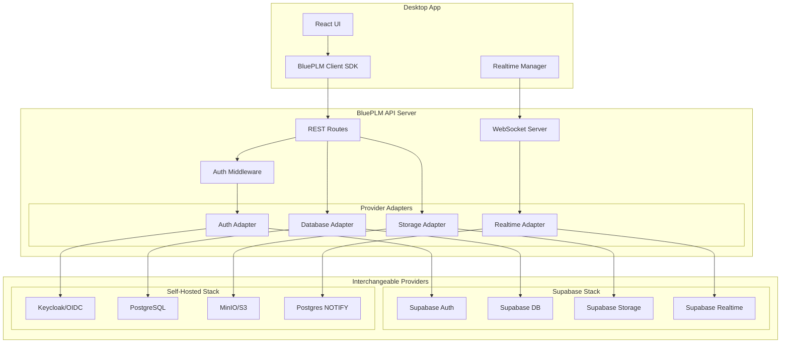

# Provider-Agnostic Architecture Design

## Goal

Enable customers to self-host BluePLM with their own backend infrastructure (Postgres + S3/MinIO, custom auth) while maintaining real-time collaboration and performant large file handling.

---

## Deep-Dive Codebase Analysis (Reality Check)

Before planning, here's what the codebase actually contains:

### Supabase Integration Scope

| Category | Count | Files/Locations |

|----------|-------|-----------------|

| Direct `.from()` queries | 557 | 89 files across src/ |

| `supabase.` direct calls | 96 | 33 files |

| `getSupabaseClient()` usage | 151 | 21 files |

| Feature files with direct DB calls | 29 | `src/features/*` |

| Centralized Supabase modules | 11 | `src/lib/supabase/*` |

| Realtime channels | 5 | files, activity, organization, color_swatches, permissions |

| Tables with realtime listeners | 7+ | files, activity, organizations, color_swatches, vault_access, team_vault_access, team_members, user_permissions, users |

### Critical Supabase-Specific Integrations

**1. Auth (Deeply Coupled)**

- `supabase.auth.signInWithOAuth()` - Google OAuth with Electron flow
- `supabase.auth.signInWithPassword()` - Email/password
- `supabase.auth.signInWithOtp()` - Phone/SMS (for China)
- `supabase.auth.onAuthStateChange()` - Session state listener
- `supabase.auth.setSession()` - Token injection from Electron main process
- `supabase.auth.getSession()` / `getUser()` - Session retrieval
- Custom OAuth callback handling in Electron (`electron/handlers/oauth.ts`)

**2. Realtime (Complex Business Logic)**

- **Files channel**: Checkout locks, version changes, state changes, orphaned checkout detection
- **Activity channel**: Notification batching (500ms window), user info lazy loading
- **Organization channel**: Settings sync across all org users
- **Permissions channel**: Cascade through vault_access, team_vault_access, team_members, user_permissions, user role changes
- **Color swatches channel**: Shared palette sync

**3. Storage**

- Main file storage via `src/lib/storage.ts` (content-addressed, deduplication)
- Avatar uploads in `ProfileSettings.tsx`
- Logo uploads in `CompanyProfileSettings.tsx`
- All use Supabase Storage SDK

**4. Typed Database Schema**

- `src/types/database.ts` generated from Supabase (`supabase gen types`)
- Provides compile-time type safety for all queries
- Would lose this with raw SQL/different ORM

### Scattered Direct Queries (29 Feature Files)

These files bypass the centralized lib and query Supabase directly:

```
src/features/supply-chain/rfq/RFQView.tsx (30+ queries)
src/features/settings/organization/team-members/hooks/*.ts (14+ queries)
src/features/source/workflows/services/*.ts (6 queries)
src/features/change-control/eco/ECOView.tsx
src/features/change-control/deviations/DeviationsView.tsx
src/features/search/SearchView.tsx
... and 23 more
```

---

## Revised Architecture

### Target State



---

## Realistic Migration Strategy

### Timeline Estimate: 4-6 Months (Full-Time)

This is a significant architectural change. Here's a realistic breakdown:

---

### Phase 0: Preparation (2 weeks)

**Goal**: Set up infrastructure and patterns before touching production code.

1. **Create adapter interfaces**
   ```
   api/adapters/
   ├── auth/index.ts      # AuthAdapter interface
   ├── database/index.ts  # DatabaseAdapter interface  
   ├── storage/index.ts   # StorageAdapter interface
   └── realtime/index.ts  # RealtimeAdapter interface
   ```

2. **Implement Supabase adapters first** (pass-through to existing behavior)

   - This validates the interfaces work without changing behavior
   - Supabase remains the default provider

3. **Set up integration test environment**

   - Docker compose with Postgres + MinIO + Keycloak
   - CI pipeline to test both Supabase and self-hosted

---

### Phase 1: API Completion (3-4 weeks)

**Goal**: Ensure API has endpoints for ALL operations currently done via direct Supabase.

**Gap Analysis** - API routes that need to be added:

| Domain | Current API Coverage | Missing Endpoints |

|--------|---------------------|-------------------|

| Files | Good (CRUD, checkout, versions) | Batch operations, search |

| Vaults | Basic | Create, update, delete, access management |

| Teams | None | Full CRUD, membership, permissions |

| Users | Basic (invite) | Profile update, role management |

| Activity | Basic | Full query options |

| Notifications | None | Full notification system |

| Reviews | None | Full ECO/review workflow |

| RFQ | None | Full RFQ system (30+ operations) |

| Workflows | None | State management, transitions |

| Settings | None | Org settings, user preferences |

| Search | None | Global search |

**New endpoints to implement (~40-50 endpoints)**:

```typescript
// Teams & Permissions
POST   /teams
GET    /teams
PATCH  /teams/:id
DELETE /teams/:id
POST   /teams/:id/members
DELETE /teams/:id/members/:userId
GET    /users/:id/permissions
PATCH  /users/:id/permissions

// Notifications & Reviews
GET    /notifications
PATCH  /notifications/:id/read
POST   /reviews
GET    /reviews
PATCH  /reviews/:id

// RFQ System (complex)
POST   /rfqs
GET    /rfqs
GET    /rfqs/:id
PATCH  /rfqs/:id
POST   /rfqs/:id/items
POST   /rfqs/:id/suppliers
POST   /rfqs/:id/send
// ... 20+ more RFQ endpoints

// Workflows
GET    /workflows
POST   /workflows
GET    /workflow-states
POST   /files/:id/transition

// Settings
GET    /settings/organization
PATCH  /settings/organization
GET    /settings/user
PATCH  /settings/user
```

---

### Phase 2: Client SDK (2-3 weeks)

**Goal**: Create a client SDK that abstracts all backend calls.

**Structure**:

```
src/lib/api/
├── client.ts           # HTTP + WebSocket client
├── files.ts            # File operations
├── vaults.ts           # Vault operations
├── teams.ts            # Teams & permissions
├── users.ts            # User operations
├── notifications.ts    # Notifications
├── rfq.ts              # RFQ operations
├── workflows.ts        # Workflow operations
├── settings.ts         # Settings
├── realtime.ts         # WebSocket subscription manager
└── index.ts            # Barrel export
```

**Key Design Decisions**:

1. **Type Safety**: Generate TypeScript types from OpenAPI spec (or manually define)
2. **Error Handling**: Consistent error shapes across all methods
3. **Offline Support**: Queue operations when offline, sync when back online
4. **Caching**: Optional response caching for frequently-accessed data

**Example SDK usage**:

```typescript
import { createBluePLMClient } from '@/lib/api'

const client = createBluePLMClient({
  baseUrl: 'https://api.company.com',
  token: accessToken,
  onTokenRefresh: (newToken) => { /* handle */ },
  onRealtimeEvent: (event) => { /* handle */ }
})

// Files
const { files } = await client.files.list({ vaultId, search: 'bracket' })
const { file } = await client.files.checkout(fileId, { message: 'Working on design' })

// Realtime
client.realtime.subscribe('files', orgId, (event) => {
  if (event.type === 'UPDATE') updateFileInStore(event.data)
})
```

---

### Phase 3: Migrate Centralized Lib (2-3 weeks)

**Goal**: Replace `src/lib/supabase/*` with API SDK calls.

**Order of migration** (by risk/complexity):

1. **Activity** (`activity.ts`) - Low risk, read-only
2. **Vaults** (`vaults.ts`) - Medium risk, used everywhere
3. **Files** (`files.ts`) - High risk, core functionality (1800+ lines)
4. **Teams** (`teams.ts`) - Medium risk, permissions
5. **Organizations** (`organizations.ts`) - Medium risk
6. **Sessions** (`sessions.ts`) - Low risk, can keep direct for now
7. **Notifications** (`notifications.ts`) - Medium risk
8. **Recovery** (`recovery.ts`) - Low risk, admin only
9. **Auth** (`auth.ts`) - **HIGH RISK** - defer to Phase 5

**Migration pattern**:

```typescript
// Before (src/lib/supabase/files.ts)
export async function getFiles(orgId: string, options?: {...}) {
  const client = getSupabaseClient()
  const { data, error } = await client.from('files').select('*')...
  return { files: data, error }
}

// After (src/lib/api/files.ts)  
export async function getFiles(orgId: string, options?: {...}) {
  const client = getApiClient()
  return client.files.list({ orgId, ...options })
}

// Re-export from same location for backward compatibility
// (src/lib/supabase/files.ts becomes a re-export)
export { getFiles } from '../api/files'
```

---

### Phase 4: Migrate Feature Files (3-4 weeks)

**Goal**: Replace 29 feature files that have direct Supabase queries.

**Prioritized by complexity**:

| Priority | File | Queries | Complexity | Notes |

|----------|------|---------|------------|-------|

| 1 | RFQView.tsx | 30+ | Very High | Needs full RFQ API first |

| 2 | team-members/hooks/*.ts | 14+ | High | Permission system |

| 3 | workflow services | 6 | Medium | State machine |

| 4 | ECOView.tsx | 7 | Medium | Change control |

| 5 | SearchView.tsx | 2 | Low | Global search |

| 6 | Settings pages | 20+ | Medium | Various settings |

| 7 | Other features | ~15 | Low-Medium | Misc |

**Strategy**:

- Add API endpoints as needed
- Replace direct queries with SDK calls
- Test each feature thoroughly before moving on

---

### Phase 5: Auth Abstraction (2-3 weeks)

**Goal**: Abstract authentication to support multiple providers.

**This is the hardest part because:**

1. Electron OAuth flow is Supabase-specific
2. `onAuthStateChange` listener pattern is Supabase-specific
3. Token refresh is handled by Supabase SDK automatically
4. Session storage is managed by Supabase

**Approach**:

```typescript
// api/adapters/auth/index.ts
interface AuthAdapter {
  // Token operations
  verifyToken(token: string): Promise<AuthUser | null>
  refreshToken(refreshToken: string): Promise<TokenPair>
  revokeToken(token: string): Promise<void>
  
  // OAuth
  getOAuthConfig(): OAuthConfig  // Client needs to know redirect URLs, etc.
  exchangeCodeForTokens(code: string, codeVerifier?: string): Promise<TokenPair>
  
  // Password auth (optional)
  signInWithPassword?(email: string, password: string): Promise<TokenPair>
  signUp?(email: string, password: string, metadata?: any): Promise<TokenPair>
  
  // Phone auth (optional, for China)
  sendOTP?(phone: string): Promise<void>
  verifyOTP?(phone: string, code: string): Promise<TokenPair>
}

// Supabase implementation
class SupabaseAuthAdapter implements AuthAdapter {
  // Delegates to Supabase Auth
}

// OIDC implementation (Keycloak, Auth0, etc.)
class OIDCAuthAdapter implements AuthAdapter {
  constructor(private issuer: string, private clientId: string) {}
  // Standard OIDC flows
}
```

**Client-side auth flow**:

```typescript
// New: src/lib/auth/manager.ts
class AuthManager {
  private provider: 'supabase' | 'oidc'
  
  async signIn(method: 'google' | 'email' | 'phone', credentials?: any) {
    if (this.provider === 'supabase') {
      // Use existing Supabase flow
    } else {
      // Use PKCE flow with OIDC provider
      const { authUrl, codeVerifier } = await this.api.auth.startOAuth('google')
      const code = await openOAuthWindow(authUrl)
      const tokens = await this.api.auth.exchangeCode(code, codeVerifier)
      this.setSession(tokens)
    }
  }
  
  onAuthStateChange(callback: (event, session) => void) {
    // Unified auth state management
  }
}
```

---

### Phase 6: Realtime Abstraction (2-3 weeks)

**Goal**: Support both Supabase Realtime and WebSocket server.

**API WebSocket Server**:

```typescript
// api/websocket/server.ts
import { WebSocketServer } from 'ws'

const wss = new WebSocketServer({ server: fastify.server, path: '/realtime' })

// Client authentication
wss.on('connection', (ws, req) => {
  const token = extractToken(req)
  const user = await authAdapter.verifyToken(token)
  if (!user) return ws.close(4001, 'Unauthorized')
  
  ws.userId = user.id
  ws.orgId = user.org_id
})

// Subscribe to Postgres changes via LISTEN/NOTIFY
const pgClient = new Client(DATABASE_URL)
await pgClient.query('LISTEN file_changes')
await pgClient.query('LISTEN activity_changes')
// ... etc

pgClient.on('notification', (msg) => {
  const payload = JSON.parse(msg.payload)
  broadcastToOrg(payload.org_id, msg.channel, payload)
})
```

**Database triggers for NOTIFY**:

```sql
-- Add to each table that needs realtime
CREATE OR REPLACE FUNCTION notify_file_change() RETURNS trigger AS $$
BEGIN
  PERFORM pg_notify('file_changes', json_build_object(
    'operation', TG_OP,
    'org_id', COALESCE(NEW.org_id, OLD.org_id),
    'table', TG_TABLE_NAME,
    'new', row_to_json(NEW),
    'old', row_to_json(OLD)
  )::text);
  RETURN NEW;
END;
$$ LANGUAGE plpgsql;

CREATE TRIGGER files_notify AFTER INSERT OR UPDATE OR DELETE ON files
FOR EACH ROW EXECUTE FUNCTION notify_file_change();
```

**Client realtime manager**:

```typescript
// src/lib/api/realtime.ts
class RealtimeManager {
  private ws: WebSocket | null = null
  private supabaseChannels: Map<string, RealtimeChannel> = new Map()
  
  constructor(private config: RealtimeConfig) {}
  
  connect() {
    if (this.config.provider === 'supabase') {
      // Use existing Supabase realtime
    } else {
      this.ws = new WebSocket(this.config.wsUrl)
      this.ws.onmessage = this.handleMessage.bind(this)
    }
  }
  
  subscribe(channel: string, filter: any, callback: (event) => void) {
    if (this.config.provider === 'supabase') {
      // Existing Supabase subscription
    } else {
      this.ws.send(JSON.stringify({ type: 'subscribe', channel, filter }))
      this.callbacks.set(channel, callback)
    }
  }
}
```

---

### Phase 7: Storage Adapter (1 week)

**Goal**: Support S3-compatible storage.

This is relatively straightforward since we already use signed URLs:

```typescript
// api/adapters/storage/s3.ts
import { S3Client, PutObjectCommand, GetObjectCommand } from '@aws-sdk/client-s3'
import { getSignedUrl } from '@aws-sdk/s3-request-presigner'

class S3StorageAdapter implements StorageAdapter {
  private client: S3Client
  
  constructor(config: S3Config) {
    this.client = new S3Client({
      endpoint: config.endpoint,  // MinIO URL for self-hosted
      region: config.region,
      credentials: { accessKeyId: config.accessKey, secretAccessKey: config.secretKey }
    })
  }
  
  async generateUploadUrl(path: string, expiresIn = 3600) {
    const command = new PutObjectCommand({ Bucket: this.bucket, Key: path })
    return getSignedUrl(this.client, command, { expiresIn })
  }
  
  async generateDownloadUrl(path: string, expiresIn = 3600) {
    const command = new GetObjectCommand({ Bucket: this.bucket, Key: path })
    return getSignedUrl(this.client, command, { expiresIn })
  }
}
```

---

### Phase 8: Testing & Documentation (2 weeks)

1. **Integration tests** for both deployment modes
2. **Self-hosted deployment guide**
3. **Migration guide** for existing Supabase users who want to self-host
4. **Docker Compose** reference configuration
5. **Helm charts** for Kubernetes deployment

---

## Risk Assessment

| Risk | Likelihood | Impact | Mitigation |

|------|------------|--------|------------|

| Breaking existing Supabase users | Medium | High | Feature flag for API mode, gradual rollout |

| Realtime latency increase | Low | Medium | Postgres NOTIFY is fast (~10ms) |

| Auth edge cases | High | High | Extensive testing, keep Supabase as fallback |

| Type safety loss | Medium | Medium | Generate types from OpenAPI spec |

| Performance regression | Low | Medium | Benchmark before/after, optimize hot paths |

| Scope creep | High | High | Strict phase gates, MVP for self-hosted |

---

## Key Decisions Required

1. **Backward compatibility mode?**

   - Option A: Feature flag to use direct Supabase (safer, more maintenance)
   - Option B: API-only going forward (cleaner, breaking change)

2. **Auth provider support scope?**

   - MVP: OIDC only (covers Keycloak, Auth0, Okta, Azure AD)
   - Later: LDAP, SAML, custom

3. **Database abstraction level?**

   - Option A: Raw SQL with migrations (most flexible)
   - Option B: Drizzle ORM (type-safe, some abstraction)
   - Option C: Keep Supabase client for Supabase, pg for self-hosted

4. **Realtime delivery guarantees?**

   - At-most-once (current, simpler)
   - At-least-once (requires message queue like Redis)

---

## Estimated Effort Summary

| Phase | Duration | Effort |

|-------|----------|--------|

| Phase 0: Preparation | 2 weeks | Setup, interfaces |

| Phase 1: API Completion | 3-4 weeks | 40-50 new endpoints |

| Phase 2: Client SDK | 2-3 weeks | SDK implementation |

| Phase 3: Centralized Lib | 2-3 weeks | 11 files, ~3000 lines |

| Phase 4: Feature Files | 3-4 weeks | 29 files, scattered queries |

| Phase 5: Auth | 2-3 weeks | Complex, high risk |

| Phase 6: Realtime | 2-3 weeks | WebSocket server + client |

| Phase 7: Storage | 1 week | S3 adapter |

| Phase 8: Testing/Docs | 2 weeks | Integration tests, docs |

| **Total** | **19-27 weeks** | **~5-7 months** |

---

## Recommendation

Given the scope, consider a **phased release strategy**:

1. **v1.0**: Current Supabase-only (production today)
2. **v1.5**: API-first with Supabase adapter (internal testing)
3. **v2.0**: Self-hosted support (Postgres + S3 + OIDC)

This allows shipping incremental value while working toward the full vision.