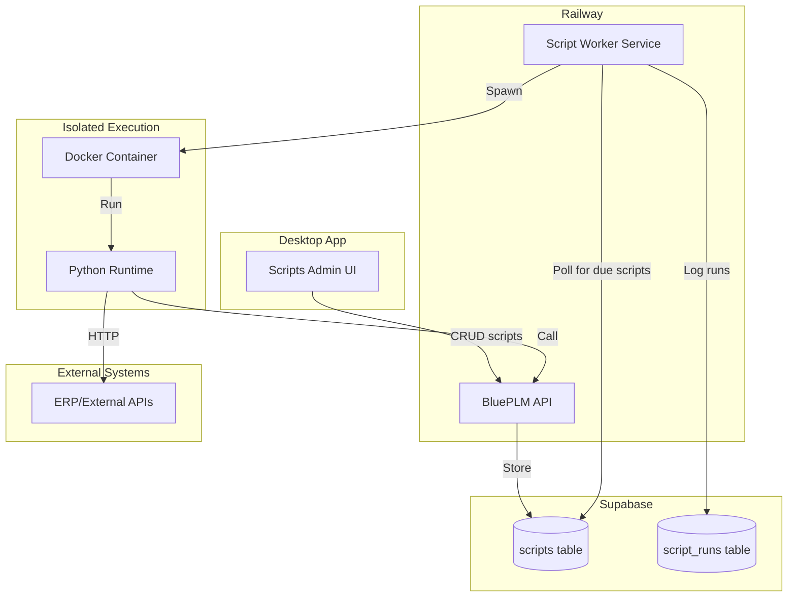
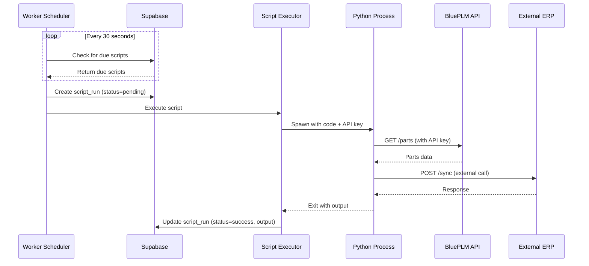

# Python Script Runner Module for BluePLM

## Architecture Overview



## Implementation Components

### 1. Database Schema

Add to [`supabase/modules/`](supabase/modules/):

```sql
-- Scripts table (stores Python code)
CREATE TABLE scripts (
  id UUID PRIMARY KEY DEFAULT uuid_generate_v4(),
  org_id UUID NOT NULL REFERENCES organizations(id),
  name TEXT NOT NULL,
  description TEXT,
  code TEXT NOT NULL,
  language TEXT DEFAULT 'python', -- For future: 'javascript', etc.
  schedule_enabled BOOLEAN DEFAULT false,
  schedule_cron TEXT,              -- e.g., '0 */6 * * *' (every 6 hours)
  schedule_timezone TEXT DEFAULT 'UTC',
  timeout_seconds INT DEFAULT 60,  -- Max 300s
  is_active BOOLEAN DEFAULT true,
  last_run_at TIMESTAMPTZ,
  last_run_status TEXT,
  created_at TIMESTAMPTZ DEFAULT NOW(),
  created_by UUID REFERENCES users(id),
  updated_at TIMESTAMPTZ DEFAULT NOW(),
  updated_by UUID REFERENCES users(id),
  UNIQUE(org_id, name)
);

-- Script execution history
CREATE TABLE script_runs (
  id UUID PRIMARY KEY DEFAULT uuid_generate_v4(),
  script_id UUID NOT NULL REFERENCES scripts(id) ON DELETE CASCADE,
  org_id UUID NOT NULL REFERENCES organizations(id),
  trigger_type TEXT NOT NULL, -- 'scheduled', 'manual', 'webhook'
  triggered_by UUID REFERENCES users(id),
  status TEXT NOT NULL DEFAULT 'pending', -- pending, running, success, error, timeout
  started_at TIMESTAMPTZ,
  completed_at TIMESTAMPTZ,
  output TEXT,                -- stdout capture
  error TEXT,                 -- stderr/exception
  duration_ms INT,
  created_at TIMESTAMPTZ DEFAULT NOW()
);
```

### 2. API Routes

Add [`api/routes/scripts.ts`](api/routes/scripts.ts):

| Endpoint | Method | Description |

|----------|--------|-------------|

| `/scripts` | GET | List organization scripts |

| `/scripts` | POST | Create new script (admin only) |

| `/scripts/:id` | GET | Get script details |

| `/scripts/:id` | PUT | Update script (admin only) |

| `/scripts/:id` | DELETE | Delete script (admin only) |

| `/scripts/:id/run` | POST | Manually trigger script run |

| `/scripts/:id/runs` | GET | Get execution history |

### 3. Script Worker Service

**Option A - Recommended: Separate Railway Service**

Create [`worker/`](worker/) directory with a Node.js service that:

1. Polls Supabase every 30-60s for scripts due to run
2. For each due script, spawns an isolated Python subprocess
3. Captures stdout/stderr and logs to `script_runs`
4. Enforces timeout limits

**Execution isolation using Node.js `child_process`:**

```typescript
// worker/executor.ts
import { spawn } from 'child_process'

async function executeScript(code: string, apiKey: string, timeout: number) {
  const env = {
    BLUEPLM_API_URL: process.env.API_URL,
    BLUEPLM_API_KEY: apiKey,
    PYTHONUNBUFFERED: '1'
  }
  
  const process = spawn('python3', ['-c', code], { env, timeout: timeout * 1000 })
  // ... capture output, enforce timeout
}
```

**Option B - Docker-based (More Secure)**

For stronger isolation, use Docker:

```typescript
await docker.run('blueplm/script-runner:python', {
  Cmd: ['python', '-c', code],
  Env: [`BLUEPLM_API_KEY=${apiKey}`],
  NetworkMode: 'bridge', // Allow internet access
  Memory: 256 * 1024 * 1024, // 256MB limit
  CpuPeriod: 100000,
  CpuQuota: 50000 // 50% CPU
})
```

### 4. Python SDK for Scripts

Provide a simple SDK that scripts can use:

```python
# Pre-injected into script execution environment
from blueplm import client

# Available to user scripts:
parts = client.get_parts(filters={"state": "released"})
client.update_part(id, {"custom_erp_id": "12345"})
suppliers = client.get_suppliers()

# Also has: requests library for external HTTP calls
import requests
response = requests.get("https://erp.company.com/api/products")
```

### 5. Output Capture (Per-Run Logs)

All `print()` statements and stdout/stderr are captured and stored in `script_runs.output`:

```typescript
// worker/executor.ts
async function executeScript(script: Script, runId: string) {
  let output = ''
  let error = ''
  
  const proc = spawn('python3', ['-c', script.code], {
    env: { PYTHONUNBUFFERED: '1', ... }
  })
  
  proc.stdout.on('data', (data) => {
    output += data.toString()
    // Optional: stream to realtime channel for live viewing
  })
  
  proc.stderr.on('data', (data) => {
    error += data.toString()
  })
  
  proc.on('close', (code) => {
    // Save to database
    await supabase.from('script_runs').update({
      status: code === 0 ? 'success' : 'error',
      output,
      error,
      completed_at: new Date().toISOString(),
      duration_ms: Date.now() - startTime
    }).eq('id', runId)
  })
}
```

### 6. Desktop UI

Add new feature area: **Settings > Automation > Scripts**

#### Scripts List View

| Column | Description |

|--------|-------------|

| Name | Script name (clickable to edit) |

| Status | Last run status badge (success/error/running) |

| Schedule | "Every 6 hours" or "Manual only" |

| Last Run | Relative time ("2 hours ago") |

| Actions | Run Now, Edit, Delete buttons |

#### Script Editor View

**Header Section:**

- Script name (editable)
- Description field
- Active toggle (enable/disable script)

**Code Editor (Monaco):**

- Python syntax highlighting
- Line numbers
- Auto-indent
- Find/replace
- Full-screen toggle
- Pre-populated template for new scripts:
```python
# BluePLM Script
# Available: blueplm (API client), requests, json, datetime

from blueplm import client

# Your code here
parts = client.get_parts()
print(f"Found {len(parts)} parts")

for part in parts:
    print(f"  - {part['number']}: {part['name']}")
```


**Schedule Configuration Panel:**

- Toggle: "Run on schedule" (checkbox)
- Simple interval picker (dropdown):
  - Every 15 minutes
  - Every hour
  - Every 6 hours
  - Every 12 hours
  - Daily at [time picker]
  - Weekly on [day picker] at [time]
  - Custom cron expression (advanced toggle)
- Timezone selector
- Next run preview: "Next run: Jan 8, 2026 at 3:00 PM UTC"

**Settings Panel:**

- Timeout: slider or input (30s - 300s)
- Environment variables (key-value pairs for secrets)

**Actions:**

- Save button
- "Run Now" button (for testing)
- Delete button (with confirmation)

#### Run History View (Per Script)

Table of past runs with columns:

| Column | Description |

|--------|-------------|

| Status | Icon: checkmark (green), X (red), spinner (running), clock (pending) |

| Trigger | "Scheduled" / "Manual by user@email.com" |

| Started | Timestamp |

| Duration | "1.2s" or "Running..." |

| Actions | View Logs button |

**Run Details Modal/Panel:**

- Status badge
- Trigger info (scheduled vs manual + who)
- Started at / Completed at / Duration
- **Output Tab**: Full stdout with monospace font, scrollable, copy button
- **Errors Tab**: stderr/exception with red highlighting
- Re-run button

#### Additional UI Features

1. **Script Templates Gallery**

   - "Sync suppliers to Odoo"
   - "Export released BOMs to CSV"
   - "Notify Slack on state changes"
   - One-click copy template to new script

2. **Live Output Streaming** (nice-to-have)

   - When clicking "Run Now", show real-time output as script runs
   - Uses Supabase realtime to stream stdout

3. **Failure Notifications**

   - Per-script option: "Email me on failure"
   - Checkbox + email input field

4. **Script Versioning** (future)

   - Auto-save versions on edit
   - "Revert to previous version" option

### 7. Additional Useful Features

**Environment Variables / Secrets**

Store sensitive values (API keys, passwords) separately from code:

```sql
-- Add to schema
CREATE TABLE script_secrets (
  id UUID PRIMARY KEY DEFAULT uuid_generate_v4(),
  script_id UUID NOT NULL REFERENCES scripts(id) ON DELETE CASCADE,
  key TEXT NOT NULL,
  value_encrypted TEXT NOT NULL,
  created_at TIMESTAMPTZ DEFAULT NOW(),
  UNIQUE(script_id, key)
);
```

Scripts access them via environment:

```python
import os
erp_api_key = os.environ.get('ERP_API_KEY')
```

**Execution Stats Dashboard**

Show aggregate stats on Scripts list:

- Total runs this week
- Success rate percentage
- Average duration
- Graph of runs over time (sparkline)

**Import/Export Scripts**

- Export script as `.py` file (with metadata header comment)
- Import script from file
- Useful for version control and sharing between orgs

**Webhook Trigger** (advanced)

Allow external systems to trigger scripts:

```
POST /api/scripts/:id/trigger?secret=xxx
```

This enables event-driven execution (e.g., run sync when ERP sends webhook)

## Security Considerations

| Risk | Mitigation |

|------|------------|

| Code injection | Scripts run in isolated subprocess/container, not in API process |

| Resource abuse | Timeout limits (max 5 min), memory caps, rate limiting |

| API abuse | Scoped API keys (read/write only org's data), audit logging |

| Secrets exposure | API key injected via environment, not stored in script |

| Infinite loops | Timeout enforcement, kill after limit |

## Execution Flow



## Phased Implementation

**Phase 1 - Core System (Week 1-2)**

- Database schema (scripts, script_runs, script_secrets)
- API routes for CRUD + manual run trigger
- Worker service with subprocess execution + output capture
- Python SDK with BluePLM API client
- Basic UI: scripts list, simple editor, run button

**Phase 2 - Full UI + Scheduling (Week 3)**

- Monaco code editor with Python highlighting
- User-friendly schedule picker (intervals + cron)
- Run history view with output/error log viewer
- Environment variables/secrets management UI
- Worker service deployed on Railway with cron scheduling

**Phase 3 - Polish + Advanced Features (Week 4)**

- Script templates gallery
- Live output streaming during runs
- Failure email notifications
- Import/export scripts
- Execution stats dashboard
- Optional: Docker isolation for stronger sandboxing

## Alternative: Config-Driven Integrations

If full Python scripting feels too complex, a simpler alternative:

Instead of arbitrary code, provide **integration templates**:

- "Sync suppliers from Odoo" (already exists)
- "Push released parts to ERP" 
- "Import purchase orders"

Users configure parameters (API URLs, field mappings) rather than writing code. This is:

- More secure (no arbitrary code execution)
- Easier to maintain
- But less flexible

**Recommendation**: Start with full Python scripting for maximum flexibility since this is for ERP integration by technical admins who can write code.