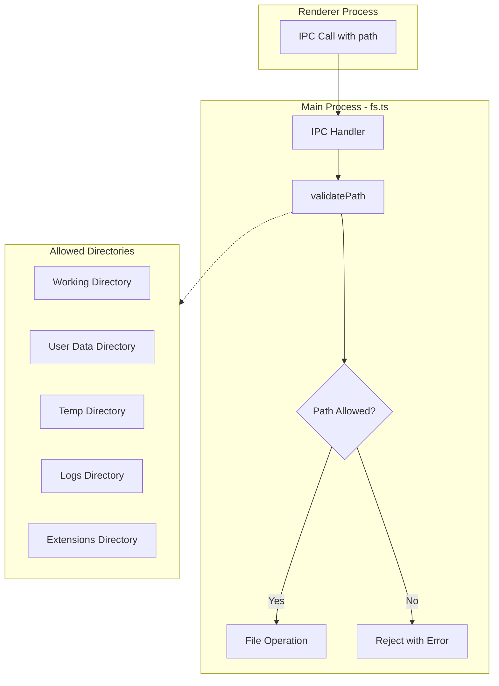
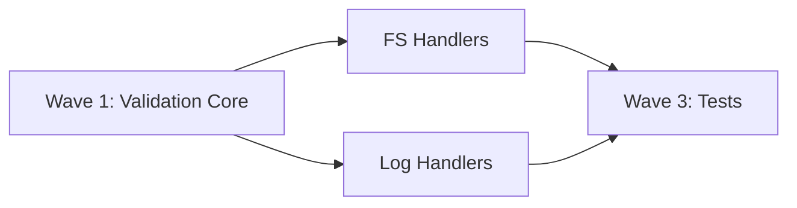

# Path Traversal Prevention Plan

## Objective

Implement comprehensive path validation for all file system IPC handlers to prevent directory traversal attacks. This is the **highest priority (P0)** security vulnerability - malicious code in the renderer could currently read, write, or delete any file on the system.

## Vulnerability Analysis

### Current State

The file system handlers in `electron/handlers/fs.ts` accept paths directly from the renderer without validation:

```typescript
// Line 437-450: No validation that path stays within allowed directories
ipcMain.handle('fs:read-file', async (_, filePath: string) => {
  const data = fs.readFileSync(filePath)  // Any path accepted - DANGEROUS
```

### Attack Vectors

1. **Direct path injection**: `../../../etc/passwd` or `C:\Windows\System32\config\SAM`
2. **Encoded traversal**: `..%2F..%2F` or URL-encoded paths
3. **Null byte injection**: `file.txt\x00.jpg` (legacy, but worth blocking)
4. **UNC paths on Windows**: `\\server\share\file` to access network resources
5. **Symlink following**: Symlink in allowed dir pointing outside

### Vulnerable Handlers (11 total)

| Handler | Risk | Current Validation |
|---------|------|-------------------|
| `fs:read-file` | Read any file | None |
| `fs:write-file` | Write anywhere | None |
| `fs:hash-file` | Read any file (for hash) | None |
| `fs:delete` | Delete any file | None |
| `fs:rename` | Move files anywhere | None |
| `fs:download-url` | Write downloaded file anywhere | None |
| `fs:copy-file` | Copy to/from anywhere | None |
| `fs:move-items` | Move items anywhere | None |
| `logs:read-file` | Read log files | None |
| `logs:delete-file` | Delete log files | None |
| `fs:open-external` | Open any file in OS | None |

---

## Architecture



---

## Agent Overview

| Agent | Wave | Responsibility | Owns | Dependencies |
|-------|------|----------------|------|--------------|
| Validation Core | 1 | Path validation utility | `electron/utils/pathSecurity.ts` | None |
| FS Handler Migration | 2 | Update fs.ts handlers | `electron/handlers/fs.ts` | Validation Core |
| Log Handler Migration | 2 | Update log handlers | `electron/handlers/logs.ts` | Validation Core |
| Test Suite | 3 | Security test coverage | `electron/__tests__/pathSecurity.test.ts` | All Wave 2 |

## Shared Files

| File | Owner | Rule |
|------|-------|------|
| `electron/utils/pathSecurity.ts` | Validation Core | Read-only after Wave 1 |
| `electron/handlers/fs.ts` | FS Handler Migration | Exclusive during Wave 2 |
| `electron/handlers/logs.ts` | Log Handler Migration | Exclusive during Wave 2 |

---

## Wave 1: Validation Core Agent

### Prompt

> Create a robust path validation utility for BluePLM's Electron main process with enterprise-level security.
>
> **Scope:**
> - Create `electron/utils/pathSecurity.ts` with:
>   - `validatePath(requestedPath, allowedRoots)` - Resolves and validates path is within allowed directories
>   - `isPathTraversal(path)` - Detects traversal patterns (../, encoded, null bytes)
>   - `normalizeAndResolve(path)` - Safely normalizes path handling edge cases
>   - `getAllowedDirectories()` - Returns map of allowed directory types and their paths
>   - `PathValidationError` class with specific error codes
> - Handle platform differences (Windows vs Unix paths, UNC paths, drive letters)
> - Block symlinks that point outside allowed directories
> - Export types for allowed directory categories: 'working', 'userData', 'temp', 'logs', 'extensions'
>
> **Security Requirements:**
> - Use `path.resolve()` to canonicalize paths before comparison
> - Check real path (follow symlinks) with `fs.realpathSync` where file exists
> - Block encoded traversal patterns (URL encoding, Unicode normalization attacks)
> - Block null bytes and other control characters
> - Block UNC paths on Windows unless explicitly in allowlist
> - Ensure case-insensitive comparison on Windows
>
> **Boundaries:**
> - OWNS: `electron/utils/pathSecurity.ts`
> - Do NOT modify: Any handler files (Wave 2 agents will do this)
>
> **Quality Requirements:**
> - Enterprise-level code quality and organization
> - Comprehensive JSDoc documentation
> - No `any` types
> - Unit-testable pure functions where possible
>
> **Deliverables:**
> - `electron/utils/pathSecurity.ts` with all validation functions
> - Report in `PATH_VALIDATION_CORE_REPORT.md`
>
> **When complete:** Provide example usage showing how handlers will call these functions.

### Boundary

- **OWNS (exclusive write):** `electron/utils/pathSecurity.ts`
- **READS (no modify):** `electron/handlers/fs.ts` (for understanding usage patterns)

### Tasks

- [ ] Create `PathValidationError` class with error codes
- [ ] Implement `normalizeAndResolve()` with platform handling
- [ ] Implement `isPathTraversal()` pattern detection
- [ ] Implement `getAllowedDirectories()` using Electron's `app.getPath()`
- [ ] Implement `validatePath()` main validation function
- [ ] Handle symlink resolution safely
- [ ] Add Windows-specific handling (case-insensitive, UNC, drive letters)
- [ ] Export TypeScript types
- [ ] Write completion report

### Deliverables

```typescript
// electron/utils/pathSecurity.ts - Key exports
export type AllowedDirectory = 'working' | 'userData' | 'temp' | 'logs' | 'extensions' | 'downloads'

export class PathValidationError extends Error {
  code: 'TRAVERSAL' | 'OUTSIDE_ALLOWED' | 'INVALID_PATH' | 'SYMLINK_ESCAPE' | 'UNC_BLOCKED'
}

export function validatePath(
  requestedPath: string,
  allowedTypes: AllowedDirectory[],
  options?: { allowSymlinks?: boolean; workingDirectory?: string }
): { valid: true; resolvedPath: string } | { valid: false; error: PathValidationError }

export function getAllowedDirectories(workingDirectory?: string): Map<AllowedDirectory, string>
```

---

## Wave 2: FS Handler Migration Agent

### Prompt

> Integrate path validation into all file system IPC handlers with enterprise-level security.
>
> **Scope:**
> - Update `electron/handlers/fs.ts` to use `validatePath()` from `pathSecurity.ts`
> - Add validation to ALL file operation handlers (11 handlers listed in plan)
> - For each handler, determine appropriate allowed directories
> - Return clear error messages when paths are rejected
> - Ensure validation happens BEFORE any file operation
>
> **Handler-to-Directory Mapping:**
> - `fs:read-file`, `fs:write-file`, `fs:hash-file`, `fs:delete`, `fs:rename`, `fs:copy-file`, `fs:move-items`: working directory only
> - `fs:download-url`: working directory + downloads directory
> - `fs:open-external`: working directory (for PDM files)
> - Log handlers: logs directory only
>
> **Boundaries:**
> - OWNS: `electron/handlers/fs.ts`
> - READS: `electron/utils/pathSecurity.ts` (do not modify)
> - Do NOT modify: Log handlers (parallel agent)
>
> **Quality Requirements:**
> - Validation MUST happen before any fs operation
> - Error messages should not leak path information to potential attackers
> - Log rejected paths for security auditing (but sanitize in logs)
> - Maintain backwards compatibility for valid operations
>
> **Deliverables:**
> - All fs.ts handlers protected with path validation
> - Report in `FS_HANDLER_MIGRATION_REPORT.md`
>
> **When complete:** Test with both valid paths and attempted traversal attacks.

### Boundary

- **OWNS (exclusive write):** `electron/handlers/fs.ts`
- **READS (no modify):** `electron/utils/pathSecurity.ts`

### Tasks

- [ ] Import `validatePath` and types from pathSecurity.ts
- [ ] Update `fs:read-file` handler with validation
- [ ] Update `fs:write-file` handler with validation
- [ ] Update `fs:hash-file` handler with validation
- [ ] Update `fs:delete` handler with validation
- [ ] Update `fs:rename` handler with validation
- [ ] Update `fs:copy-file` handler with validation
- [ ] Update `fs:move-items` handler with validation
- [ ] Update `fs:download-url` handler with validation
- [ ] Update `fs:open-external` handler with validation
- [ ] Add security audit logging for rejected paths
- [ ] Test all handlers with valid and invalid paths
- [ ] Write completion report

### Deliverables

- Protected file system handlers
- Security audit logging for path rejections

---

## Wave 2: Log Handler Migration Agent

### Prompt

> Integrate path validation into log file IPC handlers with enterprise-level security.
>
> **Scope:**
> - Update log-related handlers in `electron/handlers/logs.ts` (or fs.ts if combined)
> - Validate that log operations only access the logs directory
> - Handlers: `logs:read-file`, `logs:delete-file`, `logs:list-files`
>
> **Boundaries:**
> - OWNS: `electron/handlers/logs.ts` or log handlers in fs.ts
> - READS: `electron/utils/pathSecurity.ts` (do not modify)
> - Do NOT modify: Non-log handlers in fs.ts (parallel agent)
>
> **Quality Requirements:**
> - Log directory should be strictly enforced
> - No path parameters should allow access outside logs directory
>
> **Deliverables:**
> - All log handlers protected with path validation
> - Report in `LOG_HANDLER_MIGRATION_REPORT.md`
>
> **When complete:** Verify log operations cannot access files outside logs directory.

### Boundary

- **OWNS (exclusive write):** Log-related handlers only
- **READS (no modify):** `electron/utils/pathSecurity.ts`

### Tasks

- [ ] Identify all log-related handlers
- [ ] Add path validation to each handler
- [ ] Ensure only logs directory is allowed
- [ ] Test with traversal attempts
- [ ] Write completion report

### Deliverables

- Protected log handlers

---

## Wave 3: Test Suite Agent

### Prompt

> Create comprehensive security tests for path traversal prevention with enterprise-level coverage.
>
> **Scope:**
> - Create `electron/__tests__/pathSecurity.test.ts` with unit tests
> - Test all attack vectors: traversal, encoding, null bytes, UNC, symlinks
> - Test platform-specific behaviors (Windows vs Unix)
> - Test each handler's validation integration
>
> **Test Categories:**
> 1. **Traversal patterns**: `../`, `..\\`, `....//`, `..\\/`
> 2. **Encoded patterns**: `%2e%2e%2f`, `%252e%252e%252f` (double-encoded)
> 3. **Unicode normalization**: fullwidth characters, homoglyphs
> 4. **Null bytes**: `file.txt\x00.jpg`
> 5. **UNC paths**: `\\\\server\\share\\file`
> 6. **Symlink escape**: symlink pointing outside allowed dir
> 7. **Case sensitivity**: Windows path comparison
> 8. **Edge cases**: empty paths, very long paths, special characters
>
> **Boundaries:**
> - OWNS: `electron/__tests__/pathSecurity.test.ts`
> - READS: `electron/utils/pathSecurity.ts`, handler files
>
> **Quality Requirements:**
> - 100% coverage of validation functions
> - Test both positive (valid paths) and negative (attack paths) cases
> - Document each attack vector being tested
>
> **Deliverables:**
> - Comprehensive test suite
> - Report in `PATH_SECURITY_TEST_REPORT.md`
>
> **When complete:** Run `npm test` and report coverage.

### Boundary

- **OWNS (exclusive write):** `electron/__tests__/pathSecurity.test.ts`
- **READS (no modify):** All validation and handler code

### Tasks

- [ ] Create test file structure
- [ ] Test traversal pattern detection
- [ ] Test encoded traversal detection
- [ ] Test null byte detection
- [ ] Test UNC path blocking
- [ ] Test symlink handling
- [ ] Test case sensitivity on Windows
- [ ] Test edge cases
- [ ] Test handler integration
- [ ] Write completion report with coverage

### Deliverables

- Comprehensive test suite with documented attack vectors

---

## Execution Order



1. **Wave 1:** Validation Core agent (creates the utility)
2. **Wave 2:** FS Handler + Log Handler agents in parallel
3. **Wave 3:** Test Suite agent (verifies everything)

---

## Success Criteria

- [ ] All 11 file handlers protected with path validation
- [ ] No file operations possible outside allowed directories
- [ ] Traversal attacks blocked and logged
- [ ] Test suite covers all attack vectors
- [ ] Backwards compatible for legitimate operations
- [ ] TypeScript types exported for handler use
- [ ] `npm run typecheck` passes
