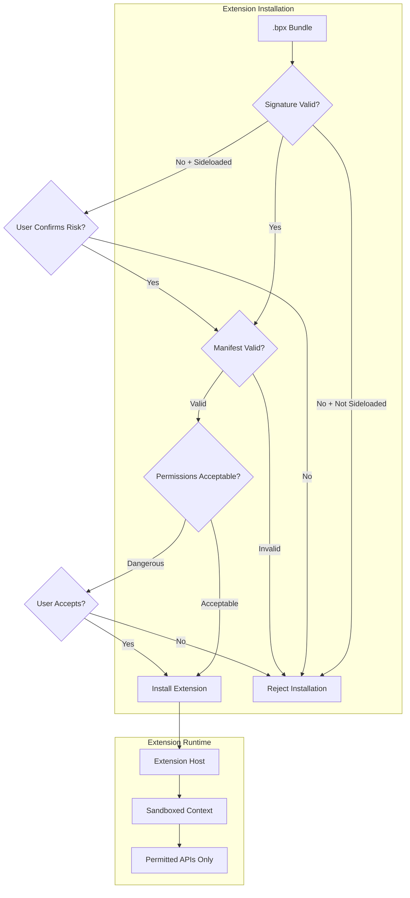
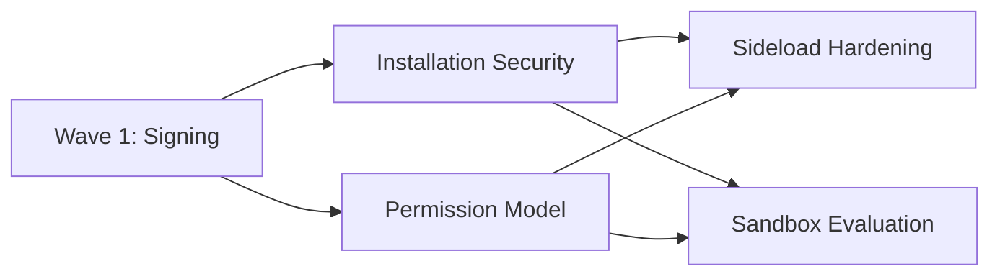

# Extension System Security Plan

## Objective

Harden the extension system with code signing verification and improved sandboxing. Currently, extensions run with `sandbox: false` and sideloaded extensions bypass all verification. This is a **P1 (High)** security priority.

## Vulnerability Analysis

### Current State

From `electron/handlers/extensionHost.ts`:

```typescript
// Lines 209-214: Extension Host runs without sandbox
webPreferences: {
  preload: path.join(currentDir, 'extension-host/preload.js'),
  contextIsolation: true,
  nodeIntegration: false,
  sandbox: false // Required for extension loading - SECURITY CONCERN
}
```

### Security Concerns

1. **No Sandbox**: Extensions have access to more system resources than sandboxed processes
2. **No Code Signing**: `.bpx` extension bundles are not cryptographically verified
3. **Sideload Bypass**: Sideloaded extensions completely bypass store verification
4. **Arbitrary Path Installation**: Extension installation accepts paths from renderer
5. **Limited Permission Model**: Native extensions lack granular permissions

### Current Verification Levels

| Level | Description | Current Security |
|-------|-------------|-----------------|
| `verified` | From official store, publisher verified | Store listing only |
| `community` | From store, publisher not verified | Store listing only |
| `sideloaded` | Manual install from .bpx file | **NONE** |

---

## Architecture



---

## Agent Overview

| Agent | Wave | Responsibility | Owns | Dependencies |
|-------|------|----------------|------|--------------|
| Signing Infrastructure | 1 | Signature generation and verification | `electron/utils/extensionSigning.ts`, `scripts/sign-extension.js` | None |
| Installation Security | 2 | Verify signatures during installation | `electron/handlers/extensionHost.ts` (install section) | Signing Infra |
| Permission Model | 2 | Granular permission system | `electron/extension-host/permissions.ts` | None |
| Sideload Hardening | 3 | User confirmation, warnings | UI components, IPC handlers | Signing, Permissions |
| Sandbox Evaluation | 3 | Re-evaluate sandbox: false requirement | Extension Host architecture | All above |

## Shared Files

| File | Owner | Rule |
|------|-------|------|
| `electron/utils/extensionSigning.ts` | Signing Infrastructure | Read-only after Wave 1 |
| `electron/handlers/extensionHost.ts` | Installation Security | Coordinate changes |
| `electron/extension-host/types.ts` | Permission Model | Add permission types |

---

## Wave 1: Signing Infrastructure Agent

### Prompt

> Create cryptographic signing infrastructure for BluePLM extensions with enterprise-level security.
>
> **Scope:**
> - Create `electron/utils/extensionSigning.ts` with:
>   - `verifyExtensionSignature(bpxPath)` - Verify .bpx file signature
>   - `extractSignatureInfo(bpxPath)` - Get signer identity, timestamp, certificate chain
>   - `SignatureVerificationResult` type with detailed status
> - Create `scripts/sign-extension.js` for extension developers:
>   - Sign a .bpx bundle with a private key
>   - Support code signing certificates (for verified publishers)
>   - Generate detached signature file (.bpx.sig) or embed in bundle
>
> **Signing Scheme:**
> - Use Ed25519 for lightweight, fast signatures (or RSA-4096 for certificate compatibility)
> - Signature covers: manifest.json, all code files, icon
> - Include timestamp to detect expired signatures
> - Support certificate chains for verified publisher identity
>
> **Verification Levels:**
> - `trusted`: Signed by BluePLM (official extensions)
> - `verified`: Signed by verified publisher certificate
> - `signed`: Signed but certificate not in trust store
> - `unsigned`: No valid signature
>
> **Boundaries:**
> - OWNS: `electron/utils/extensionSigning.ts`, `scripts/sign-extension.js`
> - Do NOT modify: Extension Host handlers (Wave 2)
>
> **Quality Requirements:**
> - Use Node.js crypto module (no external dependencies for verification)
> - Signatures must be deterministic and reproducible
> - Support both embedded and detached signatures
> - Clear error messages for signature failures
>
> **Deliverables:**
> - Signing utility and verification library
> - Report in `EXTENSION_SIGNING_REPORT.md`
>
> **When complete:** Demonstrate signing a test extension and verifying it.

### Boundary

- **OWNS (exclusive write):** `electron/utils/extensionSigning.ts`, `scripts/sign-extension.js`
- **READS (no modify):** Extension bundle format documentation

### Tasks

- [ ] Design signature format and storage (embedded vs detached)
- [ ] Implement `computeExtensionHash()` for bundle content
- [ ] Implement Ed25519 signature verification
- [ ] Implement certificate chain validation
- [ ] Create `verifyExtensionSignature()` function
- [ ] Create `extractSignatureInfo()` function
- [ ] Create signing script for developers
- [ ] Add TypeScript types for verification results
- [ ] Test with signed and unsigned bundles
- [ ] Write completion report

### Deliverables

```typescript
// electron/utils/extensionSigning.ts - Key exports
export type SignatureStatus = 'trusted' | 'verified' | 'signed' | 'unsigned' | 'invalid' | 'expired'

export interface SignatureVerificationResult {
  status: SignatureStatus
  signerIdentity?: string  // Publisher name from certificate
  signedAt?: Date
  expiresAt?: Date
  certificateChain?: string[]
  error?: string
}

export function verifyExtensionSignature(bpxPath: string): Promise<SignatureVerificationResult>
export function extractSignatureInfo(bpxPath: string): Promise<SignatureInfo | null>
```

---

## Wave 2: Installation Security Agent

### Prompt

> Integrate signature verification into extension installation flow with enterprise-level security.
>
> **Scope:**
> - Update extension installation in `electron/handlers/extensionHost.ts`
> - Verify signature BEFORE extracting or installing any extension
> - Block unsigned extensions from store (require at least 'signed' status)
> - Allow sideloaded extensions with explicit user consent
> - Store verification status in installed extensions registry
>
> **Installation Flow:**
> 1. Receive .bpx file path
> 2. Verify signature (before any extraction)
> 3. If unsigned and from store: REJECT
> 4. If unsigned and sideloaded: Show warning, require user confirmation
> 5. Extract and validate manifest
> 6. Check permissions against user preferences
> 7. Install to extensions directory
> 8. Record verification status
>
> **Boundaries:**
> - OWNS: Installation-related code in `electron/handlers/extensionHost.ts`
> - READS: `electron/utils/extensionSigning.ts` (do not modify)
> - Coordinate with: Permission Model agent for permission checks
>
> **Quality Requirements:**
> - Never install unsigned store extensions
> - Clear audit trail of what was verified
> - Signature verification must happen before extraction (prevent malicious zip bombs)
>
> **Deliverables:**
> - Secure installation flow with signature verification
> - Report in `INSTALLATION_SECURITY_REPORT.md`
>
> **When complete:** Test installation with signed, unsigned, and invalid signature extensions.

### Boundary

- **OWNS (exclusive write):** Installation functions in extensionHost.ts
- **READS (no modify):** `electron/utils/extensionSigning.ts`

### Tasks

- [ ] Import signing verification functions
- [ ] Add signature check at start of install flow
- [ ] Implement store extension rejection for unsigned
- [ ] Implement sideload warning flow (IPC to renderer)
- [ ] Update installed extensions registry with verification status
- [ ] Add audit logging for installation decisions
- [ ] Test all installation scenarios
- [ ] Write completion report

### Deliverables

- Verified extension installation flow
- Audit logging for security decisions

---

## Wave 2: Permission Model Agent

### Prompt

> Design and implement a granular permission model for BluePLM extensions.
>
> **Scope:**
> - Create `electron/extension-host/permissions.ts` with:
>   - Permission definitions and categories
>   - Permission checking functions
>   - User preference storage for extension permissions
> - Update extension manifest schema to declare required permissions
> - Categories: filesystem, network, clipboard, notifications, native, settings
>
> **Permission Levels:**
> - `required`: Extension won't function without this
> - `optional`: Enhanced functionality if granted
>
> **Permission Categories:**
> ```
> filesystem.read      - Read files from working directory
> filesystem.write     - Write files to working directory
> network.fetch        - Make HTTP requests
> clipboard.read       - Read clipboard
> clipboard.write      - Write to clipboard
> notifications.show   - Show system notifications
> native.solidworks    - Access SolidWorks integration
> settings.read        - Read organization settings
> settings.write       - Modify organization settings
> ```
>
> **Boundaries:**
> - OWNS: `electron/extension-host/permissions.ts`, manifest schema updates
> - READS: Current manifest format
> - Do NOT modify: Installation flow (parallel agent)
>
> **Quality Requirements:**
> - Permissions must be declared in manifest
> - Runtime permission checks before API access
> - User can revoke permissions post-install
>
> **Deliverables:**
> - Permission system with checking functions
> - Updated manifest schema
> - Report in `PERMISSION_MODEL_REPORT.md`
>
> **When complete:** Show example manifest with permissions and runtime check.

### Boundary

- **OWNS (exclusive write):** `electron/extension-host/permissions.ts`, manifest schema
- **READS (no modify):** Current extension types

### Tasks

- [ ] Define permission categories and granularity
- [ ] Create permission type definitions
- [ ] Implement `checkPermission()` function
- [ ] Implement `requestPermission()` for optional permissions
- [ ] Create user permission preference storage
- [ ] Update manifest schema with permissions field
- [ ] Add permission validation during installation
- [ ] Write completion report

### Deliverables

```typescript
// electron/extension-host/permissions.ts - Key exports
export type PermissionCategory = 'filesystem' | 'network' | 'clipboard' | 'notifications' | 'native' | 'settings'

export interface Permission {
  category: PermissionCategory
  action: string
  level: 'required' | 'optional'
  description: string
}

export function checkPermission(extensionId: string, permission: string): boolean
export function requestPermission(extensionId: string, permission: string): Promise<boolean>
export function getExtensionPermissions(extensionId: string): Permission[]
```

---

## Wave 3: Sideload Hardening Agent

### Prompt

> Implement user confirmation and warnings for sideloaded extensions with enterprise-level UX.
>
> **Scope:**
> - Create confirmation dialog for sideloaded extensions
> - Show clear security warnings about unsigned code
> - Display extension permissions before installation
> - Allow users to block all sideloaded extensions (org setting)
> - Track and display sideloaded extensions distinctly in UI
>
> **UI Requirements:**
> - Modal dialog with clear warning iconography
> - List of requested permissions
> - "I understand the risks" checkbox before install button
> - Visual indicator in extension list for sideloaded extensions
>
> **Boundaries:**
> - OWNS: Sideload confirmation UI, IPC handlers for confirmation
> - READS: Signing and permission systems
> - Do NOT modify: Core signing or permission code
>
> **Quality Requirements:**
> - User must actively acknowledge risk
> - Cannot accidentally install sideloaded extension
> - Admin can disable sideloading org-wide
>
> **Deliverables:**
> - Sideload confirmation dialog
> - UI indicators for sideloaded extensions
> - Report in `SIDELOAD_HARDENING_REPORT.md`
>
> **When complete:** Demonstrate sideload flow with user confirmation.

### Boundary

- **OWNS (exclusive write):** Sideload UI components, confirmation IPC
- **READS (no modify):** Signing utilities, permission system

### Tasks

- [ ] Design confirmation dialog UI
- [ ] Implement IPC handler for confirmation flow
- [ ] Create permission display component
- [ ] Add "sideloaded" visual indicator to extension cards
- [ ] Implement org-level sideload disable setting
- [ ] Test complete sideload flow
- [ ] Write completion report

### Deliverables

- Sideload confirmation dialog with risk acknowledgment
- Visual indicators for sideloaded extensions

---

## Wave 3: Sandbox Evaluation Agent

### Prompt

> Evaluate and improve Extension Host sandboxing with security-focused analysis.
>
> **Scope:**
> - Analyze why `sandbox: false` is currently required
> - Document what capabilities extensions actually need
> - Propose architecture changes to enable `sandbox: true`
> - If full sandboxing not possible, implement additional restrictions
>
> **Analysis Questions:**
> 1. What extension functionality requires sandbox: false?
> 2. Can we use a separate preload script to provide these capabilities?
> 3. What's the minimal set of main process APIs extensions need?
> 4. Can we use Web Workers for extension isolation?
>
> **Potential Improvements:**
> - Enable sandbox: true with capability-based preload
> - Use utility process instead of BrowserWindow
> - Implement CSP for Extension Host HTML
> - Restrict IPC channels available to extensions
>
> **Boundaries:**
> - OWNS: Extension Host architecture analysis, sandbox evaluation
> - Produces: Technical recommendation document
> - May modify: Extension Host if improvements are feasible
>
> **Quality Requirements:**
> - Document all current sandbox dependencies
> - Provide risk assessment for current state
> - Concrete recommendations with effort estimates
>
> **Deliverables:**
> - Technical analysis document
> - Implementation recommendations
> - Report in `SANDBOX_EVALUATION_REPORT.md`
>
> **When complete:** Present findings with security impact assessment.

### Boundary

- **OWNS (exclusive write):** Analysis document, potential Extension Host improvements
- **READS (no modify):** Current Extension Host implementation

### Tasks

- [ ] Audit Extension Host code for sandbox dependencies
- [ ] Test Extension Host with sandbox: true (document failures)
- [ ] Research Electron utility process as alternative
- [ ] Document current security posture
- [ ] Propose improvement path
- [ ] Write completion report with recommendations

### Deliverables

- Technical analysis of sandbox requirements
- Recommendations for improved isolation

---

## Execution Order



1. **Wave 1:** Signing Infrastructure (foundation for everything)
2. **Wave 2:** Installation Security + Permission Model in parallel
3. **Wave 3:** Sideload Hardening + Sandbox Evaluation in parallel

---

## Success Criteria

- [ ] Extensions cryptographically signed and verified
- [ ] Store extensions require valid signature
- [ ] Sideloaded extensions require explicit user consent
- [ ] Permission model implemented and enforced
- [ ] User can see and manage extension permissions
- [ ] Sandbox evaluation complete with recommendations
- [ ] Audit trail for all security decisions
- [ ] `npm run typecheck` passes
