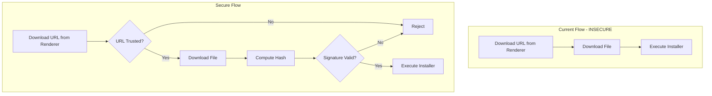
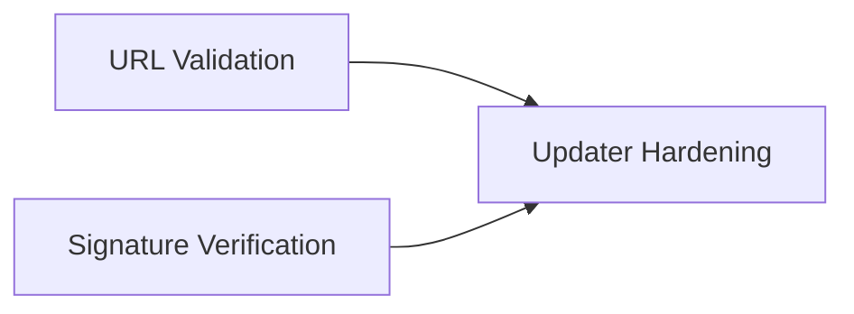

# Auto-Updater Security Plan

## Objective

Add signature verification for downloaded installers and validate download URLs against trusted sources. This is a **P1 (High)** priority - the current implementation could allow arbitrary code execution via manipulated download URLs.

## Vulnerability Analysis

### Current State

From `electron/handlers/updater.ts`:

```typescript
// Lines 301-389: Downloads from provided URL without validation
ipcMain.handle('updater:download-version', async (_, version: string, downloadUrl: string) => {
  // downloadUrl comes from renderer - could be manipulated
  const urlParts = new URL(downloadUrl)
  // ... downloads from any URL
})

// Lines 392-411: Executes downloaded file without verification
ipcMain.handle('updater:run-installer', async (_, filePath: string) => {
  await shell.openPath(filePath)  // Executes any downloaded file
})
```

### Attack Vectors

1. **URL Manipulation**: Attacker provides malicious download URL
2. **Man-in-the-Middle**: Intercept download and replace with malware
3. **Compromised CDN**: If GitHub releases CDN is compromised
4. **No Signature Check**: Downloaded installers not verified before execution
5. **Arbitrary Execution**: `run-installer` will execute any file path

### Risk Assessment

| Attack | Likelihood | Impact | Risk |
|--------|------------|--------|------|
| Malicious URL injection | Medium | Critical | High |
| MITM on download | Low (HTTPS) | Critical | Medium |
| Unsigned installer execution | High | Critical | Critical |

---

## Architecture



---

## Agent Overview

| Agent | Wave | Responsibility | Owns | Dependencies |
|-------|------|----------------|------|--------------|
| URL Validation | 1 | Trusted URL allowlist | `electron/utils/trustedUrls.ts` | None |
| Signature Verification | 1 | Authenticode/codesign verification | `electron/utils/installerVerification.ts` | None |
| Updater Hardening | 2 | Integrate validations into updater | `electron/handlers/updater.ts` | Both Wave 1 |

## Shared Files

| File | Owner | Rule |
|------|-------|------|
| `electron/utils/trustedUrls.ts` | URL Validation | Read-only after Wave 1 |
| `electron/utils/installerVerification.ts` | Signature Verification | Read-only after Wave 1 |
| `electron/handlers/updater.ts` | Updater Hardening | Exclusive during Wave 2 |

---

## Wave 1: URL Validation Agent

### Prompt

> Create URL validation utility for trusted download sources with enterprise-level security.
>
> **Scope:**
> - Create `electron/utils/trustedUrls.ts` with:
>   - `isUrlTrusted(url)` - Check if URL is from allowed sources
>   - `TRUSTED_DOWNLOAD_DOMAINS` - Allowlist of trusted domains
>   - `validateDownloadUrl(url)` - Full validation with detailed result
>
> **Trusted Sources:**
> ```
> github.com/bluerobotics/bluePLM/releases
> github-releases.githubusercontent.com (GitHub CDN)
> objects.githubusercontent.com (GitHub LFS)
> ```
>
> **Validation Rules:**
> - URL must be HTTPS (never HTTP)
> - Domain must be in allowlist
> - Path must match expected release pattern
> - No redirects to untrusted domains (check final URL)
> - Block data: URLs, javascript: URLs, file: URLs
>
> **Boundaries:**
> - OWNS: `electron/utils/trustedUrls.ts`
> - Do NOT modify: updater.ts (Wave 2)
>
> **Quality Requirements:**
> - Strict allowlist - fail closed
> - Log rejected URLs for security audit
> - Handle URL parsing errors gracefully
> - No regex vulnerabilities (ReDoS)
>
> **Deliverables:**
> - URL validation utility
> - Report in `URL_VALIDATION_REPORT.md`
>
> **When complete:** Test with valid GitHub URLs and attempted bypasses.

### Boundary

- **OWNS (exclusive write):** `electron/utils/trustedUrls.ts`
- **READS (no modify):** None

### Tasks

- [ ] Define `TRUSTED_DOWNLOAD_DOMAINS` allowlist
- [ ] Implement `isUrlTrusted()` basic check
- [ ] Implement `validateDownloadUrl()` with detailed validation
- [ ] Handle redirect chains (resolve final URL)
- [ ] Block dangerous URL schemes
- [ ] Add logging for rejected URLs
- [ ] Test with various URL formats
- [ ] Write completion report

### Deliverables

```typescript
// electron/utils/trustedUrls.ts - Key exports
export interface UrlValidationResult {
  valid: boolean
  url: string
  resolvedUrl?: string  // After redirects
  domain?: string
  error?: 'UNTRUSTED_DOMAIN' | 'INVALID_URL' | 'NOT_HTTPS' | 'BLOCKED_SCHEME' | 'INVALID_PATH'
}

export function isUrlTrusted(url: string): boolean
export function validateDownloadUrl(url: string): Promise<UrlValidationResult>
export const TRUSTED_DOWNLOAD_DOMAINS: readonly string[]
```

---

## Wave 1: Signature Verification Agent

### Prompt

> Create installer signature verification for Windows (Authenticode) and macOS (codesign) with enterprise-level security.
>
> **Scope:**
> - Create `electron/utils/installerVerification.ts` with:
>   - `verifyInstaller(filePath)` - Platform-specific signature verification
>   - `verifyAuthenticode(filePath)` - Windows EXE/MSI verification
>   - `verifyCodesign(filePath)` - macOS DMG/PKG verification
>   - Expected signer identity validation
>
> **Windows Verification (Authenticode):**
> - Use PowerShell `Get-AuthenticodeSignature` cmdlet
> - Verify signature is valid and not expired
> - Check signer matches "Blue Robotics" certificate
>
> **macOS Verification (codesign):**
> - Use `codesign --verify --deep --strict` command
> - Check signer matches expected Team ID
> - Verify notarization with `spctl --assess`
>
> **Expected Signers:**
> - Windows: "Blue Robotics Inc." or configured certificate
> - macOS: Team ID from build configuration
>
> **Boundaries:**
> - OWNS: `electron/utils/installerVerification.ts`
> - Do NOT modify: updater.ts (Wave 2)
>
> **Quality Requirements:**
> - Must work on both platforms
> - Clear error messages for verification failures
> - Log verification results for audit
> - Handle missing/corrupt files gracefully
>
> **Deliverables:**
> - Installer verification utility
> - Report in `SIGNATURE_VERIFICATION_REPORT.md`
>
> **When complete:** Test with signed and unsigned installers.

### Boundary

- **OWNS (exclusive write):** `electron/utils/installerVerification.ts`
- **READS (no modify):** None

### Tasks

- [ ] Implement Windows Authenticode verification
- [ ] Implement macOS codesign verification
- [ ] Create unified `verifyInstaller()` function
- [ ] Add expected signer validation
- [ ] Handle verification errors gracefully
- [ ] Add audit logging
- [ ] Test on both platforms
- [ ] Write completion report

### Deliverables

```typescript
// electron/utils/installerVerification.ts - Key exports
export type VerificationStatus = 'valid' | 'invalid' | 'unsigned' | 'expired' | 'untrusted_signer' | 'error'

export interface InstallerVerificationResult {
  status: VerificationStatus
  signerName?: string
  signedAt?: Date
  expiresAt?: Date
  error?: string
}

export function verifyInstaller(filePath: string): Promise<InstallerVerificationResult>
export function getExpectedSignerIdentity(): string
```

---

## Wave 2: Updater Hardening Agent

### Prompt

> Integrate URL validation and signature verification into the auto-updater with enterprise-level security.
>
> **Scope:**
> - Update `electron/handlers/updater.ts`:
>   - Validate download URL before downloading
>   - Verify installer signature before execution
>   - Remove or secure `updater:download-version` handler
>   - Remove or secure `updater:run-installer` handler
>
> **Secure Update Flow:**
> 1. Receive version and download URL from renderer
> 2. Validate URL is from trusted source
> 3. Download to temp directory
> 4. Verify installer signature
> 5. If valid, allow execution
> 6. If invalid, delete file and reject
>
> **Handler Security:**
> - `updater:download-version`: Add URL validation
> - `updater:run-installer`: Add signature verification + path validation
> - Consider combining into single secure handler
>
> **Boundaries:**
> - OWNS: `electron/handlers/updater.ts`
> - READS: `electron/utils/trustedUrls.ts`, `electron/utils/installerVerification.ts`
>
> **Quality Requirements:**
> - Never execute unsigned installer
> - Never download from untrusted URL
> - Clear error messages for failures
> - Audit log all update operations
>
> **Deliverables:**
> - Hardened updater handlers
> - Report in `UPDATER_HARDENING_REPORT.md`
>
> **When complete:** Test full update flow with both valid and invalid scenarios.

### Boundary

- **OWNS (exclusive write):** `electron/handlers/updater.ts`
- **READS (no modify):** URL and signature utilities

### Tasks

- [ ] Import URL validation utilities
- [ ] Import signature verification utilities
- [ ] Add URL validation to `updater:download-version`
- [ ] Add signature verification to `updater:run-installer`
- [ ] Add path validation to `updater:run-installer`
- [ ] Consider consolidating handlers for security
- [ ] Add audit logging for all update operations
- [ ] Delete unsigned/invalid files immediately
- [ ] Test complete update flow
- [ ] Write completion report

### Deliverables

- Hardened updater with URL and signature verification
- Audit logging for update operations

---

## Execution Order



1. **Wave 1:** URL Validation + Signature Verification in parallel
2. **Wave 2:** Updater Hardening (combines both)

---

## Success Criteria

- [ ] Download URLs validated against trusted sources
- [ ] Installer signatures verified before execution
- [ ] Unsigned installers rejected and deleted
- [ ] Untrusted URLs rejected with clear error
- [ ] Audit trail for all update operations
- [ ] Works on Windows (Authenticode) and macOS (codesign)
- [ ] `npm run typecheck` passes
