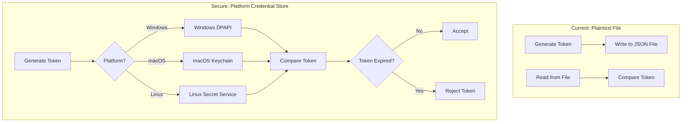
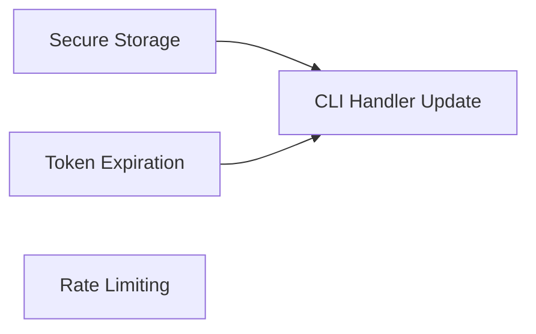

# CLI Token Security Plan

## Objective

Improve CLI token storage using Windows DPAPI/Credential Manager and add token expiration. This is a **P2 (Medium)** priority - currently tokens are stored in plaintext and never expire.

## Vulnerability Analysis

### Current State

From `electron/handlers/cli.ts`:

```typescript
// Lines 101-108: Token stored in plaintext file
fs.writeFileSync(tokenPath, content, { 
  encoding: 'utf-8',
  mode: 0o600 // Owner read/write only (IGNORED ON WINDOWS!)
})

// Lines 14-18: Token structure - no expiration
interface CliToken {
  token: string
  created_at: string
  user_email: string
  // No expires_at field!
}
```

### Security Concerns

1. **Plaintext Storage**: Token stored as readable JSON file
2. **Windows Permissions Ignored**: `mode: 0o600` has no effect on Windows
3. **No Expiration**: Tokens valid forever once created
4. **No Rate Limiting**: CLI server has no rate limits
5. **No Token Rotation**: Same token used indefinitely

### Current Token File Location

- Windows: `%APPDATA%\blueplm\cli-token.json`
- macOS/Linux: `~/.config/blueplm/cli-token.json`

### Risk Assessment

| Issue | Impact | Mitigation Effort |

|-------|--------|-------------------|

| Plaintext on Windows | Medium | Medium (DPAPI) |

| No expiration | Medium | Low |

| No rate limiting | Low | Low |

---

## Architecture



---

## Agent Overview

| Agent | Wave | Responsibility | Owns | Dependencies |

|-------|------|----------------|------|--------------|

| Secure Storage | 1 | Platform-specific credential storage | `electron/utils/secureStorage.ts` | None |

| Token Expiration | 1 | Token lifecycle management | `electron/utils/tokenManager.ts` | None |

| CLI Handler Update | 2 | Integrate secure storage into CLI | `electron/handlers/cli.ts` | Both Wave 1 |

| Rate Limiting | 2 | Add rate limits to CLI server | `electron/handlers/cli.ts` (server section) | None |

## Shared Files

| File | Owner | Rule |

|------|-------|------|

| `electron/utils/secureStorage.ts` | Secure Storage | Read-only after Wave 1 |

| `electron/utils/tokenManager.ts` | Token Expiration | Read-only after Wave 1 |

| `electron/handlers/cli.ts` | CLI Handler Update | Coordinate with Rate Limiting |

---

## Wave 1: Secure Storage Agent

### Prompt

> Create platform-specific secure credential storage for BluePLM with enterprise-level security.

>

> **Scope:**

> - Create `electron/utils/secureStorage.ts` with:

>   - `storeCredential(key, value)` - Store secret securely

>   - `retrieveCredential(key)` - Retrieve secret

>   - `deleteCredential(key)` - Remove secret

>   - Platform detection and appropriate storage backend

>

> **Platform Implementations:**

>

> **Windows (DPAPI via Electron safeStorage):**

> - Use Electron's `safeStorage.encryptString()` / `decryptString()`

> - Falls back to DPAPI under the hood

> - Store encrypted blob in file, decrypted only in memory

>

> **macOS (Keychain via Electron safeStorage):**

> - Same API, uses Keychain Services

>

> **Linux (Secret Service via Electron safeStorage):**

> - Same API, uses libsecret if available

> - Fallback to encrypted file if no secret service

>

> **Boundaries:**

> - OWNS: `electron/utils/secureStorage.ts`

> - Do NOT modify: cli.ts (Wave 2)

>

> **Quality Requirements:**

> - Use Electron's built-in safeStorage API (no external deps)

> - Graceful fallback if secure storage unavailable

> - Clear error handling for storage failures

> - Never log credential values

>

> **Deliverables:**

> - Secure storage utility

> - Report in `SECURE_STORAGE_REPORT.md`

>

> **When complete:** Demonstrate storing and retrieving a test credential.

### Boundary

- **OWNS (exclusive write):** `electron/utils/secureStorage.ts`
- **READS (no modify):** Electron safeStorage documentation

### Tasks

- [ ] Implement `storeCredential()` using safeStorage
- [ ] Implement `retrieveCredential()` with decryption
- [ ] Implement `deleteCredential()`
- [ ] Add `isSecureStorageAvailable()` check
- [ ] Implement fallback for unavailable secure storage
- [ ] Add TypeScript types
- [ ] Test on each platform
- [ ] Write completion report

### Deliverables

```typescript
// electron/utils/secureStorage.ts - Key exports
export interface SecureStorageResult {
  success: boolean
  error?: string
}

export function isSecureStorageAvailable(): boolean
export function storeCredential(key: string, value: string): SecureStorageResult
export function retrieveCredential(key: string): string | null
export function deleteCredential(key: string): SecureStorageResult
```

---

## Wave 1: Token Expiration Agent

### Prompt

> Create token lifecycle management with expiration for BluePLM CLI tokens.

>

> **Scope:**

> - Create `electron/utils/tokenManager.ts` with:

>   - `createToken(userEmail, expiresIn)` - Generate token with expiration

>   - `validateToken(token)` - Check if token is valid and not expired

>   - `refreshToken(token)` - Extend token expiration

>   - `revokeToken(token)` - Invalidate token

>   - Configurable expiration policies

>

> **Token Structure:**

> ```typescript

> interface ManagedToken {

>   token: string           // Random 32-byte hex

>   userEmail: string

>   createdAt: Date

>   expiresAt: Date

>   lastUsedAt?: Date

>   refreshCount: number    // Track how many times refreshed

> }

> ```

>

> **Expiration Policies:**

> - Default expiration: 24 hours

> - Max refresh count: 7 (one week of daily use)

> - Absolute max lifetime: 30 days

> - Idle timeout: 4 hours of no use

>

> **Boundaries:**

> - OWNS: `electron/utils/tokenManager.ts`

> - Do NOT modify: cli.ts (Wave 2)

>

> **Quality Requirements:**

> - Tokens are cryptographically random

> - Expiration checks are constant-time

> - Clear logging of token lifecycle events

> - Token validation doesn't leak timing information

>

> **Deliverables:**

> - Token manager utility

> - Report in `TOKEN_EXPIRATION_REPORT.md`

>

> **When complete:** Demonstrate token creation, validation, refresh, and expiration.

### Boundary

- **OWNS (exclusive write):** `electron/utils/tokenManager.ts`
- **READS (no modify):** None

### Tasks

- [ ] Define `ManagedToken` interface
- [ ] Implement `createToken()` with expiration
- [ ] Implement `validateToken()` with expiration check
- [ ] Implement `refreshToken()` with limits
- [ ] Implement `revokeToken()`
- [ ] Add expiration policy constants
- [ ] Implement idle timeout tracking
- [ ] Add logging for lifecycle events
- [ ] Write completion report

### Deliverables

```typescript
// electron/utils/tokenManager.ts - Key exports
export interface ManagedToken {
  token: string
  userEmail: string
  createdAt: Date
  expiresAt: Date
  lastUsedAt?: Date
  refreshCount: number
}

export interface TokenValidationResult {
  valid: boolean
  expired?: boolean
  reason?: 'expired' | 'idle_timeout' | 'max_lifetime' | 'revoked' | 'invalid'
}

export function createToken(userEmail: string, expiresInHours?: number): ManagedToken
export function validateToken(token: string, stored: ManagedToken): TokenValidationResult
export function refreshToken(stored: ManagedToken): ManagedToken | null
export function shouldRefresh(stored: ManagedToken): boolean
```

---

## Wave 2: CLI Handler Update Agent

### Prompt

> Integrate secure storage and token expiration into CLI handlers with enterprise-level security.

>

> **Scope:**

> - Update `electron/handlers/cli.ts`:

>   - Use `secureStorage` for token storage

>   - Use `tokenManager` for lifecycle management

>   - Add expiration checks to token validation

>   - Auto-refresh tokens on successful use

>   - Migration from old plaintext tokens

>

> **Migration Strategy:**

> 1. On startup, check for old plaintext token file

> 2. If found, validate and migrate to secure storage

> 3. Delete old plaintext file after successful migration

> 4. Add expiration to migrated tokens

>

> **Updated Flow:**

> 1. Generate token → Store securely with expiration

> 2. Validate token → Check signature AND expiration

> 3. On successful validation → Update lastUsedAt, consider refresh

> 4. On expiration → Return clear error, require re-auth

>

> **Boundaries:**

> - OWNS: `electron/handlers/cli.ts`

> - READS: `electron/utils/secureStorage.ts`, `electron/utils/tokenManager.ts`

>

> **Quality Requirements:**

> - Backwards compatible migration

> - No token leakage during migration

> - Clear error messages for expired tokens

> - Audit logging for token operations

>

> **Deliverables:**

> - Updated CLI handlers with secure storage

> - Migration from plaintext tokens

> - Report in `CLI_HANDLER_UPDATE_REPORT.md`

>

> **When complete:** Test full token lifecycle including migration.

### Boundary

- **OWNS (exclusive write):** `electron/handlers/cli.ts`
- **READS (no modify):** Secure storage and token manager utilities

### Tasks

- [ ] Import secure storage and token manager
- [ ] Update `generateCliToken()` to use secure storage
- [ ] Update token validation to check expiration
- [ ] Implement auto-refresh on successful validation
- [ ] Implement migration from plaintext tokens
- [ ] Update `revokeCliToken()` for secure storage
- [ ] Add expiration error responses
- [ ] Add audit logging
- [ ] Test complete lifecycle
- [ ] Write completion report

### Deliverables

- CLI handlers using secure storage and expiration
- Plaintext token migration

---

## Wave 2: Rate Limiting Agent

### Prompt

> Add rate limiting to the CLI server with enterprise-level protection.

>

> **Scope:**

> - Add rate limiting to CLI server in `electron/handlers/cli.ts`

> - Implement per-IP and per-token rate limits

> - Add exponential backoff for repeated failures

>

> **Rate Limits:**

> - Token validation: 10 requests per minute per IP

> - Failed auth: 5 attempts per minute, then exponential backoff

> - Command execution: 60 requests per minute per token

>

> **Implementation:**

> - In-memory rate limit tracking (resets on app restart)

> - Sliding window algorithm

> - Return 429 Too Many Requests with Retry-After header

>

> **Boundaries:**

> - OWNS: Rate limiting section of `electron/handlers/cli.ts`

> - Coordinate with: CLI Handler Update agent

>

> **Quality Requirements:**

> - Rate limits don't affect normal usage

> - Clear error messages with retry time

> - Logging of rate limit events

>

> **Deliverables:**

> - Rate limiting for CLI server

> - Report in `CLI_RATE_LIMITING_REPORT.md`

>

> **When complete:** Test rate limiting behavior.

### Boundary

- **OWNS (exclusive write):** Rate limiting section of cli.ts
- **Coordinate with:** CLI Handler Update agent

### Tasks

- [ ] Implement sliding window rate limiter
- [ ] Add per-IP tracking for auth attempts
- [ ] Add per-token tracking for commands
- [ ] Implement exponential backoff for failures
- [ ] Return proper 429 responses
- [ ] Add logging for rate limit events
- [ ] Test rate limiting
- [ ] Write completion report

### Deliverables

- Rate limiting for CLI server

---

## Execution Order



1. **Wave 1:** Secure Storage + Token Expiration in parallel
2. **Wave 2:** CLI Handler Update + Rate Limiting in parallel (coordinate on cli.ts)

---

## Success Criteria

- [ ] Tokens stored securely using platform credential store
- [ ] Tokens expire after configurable time
- [ ] Expired tokens rejected with clear error
- [ ] Old plaintext tokens migrated automatically
- [ ] Rate limiting prevents brute force
- [ ] CLI still works for legitimate use
- [ ] `npm run typecheck` passes