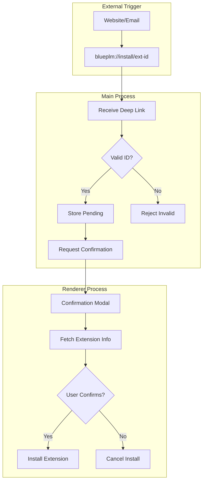
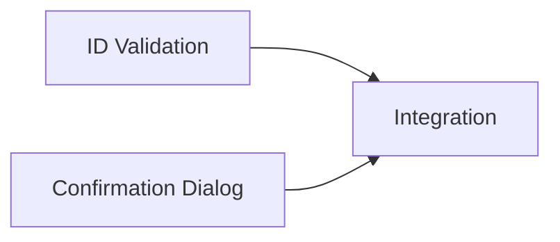

# Deep Link Confirmation Plan

## Objective

Add user confirmation dialog before processing deep link extension installs. This is a **P2 (Medium)** priority - currently any website can trigger `blueplm://install/{id}` without user confirmation.

## Vulnerability Analysis

### Current State

From `electron/handlers/deepLink.ts`:

```typescript
// Lines 95-119: Extension ID validation is lenient
if (extensionId && isValidExtensionId(extensionId)) {
  result.extensionId = extensionId
} else if (extensionId) {
  // Logs warning but STILL ACCEPTS potentially invalid ID
  deps?.log(`Deep link extension ID may be invalid: ${extensionId}`)
  result.extensionId = extensionId  // Accepted anyway!
}

// Lines 171-203: Sends install directly to renderer
mainWindow.webContents.send('deep-link:install-extension', {
  extensionId,
  version,
  timestamp: Date.now()
})
// No user confirmation before triggering install!
```

### Attack Scenario

1. User visits malicious website
2. Website triggers `blueplm://install/malicious-extension`
3. BluePLM opens and immediately starts installing
4. User may not realize what's happening
5. Malicious extension installed without explicit consent

### Current Deep Link Handling

| Step | Current Behavior | Recommended |
|------|-----------------|-------------|
| URL received | Parsed immediately | Parse and validate |
| ID validation | Lenient (accepts invalid) | Strict rejection |
| User confirmation | None | Required modal |
| Origin tracking | Not shown | Display in confirmation |
| Install trigger | Automatic | After confirmation |

---

## Architecture



---

## Agent Overview

| Agent | Wave | Responsibility | Owns | Dependencies |
|-------|------|----------------|------|--------------|
| ID Validation | 1 | Strict extension ID validation | `electron/handlers/deepLink.ts` (validation) | None |
| Confirmation Dialog | 1 | User confirmation UI component | `src/components/extensions/DeepLinkConfirmation.tsx` | None |
| Integration | 2 | Connect main process to confirmation UI | deepLink.ts + renderer integration | Both Wave 1 |

## Shared Files

| File | Owner | Rule |
|------|-------|------|
| `electron/handlers/deepLink.ts` | ID Validation + Integration | Coordinate changes |
| `src/components/extensions/DeepLinkConfirmation.tsx` | Confirmation Dialog | Exclusive |
| `src/features/extensions/hooks/useDeepLinkInstall.ts` | Integration | Exclusive |

---

## Wave 1: ID Validation Agent

### Prompt

> Implement strict extension ID validation for deep links with enterprise-level security.
>
> **Scope:**
> - Update `electron/handlers/deepLink.ts`:
>   - Make `isValidExtensionId()` strict (no lenient fallback)
>   - Reject deep links with invalid IDs immediately
>   - Add rate limiting for deep link processing
>   - Log rejected deep links for security audit
>
> **Strict Validation Rules:**
> - Must match pattern: `^[a-z0-9][a-z0-9_-]{1,62}[a-z0-9]$`
> - No special characters except hyphen and underscore
> - 3-64 characters
> - Cannot start/end with hyphen or underscore
> - Reject with clear error if invalid
>
> **Rate Limiting:**
> - Max 5 deep links per minute
> - Prevent rapid-fire installation attempts
>
> **Do NOT:**
> - Trigger installation yet (Wave 2)
> - Show UI yet (parallel agent)
>
> **Boundaries:**
> - OWNS: Validation logic in `electron/handlers/deepLink.ts`
> - Do NOT modify: Installation trigger (Wave 2)
>
> **Quality Requirements:**
> - Zero tolerance for invalid IDs
> - Clear rejection messages
> - Security audit logging
>
> **Deliverables:**
> - Strict ID validation
> - Rate limiting
> - Report in `DEEP_LINK_VALIDATION_REPORT.md`
>
> **When complete:** Test with valid and invalid extension IDs.

### Boundary

- **OWNS (exclusive write):** Validation section of deepLink.ts
- **Do NOT modify:** Installation trigger code

### Tasks

- [ ] Make `isValidExtensionId()` strict (remove fallback)
- [ ] Update `parseDeepLink()` to reject invalid IDs
- [ ] Add rate limiting for deep link processing
- [ ] Add security audit logging for rejections
- [ ] Test with various ID formats
- [ ] Write completion report

### Deliverables

- Strict ID validation with no lenient fallbacks
- Rate limiting for deep links

---

## Wave 1: Confirmation Dialog Agent

### Prompt

> Create user confirmation dialog for deep link extension installs with enterprise-level UX.
>
> **Scope:**
> - Create `src/components/extensions/DeepLinkConfirmation.tsx`:
>   - Modal dialog for confirming extension install
>   - Display extension name, publisher, description
>   - Show requested permissions
>   - Clear warning about external trigger
>   - Confirm and Cancel buttons
>
> **Dialog Content:**
> ```
> ┌─────────────────────────────────────────────┐
> │  ⚠️  Install Extension?                     │
> │─────────────────────────────────────────────│
> │  An external website wants to install:      │
> │                                             │
> │  [Icon] Extension Name                      │
> │  By: Publisher Name                         │
> │  "Short description of extension"           │
> │                                             │
> │  Requested Permissions:                     │
> │  • Read files from working directory        │
> │  • Make network requests                    │
> │                                             │
> │  ⚠️  Only install extensions you trust.    │
> │                                             │
> │        [Cancel]    [Install Extension]      │
> └─────────────────────────────────────────────┘
> ```
>
> **Extension Info Fetching:**
> - Fetch extension details from store API
> - Show loading state while fetching
> - Show error state if extension not found
>
> **Boundaries:**
> - OWNS: `src/components/extensions/DeepLinkConfirmation.tsx`
> - READS: Store API types
> - Do NOT modify: Deep link handlers (parallel agent)
>
> **Quality Requirements:**
> - Clear warning about external trigger
> - Cannot confirm without extension details loading
> - Accessible (keyboard navigation, screen reader)
> - Consistent with app design system
>
> **Deliverables:**
> - Confirmation dialog component
> - Report in `DEEP_LINK_CONFIRMATION_DIALOG_REPORT.md`
>
> **When complete:** Show component in isolation (Storybook or test page).

### Boundary

- **OWNS (exclusive write):** `src/components/extensions/DeepLinkConfirmation.tsx`
- **READS (no modify):** Store API, design system components

### Tasks

- [ ] Create modal component structure
- [ ] Add extension info display
- [ ] Add permissions display
- [ ] Add warning message about external trigger
- [ ] Implement loading state
- [ ] Implement error state
- [ ] Add confirm/cancel handlers
- [ ] Test accessibility
- [ ] Write completion report

### Deliverables

- Confirmation dialog component ready for integration

---

## Wave 2: Integration Agent

### Prompt

> Integrate deep link confirmation dialog with main process handlers.
>
> **Scope:**
> - Update `electron/handlers/deepLink.ts`:
>   - Store pending deep link instead of immediate trigger
>   - Send confirmation request to renderer
>   - Wait for user response before proceeding
> - Create `src/features/extensions/hooks/useDeepLinkInstall.ts`:
>   - Listen for deep link confirmation requests
>   - Show confirmation dialog
>   - Send user decision back to main process
> - Update app to include confirmation dialog
>
> **Updated Flow:**
> 1. Main process receives deep link
> 2. Validates extension ID (strict)
> 3. Stores pending deep link with timestamp
> 4. Sends IPC: `deep-link:confirm-install` with extensionId
> 5. Renderer shows confirmation dialog
> 6. User confirms or cancels
> 7. Renderer sends IPC: `deep-link:confirm-response`
> 8. Main process proceeds or cancels based on response
>
> **IPC Messages:**
> - `deep-link:confirm-install` → { extensionId, version, timestamp }
> - `deep-link:confirm-response` → { extensionId, confirmed: boolean }
> - `deep-link:install-extension` → Only sent AFTER confirmation
>
> **Timeout Handling:**
> - If no response in 60 seconds, cancel pending install
> - Clear pending on window close
>
> **Boundaries:**
> - OWNS: Integration code in deepLink.ts, useDeepLinkInstall.ts
> - READS: Confirmation dialog component, validation logic
>
> **Quality Requirements:**
> - Installation NEVER proceeds without explicit confirmation
> - Pending state handled across window lifecycle
> - Clear audit trail of user decisions
>
> **Deliverables:**
> - Complete deep link confirmation flow
> - Report in `DEEP_LINK_INTEGRATION_REPORT.md`
>
> **When complete:** Test end-to-end flow from external deep link to confirmed install.

### Boundary

- **OWNS (exclusive write):** Integration code, useDeepLinkInstall hook
- **READS (no modify):** Validation logic, confirmation dialog

### Tasks

- [ ] Update deepLink.ts to store pending instead of trigger
- [ ] Add `deep-link:confirm-install` IPC message
- [ ] Create useDeepLinkInstall hook
- [ ] Integrate confirmation dialog in app
- [ ] Add `deep-link:confirm-response` handler
- [ ] Implement timeout handling
- [ ] Add audit logging for user decisions
- [ ] Test end-to-end flow
- [ ] Write completion report

### Deliverables

- Complete confirmation flow from deep link to install

---

## Execution Order



1. **Wave 1:** ID Validation + Confirmation Dialog in parallel
2. **Wave 2:** Integration (combines both)

---

## Success Criteria

- [ ] Extension IDs strictly validated (no lenient fallback)
- [ ] Rate limiting prevents rapid deep link abuse
- [ ] Confirmation dialog shown for ALL deep link installs
- [ ] User must explicitly confirm before install proceeds
- [ ] Extension details and permissions displayed
- [ ] Warning about external trigger clearly shown
- [ ] Timeout handling for abandoned confirmations
- [ ] `npm run typecheck` passes
