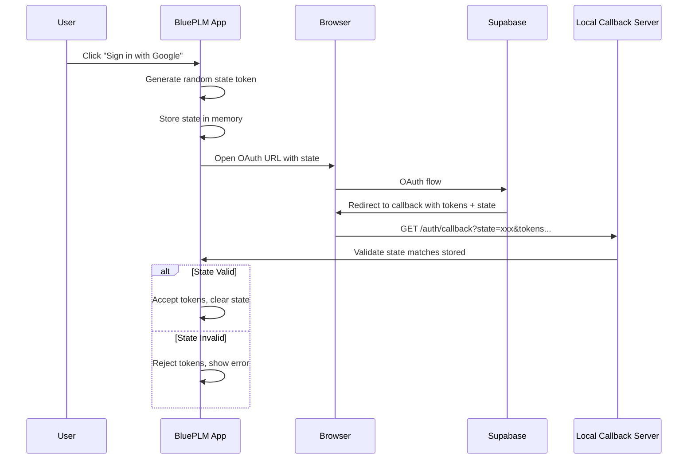
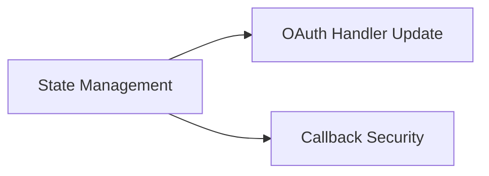

# OAuth CSRF Protection Plan

## Objective

Implement OAuth state parameter validation to prevent Cross-Site Request Forgery (CSRF) attacks during authentication. This is a **P2 (Medium)** priority - currently the OAuth callback accepts any tokens without verifying they originated from a legitimate auth request.

## Vulnerability Analysis

### Current State

From `electron/handlers/oauth.ts`:

```typescript
// Lines 61-100: Callback server accepts tokens without state validation
const server = http.createServer((req, res) => {
  // ...
  if (accessToken && refreshToken) {
    // Tokens accepted without any CSRF protection!
    mainWindow?.webContents.send('auth:set-session', {
      access_token: accessToken,
      refresh_token: refreshToken,
      // ...
    })
  }
})
```

### Attack Scenario

1. Attacker initiates OAuth flow on their own account
2. Attacker obtains callback URL with their tokens
3. Attacker tricks victim into visiting: `http://127.0.0.1:{port}/auth/callback?access_token=ATTACKER_TOKEN`
4. Victim's app now uses attacker's session
5. Attacker can see victim's activity or inject malicious data

### OAuth Security Best Practices

| Practice | Current | Recommended |
|----------|---------|-------------|
| State parameter | Missing | Required |
| State validation | N/A | Server-side check |
| State entropy | N/A | 32 bytes random |
| PKCE | Missing | Recommended |
| Callback timeout | 5 minutes | 2-3 minutes |

---

## Architecture



---

## Agent Overview

| Agent | Wave | Responsibility | Owns | Dependencies |
|-------|------|----------------|------|--------------|
| State Management | 1 | Generate and validate state tokens | `electron/utils/oauthState.ts` | None |
| OAuth Handler Update | 2 | Integrate state validation | `electron/handlers/oauth.ts` | State Management |
| Callback Security | 2 | Additional callback hardening | `electron/handlers/oauth.ts` (callback section) | State Management |

## Shared Files

| File | Owner | Rule |
|------|-------|------|
| `electron/utils/oauthState.ts` | State Management | Read-only after Wave 1 |
| `electron/handlers/oauth.ts` | OAuth Handler Update + Callback Security | Coordinate changes |

---

## Wave 1: State Management Agent

### Prompt

> Create OAuth state token management for CSRF protection with enterprise-level security.
>
> **Scope:**
> - Create `electron/utils/oauthState.ts` with:
>   - `generateState()` - Create cryptographically random state token
>   - `storeState(state, metadata)` - Store state with expiration
>   - `validateAndConsumeState(state)` - Validate and remove (one-time use)
>   - `clearExpiredStates()` - Cleanup old states
>
> **State Token Requirements:**
> - 32 bytes of cryptographically random data
> - Base64url encoded for URL safety
> - One-time use (consumed on validation)
> - Short expiration (3 minutes)
> - Store associated metadata (provider, timestamp)
>
> **State Storage:**
> - In-memory Map (states don't survive restart - that's OK)
> - Automatic expiration cleanup
> - Maximum concurrent states limit (prevent memory exhaustion)
>
> **Boundaries:**
> - OWNS: `electron/utils/oauthState.ts`
> - Do NOT modify: oauth.ts (Wave 2)
>
> **Quality Requirements:**
> - Cryptographically secure random generation
> - Constant-time comparison for validation
> - Clear logging for security audit
> - No state token leakage in logs
>
> **Deliverables:**
> - State management utility
> - Report in `OAUTH_STATE_REPORT.md`
>
> **When complete:** Demonstrate state generation, storage, and validation.

### Boundary

- **OWNS (exclusive write):** `electron/utils/oauthState.ts`
- **READS (no modify):** None

### Tasks

- [ ] Implement `generateState()` with crypto.randomBytes
- [ ] Implement state storage with expiration
- [ ] Implement `validateAndConsumeState()` with timing-safe compare
- [ ] Add expiration cleanup mechanism
- [ ] Add maximum states limit
- [ ] Add logging for state lifecycle
- [ ] Add TypeScript types
- [ ] Write completion report

### Deliverables

```typescript
// electron/utils/oauthState.ts - Key exports
export interface StateMetadata {
  provider: 'supabase' | 'google'
  createdAt: Date
  expiresAt: Date
}

export interface StateValidationResult {
  valid: boolean
  metadata?: StateMetadata
  error?: 'NOT_FOUND' | 'EXPIRED' | 'ALREADY_USED'
}

export function generateState(): string
export function storeState(state: string, provider: 'supabase' | 'google'): void
export function validateAndConsumeState(state: string): StateValidationResult
export function clearExpiredStates(): number  // Returns count of cleared
```

---

## Wave 2: OAuth Handler Update Agent

### Prompt

> Integrate state parameter validation into OAuth handlers with enterprise-level security.
>
> **Scope:**
> - Update `electron/handlers/oauth.ts`:
>   - Generate state before opening OAuth URL
>   - Include state in OAuth redirect URL
>   - Validate state in callback handler
>   - Reject callbacks with missing/invalid state
>
> **Updated Flow for Supabase OAuth:**
> 1. Generate state token
> 2. Store state with metadata
> 3. Append `&state={state}` to OAuth URL
> 4. Open browser with URL
> 5. On callback, extract state from query params
> 6. Validate state matches stored
> 7. If valid: accept tokens
> 8. If invalid: reject and show error
>
> **Updated Flow for Google Drive OAuth:**
> - Same pattern, include state in auth URL
> - Validate state in callback
>
> **Boundaries:**
> - OWNS: Main OAuth handler code in `electron/handlers/oauth.ts`
> - READS: `electron/utils/oauthState.ts` (do not modify)
> - Coordinate with: Callback Security agent
>
> **Quality Requirements:**
> - State MUST be validated before accepting ANY tokens
> - Clear error message for CSRF detection
> - Log CSRF attempts for security audit
> - Backwards compatible (don't break if state missing during transition)
>
> **Deliverables:**
> - OAuth handlers with state validation
> - Report in `OAUTH_HANDLER_UPDATE_REPORT.md`
>
> **When complete:** Test OAuth flow with state validation.

### Boundary

- **OWNS (exclusive write):** Main OAuth handler code
- **READS (no modify):** State management utility
- **Coordinate with:** Callback Security agent

### Tasks

- [ ] Import state management utilities
- [ ] Update Supabase OAuth to generate state
- [ ] Update Supabase OAuth URL to include state
- [ ] Update Supabase callback to validate state
- [ ] Update Google Drive OAuth to generate state
- [ ] Update Google Drive OAuth URL to include state
- [ ] Update Google Drive callback to validate state
- [ ] Add CSRF detection logging
- [ ] Test complete OAuth flows
- [ ] Write completion report

### Deliverables

- OAuth handlers with CSRF protection via state parameter

---

## Wave 2: Callback Security Agent

### Prompt

> Harden OAuth callback server with additional security measures.
>
> **Scope:**
> - Update callback server in `electron/handlers/oauth.ts`:
>   - Add Content Security Policy to callback HTML
>   - Reduce callback timeout from 5 to 3 minutes
>   - Add request origin validation
>   - Sanitize error messages (no token leakage)
>
> **CSP for Callback Pages:**
> ```
> default-src 'none';
> style-src 'unsafe-inline';
> script-src 'unsafe-inline';  // Required for hash extraction
> img-src data:;
> ```
>
> **Additional Hardening:**
> - Only accept GET requests
> - Reject requests with unexpected query params
> - Rate limit callback attempts
> - Clear, non-technical error messages
>
> **Boundaries:**
> - OWNS: Callback server and HTML templates in oauth.ts
> - READS: State management utility
> - Coordinate with: OAuth Handler Update agent
>
> **Quality Requirements:**
> - CSP prevents XSS in callback pages
> - No sensitive data in error pages
> - Callback timeout reduced
>
> **Deliverables:**
> - Hardened callback server
> - Report in `CALLBACK_SECURITY_REPORT.md`
>
> **When complete:** Test callback security measures.

### Boundary

- **OWNS (exclusive write):** Callback server and HTML templates
- **READS (no modify):** State management utility
- **Coordinate with:** OAuth Handler Update agent

### Tasks

- [ ] Add CSP headers to callback responses
- [ ] Reduce callback timeout to 3 minutes
- [ ] Add request method validation (GET only)
- [ ] Sanitize error messages
- [ ] Add rate limiting for callback attempts
- [ ] Update HTML templates with CSP-compatible code
- [ ] Test callback hardening
- [ ] Write completion report

### Deliverables

- Hardened callback server with CSP and reduced timeout

---

## Execution Order



1. **Wave 1:** State Management (foundation)
2. **Wave 2:** OAuth Handler Update + Callback Security in parallel (coordinate on oauth.ts)

---

## Success Criteria

- [ ] State parameter generated for all OAuth flows
- [ ] State validated before accepting tokens
- [ ] CSRF attempts detected and logged
- [ ] Callback pages have CSP headers
- [ ] Callback timeout reduced to 3 minutes
- [ ] OAuth still works for legitimate users
- [ ] `npm run typecheck` passes
