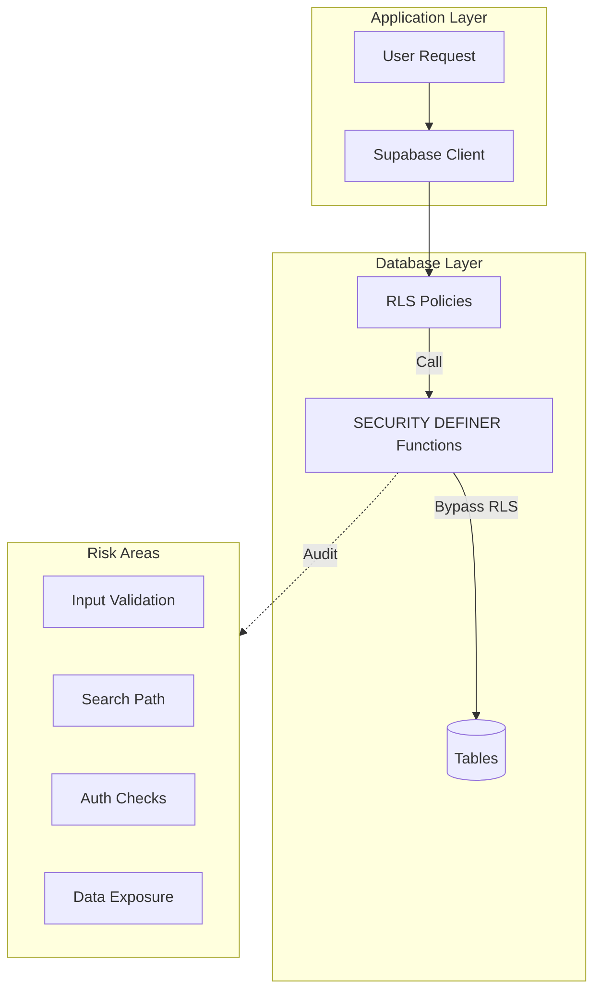
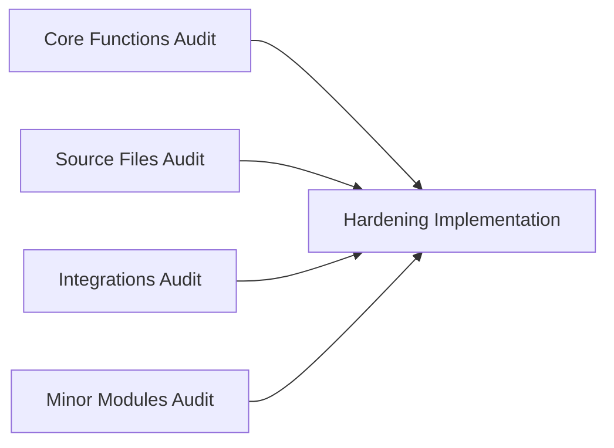

# RLS & SECURITY DEFINER Audit Plan

## Objective

Audit all 71 SECURITY DEFINER database functions for privilege escalation vulnerabilities. This is a **P3 (Medium)** priority - SECURITY DEFINER functions bypass RLS and must be carefully audited to prevent privilege escalation.

## Vulnerability Analysis

### Current State

The database schema contains 71 functions with SECURITY DEFINER:

```sql
-- Example from core.sql - this function runs as the DEFINING user, not the caller
CREATE OR REPLACE FUNCTION is_org_admin(p_org_id UUID)
RETURNS BOOLEAN
SECURITY DEFINER  -- Runs with elevated privileges!
AS $$
  -- If this function has bugs, attacker could gain admin access
$$;
```

### SECURITY DEFINER Distribution

| SQL File | Count | Risk Level |
|----------|-------|------------|
| `supabase/core.sql` | 33 | High (core permissions) |
| `supabase/modules/10-source-files.sql` | 15 | Medium (file operations) |
| `supabase/modules/40-integrations.sql` | 12 | Medium (external access) |
| `supabase/modules/20-change-control.sql` | 6 | Low (workflow logic) |
| `supabase/modules/50-extensions.sql` | 5 | Low (extension registry) |

### Common SECURITY DEFINER Vulnerabilities

1. **Missing Input Validation**: SQL injection through parameters
2. **Search Path Injection**: Unqualified function/table references
3. **Excessive Privileges**: Function does more than needed
4. **Missing Authorization Checks**: Doesn't verify caller's permissions
5. **Information Disclosure**: Returns data caller shouldn't see
6. **TOCTOU Race Conditions**: Time-of-check vs time-of-use bugs

### High-Risk Functions to Audit

| Function | Location | Risk | Reason |
|----------|----------|------|--------|
| `is_org_admin()` | core.sql | Critical | Used in many RLS policies |
| `is_org_member()` | core.sql | Critical | Used in many RLS policies |
| `user_has_permission()` | core.sql | Critical | Permission gate |
| `user_has_team_permission()` | core.sql | High | Team permission gate |
| `get_user_org_id()` | core.sql | High | Org context determination |
| `create_file_share_link()` | source-files.sql | High | Creates shareable links |
| `validate_share_link()` | source-files.sql | High | Validates access tokens |

---

## Architecture



---

## Agent Overview

| Agent | Wave | Responsibility | Owns | Dependencies |
|-------|------|----------------|------|--------------|
| Core Functions Audit | 1 | Audit core.sql SECURITY DEFINER functions | Audit report + fixes | None |
| Source Files Audit | 1 | Audit 10-source-files.sql functions | Audit report + fixes | None |
| Integrations Audit | 2 | Audit 40-integrations.sql functions | Audit report + fixes | None |
| Minor Modules Audit | 2 | Audit 20-change-control + 50-extensions | Audit report + fixes | None |
| Hardening Implementation | 3 | Apply all identified fixes | SQL migration files | All audits |

## Shared Files

| File | Owner | Rule |
|------|-------|------|
| `supabase/core.sql` | Core Functions Audit → Hardening | Read during audit, write during hardening |
| `supabase/modules/*.sql` | Respective audit agents → Hardening | Same pattern |
| Audit report template | All agents | Follow same format |

---

## Audit Checklist Template

Each agent must check every SECURITY DEFINER function against this checklist:

```markdown
### Function: `function_name()`

**Location:** file.sql:line
**Purpose:** Brief description

#### Security Checklist
- [ ] **Input Validation**: All parameters validated/sanitized
- [ ] **Search Path**: Uses explicit schema qualifiers (public.table, not just table)
- [ ] **Authorization**: Verifies caller has permission for requested action
- [ ] **Minimal Privileges**: Only accesses data needed for function purpose
- [ ] **No SQL Injection**: No dynamic SQL, or properly parameterized
- [ ] **No Information Leak**: Error messages don't expose sensitive data
- [ ] **SET search_path**: Function sets search_path explicitly

#### Issues Found
- Issue 1: Description
- Issue 2: Description

#### Recommended Fixes
- Fix 1: Code change
- Fix 2: Code change

#### Risk Rating: LOW / MEDIUM / HIGH / CRITICAL
```

---

## Wave 1: Core Functions Audit Agent

### Prompt

> Audit all SECURITY DEFINER functions in supabase/core.sql for security vulnerabilities.
>
> **Scope:**
> - Audit all 33 SECURITY DEFINER functions in core.sql
> - Focus especially on permission-checking functions used by RLS:
>   - `is_org_admin()`
>   - `is_org_member()`
>   - `user_has_permission()`
>   - `user_has_team_permission()`
>   - `get_user_org_id()`
>   - `get_user_permissions()`
> - Use the audit checklist for each function
> - Document all issues and recommended fixes
>
> **Key Questions for Each Function:**
> 1. Could a malicious user manipulate parameters to gain unauthorized access?
> 2. Does the function properly verify the caller's identity?
> 3. Are all table/function references schema-qualified?
> 4. Does `SET search_path = public, pg_temp` appear?
> 5. Could SQL injection occur?
>
> **Boundaries:**
> - OWNS: Audit report for core.sql
> - Do NOT modify SQL yet (Wave 3 does fixes)
>
> **Quality Requirements:**
> - Complete audit of every SECURITY DEFINER function
> - Clear documentation of issues
> - Severity ratings for each issue
> - Specific fix recommendations
>
> **Deliverables:**
> - Detailed audit report
> - Report in `CORE_FUNCTIONS_AUDIT_REPORT.md`
>
> **When complete:** Summarize critical and high-severity issues found.

### Boundary

- **OWNS (exclusive write):** Audit report only
- **READS (no modify):** `supabase/core.sql`

### Tasks

- [ ] List all SECURITY DEFINER functions in core.sql
- [ ] Audit permission-checking functions (is_org_admin, etc.)
- [ ] Audit user context functions (get_user_org_id, etc.)
- [ ] Audit utility functions
- [ ] Check for search_path issues
- [ ] Check for SQL injection vectors
- [ ] Document all issues with severity
- [ ] Write completion report

### Deliverables

- Complete audit report for core.sql
- Prioritized list of issues to fix

---

## Wave 1: Source Files Audit Agent

### Prompt

> Audit all SECURITY DEFINER functions in supabase/modules/10-source-files.sql for security vulnerabilities.
>
> **Scope:**
> - Audit all 15 SECURITY DEFINER functions in source-files.sql
> - Focus especially on:
>   - `create_file_share_link()` - Creates shareable access tokens
>   - `validate_share_link()` - Validates share tokens
>   - `increment_file_version()` - Modifies file metadata
>   - Backup-related functions
> - Use the audit checklist for each function
>
> **Key Questions:**
> 1. Could an attacker create share links to files they shouldn't access?
> 2. Could an attacker validate a share link for unauthorized access?
> 3. Are file permissions properly checked before operations?
>
> **Boundaries:**
> - OWNS: Audit report for source-files.sql
> - Do NOT modify SQL yet (Wave 3 does fixes)
>
> **Quality Requirements:**
> - Same as Core Functions Audit
>
> **Deliverables:**
> - Detailed audit report
> - Report in `SOURCE_FILES_AUDIT_REPORT.md`
>
> **When complete:** Summarize critical and high-severity issues found.

### Boundary

- **OWNS (exclusive write):** Audit report only
- **READS (no modify):** `supabase/modules/10-source-files.sql`

### Tasks

- [ ] List all SECURITY DEFINER functions
- [ ] Audit share link functions
- [ ] Audit file operation functions
- [ ] Audit backup functions
- [ ] Check for search_path issues
- [ ] Check for authorization bypasses
- [ ] Document all issues with severity
- [ ] Write completion report

### Deliverables

- Complete audit report for source-files.sql

---

## Wave 2: Integrations Audit Agent

### Prompt

> Audit all SECURITY DEFINER functions in supabase/modules/40-integrations.sql for security vulnerabilities.
>
> **Scope:**
> - Audit all 12 SECURITY DEFINER functions in integrations.sql
> - Focus especially on:
>   - Credential access functions
>   - Integration status functions
>   - OAuth-related functions
> - Use the audit checklist for each function
>
> **Key Questions:**
> 1. Could credentials be exposed to unauthorized users?
> 2. Could an attacker access another org's integrations?
> 3. Are integration settings properly protected?
>
> **Boundaries:**
> - OWNS: Audit report for integrations.sql
> - Do NOT modify SQL yet (Wave 3 does fixes)
>
> **Quality Requirements:**
> - Same as Core Functions Audit
>
> **Deliverables:**
> - Detailed audit report
> - Report in `INTEGRATIONS_AUDIT_REPORT.md`
>
> **When complete:** Summarize critical and high-severity issues found.

### Boundary

- **OWNS (exclusive write):** Audit report only
- **READS (no modify):** `supabase/modules/40-integrations.sql`

### Tasks

- [ ] List all SECURITY DEFINER functions
- [ ] Audit credential access functions
- [ ] Audit integration status functions
- [ ] Check for cross-org access issues
- [ ] Document all issues with severity
- [ ] Write completion report

### Deliverables

- Complete audit report for integrations.sql

---

## Wave 2: Minor Modules Audit Agent

### Prompt

> Audit SECURITY DEFINER functions in 20-change-control.sql and 50-extensions.sql.
>
> **Scope:**
> - Audit 6 functions in change-control.sql
> - Audit 5 functions in extensions.sql
> - Use the audit checklist for each function
>
> **Boundaries:**
> - OWNS: Audit reports for both files
> - Do NOT modify SQL yet (Wave 3 does fixes)
>
> **Deliverables:**
> - Audit reports for both modules
> - Report in `MINOR_MODULES_AUDIT_REPORT.md`
>
> **When complete:** Summarize issues found.

### Boundary

- **OWNS (exclusive write):** Audit reports only
- **READS (no modify):** `20-change-control.sql`, `50-extensions.sql`

### Tasks

- [ ] Audit change-control functions
- [ ] Audit extensions functions
- [ ] Document all issues
- [ ] Write completion report

### Deliverables

- Audit reports for minor modules

---

## Wave 3: Hardening Implementation Agent

### Prompt

> Implement all security fixes identified in the SECURITY DEFINER audits.
>
> **Scope:**
> - Review all audit reports from Wave 1 and 2
> - Create SQL migration to fix all identified issues
> - Prioritize fixes by severity (CRITICAL → HIGH → MEDIUM → LOW)
> - Add `SET search_path = public` to all functions
> - Add schema qualifiers to all table/function references
> - Fix authorization check issues
> - Fix input validation issues
>
> **Common Fixes:**
> ```sql
> -- Add search_path setting
> CREATE OR REPLACE FUNCTION function_name()
> RETURNS ...
> SECURITY DEFINER
> SET search_path = public  -- ADD THIS
> AS $$
>   -- Use qualified names: public.table_name, not just table_name
> $$;
> ```
>
> **Boundaries:**
> - OWNS: SQL migration files for fixes
> - READS: All audit reports
>
> **Quality Requirements:**
> - All CRITICAL issues must be fixed
> - All HIGH issues must be fixed
> - Changes must be backwards compatible
> - Each fix must be tested
>
> **Deliverables:**
> - SQL migration with all fixes
> - Test results
> - Report in `HARDENING_IMPLEMENTATION_REPORT.md`
>
> **When complete:** Verify all functions pass the security checklist.

### Boundary

- **OWNS (exclusive write):** SQL migration files
- **READS (no modify):** Audit reports

### Tasks

- [ ] Review all audit reports
- [ ] Prioritize fixes by severity
- [ ] Create migration for core.sql fixes
- [ ] Create migration for source-files.sql fixes
- [ ] Create migration for integrations.sql fixes
- [ ] Create migration for minor modules fixes
- [ ] Test each fix
- [ ] Verify backwards compatibility
- [ ] Write completion report

### Deliverables

- SQL migrations fixing all identified issues
- Verification that all functions pass security checklist

---

## Execution Order



1. **Wave 1:** Core Functions + Source Files audits in parallel
2. **Wave 2:** Integrations + Minor Modules audits in parallel
3. **Wave 3:** Hardening Implementation (consolidates all fixes)

---

## Success Criteria

- [ ] All 71 SECURITY DEFINER functions audited
- [ ] All functions have `SET search_path = public`
- [ ] All table/function references are schema-qualified
- [ ] All authorization check issues fixed
- [ ] All input validation issues fixed
- [ ] No SQL injection vulnerabilities
- [ ] Audit reports document all issues and fixes
- [ ] Database migrations tested and verified
- [ ] `npm run typecheck` passes (if TypeScript changes needed)
