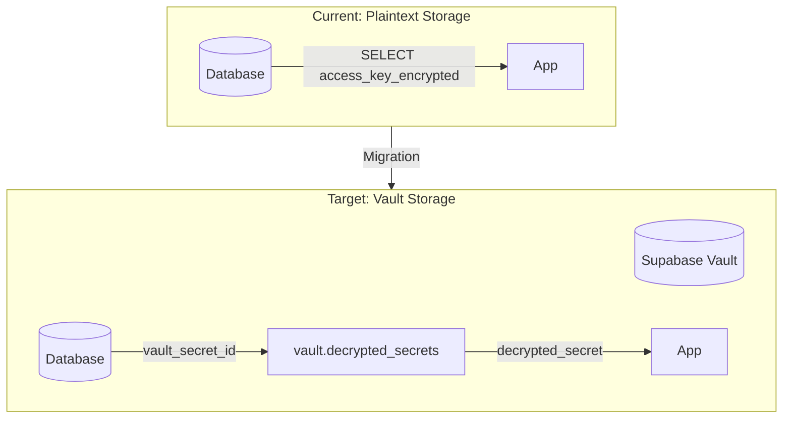
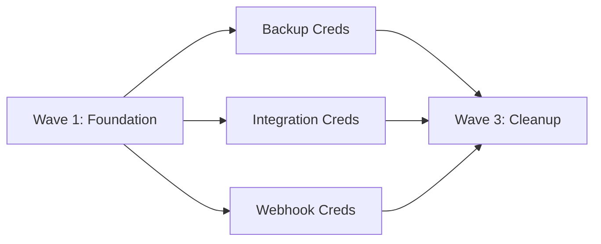

# Supabase Vault Credential Migration Plan

## Objective

Encrypt all user-entered secrets at rest using Supabase Vault. Currently, 12+ credential columns across 6 tables store sensitive data in plaintext (despite `_encrypted` suffixes). This plan migrates them to Vault with zero-downtime and backwards-compatible migration.

## Architecture Overview

## Credential Inventory

| Table | Credential Columns | Priority |

|-------|-------------------|----------|

| `backup_config` | `access_key_encrypted`, `secret_key_encrypted`, `restic_password_encrypted` | High |

| `odoo_saved_configs` | `api_key_encrypted` | High |

| `woocommerce_saved_configs` | `consumer_key_encrypted`, `consumer_secret_encrypted` | High |

| `organizations` | `google_drive_client_secret` | High |

| `organization_integrations` | `credentials_encrypted` | High |

| `webhooks` | `secret` | Medium |

## Wave Structure

### Wave 1: Foundation (Sequential - 1 Agent)

Set up Vault infrastructure, helper functions, and migration framework.

### Wave 2: Credential Migration (Parallel - 3 Agents)

Migrate each credential type simultaneously with isolated ownership.

### Wave 3: Cleanup (Sequential - 1 Agent)

Remove deprecated columns, update documentation.

---

## Agent Overview

| Agent | Wave | Responsibility | Owns | Dependencies |

|-------|------|----------------|------|--------------|

| Foundation | 1 | Vault setup, helper functions | `supabase/core.sql` (Vault section), `src/lib/vault.ts` | None |

| Backup Creds | 2 | Backup S3/B2/restic credentials | `src/features/source/backup/*`, `src/lib/backup.ts` | Foundation |

| Integration Creds | 2 | Odoo, WooCommerce, Google Drive, generic integrations | `src/features/integrations/*` | Foundation |

| Webhook Creds | 2 | Webhook signing secrets | `src/features/settings/webhooks/*` | Foundation |

| Cleanup | 3 | Remove old columns, final verification | Schema migration only | All Wave 2 |

## Shared Files

| File | Owner | Rule |

|------|-------|------|

| `supabase/core.sql` (Vault section) | Foundation | All agents read, only Foundation writes Vault section |

| `src/lib/vault.ts` | Foundation | Read-only after Wave 1 complete |

| `src/types/supabase.ts` | Cleanup | Regenerated after schema changes |

---

## Wave 1: Foundation Agent

### Prompt

> Implement Supabase Vault infrastructure for BluePLM with enterprise-level code quality.

>

> **Scope:**

> - Add Vault section to `supabase/core.sql` with:

>   - Enable `vault` extension if not exists

>   - Helper function `store_secret(name, secret, description)` that inserts into `vault.secrets`

>   - Helper function `get_secret(secret_id)` that reads from `vault.decrypted_secrets`

>   - Helper function `delete_secret(secret_id)`

>   - Helper function `update_secret(secret_id, new_secret)`

>   - All functions should be `SECURITY DEFINER` with proper RLS checks

> - Create `src/lib/vault.ts` with TypeScript wrappers for calling these functions via Supabase RPC

> - Add migration columns to credential tables (in their respective module files)

>

> **Boundaries:**

> - OWNS: `supabase/core.sql` (Vault section only), `src/lib/vault.ts`

> - Do NOT modify: Any existing credential handling code (Wave 2 agents will do this)

>

> **Quality Requirements:**

> - Enterprise-level code quality and organization

> - Proper TypeScript types (no `any`)

> - Error handling for Vault operations (secret not found, permission denied)

> - Idempotent SQL (safe to run multiple times)

>

> **Deliverables:**

> - Working Vault helper functions in SQL

> - TypeScript wrapper in `src/lib/vault.ts`

> - Report in `FOUNDATION_AGENT_REPORT.md`

>

> **When complete:** Verify functions work by testing in Supabase SQL editor.

### Boundary

- **OWNS (exclusive write):** `supabase/core.sql` (Vault section), `src/lib/vault.ts`
- **READS (no modify):** `supabase/modules/40-integrations.sql`, `supabase/modules/10-source-files.sql`

### Tasks

- [ ] Enable Vault extension in `supabase/core.sql`
- [ ] Create `store_secret()` function with RLS checks
- [ ] Create `get_secret()` function with RLS checks
- [ ] Create `update_secret()` function
- [ ] Create `delete_secret()` function
- [ ] Add `*_vault_id` columns to credential tables (in respective module files)
- [ ] Create TypeScript wrapper `src/lib/vault.ts`
- [ ] Test functions in Supabase SQL editor
- [ ] Write completion report

### Deliverables

- Vault section in `supabase/core.sql` - Vault helper functions (alongside RLS, other core infrastructure)
- `src/lib/vault.ts` - TypeScript wrapper
- New columns: `backup_config.access_key_vault_id`, `backup_config.secret_key_vault_id`, `backup_config.restic_password_vault_id`, etc.

---

## Wave 2: Backup Credentials Agent

### Prompt

> Migrate backup credentials (S3/B2/Restic) to Supabase Vault with enterprise-level code quality.

>

> **Scope:**

> - Update `src/lib/backup.ts` to use Vault functions for storing/retrieving credentials

> - Update `src/features/source/backup/hooks/useBackupConfig.ts` to work with Vault

> - Create migration logic: on save, store in Vault and save `vault_id`; on load, decrypt from Vault

> - Handle migration of existing plaintext credentials to Vault on first access

>

> **Boundaries:**

> - OWNS: `src/lib/backup.ts`, `src/features/source/backup/*`

> - READS: `src/lib/vault.ts` (do not modify)

> - Do NOT modify: Other integration code, Vault SQL functions

>

> **Quality Requirements:**

> - Enterprise-level code quality and organization

> - Backwards compatible: existing plaintext creds migrate automatically

> - Error handling: graceful fallback if Vault unavailable

> - No credentials should ever be logged or exposed in error messages

>

> **Deliverables:**

> - Updated backup credential handling using Vault

> - Report in `BACKUP_CREDS_AGENT_REPORT.md`

>

> **When complete:** Test backup configuration save/load with real S3 credentials.

### Boundary

- **OWNS (exclusive write):** `src/lib/backup.ts`, `src/features/source/backup/*`
- **READS (no modify):** `src/lib/vault.ts`, `supabase/core.sql` (Vault section)

### Tasks

- [ ] Update `saveBackupConfig()` to store credentials in Vault
- [ ] Update `getBackupConfig()` to retrieve and decrypt from Vault
- [ ] Add migration logic for existing plaintext credentials
- [ ] Update `useBackupConfig.ts` hook
- [ ] Update Electron handler `electron/handlers/backup.ts` if needed
- [ ] Test save/load cycle
- [ ] Write completion report

### Deliverables

- Vault-integrated backup credential handling
- Automatic migration of existing plaintext credentials

---

## Wave 2: Integration Credentials Agent

### Prompt

> Migrate integration credentials (Odoo, WooCommerce, Google Drive, generic) to Supabase Vault with enterprise-level code quality.

>

> **Scope:**

> - Update Odoo integration to use Vault for `api_key_encrypted`

> - Update WooCommerce integration to use Vault for `consumer_key_encrypted`, `consumer_secret_encrypted`

> - Update Google Drive integration to use Vault for `google_drive_client_secret`

> - Update generic `organization_integrations.credentials_encrypted` handling

>

> **Boundaries:**

> - OWNS: `src/features/integrations/*` (all integration code)

> - READS: `src/lib/vault.ts` (do not modify)

> - Do NOT modify: Backup code, webhook code, Vault SQL functions

>

> **Quality Requirements:**

> - Enterprise-level code quality and organization

> - Backwards compatible migration

> - Consistent pattern across all integrations

> - No credentials in logs or error messages

>

> **Deliverables:**

> - All integration credentials stored in Vault

> - Report in `INTEGRATION_CREDS_AGENT_REPORT.md`

>

> **When complete:** Test each integration type (Odoo, WooCommerce, Google Drive) save/load.

### Boundary

- **OWNS (exclusive write):** `src/features/integrations/*`, integration-related hooks
- **READS (no modify):** `src/lib/vault.ts`, `supabase/core.sql` (Vault section)

### Tasks

- [ ] Update Odoo credential handling
- [ ] Update WooCommerce credential handling  
- [ ] Update Google Drive client secret handling
- [ ] Update generic integration credentials handling
- [ ] Add migration logic for each integration type
- [ ] Test each integration save/load
- [ ] Write completion report

### Deliverables

- Vault-integrated credential handling for all 4 integration types

---

## Wave 2: Webhook Credentials Agent

### Prompt

> Migrate webhook signing secrets to Supabase Vault with enterprise-level code quality.

>

> **Scope:**

> - Update webhook handling to use Vault for `webhooks.secret`

> - Ensure webhook signature verification still works with Vault-stored secrets

>

> **Boundaries:**

> - OWNS: `src/features/settings/webhooks/*`, webhook-related code

> - READS: `src/lib/vault.ts` (do not modify)

> - Do NOT modify: Backup code, integration code, Vault SQL functions

>

> **Quality Requirements:**

> - Enterprise-level code quality and organization

> - Backwards compatible migration

> - Secret never exposed in webhook delivery logs

>

> **Deliverables:**

> - Webhook secrets stored in Vault

> - Report in `WEBHOOK_CREDS_AGENT_REPORT.md`

>

> **When complete:** Test webhook creation and delivery with signature verification.

### Boundary

- **OWNS (exclusive write):** `src/features/settings/webhooks/*`, webhook handlers
- **READS (no modify):** `src/lib/vault.ts`, `supabase/core.sql` (Vault section)

### Tasks

- [ ] Update webhook secret storage to use Vault
- [ ] Update webhook signature generation to retrieve from Vault
- [ ] Add migration logic for existing webhook secrets
- [ ] Test webhook create/update/trigger flow
- [ ] Write completion report

### Deliverables

- Vault-integrated webhook secret handling

---

## Wave 3: Cleanup Agent

### Prompt

> Complete the Vault migration by removing deprecated columns and updating types with enterprise-level code quality.

>

> **Scope:**

> - Verify all credentials have been migrated (no nulls in `*_vault_id` columns)

> - Create migration to drop old plaintext columns (keep commented out until verified)

> - Regenerate `src/types/supabase.ts` with new schema

> - Update any remaining references to old column names

>

> **Boundaries:**

> - OWNS: Schema migration for dropping columns, `src/types/supabase.ts`

> - READS: All agent reports to verify completion

> - Do NOT modify: Credential handling code (already updated in Wave 2)

>

> **Quality Requirements:**

> - Verify migration complete before dropping columns

> - Keep rollback path available (commented SQL)

> - Update documentation

>

> **Deliverables:**

> - Clean schema with only Vault references

> - Updated TypeScript types

> - Report in `CLEANUP_AGENT_REPORT.md`

>

> **When complete:** Run `npm run typecheck` and verify no references to old column names.

### Boundary

- **OWNS (exclusive write):** Column drop migrations, `src/types/supabase.ts`
- **READS (no modify):** All other files

### Tasks

- [ ] Query to verify all credentials migrated
- [ ] Create column drop migration (keep commented initially)
- [ ] Regenerate TypeScript types
- [ ] Search codebase for old column references
- [ ] Update documentation
- [ ] Final typecheck verification
- [ ] Write completion report

### Deliverables

- Clean schema without plaintext credential columns
- Updated TypeScript types
- Migration verification report

---

## Execution Order

1. **Wave 1:** Run Foundation agent alone
2. **Wave 2:** Run all 3 credential agents in parallel (after Wave 1 complete)
3. **Wave 3:** Run Cleanup agent alone (after all Wave 2 complete)

## Success Criteria

- [ ] All credentials stored in Supabase Vault
- [ ] Existing credentials migrated automatically on first access
- [ ] No plaintext credentials in database columns
- [ ] All integrations functional (backup, Odoo, WooCommerce, Google Drive, webhooks)
- [ ] TypeScript types updated and typecheck passes
- [ ] No credentials appear in logs or error messages