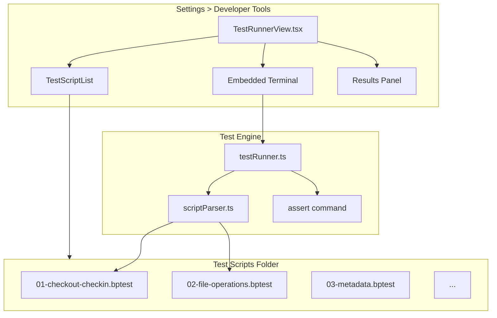

# Self-Test Regression Framework

## Objective

Enable bluePLM to self-test by adding assertion commands to the terminal, a test runner engine that executes `.bptest` script files, and a Developer Tools UI that lets developers point to a test folder, browse/run scripts, and monitor execution in a live CLI view.

## Current State

The terminal command system is already very mature with 60+ commands:

- **PDM ops**: checkout, checkin, sync, download, get-latest, delete, discard, force-release
- **File ops**: mkdir, touch, rename, move, copy, cat, write, etc.
- **Info/query**: status, info, metadata, set-metadata, set-state, pending, env
- **Collaboration**: watch, unwatch, share, notify, request-review, add-to-eco
- **Navigation**: ls, cd, pwd, tree
- **Batch**: sync-all, checkin-all, checkout-all

Commands return structured `CommandResult` with `success`, `succeeded`/`failed` counts, `errors[]`.

**Key gaps for self-testing:**

1. No assertion commands (can run operations but can't verify results programmatically)
2. No test script runner (no way to execute a sequence of commands as a test)
3. No restore-from-trash command
4. No file attribute checks (read-only, exists, hash)
5. No Developer Tools UI for test management

## Architecture




## Test Folder (Vault-Based)

All test activity happens inside a **configurable vault subfolder**. This keeps test data isolated and easy to clean up.

- **Default folder name:** `0 - Tests`
- **Configurable** in Settings > Developer Tools (saved locally per machine)
- **Test scripts** (`.bptest` files) are also stored in this vault folder
- **Test data** created by scripts goes into subfolders within it
- Example vault layout:

```
  My Vault/
    Parts/
    Assemblies/
    0 - Tests/                        <-- test folder (configurable name)
      01-file-sync.bptest             <-- test scripts live here
      02-checkout-checkin.bptest
      ...
      _data/                          <-- runtime test data created here
        checkout-flow/
          test-part.txt
  

```

All paths in `.bptest` scripts are **relative to the test folder**. The runner automatically prepends `{testFolderName}/` to all path arguments before executing commands.

**Auto-lifecycle:** The test runner automatically creates the test folder before a run starts and destroys it (deletes from server + local) after all scripts complete. This ensures a clean slate every time and no test artifacts left behind. The `.bptest` script files themselves are stored in the repo at `tests/regression/` and copied into the vault test folder at the start of a run (or read directly from disk by the runner).

## Test Script Format (.bptest)

Line-by-line command format that reuses existing terminal syntax. Simple, readable, directly maps to the terminal. All paths are relative to the test folder:

```
@name Checkout and Checkin Flow
@requires vault
@timeout 120

# Setup
mkdir _data/checkout-flow
touch _data/checkout-flow/test-part.txt
sync _data/checkout-flow/test-part.txt
wait 2000

# Test: Basic checkout
checkout _data/checkout-flow/test-part.txt
assert _data/checkout-flow/test-part.txt --status=checked-out
assert _data/checkout-flow/test-part.txt --writable

# Test: Check in
checkin _data/checkout-flow/test-part.txt
assert _data/checkout-flow/test-part.txt --status=synced
assert _data/checkout-flow/test-part.txt --readonly

# Test: Discard checkout
checkout _data/checkout-flow/test-part.txt
discard _data/checkout-flow/test-part.txt
assert _data/checkout-flow/test-part.txt --status=synced
assert _data/checkout-flow/test-part.txt --readonly

# Teardown
delete _data/checkout-flow
```

- All paths are **relative to the test folder** (e.g., `_data/foo.txt` becomes `0 - Tests/_data/foo.txt`)
- Lines starting with `#` are section headers (displayed in results)
- Lines starting with `@` are metadata directives
- `@requires vault|sw|admin` for conditional skipping
- `@timeout <seconds>` per-script timeout
- `assert` is the new verification command
- `wait <ms>` pauses between operations
- `# Teardown` section runs even on failure
- Empty lines are ignored
- Convention: test data goes in `_data/` subfolders to keep scripts and data separate

## Agent Overview

- Agent 1: Assertion commands and test engine (parser + runner)
- Agent 2: Missing action commands needed by tests (restore, hash, is-readonly, wait)
- Agent 3: Developer Tools UI (test runner view, script browser, embedded CLI, results)
- Agent 4: Regression test scripts covering tests.md checklist

**Dependencies:** Agent 4 depends on Agents 1 + 2. Agents 1, 2, 3 are independent.

## Shared Files

- [src/lib/commands/handlers/index.ts](src/lib/commands/handlers/index.ts) -- Owner: Agent 1. Agent 2 appends imports for their handlers.
- [src/stores/slices/settingsSlice.ts](src/stores/slices/settingsSlice.ts) -- Owner: Agent 3. Adds `testFolderName` setting (default `"0 - Tests"`).
- [src/stores/types.ts](src/stores/types.ts) -- Owner: Agent 3. Adds test runner state types.
- [src/electron.d.ts](src/electron.d.ts) -- Owner: Agent 2. Adds IPC type declarations for new electron APIs.
- [electron/preload.ts](electron/preload.ts) -- Owner: Agent 2. Exposes new IPC bridges.
- [electron/handlers/fs.ts](electron/handlers/fs.ts) -- Owner: Agent 2. Adds file attribute IPC handlers.

---

## Agent 1: Test Engine (Assertions + Parser + Runner)

### Prompt

> Implement the test engine for bluePLM's self-test regression framework with enterprise-level code quality.
>
> **Scope:**
>
> 1. **Assert command** in `src/lib/commands/handlers/assert.ts`:
>   - Register as terminal command with aliases `['assert', 'expect']`
>   - Accepts a file path + flags for assertions
>   - Supported flags:
>     - `--status=<value>` (checked-out, synced, cloud, added, deleted, deleted_remote)
>     - `--version=<n>` (exact version number)
>     - `--part=<value>` (part_number matches)
>     - `--desc=<value>` (description matches)
>     - `--rev=<value>` (revision matches)
>     - `--readonly` / `--writable` (file attribute via `window.electronAPI.isReadOnly`)
>     - `--exists` / `--not-exists` (file exists in vault store)
>     - `--checked-out-by=<me|email>` (who has checkout)
>     - `--state=<wip|in_review|released|obsolete>` (workflow state)
>     - `--has-pending` / `--no-pending` (has pending metadata changes)
>   - On pass: output success message with what was asserted
>   - On fail: output error with expected vs actual values
>   - Returns `{ success: true/false }` in CommandResult pattern
> 2. **Wait command** in same file:
>   - `wait <ms>` — pauses execution for N milliseconds
>   - Useful between operations that need server propagation
> 3. **Script parser** in `src/lib/commands/testing/scriptParser.ts`:
>   - Parse `.bptest` files into structured test scripts
>   - Extract metadata (`@name`, `@requires`, `@timeout`)
>   - Group commands by section headers (`# Section Name`)
>   - Identify `# Teardown` section for guaranteed execution
>   - Return type: `ParsedTestScript { name, requires, timeout, sections: TestSection[], teardown?: TestSection }`
> 4. **Test runner** in `src/lib/commands/testing/testRunner.ts`:
>   - `runTestScript(script: ParsedTestScript, options)` — executes a parsed script
>   - **Path rewriting:** Before executing each command, the runner prepends the test folder name to all path arguments. For example, if testFolderName is `"0 - Tests"` and the script line is `checkout _data/test.txt`, the runner rewrites it to `checkout "0 - Tests/_data/test.txt"`. The `options` parameter includes `testFolderName: string` (read from store).
>   - **Auto-lifecycle:** The runner has a `runAll(scripts, options)` method that:
>   1. **Creates** the test folder in the vault (`mkdir {testFolderName}`) before any scripts run
>   2. Runs all scripts sequentially (each script's `# Teardown` still cleans up its own `_data/` subfolder)
>   3. **Destroys** the entire test folder after all scripts complete (`delete {testFolderName}` from server + local), regardless of pass/fail
>     Single script runs via `runTestScript()` also create/destroy the test folder automatically
>     ecutes commands sequentially via `executeTerminalCommand()`
>     acks pass/fail per section and per assertion
>      any assertion failure: stop current section, skip remaining sections, run teardown
>     its progress events (for UI): `onSectionStart`, `onCommandExecute`, `onAssertResult`, `onComplete`
>     turns `TestResult { scriptName, sections: SectionResult[], passed, failed, skipped, duration }`
>     pport cancellation via AbortSignal (still runs folder cleanup on cancel)
> 5. **Run-test terminal command** in `src/lib/commands/handlers/testCommands.ts`:
>   - `run-test <script-path>` — runs a single .bptest file from the terminal
>   - `run-tests [folder-path]` — runs all .bptest files in a folder
>   - Reads files via `window.electronAPI.readFile` / `window.electronAPI.listDirectory`
>   - Prints summary: X passed, Y failed, Z skipped
> 6. **Barrel export** in `src/lib/commands/testing/index.ts`
> 7. Update `src/lib/commands/handlers/index.ts` to import `./assert` and `./testCommands`
>
> **Boundaries:**
>
> - OWNS: `src/lib/commands/handlers/assert.ts`, `src/lib/commands/handlers/testCommands.ts`, `src/lib/commands/testing/`*
> - READS (no modify): `src/lib/commands/parser.ts`, `src/lib/commands/registry.ts`, `src/lib/commands/types.ts`, `src/lib/commands/executor.ts`
> - APPENDS ONLY: `src/lib/commands/handlers/index.ts` (add two import lines)
>
> **Patterns to follow:**
>
> - Follow the self-registration pattern from [src/lib/commands/handlers/info.ts](src/lib/commands/handlers/info.ts): `registerTerminalCommand()` with aliases, description, usage, examples, category
> - Use the `resolvePathPattern()` helper (copy from info.ts) for path resolution
> - Use `usePDMStore.getState()` to read file state for assertions
> - Terminal output via `addOutput('success'|'error'|'info', message)`
> - For `isReadOnly` check, call `window.electronAPI.isReadOnly(fullPath)` (Agent 2 will add this)
>
> **Quality Requirements:**
>
> - Enterprise-level code quality and organization
> - Proper TypeScript types (no `any`)
> - Error handling and edge cases covered
> - JSDoc on all public functions and types
> - Clean, readable, documented code
>
> **Deliverables:**
>
> - Working assert command testable from terminal: `assert Parts/bracket.sldprt --status=synced --version=2`
> - Working test runner: `run-test C:/tests/01-checkout.bptest`
> - Report in `.cursor/plans/AGENT1_REPORT.md`
>
> **When complete:** Run `npx tsc --noEmit` and report results.

### Boundary

- **OWNS (exclusive write):** `src/lib/commands/handlers/assert.ts`, `src/lib/commands/handlers/testCommands.ts`, `src/lib/commands/testing/`*
- **APPENDS:** `src/lib/commands/handlers/index.ts` (two import lines only)
- **READS:** `src/lib/commands/parser.ts`, `src/lib/commands/registry.ts`, `src/lib/commands/types.ts`, `src/lib/commands/executor.ts`, `src/lib/commands/handlers/info.ts`

### Tasks

- Create `assert` terminal command with all flags
- Create `wait` terminal command
- Create script parser for .bptest format
- Create test runner engine with event emission
- Create `run-test` and `run-tests` terminal commands
- Update handlers/index.ts with imports

### Deliverables

- `ParsedTestScript` and `TestResult` types for Agent 3 UI to consume
- Event emitter interface for Agent 3 to subscribe to progress

---

## Agent 2: Missing Action Commands

### Prompt

> Add missing terminal commands needed for the self-test regression framework, with enterprise-level code quality.
>
> **Scope:**
>
> 1. **Restore command** in `src/lib/commands/handlers/restore.ts`:
>   - `restore <file-path>` — restores a file from trash
>   - Queries `source_files` table for soft-deleted files matching the path/name
>   - Calls supabase RPC or update to set `deleted_at = null`
>   - Check existing trash/restore logic in the codebase — look at how delete-server works in [src/lib/commands/handlers/delete.ts](src/lib/commands/handlers/delete.ts) and find the corresponding restore function in [src/lib/supabase/files/mutations.ts](src/lib/supabase/files/mutations.ts)
>   - Register as terminal command: aliases `['restore', 'undelete']`, category `'pdm'`
> 2. **Hash command** — add to `src/lib/commands/handlers/info.ts`:
>   - `hash <file-path>` — computes and displays the MD5/SHA256 hash of a local file
>   - Uses `window.electronAPI.getFileHash(fullPath)` (you'll need to add this IPC bridge)
>   - Register as terminal command: aliases `['hash', 'checksum']`, category `'info'`
> 3. **Is-readonly command** — add to `src/lib/commands/handlers/info.ts`:
>   - `is-readonly <file-path>` — checks if file is read-only on disk
>   - Uses `window.electronAPI.isReadOnly(fullPath)` (new IPC bridge)
>   - Register as terminal command: aliases `['is-readonly', 'readonly']`, category `'info'`
> 4. **Version-history command** — add to `src/lib/commands/handlers/info.ts`:
>   - `history <file-path>` — shows version history for a synced file
>   - Queries `file_versions` table via supabase
>   - Shows version number, timestamp, user, and note for each entry
>   - Register as terminal command: aliases `['history', 'versions']`, category `'info'`
> 5. **Electron IPC bridges** — Add to [electron/handlers/fs.ts](electron/handlers/fs.ts):
>   - `isReadOnly(filePath)` — returns boolean (check file attributes via `fs.statSync` and check write permission or `FILE_ATTRIBUTE_READONLY` on Windows)
>   - `getFileHash(filePath, algorithm?)` — returns hex hash string (use `crypto.createHash`)
>   - `listTestScripts(folderPath)` — returns array of `.bptest` file paths in a folder (needed by Agent 3)
>   - `readTextFile(filePath)` — returns string content (UTF-8) for reading .bptest scripts without base64
> 6. **Preload + type declarations:**
>   - Add new methods to [electron/preload.ts](electron/preload.ts)
>   - Add type declarations to [src/electron.d.ts](src/electron.d.ts)
>
> **Boundaries:**
>
> - OWNS: `src/lib/commands/handlers/restore.ts`
> - APPENDS: `src/lib/commands/handlers/info.ts` (add hash, is-readonly, history commands at bottom)
> - APPENDS: `src/lib/commands/handlers/index.ts` (add `import './restore'` line)
> - OWNS: new IPC handlers in `electron/handlers/fs.ts` (add to existing file, at bottom)
> - APPENDS: `electron/preload.ts`, `src/electron.d.ts`
>
> **Patterns to follow:**
>
> - Terminal commands: follow self-registration pattern from [src/lib/commands/handlers/info.ts](src/lib/commands/handlers/info.ts)
> - IPC bridges: follow existing patterns in [electron/handlers/fs.ts](electron/handlers/fs.ts) and [electron/preload.ts](electron/preload.ts)
> - Supabase queries: follow patterns in [src/lib/supabase/files/mutations.ts](src/lib/supabase/files/mutations.ts)
>
> **Quality Requirements:**
>
> - Enterprise-level code quality and organization
> - Proper TypeScript types (no `any`)
> - Error handling and edge cases covered
> - JSDoc on all public functions
>
> **Deliverables:**
>
> - Working `restore`, `hash`, `is-readonly`, `history` commands in terminal
> - IPC bridges for `isReadOnly`, `getFileHash`, `listTestScripts`, `readTextFile`
> - Report in `.cursor/plans/AGENT2_REPORT.md`
>
> **When complete:** Run `npx tsc --noEmit` and report results.

### Boundary

- **OWNS:** `src/lib/commands/handlers/restore.ts`
- **APPENDS:** `src/lib/commands/handlers/info.ts`, `src/lib/commands/handlers/index.ts`, `electron/handlers/fs.ts`, `electron/preload.ts`, `src/electron.d.ts`
- **READS:** `src/lib/commands/handlers/delete.ts`, `src/lib/supabase/files/mutations.ts`

### Tasks

- Create restore terminal command
- Add hash, is-readonly, history commands to info.ts
- Add IPC bridges to electron/handlers/fs.ts
- Update preload.ts and electron.d.ts with new APIs

### Deliverables

- IPC APIs (`isReadOnly`, `getFileHash`, `listTestScripts`, `readTextFile`) needed by Agents 1 and 3

---

## Agent 3: Developer Tools Test Runner UI

### Prompt

> Build the Test Runner UI in Settings > Developer Tools for bluePLM with enterprise-level code quality.
>
> **Scope:**
>
> 1. **TestRunnerView** in `src/features/dev-tools/test-runner/TestRunnerView.tsx`:
>   - Main view component for the test runner
>   - **Left panel: Script Browser**
>     - **Test folder name** text input (editable, default `"0 - Tests"`, saved to store as `testFolderName`)
>     - The test folder lives inside the active vault: `{vaultPath}/{testFolderName}/`
>     - Lists available `.bptest` scripts from the bundled repo path `tests/regression/` (read via Electron IPC)
>     - The test folder is auto-created at run start and auto-destroyed after run completes — no manual management needed
>     - Each script shows: name (from `@name` or filename), requirements (`@requires` tags as badges), last run status (pass/fail/not-run)
>     - "Run All" button at top, individual "Run" button per script
>     - Checkbox multi-select to run a subset
>   - **Right panel: split vertically**
>     - **Top: Embedded CLI** — a live terminal view showing command execution in real-time as tests run. Reuse the existing `Terminal` component from [src/features/dev-tools/terminal/Terminal.tsx](src/features/dev-tools/terminal/Terminal.tsx) or embed a simplified read-only version that shows test output. Users can also type commands here for manual testing.
>     - **Bottom: Results Panel** — shows structured test results after a run completes:
>       - Summary bar: X passed, Y failed, Z skipped, duration
>       - Expandable sections per test script
>       - Within each script: sections with pass/fail per assertion
>       - Failed assertions highlighted with expected vs actual
>       - Click a failed assertion to see the full command that failed
> 2. **State management** — add to settings slice in `src/stores/slices/settingsSlice.ts`:
>   - `testFolderName: string` — vault subfolder name for test scripts and data (default `"0 - Tests"`, persisted locally)
>   - `setTestFolderName(name: string)` — setter
>   - The full path is always computed as `{vaultPath}/{testFolderName}/`
> 3. **Navigation** — wire the test runner view into the Developer Tools area:
>   - Check how existing dev-tools views are routed (look at [src/features/dev-tools/](src/features/dev-tools/) structure)
>   - Add a "Test Runner" tab/option in the dev-tools section of Settings
>   - The test runner should be accessible from Settings > Developer Tools > Test Runner
> 4. **Integration with test engine** (from Agent 1):
>   - Import `ParsedTestScript`, `TestResult`, `runTestScript` from `@/lib/commands/testing`
>   - Import `parseTestScript` from `@/lib/commands/testing/scriptParser`
>   - Subscribe to runner events (`onSectionStart`, `onCommandExecute`, `onAssertResult`) to update the embedded CLI and results panel in real-time
>   - Handle cancellation (stop button that sends AbortSignal)
>
> **Component Structure:**

```
> src/features/dev-tools/test-runner/
>   index.ts                    # Barrel exports
>   TestRunnerView.tsx           # Main view (left/right split)
>   components/
>     ScriptBrowser.tsx          # Left panel: folder picker + script list
>     ScriptListItem.tsx         # Single script row with run button
>     TestTerminal.tsx           # Right-top: embedded CLI for live output
>     TestResultsPanel.tsx       # Right-bottom: structured results
>     TestResultSection.tsx      # Expandable section within results
>     TestSummaryBar.tsx         # Pass/fail/skip summary counts
> 

```

> **Boundaries:**
>
> - OWNS: `src/features/dev-tools/test-runner/`*
> - APPENDS: `src/stores/slices/settingsSlice.ts` (add testScriptsFolderPath state)
> - APPENDS: `src/stores/types.ts` (add types if needed)
> - APPENDS: dev-tools navigation/routing to include Test Runner tab
>
> **UI Design:**
>
> - Use the existing design system (Mantine or whatever UI library is used — check [src/app/App.tsx](src/app/App.tsx) for providers)
> - Match the visual style of existing Settings pages and the Terminal component
> - Dark-friendly colors for pass (green), fail (red), skip (gray), running (blue)
> - The embedded CLI should look exactly like the existing terminal but with test output piped in
> - Results panel uses a compact tree/accordion layout
>
> **Quality Requirements:**
>
> - Enterprise-level code quality and organization
> - Proper TypeScript types (no `any`)
> - Error handling and edge cases covered (no folder selected, empty folder, script parse errors)
> - Responsive layout that works at different panel sizes
> - Loading states and empty states
>
> **Deliverables:**
>
> - Complete test runner UI accessible from Settings > Developer Tools
> - Report in `.cursor/plans/AGENT3_REPORT.md`
>
> **When complete:** Run `npx tsc --noEmit` and report results.

### Boundary

- **OWNS:** `src/features/dev-tools/test-runner/`*
- **APPENDS:** `src/stores/slices/settingsSlice.ts`, `src/stores/types.ts`, dev-tools navigation
- **READS:** `src/features/dev-tools/terminal/Terminal.tsx`, `src/lib/commands/testing/`* (Agent 1's types)

### Tasks

- Create TestRunnerView with left/right split layout
- Create ScriptBrowser (folder picker + script list)
- Create TestTerminal (embedded CLI with live output)
- Create TestResultsPanel (structured pass/fail results)
- Add testFolderName to settings slice (default "0 - Tests")
- Wire into Settings > Developer Tools navigation

### Deliverables

- Complete UI that consumes Agent 1's test engine and Agent 2's IPC APIs

---

## Agent 4: Regression Test Scripts

### Prompt

> Write comprehensive regression test scripts for bluePLM in `.bptest` format covering the human regression test checklist in [tests.md](tests.md).
>
> **Scope:**
>
> Create test scripts that will live in the vault's test folder (default `0 - Tests/`). Each script covers one area from tests.md. Scripts should be self-contained with setup and teardown. All runtime test data should be created under a `_data/` subfolder to keep scripts and test data separate. All paths in scripts are relative to the test folder (the runner prepends the test folder name automatically).
>
> **Important:** Write the script files to `tests/regression/` in the repo for version control. The README should explain that users copy these into their vault's test folder (or the UI can load them from here).
>
> **Scripts to create:**
>
> 1. `tests/regression/01-file-sync.bptest` — Download, get-latest, sync stats
>   - Create files under `_data/sync-test/`, sync, verify synced
>   - Delete local copy, verify cloud-only, re-download, verify local
>   - Teardown: delete `_data/sync-test/`
> 2. `tests/regression/02-checkout-checkin.bptest` — Checkout, checkin, discard
>   - Create + sync files under `_data/checkout-test/`
>   - Checkout, verify status + writable
>   - Checkin, verify status + readonly + version incremented
>   - Checkout then discard, verify reverted
>   - Teardown: delete `_data/checkout-test/`
> 3. `tests/regression/03-file-operations.bptest` — Rename, move, copy, new folder
>   - Create folders + files under `_data/fileops-test/`, sync
>   - Rename a file, verify new name exists
>   - Move a file to another subfolder, verify
>   - Copy a file, verify copy exists
>   - Teardown: delete `_data/fileops-test/`
> 4. `tests/regression/04-delete-restore.bptest` — Delete server, restore from trash
>   - Create + sync files under `_data/delete-test/`
>   - Delete from server, verify gone
>   - Restore from trash, verify back
>   - Teardown: delete `_data/delete-test/`
> 5. `tests/regression/05-metadata.bptest` — Set/read metadata (non-SW)
>   - Create + sync file under `_data/meta-test/`, checkout
>   - Set metadata via `set-metadata --part="TEST-001" --desc="Test Part"`
>   - Verify with `assert --part=TEST-001 --desc="Test Part"`
>   - Checkin, verify metadata persisted
>   - Teardown: delete `_data/meta-test/`
> 6. `tests/regression/06-version-history.bptest` — Version tracking
>   - Create + sync file under `_data/version-test/`
>   - Checkout, checkin (v2), checkout, checkin (v3)
>   - Assert version=3
>   - Teardown: delete `_data/version-test/`
> 7. `tests/regression/07-collaboration.bptest` — Watch, notify, request-review
>   - Create + sync file under `_data/collab-test/`
>   - Watch it, unwatch
>   - (Request-review and notify require a second user — use @requires multi-user)
>   - Teardown: delete `_data/collab-test/`
> 8. `tests/regression/08-batch-operations.bptest` — sync-all, checkin-all, checkout-all
>   - Create multiple files under `_data/batch-test/`, sync-all
>   - Checkout-all folder, verify all checked out
>   - Checkin-all, verify all synced
>   - Teardown: delete `_data/batch-test/`
> 9. `tests/regression/09-metadata-sw.bptest` — SolidWorks metadata (requires SW)
>   - @requires sw
>   - Tests that require SolidWorks service running
>   - sync-metadata, extract-references on assembly files
>   - (Note: can only test if SW test files exist — document prerequisites)
> 10. `tests/regression/10-edge-cases.bptest` — Stress and edge cases
>   - Special characters in folder names under `_data/edge-test/`
>     - Empty folders
>     - Large batch operations
>     - Rapid sequential operations
>     - Teardown: delete `_data/edge-test/`
>
> **Script format (for reference — all paths relative to test folder):**

```
> @name Checkout and Checkin Flow
> @requires vault
> @timeout 120
>
> # Setup
> mkdir _data/checkout-flow
> touch _data/checkout-flow/test-part.txt
> sync _data/checkout-flow/test-part.txt
> wait 2000
>
> # Test: Basic checkout
> checkout _data/checkout-flow/test-part.txt
> assert _data/checkout-flow/test-part.txt --status=checked-out
> assert _data/checkout-flow/test-part.txt --writable
>
> # Teardown
> delete _data/checkout-flow
> 

```

> **Boundaries:**
>
> - OWNS: `tests/regression/`*
> - READS: `tests.md` (the human checklist to automate)
>
> **Quality Requirements:**
>
> - Each script must be self-contained (creates its own test data, cleans up after)
> - All runtime test data created under `_data/` subfolders (paths are relative to the test folder)
> - Generous `wait` commands between server operations (2000ms minimum)
> - Clear section headers describing what's being tested
> - Comments explaining non-obvious assertions
> - Each script should complete in under 60 seconds individually
>
> **Deliverables:**
>
> - 10 regression test scripts in `tests/regression/`
> - `tests/regression/README.md` with instructions for running tests
> - Report in `.cursor/plans/AGENT4_REPORT.md`

### Boundary

- **OWNS:** `tests/regression/`*
- **READS:** `tests.md`

### Tasks

- Write 10 regression test scripts
- Write README.md with test running instructions
- Verify scripts follow .bptest format correctly

