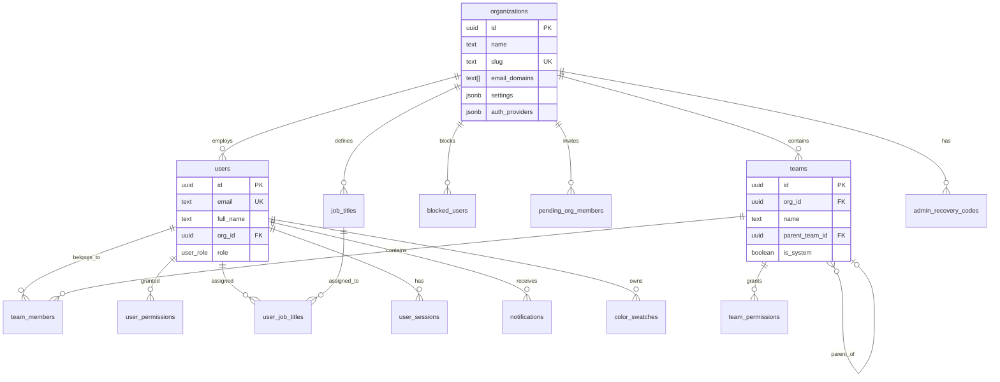

# Supabase Architecture - Visual Reference

This plan file contains comprehensive diagrams of the bluePLM Supabase architecture for easy viewing.

---

## 1. High-Level System Architecture


---

## 2. Database Module Architecture


---

## 3. Core Schema Entity Relationships



---

## 4. Source Files Module Entity Relationships

```mermaid
erDiagram
    organizations ||--o{ vaults : contains
    vaults ||--o{ files : stores
    vaults ||--o{ vault_access : grants
    vaults ||--o{ team_vault_access : grants
    
    files ||--o{ file_versions : has
    files ||--o{ file_references : parent_of
    files ||--o{ file_references : child_of
    files ||--o{ file_watchers : watched_by
    files ||--o{ file_share_links : shared_via
    files ||--o{ file_comments : has
    files ||--o{ release_files : generates
    files ||--o{ activity : logs
    
    workflow_templates ||--o{ workflow_states : contains
    workflow_templates ||--o{ workflow_transitions : has
    workflow_states ||--o{ workflow_transitions : from
    workflow_states ||--o{ workflow_transitions : to
    workflow_transitions ||--o{ workflow_gates : requires
    
    files ||--o{ file_workflow_assignments : assigned
    file_workflow_assignments }o--|| workflow_templates : uses
    
    vaults {
        uuid id PK
        uuid org_id FK
        text name
        text local_path
        text storage_bucket
    }
    
    files {
        uuid id PK
        uuid vault_id FK
        text file_path
        text file_name
        text part_number
        text revision
        integer version
        text content_hash
        uuid checked_out_by FK
        uuid workflow_state_id FK
    }
    
    file_versions {
        uuid id PK
        uuid file_id FK
        integer version
        text revision
        text content_hash
    }
    
    file_references {
        uuid id PK
        uuid parent_file_id FK
        uuid child_file_id FK
        integer quantity
        text configuration
    }
```

---

## 5. Workflow System Architecture


---

## 6. Change Control Module Entity Relationships


---

## 7. Supply Chain Module Entity Relationships


---

## 8. Authentication Flow


---

## 9. File Sync and Storage Flow


---

## 10. Checkout/Checkin Flow with Conflict Prevention


---

## 11. Realtime Subscription Architecture


---

## 12. Permission Hierarchy and Access Control


---

## 13. RLS Policy Decision Flow


---

## 14. Storage Architecture - Content Addressable


---

## 15. BYOB (Bring Your Own Backend) Configuration


---

## 16. Webhook Delivery System


---

## 17. Extension System Architecture


---

## 18. Complete Database Schema Overview


---

## Summary

This plan file contains **18 comprehensive diagrams** covering:

1. **System Architecture** - High-level component overview
2. **Module Dependencies** - How SQL modules relate
3. **Core Schema ERD** - Organizations, users, teams
4. **Source Files ERD** - Files, vaults, workflows
5. **Workflow System** - States, transitions, gates
6. **Change Control ERD** - ECOs, reviews, deviations
7. **Supply Chain ERD** - Suppliers, RFQs, quotes
8. **Auth Flow** - Google OAuth sequence
9. **File Sync Flow** - Upload with deduplication
10. **Checkout Flow** - Lock acquisition with conflict prevention
11. **Realtime Architecture** - Channels and subscriptions
12. **Permission Hierarchy** - Roles and access levels
13. **RLS Decision Flow** - Policy evaluation
14. **Storage Architecture** - Content-addressable storage
15. **BYOB Configuration** - Multi-tenant setup
16. **Webhook System** - Event delivery with retries
17. **Extension System** - Plugin architecture
18. **Complete Schema Overview** - All module relationships

All diagrams use Mermaid syntax and will render in the Cursor plan viewer.
