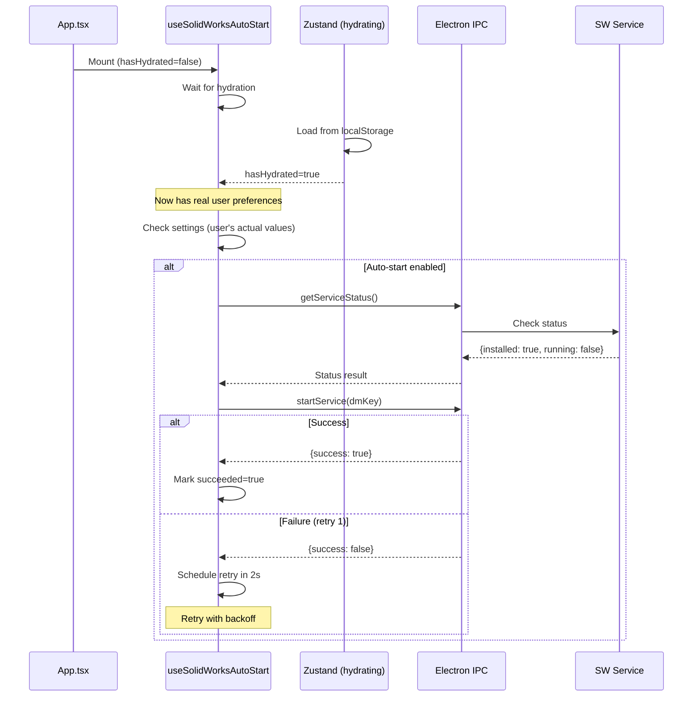

# Agent 1 Report: Renderer Reliability Fix

## Summary

Fixed the SolidWorks service auto-start reliability issues in the renderer process by:

1. Adding Zustand hydration tracking to prevent race conditions
2. Implementing retry logic with exponential backoff
3. Resetting retry counter on settings changes
4. Adding user-visible toast notifications for failures
5. Improving logging for all failure paths

## Changes Made

### `src/stores/pdmStore.ts`

Added hydration tracking mechanism:

```typescript
// Module-level hydration state
let storeHasHydrated = false

// In persist config:
onRehydrateStorage: () => {
  return (_state, error) => {
    if (error) {
      console.error('[PDMStore] Hydration failed:', error)
    } else {
      console.log('[PDMStore] Hydration complete')
    }
    storeHasHydrated = true
  }
}

// New exported hooks:
export function useHasHydrated(): boolean { ... }
export function getHasHydrated(): boolean { ... }
```

**Why**: The `persist` middleware hydrates asynchronously from localStorage. Without waiting for hydration, the auto-start hook could read default values (`autoStartSolidworksService = true`) instead of the user's actual preferences.

### `src/hooks/useSolidWorksAutoStart.ts`

Complete rewrite with the following improvements:

#### 1. Hydration Gating

```typescript
const hasHydrated = useHasHydrated()

// In effect:
if (!hasHydrated) {
  log('info', '[SolidWorks] Waiting for store hydration, deferring auto-start')
  return
}
```

**Why**: Prevents acting on default values before user preferences are loaded.

#### 2. Retry Logic with Exponential Backoff

```typescript
const MAX_RETRY_ATTEMPTS = 3
const RETRY_BASE_DELAY_MS = 2000  // 2s, 4s, 8s

interface AutoStartAttempt {
  orgId: string
  attemptCount: number
  lastAttemptTime: number
  lastFailureReason: FailureReason | null
  succeeded: boolean
}
```

**Why**: Transient failures (network issues, process startup timing) are now recovered automatically.

#### 3. Settings Change Detection

```typescript
const lastAutoStartSettingRef = useRef<boolean | null>(null)

// In effect:
if (lastAutoStartSettingRef.current !== null && 
    lastAutoStartSettingRef.current !== autoStartSolidworksService) {
  log('info', '[SolidWorks] autoStartSolidworksService setting changed, resetting retry counter')
  attemptStateRef.current = null
}
lastAutoStartSettingRef.current = autoStartSolidworksService
```

**Why**: When user toggles auto-start off then on, the retry counter resets to allow a fresh attempt.

#### 4. Toast Notifications

```typescript
// On exhausted retries:
showToast('error', 'SolidWorks service failed to start after multiple attempts. Try starting manually.')

// On SolidWorks not installed:
showToast('info', 'SolidWorks auto-start enabled but SolidWorks is not installed on this machine')
```

**Why**: Users now see actionable feedback instead of silent failures.

#### 5. Failure Reason Tracking

```typescript
type FailureReason = 
  | 'hydration_pending'
  | 'integration_disabled'
  | 'autostart_disabled'
  | 'no_electron_api'
  | 'no_organization'
  | 'not_installed'
  | 'status_check_failed'
  | 'start_failed'
  | 'license_key_failed'
  | 'unknown_error'
```

**Why**: Enables better debugging by tracking exactly why auto-start failed.

## Sequence Diagram (After Fix)



## Testing Recommendations

1. **Fresh install**: Verify auto-start works on first launch
2. **App restart**: Verify auto-start works after closing and reopening
3. **Settings toggle**: Toggle auto-start off → on, verify it retries
4. **Kill service**: Kill SW service externally, verify next app start recovers
5. **Network delay**: Simulate slow IPC, verify retry logic activates

## Typecheck Result

```
> npm run typecheck
> tsc --noEmit

(no errors)
```

## Files Modified

| File | Lines Changed | Purpose |
|------|---------------|---------|
| `src/stores/pdmStore.ts` | +65 | Hydration tracking |
| `src/hooks/useSolidWorksAutoStart.ts` | Complete rewrite (~280 lines) | Retry logic, toasts, logging |

## Boundaries Respected

- ✅ Only modified files in OWNS list
- ✅ Did not touch `electron/handlers/solidworks.ts` (Agent 2's scope)
- ✅ Read `src/app/App.tsx` and `src/stores/types.ts` for context only
