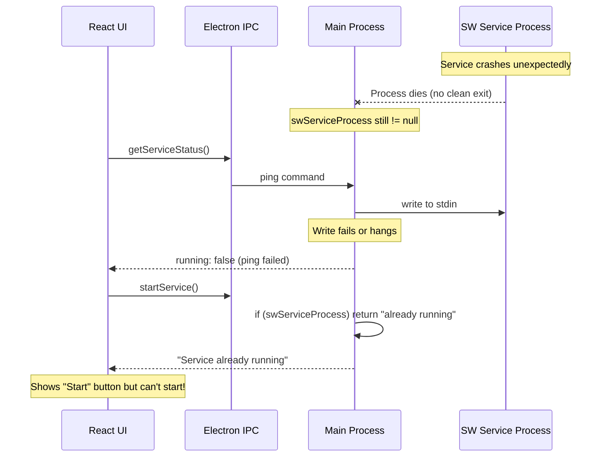

# SolidWorks Service State Synchronization Fix

## Objective

Fix the bug where `swServiceProcess` remains set after the SW service crashes, causing "Service already running" errors when the user tries to restart it.

---

## Root Cause Analysis

### The Bug



### Code Location

[`electron/handlers/solidworks.ts`](electron/handlers/solidworks.ts) lines 169-177:

```typescript
if (swServiceProcess) {
  log('[SolidWorks] Service already running')
  // Returns early without checking if process is actually alive
  return { success: true, data: { message: 'Service already running' } }
}
```

### Why It Happens

1. The service process crashes (memory issue, SW API error, etc.)
2. The `'close'` or `'error'` event doesn't fire reliably (race condition, zombie process)
3. `swServiceProcess` remains non-null
4. `startSWService()` trusts this variable and returns "already running"
5. User is stuck - can't start the service

---

## Scope

### OWNS (exclusive write)

- [`electron/handlers/solidworks.ts`](electron/handlers/solidworks.ts) - SW service management

### READS (no modify)

- [`src/features/integrations/solidworks/`](src/features/integrations/solidworks/) - UI components (for understanding)

---

## Tasks

### Task 1: Add Process Liveness Check

Before returning "already running", verify the process is actually alive by checking if it can respond to a ping.

**Changes to `startSWService()` function:**

```typescript
if (swServiceProcess) {
  // Verify process is actually alive with a quick ping
  const pingResult = await sendSWCommand({ action: 'ping' })
  
  if (!pingResult.success) {
    // Process is stale - clean up and continue to start a new one
    log('[SolidWorks] Stale process detected, cleaning up')
    try {
      swServiceProcess.kill()
    } catch { /* ignore */ }
    swServiceProcess = null
    swPendingRequests.clear()
  } else {
    // Process is alive
    log('[SolidWorks] Service already running')
    return { success: true, data: { message: 'Service already running' } }
  }
}
```

### Task 2: Reduce Ping Timeout for Liveness Checks

The current 300-second timeout is too long for liveness checks. Add a short-timeout ping option:

```typescript
async function sendSWCommand(
  command: Record<string, unknown>,
  options?: { timeoutMs?: number }
): Promise<SWServiceResult> {
  const timeoutMs = options?.timeoutMs ?? 300000  // Default 5 min
  // ... use timeoutMs instead of hardcoded value
}
```

Use short timeout (5 seconds) for liveness pings:

```typescript
const pingResult = await sendSWCommand({ action: 'ping' }, { timeoutMs: 5000 })
```

### Task 3: Add Force-Start Option

Add an IPC handler that can force-kill and restart the service for stuck situations:

```typescript
ipcMain.handle('solidworks:force-restart', async (_, dmLicenseKey?: string) => {
  log('[SolidWorks] Force restart requested')
  
  // Kill existing process if any
  if (swServiceProcess) {
    try {
      swServiceProcess.kill('SIGKILL')
    } catch { /* ignore */ }
    swServiceProcess = null
  }
  swPendingRequests.clear()
  
  // Start fresh
  return startSWService(dmLicenseKey)
})
```

### Task 4: Improve Exit Handler Reliability

Ensure the exit handler always fires by also listening for `'disconnect'` and adding periodic health checks:

```typescript
swServiceProcess.on('disconnect', () => {
  log('[SolidWorks Service] Process disconnected')
  swServiceProcess = null
})

// Also clear pending requests on exit
swServiceProcess.on('close', (code, signal) => {
  log('[SolidWorks Service] Process exited', { code, signal })
  swServiceProcess = null
  
  // Reject all pending requests
  for (const [id, req] of swPendingRequests) {
    req.reject(new Error('Service process exited'))
  }
  swPendingRequests.clear()
})
```

---

## Quality Requirements

- No `any` types introduced
- Proper error handling with try/catch
- Clear logging for debugging
- Follows existing patterns in the codebase
- Backwards compatible (no changes to IPC API signatures)

---

## Deliverables

1. Fixed `startSWService()` with liveness check
2. Configurable timeout for `sendSWCommand()`
3. New `solidworks:force-restart` IPC handler
4. Improved process exit handling
5. Report in `.cursor/plans/sw-service-state-fix-report.md`

---

## Verification

- [ ] `npm run typecheck` passes
- [ ] Manual test: Kill SW service process externally, verify UI can restart it
- [ ] Manual test: Start service, use it, stop it, start it again
- [ ] No regressions in normal SW service operations