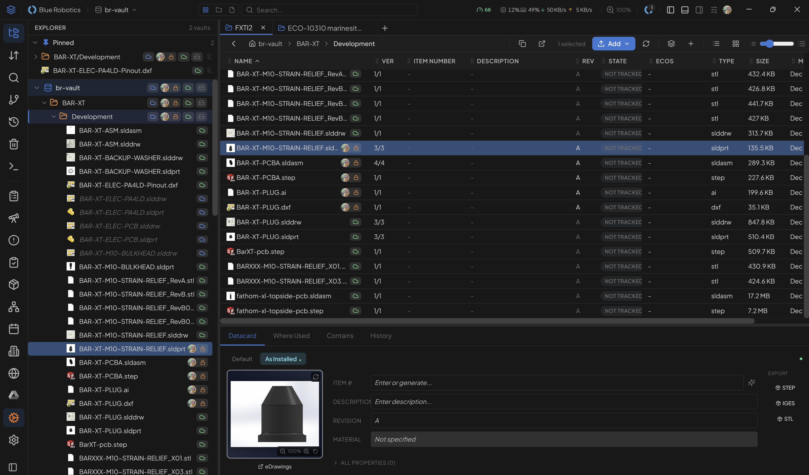

# BluePLM

Open-source product lifecycle management for everyone who builds. Built with Electron, React, and Supabase.



[](https://github.com/bluerobotics/bluePLM/releases)
[](https://github.com/bluerobotics/bluePLM/actions)
[](https://github.com/bluerobotics/bluePLM/releases)
[](LICENSE)

## Features

### Core PDM

- **Check In / Check Out**
  - Exclusive file locking prevents conflicts when multiple engineers work on the same files
  - Multi-machine tracking shows which computer has a file checked out
  - Force check-in option for admins to release abandoned locks
  - Request checkout notifications to ask colleagues to release files

- **Version Control**
  - Full history of every file with timestamps and user attribution
  - Rollback to any previous version with one click
  - Side-by-side comparison of server vs. local versions
  - Automatic version increment on check-in

- **File State Management**
  - Lifecycle states: WIP → In Review → Released → Obsolete
  - Visual workflow builder to customize state transitions
  - Approval gates requiring reviews before state changes
  - ECO column shows which change orders affect each file

- **Real-time Collaboration**
  - Instant sync across all connected clients via Supabase Realtime
  - Live notifications for check-ins, checkouts, state changes, and new versions
  - Green `+` indicators for files added by other users
  - User avatars showing who has files checked out

- **Multi-vault Support**
  - Organize files into separate vaults (e.g., by project or department)
  - Per-vault user permissions (restrict access to specific vaults)
  - Connect/disconnect vaults without losing data
  - Vault-level ignore patterns (`.gitignore` style)

- **Trash & Recovery**
  - Soft delete moves files to trash instead of permanent deletion
  - Restore deleted files back to active status
  - Permanent delete option for cleanup
  - Empty trash to remove all deleted files at once

### Engineering Change Management

- **ECO Management**
  - Create Engineering Change Orders with title, description, and priority
  - Attach files to ECOs for full traceability
  - Track ECO status through configurable workflow states
  - ECO tags column in file browser shows all linked change orders

- **Visual Workflow Builder**
  - Drag-and-drop canvas for designing state machines
  - Create custom states with names, colors, and types
  - Connect states with transition arrows
  - Add approval gates requiring reviews before transitions
  - Pan, zoom, and reposition elements interactively

- **Reviews & Notifications**
  - Request reviews from teammates with due dates and priority levels
  - Reviewers receive notifications and can approve/reject with comments
  - Track all outgoing review requests and their status
  - Notification badges show unread count
  - Overdue reviews highlighted with visual indicators
  - Watch files to get notified on any changes

### Integrations

- **SolidWorks**
  - Thumbnail extraction for parts, assemblies, and drawings (.sldprt, .sldasm, .slddrw)
  - Native add-in with toolbar buttons and task pane
  - Document Manager API for BOM, properties, and configs without launching SolidWorks
  - Auto read-only mode for non-checked-out files

- **Google Drive**
  - Browse personal Drive and Shared Drives in sidebar
  - Edit Docs, Sheets, Slides, and Forms inline without leaving BluePLM
  - Quick access to Starred, Recent, Shared with me, and Trash
  - Context menu: rename, star, download, delete, open in browser
  - Organization-level OAuth (admin configures once)

- **REST API**
  - Fastify server with OpenAPI/Swagger documentation at `/docs`
  - JWT authentication via Supabase tokens
  - Signed URLs for secure file downloads
  - Webhooks for external system notifications
  - Docker image with one-click deploy to Railway/Render
  - Rate limiting and request validation

- **Odoo ERP**
  - Sync suppliers from Odoo to BluePLM
  - Product catalog integration
  - Automatic sync scheduling

- **Vault Backups**
  - Automated encrypted backups via Restic
  - Supports local disk, S3, Backblaze B2, and SFTP
  - Configurable schedule (hourly, daily, weekly)
  - Deduplicated storage for efficiency

### Desktop Experience

- **Built-in Terminal**
  - CLI with file operations: `checkout`, `checkin`, `sync`, `download`
  - Navigation commands: `cd`, `ls`, `pwd`
  - Query commands: `status`, `history`, `find`
  - Batch operations on multiple files

- **File Browser**
  - Icon view with adjustable thumbnail sizes (48–256px)
  - List view with adjustable row heights
  - Windows shell thumbnails and icons
  - SolidWorks preview thumbnails
  - Sort by name, date, size, state, or version
  - Multi-select with Ctrl/Shift click

- **Drag & Drop**
  - Import files/folders from Windows Explorer
  - Drag files out to other applications
  - Move files between folders within BluePLM
  - Cross-view drag between sidebar and main panel

- **Search & Filter**
  - Full-text search across file names
  - Filter by state, checkout status, or file type
  - Pinned items for quick access
  - Recent files list

- **Offline Mode**
  - Work locally when disconnected from the network
  - Changes sync automatically when connection restored
  - Local-only vault option for air-gapped environments

### Administration

- **User Management**
  - Invite users with organization code
  - Role-based access: Admin, Engineer, Viewer
  - Change roles or remove users
  - Auto-join via email domain matching

- **Organization Settings**
  - Company profile with logo and addresses
  - Vault creation and management
  - API configuration (local/external toggle)
  - Integration credentials (Google Drive, Odoo)

- **RFQ System**
  - Request for Quote management
  - Supplier database with contact info
  - Supplier portal for external access

## Quick Start

### For Users
1. **Download** from the [releases page](https://github.com/bluerobotics/bluePLM/releases)
2. **Install** and launch BluePLM
3. **Enter** your organization's Supabase URL and anon key (from your admin)
4. **Sign in with Google**
5. **Connect** to a vault from Settings → Organization

### For Admins

<details>
<summary><strong>1. Create a Supabase Project</strong></summary>

1. Sign up at [supabase.com](https://supabase.com)
2. Create a new project
3. Note your **Project URL** and **anon/public key** (Settings → API)
</details>

<details>
<summary><strong>2. Set Up Google OAuth</strong></summary>

1. Go to [Google Cloud Console](https://console.cloud.google.com/apis/credentials)
2. Create OAuth 2.0 Client ID (Web application)
3. Add `https://your-project.supabase.co/auth/v1/callback` to redirect URIs
4. In Supabase: Authentication → Providers → Google → Enable and add credentials
5. Add `http://localhost` to Supabase Redirect URLs
</details>

<details>
<summary><strong>3. Set Up Storage & Database</strong></summary>

1. Create a private bucket named `vault` (Storage → New Bucket)
2. Run [`supabase/schema.sql`](supabase/schema.sql) in the SQL Editor
3. Create your organization:
   ```sql
   INSERT INTO organizations (name, slug, email_domains)
   VALUES ('Your Company', 'your-company', ARRAY['yourcompany.com']);
   ```
</details>

Share your **Project URL** and **anon key** with team members. Users with matching email domains auto-join.

## File Storage

| Platform | Path |
|----------|------|
| Windows | `C:\BluePLM\{vault-name}` |
| macOS | `~/Documents/BluePLM/{vault-name}` |
| Linux | `~/BluePLM/{vault-name}` |

## SolidWorks Add-in

Native SolidWorks integration with toolbar buttons and task pane.

**Features:**
- Check out/in directly from the SolidWorks toolbar
- Task pane showing file status, version, and state
- Automatic read-only mode for files not checked out by you
- Custom properties sync with BluePLM metadata
- Check-in dialog with version notes

**Installation:**
1. Download `BluePLM.SolidWorks.dll` from [releases](https://github.com/bluerobotics/bluePLM/releases)
2. Run as admin: `RegAsm.exe /codebase BluePLM.SolidWorks.dll`
3. Restart SolidWorks and enable from Tools → Add-ins

See [SolidWorks Add-in README](solidworks-addin/README.md) for details.

## Building from Source

```bash
git clone https://github.com/bluerobotics/bluePLM.git
cd bluePLM
npm install
npm run dev      # Development with hot reload
npm run build    # Production build
```

Optional `.env` for development:
```
VITE_SUPABASE_URL=https://your-project.supabase.co
VITE_SUPABASE_ANON_KEY=your-anon-key
```

### Available Scripts

| Command | Description |
|---------|-------------|
| `npm run dev` | Start Electron app with hot reload |
| `npm run build` | Build production app with electron-builder |
| `npm run typecheck` | Run TypeScript type checking |
| `npm run cli` | Run CLI commands (`node cli/blueplm.js`) |
| `npm run api` | Start REST API server |
| `npm run api:dev` | Start API server with hot reload |

## Roadmap

| Feature | Status | Description |
|---------|--------|-------------|
| Engineering Change Requests (ECRs) | 🔜 Planned | Track issues and change requests linked to files and ECOs with full traceability |
| ECO Schedule | 🔜 Planned | Timeline/calendar view of ECO milestones, deadlines, and release dates |
| ECO Dashboard (GSD) | 🔜 Planned | "Getting Stuff Done" dashboard with progress tracking, blockers, and attention items |
| ECO Process Editor | 🔜 Planned | Define ECO stages, approval gates, assignees, and automation rules |
| Product Catalog | 🔜 Planned | Manage product information, lifecycle stages, and BOM configurations |
| Tab Navigation | 🔜 Planned | Multi-tab file browsing with pinning, split views, and drag between panes |
| Item Number Database | 🔜 Planned | Part number serialization, revision tracking with badges, and cross-reference navigation |
| Offline Conflict Resolution | 🔜 Planned | Smart merge UI when reconnecting after offline edits to the same file |
| Folder History | 🔜 Planned | View version history for entire folders, not just individual files |
| Undo Check-in | 🔜 Planned | Revert a check-in from history panel (restores previous version, keeps newer locally) |
| SolidWorks Configurations | 🔜 Planned | Manage SolidWorks configurations as metadata, sync between files |
| SolidWorks Service | 🔜 Planned | Headless exports, Pack and Go, and auto-metadata extraction without launching SolidWorks |

## Tech Stack

| Component | Technologies |
|-----------|--------------|
| Desktop App | Electron 34, React 19, TypeScript, Tailwind CSS, Zustand, Supabase |
| SolidWorks Add-in | C#, .NET Framework 4.8, SolidWorks API, Windows Forms |
| API Server | Fastify, TypeScript, Docker, Swagger/OpenAPI |
| Database | PostgreSQL (via Supabase), Row Level Security |
| Storage | Supabase Storage, Restic for backups |
| Auth | Supabase Auth, Google OAuth 2.0 |

## License

MIT — see [LICENSE](LICENSE)

## About Blue Robotics

<div align="center">
  
  <p><strong>On a mission to enable the future of marine robotics</strong></p>
  <p>
    <a href="https://bluerobotics.com">🌐 Website</a> •
    <a href="https://github.com/bluerobotics">🐙 GitHub</a> •
    <a href="https://www.youtube.com/bluerobotics">📺 YouTube</a>
  </p>
</div>

---

<div align="center">
  <p>⭐ <strong>Star us on GitHub</strong> if you find Cockpit useful!</p>
  <p>Made with 💙 by the Blue Robotics team and contributors worldwide</p>
</div>
