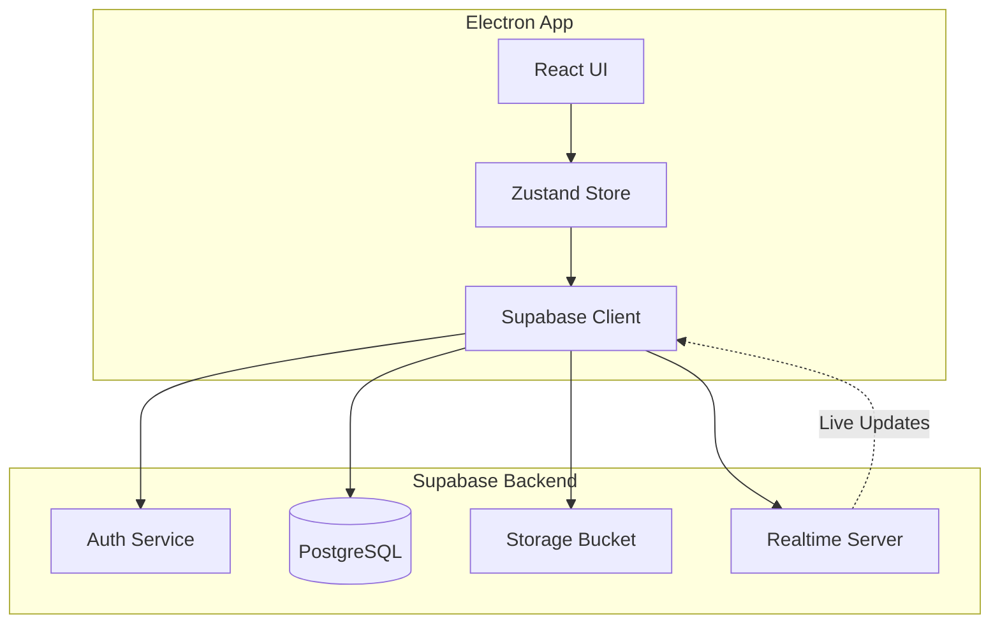
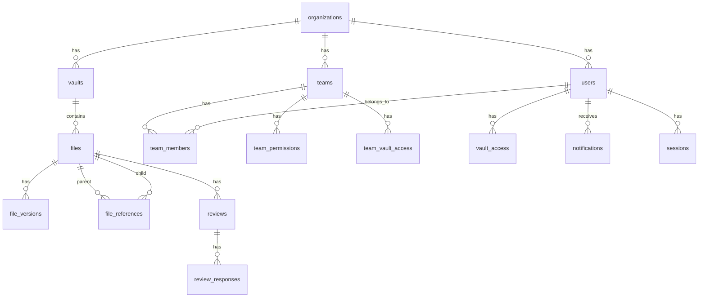
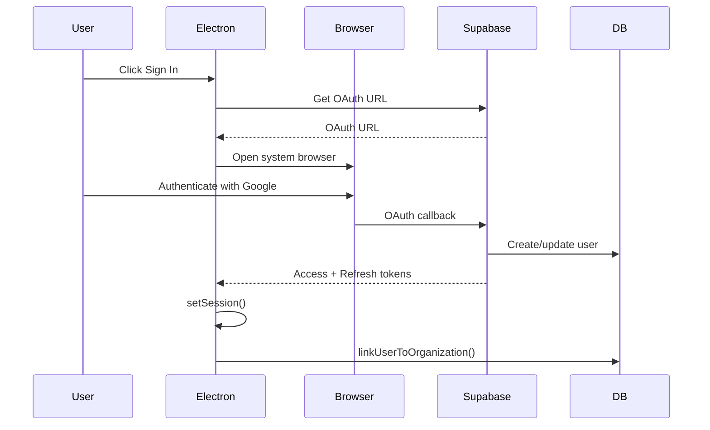
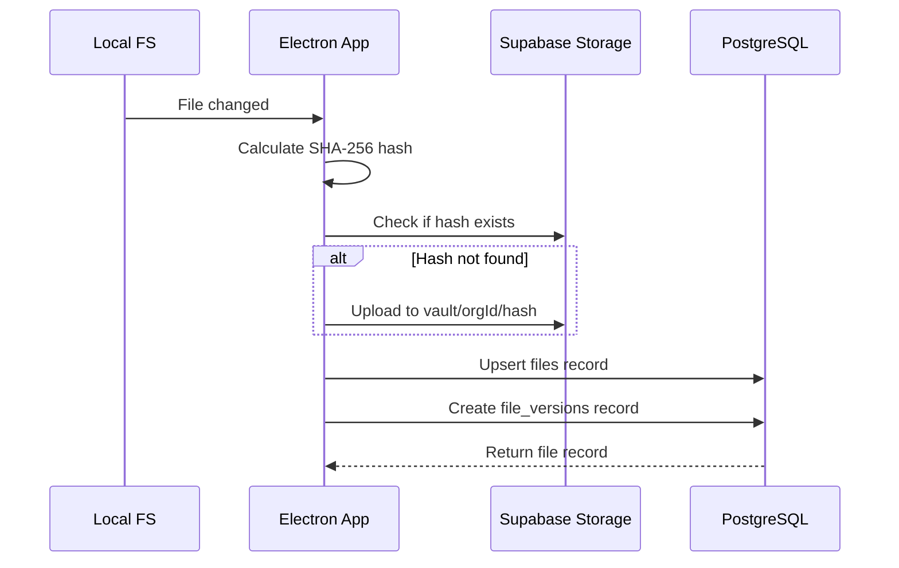
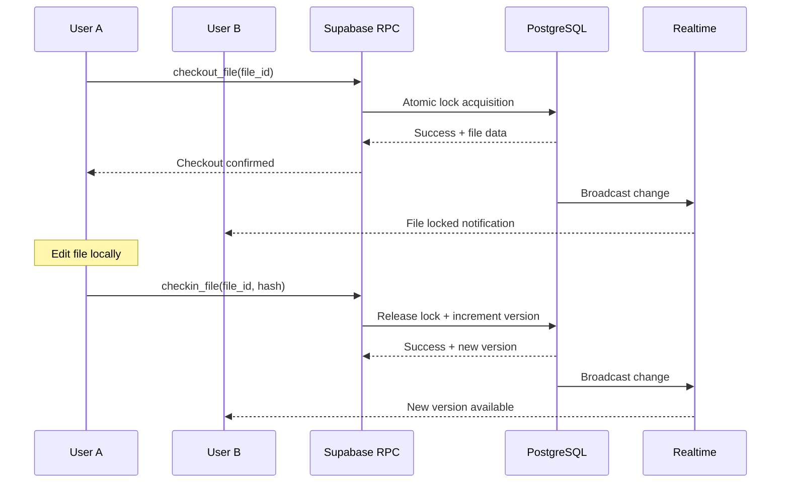
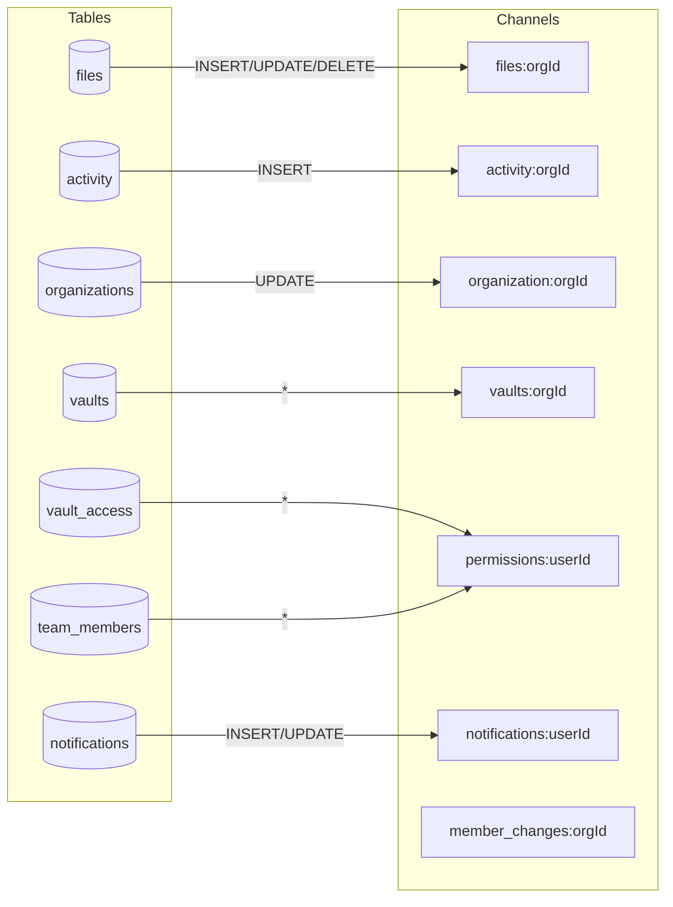
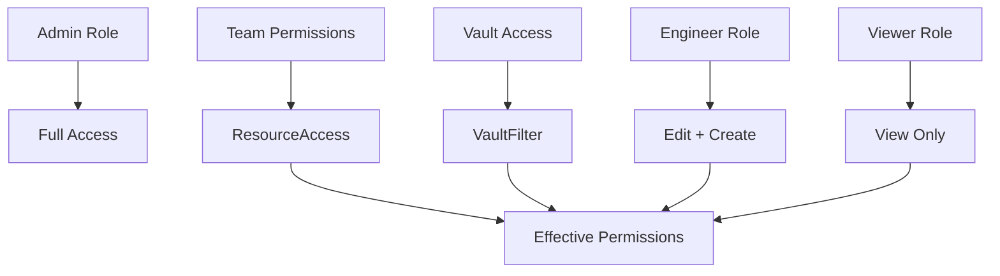
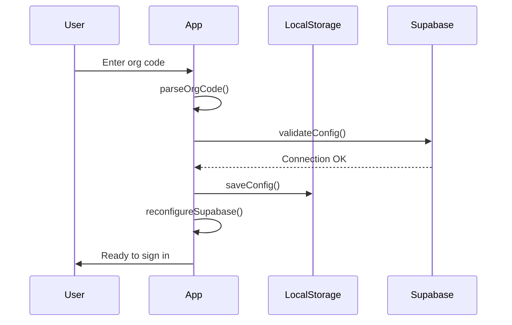

# Supabase Architecture

This document provides a comprehensive overview of how Supabase powers bluePLM, covering the database schema, API calls, storage, realtime subscriptions, and security model.

---

## Overview

Supabase serves as the complete backend for bluePLM, providing:

| Service | Purpose |
|---------|---------|
| **PostgreSQL Database** | All application data with Row Level Security |
| **Authentication** | User sign-in with Google, Email, and Phone/SMS |
| **Storage** | Content-addressable file storage with deduplication |
| **Realtime** | Live updates across all connected clients |

### High-Level Architecture



---

## Database Schema

The schema is organized into modular SQL files:

- `supabase/core.sql` - Organizations, users, teams, permissions
- `supabase/modules/10-source-files.sql` - Files, vaults, workflows
- `supabase/modules/20-change-control.sql` - ECOs, reviews
- `supabase/modules/30-supply-chain.sql` - Suppliers, RFQs
- `supabase/modules/40-integrations.sql` - External system integrations
- `supabase/modules/50-extensions.sql` - Extension framework

### Entity Relationship Diagram



### Tables by Module (Summary)

| Module | Tables | Purpose |
|--------|--------|---------|
| `core.sql` | 17 | Organizations, users, teams, permissions |
| `10-source-files.sql` | 35 | Files, vaults, workflows, reviews |
| `20-change-control.sql` | 12 | ECOs, reviews, deviations, process templates |
| `30-supply-chain.sql` | 10 | Suppliers, RFQs, quotes |
| `40-integrations.sql` | 10 | Webhooks, ERP sync, SOLIDWORKS licenses |
| `50-extensions.sql` | 7 | Extension system, secrets, storage |

---

## Core Schema (`core.sql`)

The foundational schema required by ALL bluePLM installations.

### Enums

| Enum | Values | Purpose |
|------|--------|---------|
| `user_role` | `admin`, `engineer`, `viewer` | User permission level |
| `permission_action` | `view`, `create`, `edit`, `delete`, `admin` | Granular permissions |

### Tables

#### `schema_version`
Single-row table tracking database version for app compatibility.

| Column | Type | Description |
|--------|------|-------------|
| `id` | `INTEGER` | Always 1 (single row) |
| `version` | `INTEGER` | Current schema version |
| `description` | `TEXT` | Migration description |
| `applied_at` | `TIMESTAMPTZ` | When last updated |
| `applied_by` | `TEXT` | Migration author |

#### `organizations`
Multi-tenant organization data with settings and branding.

| Column | Type | Description |
|--------|------|-------------|
| `id` | `UUID` | Primary key |
| `name` | `TEXT` | Organization display name |
| `slug` | `TEXT` | Unique org code slug |
| `email_domains` | `TEXT[]` | Auto-join email domains |
| `settings` | `JSONB` | App settings (checkout required, part number format, etc.) |
| `logo_url` | `TEXT` | Company logo URL |
| `logo_storage_path` | `TEXT` | Storage path for uploaded logo |
| `address_line1/2`, `city`, `state`, `postal_code`, `country` | `TEXT` | Company address |
| `phone`, `website`, `contact_email` | `TEXT` | Contact info |
| `module_defaults` | `JSONB` | Default sidebar configuration |
| `module_defaults_forced_at` | `TIMESTAMPTZ` | When defaults were force-pushed |
| `auth_providers` | `JSONB` | Enabled auth methods (Google, email, phone) |
| `default_new_user_team_id` | `UUID` | Team for org code signups |

#### `users`
User profiles linked to Supabase Auth.

| Column | Type | Description |
|--------|------|-------------|
| `id` | `UUID` | FK to `auth.users` |
| `email` | `TEXT` | User email |
| `full_name` | `TEXT` | Display name |
| `avatar_url` | `TEXT` | Google/OAuth avatar |
| `custom_avatar_url` | `TEXT` | Uploaded avatar |
| `job_title` | `TEXT` | Legacy job title field |
| `org_id` | `UUID` | FK to organizations |
| `role` | `user_role` | Permission level |
| `last_sign_in` | `TIMESTAMPTZ` | Last login |
| `last_online` | `TIMESTAMPTZ` | Last activity |

#### `blocked_users`
Email blocklist per organization.

| Column | Type | Description |
|--------|------|-------------|
| `org_id` | `UUID` | Organization |
| `email` | `TEXT` | Blocked email |
| `blocked_by` | `UUID` | Admin who blocked |
| `blocked_at` | `TIMESTAMPTZ` | When blocked |
| `reason` | `TEXT` | Block reason |

#### `teams`
Team/group definitions for permission management.

| Column | Type | Description |
|--------|------|-------------|
| `id` | `UUID` | Primary key |
| `org_id` | `UUID` | Organization |
| `name` | `TEXT` | Team name (unique per org) |
| `description` | `TEXT` | Team description |
| `color` | `TEXT` | Display color (#hex) |
| `icon` | `TEXT` | Lucide icon name |
| `parent_team_id` | `UUID` | Hierarchical parent |
| `is_default` | `BOOLEAN` | Default team for new users |
| `is_system` | `BOOLEAN` | Cannot be deleted |
| `module_defaults` | `JSONB` | Team-specific sidebar config |

#### `team_members`
User membership in teams.

| Column | Type | Description |
|--------|------|-------------|
| `team_id` | `UUID` | Team |
| `user_id` | `UUID` | User |
| `is_team_admin` | `BOOLEAN` | Can manage team members |
| `added_by` | `UUID` | Who added them |

#### `team_permissions`
Resource/action permissions per team.

| Column | Type | Description |
|--------|------|-------------|
| `team_id` | `UUID` | Team |
| `resource` | `TEXT` | Resource type (e.g., `module:explorer`) |
| `vault_id` | `UUID` | Optional vault scope |
| `actions` | `permission_action[]` | Allowed actions |
| `granted_by` | `UUID` | Who granted |

#### `permission_presets`
Reusable permission templates.

| Column | Type | Description |
|--------|------|-------------|
| `org_id` | `UUID` | Organization |
| `name` | `TEXT` | Preset name |
| `permissions` | `JSONB` | Permission configuration |
| `is_system` | `BOOLEAN` | Built-in preset |

#### `user_permissions`
Individual user permission overrides.

| Column | Type | Description |
|--------|------|-------------|
| `user_id` | `UUID` | User |
| `resource` | `TEXT` | Resource type |
| `vault_id` | `UUID` | Optional vault scope |
| `actions` | `permission_action[]` | Allowed actions |

#### `job_titles`
Organization job title definitions.

| Column | Type | Description |
|--------|------|-------------|
| `org_id` | `UUID` | Organization |
| `name` | `TEXT` | Title name |
| `color` | `TEXT` | Display color |
| `icon` | `TEXT` | Icon name |
| `is_system` | `BOOLEAN` | Built-in title |

#### `user_job_titles`
Job title assignments to users.

| Column | Type | Description |
|--------|------|-------------|
| `user_id` | `UUID` | User (unique) |
| `title_id` | `UUID` | Job title |
| `assigned_by` | `UUID` | Who assigned |

#### `pending_org_members`
Invited users not yet signed up.

| Column | Type | Description |
|--------|------|-------------|
| `org_id` | `UUID` | Organization |
| `email` | `TEXT` | Invited email |
| `full_name` | `TEXT` | Display name |
| `role` | `user_role` | Assigned role |
| `team_ids` | `UUID[]` | Pre-assigned teams |
| `vault_ids` | `UUID[]` | Pre-assigned vaults |
| `workflow_role_ids` | `UUID[]` | Pre-assigned workflow roles |
| `invited_by` | `UUID` | Who invited |
| `expires_at` | `TIMESTAMPTZ` | Invitation expiry |
| `claimed_at` | `TIMESTAMPTZ` | When user signed up |

#### `admin_recovery_codes`
Emergency admin access codes.

| Column | Type | Description |
|--------|------|-------------|
| `org_id` | `UUID` | Organization |
| `code_hash` | `TEXT` | SHA-256 hash of code |
| `expires_at` | `TIMESTAMPTZ` | Expiration |
| `is_used` | `BOOLEAN` | Already used |
| `used_by` | `UUID` | Who used it |
| `is_revoked` | `BOOLEAN` | Manually revoked |

#### `user_sessions`
Active device sessions per user.

| Column | Type | Description |
|--------|------|-------------|
| `user_id` | `UUID` | User |
| `machine_id` | `TEXT` | Unique device ID |
| `machine_name` | `TEXT` | Device name |
| `platform` | `TEXT` | OS platform |
| `os_version` | `TEXT` | OS version |
| `app_version` | `TEXT` | App version |
| `is_active` | `BOOLEAN` | Session active |
| `last_seen` | `TIMESTAMPTZ` | Last heartbeat |

#### `notifications`
In-app notification system.

| Column | Type | Description |
|--------|------|-------------|
| `org_id` | `UUID` | Organization |
| `user_id` | `UUID` | Recipient |
| `type` | `TEXT` | Notification type |
| `category` | `TEXT` | Category grouping |
| `title` | `TEXT` | Notification title |
| `message` | `TEXT` | Body text |
| `priority` | `TEXT` | `low`, `normal`, `high` |
| `entity_type` | `TEXT` | Referenced entity type |
| `entity_id` | `UUID` | Referenced entity ID |
| `from_user_id` | `UUID` | Sender |
| `read` | `BOOLEAN` | Read status |
| `action_url` | `TEXT` | Click action URL |

#### `color_swatches`
Personal color palette for users.

| Column | Type | Description |
|--------|------|-------------|
| `user_id` | `UUID` | Owner |
| `name` | `TEXT` | Color name |
| `color` | `TEXT` | Hex color value |
| `sort_order` | `INTEGER` | Display order |

---

## Source Files Module (`10-source-files.sql`)

File management, vaults, workflows, and activity tracking.

### Enums

| Enum | Values | Purpose |
|------|--------|---------|
| `file_type` | `part`, `assembly`, `drawing`, `pdf`, `step`, `other` | CAD file classification |
| `reference_type` | `component`, `derived`, `reference` | BOM relationship type |
| `activity_action` | `create`, `update`, `checkout`, `checkin`, `state_change`, `revision_change`, `delete`, `restore`, `move`, `rename` | Activity log types |
| `release_file_type` | `step`, `pdf`, `dxf`, `iges`, `stl`, `dwg`, `dxf_flat` | Export formats |
| `metadata_column_type` | `text`, `number`, `date`, `boolean`, `select` | Custom field types |
| `state_type` | `state`, `gate` | Workflow node types |
| `state_shape` | `rectangle`, `diamond`, `hexagon`, `ellipse` | Visual shapes |
| `transition_line_style` | `solid`, `dashed`, `dotted` | Transition line styles |
| `gate_type` | `approval`, `checklist`, `condition` | Gate validation types |
| `approval_mode` | `any`, `all`, `majority` | Multi-approver logic |
| `reviewer_type` | `user`, `role`, `group`, `workflow_role` | Reviewer assignment |
| `review_status` | `pending`, `approved`, `rejected`, `cancelled` | Review states |

### Core File Tables

#### `vaults`
File storage containers per organization.

| Column | Type | Description |
|--------|------|-------------|
| `id` | `UUID` | Primary key |
| `org_id` | `UUID` | Organization |
| `name` | `TEXT` | Display name |
| `slug` | `TEXT` | URL-safe identifier |
| `description` | `TEXT` | Description |
| `local_path` | `TEXT` | Local filesystem path |
| `storage_bucket` | `TEXT` | Supabase storage bucket |
| `color` | `TEXT` | Display color |
| `icon` | `TEXT` | Icon name |
| `is_default` | `BOOLEAN` | Default vault for new files |

#### `vault_access`
Individual user vault permissions.

| Column | Type | Description |
|--------|------|-------------|
| `vault_id` | `UUID` | Vault |
| `user_id` | `UUID` | User |
| `granted_by` | `UUID` | Who granted |

#### `team_vault_access`
Team-level vault permissions.

| Column | Type | Description |
|--------|------|-------------|
| `team_id` | `UUID` | Team |
| `vault_id` | `UUID` | Vault |
| `granted_by` | `UUID` | Who granted |

#### `files`
Main file metadata table (30+ columns).

| Column | Type | Description |
|--------|------|-------------|
| `id` | `UUID` | Primary key |
| `org_id` | `UUID` | Organization |
| `vault_id` | `UUID` | Containing vault |
| `file_path` | `TEXT` | Full path including filename |
| `file_name` | `TEXT` | Filename only |
| `extension` | `TEXT` | File extension |
| `file_type` | `file_type` | CAD type classification |
| `part_number` | `TEXT` | Engineering part number |
| `description` | `TEXT` | Part description |
| `revision` | `TEXT` | Current revision (A, B, C...) |
| `version` | `INTEGER` | Internal version number |
| `content_hash` | `TEXT` | SHA-256 of file content |
| `file_size` | `BIGINT` | Size in bytes |
| `workflow_state_id` | `UUID` | Current workflow state |
| `state` | `TEXT` | Legacy state name |
| `state_changed_at` | `TIMESTAMPTZ` | Last state change |
| `state_changed_by` | `UUID` | Who changed state |
| `checked_out_by` | `UUID` | User holding lock |
| `checked_out_at` | `TIMESTAMPTZ` | Lock acquisition time |
| `lock_message` | `TEXT` | Checkout comment |
| `checked_out_by_machine_id` | `TEXT` | Device ID |
| `checked_out_by_machine_name` | `TEXT` | Device name |
| `created_by` | `UUID` | File creator |
| `updated_by` | `UUID` | Last modifier |
| `custom_properties` | `JSONB` | Custom metadata fields |
| `configuration_revisions` | `JSONB` | Per-config revision map |
| `eco_tags` | `TEXT[]` | Associated ECO numbers |
| `deleted_at` | `TIMESTAMPTZ` | Soft delete timestamp |

**Indexes:** Unique on `(vault_id, file_path)` where not deleted, full-text search on name/part_number/description/eco_tags.

#### `file_versions`
Version history for files.

| Column | Type | Description |
|--------|------|-------------|
| `file_id` | `UUID` | Parent file |
| `version` | `INTEGER` | Version number |
| `revision` | `TEXT` | Revision at this version |
| `content_hash` | `TEXT` | Content SHA-256 |
| `file_size` | `BIGINT` | Size at this version |
| `workflow_state_id` | `UUID` | State at this version |
| `state` | `TEXT` | State name snapshot |
| `comment` | `TEXT` | Checkin comment |
| `part_number` | `TEXT` | Part number snapshot |
| `description` | `TEXT` | Description snapshot |
| `created_by` | `UUID` | Who created version |

#### `release_files`
Generated export files (STEP, PDF, etc.).

| Column | Type | Description |
|--------|------|-------------|
| `file_id` | `UUID` | Source file |
| `file_version_id` | `UUID` | Source version |
| `version` | `INTEGER` | Version number |
| `revision` | `TEXT` | Revision |
| `file_type` | `release_file_type` | Export format |
| `file_name` | `TEXT` | Generated filename |
| `storage_path` | `TEXT` | Storage path |
| `storage_hash` | `TEXT` | Content hash |
| `rfq_id` | `UUID` | Associated RFQ |

#### `file_references`
BOM/assembly parent-child relationships.

| Column | Type | Description |
|--------|------|-------------|
| `org_id` | `UUID` | Organization |
| `parent_file_id` | `UUID` | Parent (assembly) |
| `child_file_id` | `UUID` | Child (component) |
| `reference_type` | `reference_type` | Relationship type |
| `quantity` | `INTEGER` | Component quantity |
| `configuration` | `TEXT` | Configuration name |

#### `activity`
Audit log of all file operations.

| Column | Type | Description |
|--------|------|-------------|
| `org_id` | `UUID` | Organization |
| `file_id` | `UUID` | Affected file |
| `user_id` | `UUID` | Actor |
| `user_email` | `TEXT` | Actor email (denormalized) |
| `action` | `activity_action` | Action type |
| `details` | `JSONB` | Action-specific data |

### Workflow Tables

#### `workflow_templates`
Workflow definitions.

| Column | Type | Description |
|--------|------|-------------|
| `org_id` | `UUID` | Organization |
| `name` | `TEXT` | Workflow name |
| `description` | `TEXT` | Description |
| `is_default` | `BOOLEAN` | Default for new files |
| `is_active` | `BOOLEAN` | Can be assigned |
| `canvas_config` | `JSONB` | Editor zoom/pan state |

#### `workflow_states`
States within a workflow.

| Column | Type | Description |
|--------|------|-------------|
| `workflow_id` | `UUID` | Parent workflow |
| `state_type` | `state_type` | `state` or `gate` |
| `shape` | `state_shape` | Visual shape |
| `name` | `TEXT` | State name |
| `label` | `TEXT` | Display label |
| `color` | `TEXT` | Background color |
| `icon` | `TEXT` | Icon name |
| `position_x`, `position_y` | `INTEGER` | Canvas position |
| `is_editable` | `BOOLEAN` | Files can be edited |
| `requires_checkout` | `BOOLEAN` | Checkout required to edit |
| `auto_increment_revision` | `BOOLEAN` | Bump revision on entry |
| `gate_config` | `JSONB` | Gate-specific settings |
| `required_workflow_roles` | `UUID[]` | Required roles |

#### `workflow_transitions`
Allowed state-to-state transitions.

| Column | Type | Description |
|--------|------|-------------|
| `workflow_id` | `UUID` | Parent workflow |
| `from_state_id` | `UUID` | Source state |
| `to_state_id` | `UUID` | Target state |
| `name` | `TEXT` | Transition label |
| `line_style` | `transition_line_style` | Visual style |
| `line_color` | `TEXT` | Line color |
| `line_path_type` | `transition_path_type` | Straight/curved |
| `line_arrow_head` | `transition_arrow_head` | Arrow placement |
| `allowed_workflow_roles` | `UUID[]` | Who can trigger |
| `auto_conditions` | `JSONB` | Auto-transition rules |

#### `workflow_gates`
Gate/approval requirements on transitions.

| Column | Type | Description |
|--------|------|-------------|
| `transition_id` | `UUID` | Parent transition |
| `name` | `TEXT` | Gate name |
| `gate_type` | `gate_type` | Validation type |
| `required_approvals` | `INTEGER` | Number needed |
| `approval_mode` | `approval_mode` | Any/all/majority |
| `checklist_items` | `JSONB` | Checklist requirements |
| `is_blocking` | `BOOLEAN` | Blocks transition |
| `can_be_skipped_by` | `user_role[]` | Skip permissions |

#### `workflow_roles`
Custom roles for workflow permissions.

| Column | Type | Description |
|--------|------|-------------|
| `org_id` | `UUID` | Organization |
| `name` | `TEXT` | Role name |
| `color` | `TEXT` | Display color |
| `icon` | `TEXT` | Icon |
| `is_active` | `BOOLEAN` | Active |

#### `user_workflow_roles`
User assignments to workflow roles.

| Column | Type | Description |
|--------|------|-------------|
| `user_id` | `UUID` | User |
| `workflow_role_id` | `UUID` | Role |
| `assigned_by` | `UUID` | Assigner |

### Additional Tables

| Table | Purpose |
|-------|---------|
| `file_workflow_assignments` | Which workflow is assigned to each file |
| `pending_reviews` | Active review requests |
| `workflow_review_history` | Completed review audit log |
| `revision_schemes` | Custom revision numbering schemes |
| `workflow_state_permissions` | Per-state file permissions |
| `workflow_transition_conditions` | Conditional transition rules |
| `workflow_transition_actions` | Actions on transition (notify, convert) |
| `workflow_transition_notifications` | Notification templates |
| `workflow_transition_approvals` | Multi-level approval definitions |
| `workflow_approval_reviewers` | Reviewers for approvals |
| `workflow_auto_transitions` | Timed/conditional auto-transitions |
| `workflow_tasks` | Background tasks (PDF generation) |
| `pending_transition_approvals` | Active approval requests |
| `workflow_history` | Transition audit log |
| `file_state_entries` | Time tracking in each state |
| `file_watchers` | File subscription list |
| `file_share_links` | Shareable download links |
| `file_comments` | File comments |
| `file_metadata_columns` | Custom metadata field definitions |
| `backup_config` | Backup configuration per org |
| `backup_history` | Backup run history |
| `backup_machines` | Registered backup machines |
| `backup_locks` | Backup coordination locks |

---

## Change Control Module (`20-change-control.sql`)

ECOs, reviews, deviations, and phase-gate processes.

### Enums

| Enum | Values | Purpose |
|------|--------|---------|
| `eco_status` | `open`, `in_progress`, `completed`, `cancelled` | ECO lifecycle |
| `deviation_status` | `draft`, `pending_approval`, `approved`, `rejected`, `closed`, `expired` | Deviation lifecycle |
| `checklist_item_status` | `not_started`, `in_progress`, `complete`, `blocked`, `na` | Checklist progress |

### Tables

#### `ecos`
Engineering Change Orders.

| Column | Type | Description |
|--------|------|-------------|
| `org_id` | `UUID` | Organization |
| `eco_number` | `TEXT` | Unique ECO number |
| `title` | `TEXT` | ECO title |
| `description` | `TEXT` | Change description |
| `status` | `eco_status` | Current status |
| `process_template_id` | `UUID` | Phase-gate template |
| `created_by` | `UUID` | Creator |
| `completed_at` | `TIMESTAMPTZ` | Completion date |
| `custom_properties` | `JSONB` | Custom fields |

#### `file_ecos`
Files associated with ECOs.

| Column | Type | Description |
|--------|------|-------------|
| `file_id` | `UUID` | File |
| `eco_id` | `UUID` | ECO |
| `created_by` | `UUID` | Who linked |
| `notes` | `TEXT` | Association notes |

#### `reviews`
File review requests.

| Column | Type | Description |
|--------|------|-------------|
| `org_id` | `UUID` | Organization |
| `file_id` | `UUID` | File to review |
| `vault_id` | `UUID` | File's vault |
| `requested_by` | `UUID` | Requester |
| `title` | `TEXT` | Review title |
| `message` | `TEXT` | Review message |
| `file_version` | `INTEGER` | Version to review |
| `status` | `review_status` | Overall status |
| `due_date` | `TIMESTAMPTZ` | Deadline |
| `priority` | `TEXT` | Priority level |

#### `review_responses`
Individual reviewer responses.

| Column | Type | Description |
|--------|------|-------------|
| `review_id` | `UUID` | Review request |
| `reviewer_id` | `UUID` | Reviewer |
| `status` | `review_status` | Response status |
| `comment` | `TEXT` | Review comment |
| `responded_at` | `TIMESTAMPTZ` | Response time |

#### `deviations`
Approved departures from specifications.

| Column | Type | Description |
|--------|------|-------------|
| `org_id` | `UUID` | Organization |
| `deviation_number` | `TEXT` | Unique number |
| `title` | `TEXT` | Deviation title |
| `description` | `TEXT` | Description |
| `status` | `deviation_status` | Current status |
| `approved_by` | `UUID` | Approver |
| `effective_date` | `TIMESTAMPTZ` | Start date |
| `expiration_date` | `TIMESTAMPTZ` | End date |
| `affected_part_numbers` | `TEXT[]` | Affected parts |
| `deviation_type` | `TEXT` | Type classification |

#### `file_deviations`
Files associated with deviations.

| Column | Type | Description |
|--------|------|-------------|
| `file_id` | `UUID` | File |
| `deviation_id` | `UUID` | Deviation |
| `file_version` | `INTEGER` | Specific version |
| `file_revision` | `TEXT` | Specific revision |

#### `process_templates`
Phase-gate process templates for ECOs.

| Column | Type | Description |
|--------|------|-------------|
| `org_id` | `UUID` | Organization |
| `name` | `TEXT` | Template name |
| `description` | `TEXT` | Description |
| `is_default` | `BOOLEAN` | Default template |
| `is_active` | `BOOLEAN` | Can be used |

#### `process_template_phases`
Phases within a process template.

| Column | Type | Description |
|--------|------|-------------|
| `template_id` | `UUID` | Parent template |
| `name` | `TEXT` | Phase name |
| `gate_name` | `TEXT` | Gate name at phase end |
| `gate_description` | `TEXT` | Gate description |
| `sort_order` | `INTEGER` | Display order |

#### `process_template_items`
Deliverables/checklist items within phases.

| Column | Type | Description |
|--------|------|-------------|
| `phase_id` | `UUID` | Parent phase |
| `uid` | `TEXT` | Item identifier |
| `doc_number` | `TEXT` | Document number |
| `name` | `TEXT` | Item name |
| `required_for_gate` | `BOOLEAN` | Required for gate |
| `default_accountable` | `TEXT` | Default RACI |
| `default_duration_days` | `INTEGER` | Expected duration |

#### `eco_checklist_items`
Instantiated checklist for specific ECOs.

| Column | Type | Description |
|--------|------|-------------|
| `eco_id` | `UUID` | ECO |
| `template_item_id` | `UUID` | Source template item |
| `phase_name` | `TEXT` | Phase name |
| `status` | `checklist_item_status` | Progress status |
| `accountable_user_id` | `UUID` | Accountable person |
| `responsible_user_id` | `UUID` | Responsible person |
| `target_date` | `DATE` | Due date |
| `completed_at` | `TIMESTAMPTZ` | Completion time |
| `link_file_id` | `UUID` | Linked file |

#### `eco_gate_approvals`
Gate approval tracking for ECOs.

| Column | Type | Description |
|--------|------|-------------|
| `eco_id` | `UUID` | ECO |
| `gate_name` | `TEXT` | Gate name |
| `phase_name` | `TEXT` | Phase name |
| `is_approved` | `BOOLEAN` | Approved |
| `approved_by` | `UUID` | Approver |
| `notes` | `TEXT` | Approval notes |

#### `eco_checklist_activity`
Audit trail for ECO checklist changes.

| Column | Type | Description |
|--------|------|-------------|
| `eco_id` | `UUID` | ECO |
| `checklist_item_id` | `UUID` | Item |
| `action` | `TEXT` | Action type |
| `old_value`, `new_value` | `TEXT` | Change values |
| `performed_by` | `UUID` | Actor |

---

## Supply Chain Module (`30-supply-chain.sql`)

Supplier management, RFQs, and quoting.

### Enums

| Enum | Values | Purpose |
|------|--------|---------|
| `rfq_status` | `draft`, `pending_files`, `generating`, `ready`, `sent`, `awaiting_quote`, `quoted`, `awarded`, `cancelled`, `completed` | RFQ lifecycle |
| `supplier_auth_method` | `email`, `phone`, `wechat` | Supplier portal auth |
| `address_type` | `billing`, `shipping` | Address classification |

### Tables

#### `organization_addresses`
Billing/shipping addresses for RFQs.

| Column | Type | Description |
|--------|------|-------------|
| `org_id` | `UUID` | Organization |
| `address_type` | `address_type` | Billing or shipping |
| `label` | `TEXT` | Address label |
| `is_default` | `BOOLEAN` | Default for type |
| `company_name` | `TEXT` | Company name |
| `contact_name` | `TEXT` | Contact person |
| `address_line1/2`, `city`, `state`, `postal_code`, `country` | `TEXT` | Address fields |
| `attention_to` | `TEXT` | Shipping attention line |

#### `suppliers`
Supplier/vendor companies.

| Column | Type | Description |
|--------|------|-------------|
| `org_id` | `UUID` | Organization |
| `name` | `TEXT` | Supplier name |
| `code` | `TEXT` | Supplier code |
| `contact_name`, `contact_email`, `contact_phone` | `TEXT` | Primary contact |
| `website` | `TEXT` | Website |
| `address_line1/2`, `city`, `state`, `postal_code`, `country` | `TEXT` | Address |
| `payment_terms` | `TEXT` | Default payment terms |
| `default_lead_time_days` | `INTEGER` | Standard lead time |
| `min_order_value` | `DECIMAL` | Minimum order |
| `currency` | `TEXT` | Default currency |
| `is_active` | `BOOLEAN` | Active supplier |
| `is_approved` | `BOOLEAN` | Approved vendor |
| `erp_id` | `TEXT` | ERP system ID |

#### `supplier_contacts`
Portal users at supplier companies.

| Column | Type | Description |
|--------|------|-------------|
| `auth_user_id` | `UUID` | Supabase auth user |
| `supplier_id` | `UUID` | Supplier |
| `email`, `phone` | `TEXT` | Contact info |
| `full_name` | `TEXT` | Name |
| `auth_method` | `supplier_auth_method` | Login method |
| `wechat_openid` | `TEXT` | WeChat ID |
| `is_primary` | `BOOLEAN` | Primary contact |
| `can_view_rfqs`, `can_submit_quotes`, etc. | `BOOLEAN` | Portal permissions |

#### `supplier_invitations`
Invitations to supplier portal.

| Column | Type | Description |
|--------|------|-------------|
| `org_id` | `UUID` | Organization |
| `supplier_id` | `UUID` | Supplier |
| `email`, `phone` | `TEXT` | Invite destination |
| `token` | `TEXT` | Unique invite token |
| `expires_at` | `TIMESTAMPTZ` | Expiration |
| `accepted_at` | `TIMESTAMPTZ` | Acceptance time |

#### `part_suppliers`
Part-supplier relationships with pricing.

| Column | Type | Description |
|--------|------|-------------|
| `org_id` | `UUID` | Organization |
| `file_id` | `UUID` | Part file |
| `supplier_id` | `UUID` | Supplier |
| `supplier_part_number` | `TEXT` | Supplier's part number |
| `unit_price` | `DECIMAL(12,4)` | Price per unit |
| `currency` | `TEXT` | Currency |
| `price_breaks` | `JSONB` | Quantity discounts |
| `min_order_qty` | `INTEGER` | Minimum order |
| `lead_time_days` | `INTEGER` | Lead time |
| `is_preferred` | `BOOLEAN` | Preferred supplier |
| `is_qualified` | `BOOLEAN` | Quality approved |

#### `rfqs`
Request for Quote documents.

| Column | Type | Description |
|--------|------|-------------|
| `org_id` | `UUID` | Organization |
| `rfq_number` | `TEXT` | RFQ number |
| `title` | `TEXT` | RFQ title |
| `description` | `TEXT` | Description |
| `status` | `rfq_status` | Current status |
| `due_date` | `DATE` | Quote deadline |
| `required_date` | `DATE` | Need-by date |
| `requires_samples` | `BOOLEAN` | Sample requirement |
| `release_files_generated` | `BOOLEAN` | Exports ready |
| `billing_address_id`, `shipping_address_id` | `UUID` | Addresses |
| `awarded_supplier_id` | `UUID` | Winning supplier |
| `pdf_url` | `TEXT` | Generated PDF |

#### `rfq_items`
Line items within an RFQ.

| Column | Type | Description |
|--------|------|-------------|
| `rfq_id` | `UUID` | Parent RFQ |
| `line_number` | `INTEGER` | Line number |
| `file_id` | `UUID` | Part file |
| `part_number` | `TEXT` | Part number |
| `description` | `TEXT` | Description |
| `revision` | `TEXT` | Revision |
| `quantity` | `INTEGER` | Required quantity |
| `material` | `TEXT` | Material spec |
| `finish` | `TEXT` | Finish spec |
| `release_files_status` | `TEXT` | Export status |

#### `rfq_suppliers`
Suppliers associated with an RFQ.

| Column | Type | Description |
|--------|------|-------------|
| `rfq_id` | `UUID` | RFQ |
| `supplier_id` | `UUID` | Supplier |
| `sent_at` | `TIMESTAMPTZ` | When RFQ was sent |
| `sent_via` | `TEXT` | Email/portal |
| `viewed_at` | `TIMESTAMPTZ` | First view |
| `responded_at` | `TIMESTAMPTZ` | Response time |
| `response_status` | `TEXT` | Response status |

#### `rfq_quotes`
Supplier quotes for RFQ items.

| Column | Type | Description |
|--------|------|-------------|
| `rfq_id` | `UUID` | RFQ |
| `rfq_item_id` | `UUID` | Line item |
| `supplier_id` | `UUID` | Supplier |
| `unit_price` | `DECIMAL(12,4)` | Quoted price |
| `lead_time_days` | `INTEGER` | Quoted lead time |
| `min_order_qty` | `INTEGER` | Minimum quantity |
| `notes` | `TEXT` | Quote notes |
| `is_selected` | `BOOLEAN` | Winning quote |

#### `rfq_activity`
RFQ activity/audit log.

| Column | Type | Description |
|--------|------|-------------|
| `rfq_id` | `UUID` | RFQ |
| `action` | `TEXT` | Action type |
| `details` | `JSONB` | Action details |
| `performed_by` | `UUID` | User |
| `supplier_contact_id` | `UUID` | Supplier contact |

---

## Integrations Module (`40-integrations.sql`)

External system integrations, webhooks, and SOLIDWORKS licenses.

### Enums

| Enum | Values | Purpose |
|------|--------|---------|
| `webhook_event` | `file.created`, `file.updated`, `file.deleted`, `file.checked_in`, `file.checked_out`, `file.state_changed`, `file.revision_changed`, `eco.created`, `eco.updated`, `eco.completed`, `review.requested`, `review.approved`, `review.rejected`, `rfq.created`, `rfq.sent`, `rfq.quoted`, `rfq.awarded`, `supplier.created`, `supplier.updated` | Webhook triggers |
| `webhook_delivery_status` | `pending`, `success`, `failed`, `retrying` | Delivery status |
| `solidworks_license_type` | `standalone`, `network` | License type |

### Tables

#### `organization_integrations`
Generic integration settings.

| Column | Type | Description |
|--------|------|-------------|
| `org_id` | `UUID` | Organization |
| `integration_type` | `TEXT` | Type (odoo, slack, etc.) |
| `settings` | `JSONB` | Configuration |
| `credentials_encrypted` | `TEXT` | Encrypted credentials |
| `is_active`, `is_connected` | `BOOLEAN` | Status |
| `auto_sync` | `BOOLEAN` | Auto-sync enabled |
| `sync_interval_minutes` | `INTEGER` | Sync frequency |
| `last_sync_at`, `last_sync_status`, `last_sync_count` | | Sync tracking |

#### `integration_sync_log`
Sync operation history.

| Column | Type | Description |
|--------|------|-------------|
| `org_id` | `UUID` | Organization |
| `integration_id` | `UUID` | Integration |
| `sync_type` | `TEXT` | What was synced |
| `sync_direction` | `TEXT` | Push/pull |
| `status` | `TEXT` | Success/failed |
| `records_processed`, `records_created`, `records_updated`, `records_errored` | `INTEGER` | Counts |
| `error_message`, `error_details` | | Error info |

#### `odoo_saved_configs`
Saved Odoo ERP configurations.

| Column | Type | Description |
|--------|------|-------------|
| `org_id` | `UUID` | Organization |
| `name` | `TEXT` | Config name |
| `url` | `TEXT` | Odoo URL |
| `database` | `TEXT` | Database name |
| `username` | `TEXT` | Username |
| `api_key_encrypted` | `TEXT` | Encrypted API key |
| `is_active` | `BOOLEAN` | Active |
| `last_tested_at`, `last_test_success` | | Connection test |

#### `woocommerce_saved_configs`
Saved WooCommerce configurations.

| Column | Type | Description |
|--------|------|-------------|
| `org_id` | `UUID` | Organization |
| `name` | `TEXT` | Config name |
| `store_url` | `TEXT` | Store URL |
| `consumer_key_encrypted`, `consumer_secret_encrypted` | `TEXT` | API credentials |
| `sync_settings` | `JSONB` | Sync options |
| `wc_version` | `TEXT` | WooCommerce version |

#### `woocommerce_product_mappings`
BluePLM file to WooCommerce product mapping.

| Column | Type | Description |
|--------|------|-------------|
| `org_id` | `UUID` | Organization |
| `config_id` | `UUID` | WooCommerce config |
| `file_id` | `UUID` | BluePLM file |
| `wc_product_id` | `INTEGER` | WooCommerce product ID |
| `wc_product_sku` | `TEXT` | Product SKU |
| `last_synced_at`, `last_synced_version` | | Sync tracking |
| `sync_status`, `sync_error` | | Sync status |

#### `webhooks`
Webhook configurations.

| Column | Type | Description |
|--------|------|-------------|
| `org_id` | `UUID` | Organization |
| `name` | `TEXT` | Webhook name |
| `url` | `TEXT` | Destination URL |
| `secret` | `TEXT` | Signing secret |
| `events` | `webhook_event[]` | Subscribed events |
| `is_active` | `BOOLEAN` | Enabled |
| `trigger_filter` | `TEXT` | `everyone`, `roles`, `users` |
| `trigger_roles`, `trigger_user_ids` | | Filter values |
| `custom_headers` | `JSONB` | Custom HTTP headers |
| `max_retries`, `retry_delay_seconds`, `timeout_seconds` | `INTEGER` | Retry config |
| `success_count`, `failure_count` | `INTEGER` | Stats |

#### `webhook_deliveries`
Webhook delivery attempts.

| Column | Type | Description |
|--------|------|-------------|
| `webhook_id` | `UUID` | Webhook |
| `org_id` | `UUID` | Organization |
| `event_type` | `webhook_event` | Event type |
| `payload` | `JSONB` | Request body |
| `status` | `webhook_delivery_status` | Delivery status |
| `attempt_count` | `INTEGER` | Retry count |
| `response_status`, `response_body`, `response_headers` | | Response info |
| `next_retry_at` | `TIMESTAMPTZ` | Next retry time |
| `last_error` | `TEXT` | Error message |

#### `solidworks_licenses`
Organization SOLIDWORKS license keys.

| Column | Type | Description |
|--------|------|-------------|
| `org_id` | `UUID` | Organization |
| `serial_number` | `TEXT` | License serial |
| `nickname` | `TEXT` | Display name |
| `license_type` | `solidworks_license_type` | Standalone/network |
| `product_name` | `TEXT` | Product name |
| `seats` | `INTEGER` | Number of seats |
| `purchase_date`, `expiry_date` | `DATE` | Dates |
| `notes` | `TEXT` | Notes |

#### `solidworks_license_assignments`
User license assignments.

| Column | Type | Description |
|--------|------|-------------|
| `license_id` | `UUID` | License |
| `user_id` | `UUID` | Assigned user |
| `assigned_by` | `UUID` | Assigner |
| `is_active` | `BOOLEAN` | Currently active |
| `activated_at` | `TIMESTAMPTZ` | Activation time |
| `machine_id`, `machine_name` | `TEXT` | Activated machine |
| `deactivated_at` | `TIMESTAMPTZ` | Deactivation time |

---

## Extensions Module (`50-extensions.sql`)

Extension system for third-party integrations.

### Tables

#### `org_installed_extensions`
Extensions installed per organization.

| Column | Type | Description |
|--------|------|-------------|
| `org_id` | `UUID` | Organization |
| `extension_id` | `TEXT` | Extension identifier |
| `version` | `TEXT` | Installed version |
| `installed_by` | `UUID` | Installer |
| `pinned_version` | `TEXT` | Version lock |
| `enabled` | `BOOLEAN` | Extension enabled |
| `manifest` | `JSONB` | Full extension.json |
| `handlers` | `JSONB` | Handler code map |
| `allowed_domains` | `TEXT[]` | HTTP allowlist |

#### `org_extension_config`
Extension configuration per organization.

| Column | Type | Description |
|--------|------|-------------|
| `org_id` | `UUID` | Organization |
| `extension_id` | `TEXT` | Extension |
| `config` | `JSONB` | Configuration values |
| `updated_by` | `UUID` | Last updater |

#### `extension_storage`
Extension key-value storage.

| Column | Type | Description |
|--------|------|-------------|
| `org_id` | `UUID` | Organization |
| `extension_id` | `TEXT` | Extension |
| `key` | `TEXT` | Storage key |
| `value` | `JSONB` | Stored value |

#### `extension_secrets`
Encrypted secrets for extensions.

| Column | Type | Description |
|--------|------|-------------|
| `org_id` | `UUID` | Organization |
| `extension_id` | `TEXT` | Extension |
| `name` | `TEXT` | Secret name |
| `encrypted_value` | `TEXT` | AES-256-GCM encrypted |

#### `extension_secret_versions`
Secret version history for rollback.

| Column | Type | Description |
|--------|------|-------------|
| `org_id`, `extension_id`, `name` | | Secret identifier |
| `encrypted_value` | `TEXT` | Previous value |
| `archived_at` | `TIMESTAMPTZ` | Archive time |

#### `extension_secret_access`
Secret access audit log.

| Column | Type | Description |
|--------|------|-------------|
| `org_id`, `extension_id` | | Context |
| `secret_name` | `TEXT` | Secret accessed |
| `action` | `TEXT` | `read`, `write`, `delete` |
| `accessed_by` | `TEXT` | User ID or `system` |

#### `extension_http_log`
HTTP request log for extensions.

| Column | Type | Description |
|--------|------|-------------|
| `org_id`, `extension_id` | | Context |
| `method` | `TEXT` | HTTP method |
| `url` | `TEXT` | Request URL |
| `status` | `INTEGER` | Response status |
| `duration_ms` | `INTEGER` | Request duration |
| `request_size`, `response_size` | `INTEGER` | Sizes |
| `error` | `TEXT` | Error message |

---

## API Layer

All Supabase calls are organized in `src/lib/supabase/`:

### Client Setup (`client.ts`)

```typescript
// Dynamic client - supports BYOB (Bring Your Own Backend)
const client = getSupabaseClient()

// Configuration from org code or environment
const config = loadConfig() // { url, anonKey, orgSlug }
```

### File Operations

#### Queries (`files/queries.ts`)

| Function | Purpose |
|----------|---------|
| `getFiles(orgId, options)` | Fetch files with user info joins |
| `getFilesLightweight(orgId, vaultId)` | Fast bulk fetch via RPC |
| `getFilesDelta(orgId, vaultId, since)` | Incremental sync since timestamp |
| `getFile(fileId)` | Single file with full metadata |
| `getFileByPath(orgId, filePath)` | Lookup by path |
| `getFileVersions(fileId)` | Version history |
| `getWhereUsed(fileId)` | Parent references (where-used) |
| `getContains(fileId)` | Child references (BOM) |
| `getContainsByConfiguration(fileId, config)` | Config-specific BOM |
| `getContainsRecursive(fileId, maxDepth)` | Full BOM tree |
| `getMyCheckedOutFiles(userId)` | User's checkouts |
| `getAllCheckedOutFiles(orgId)` | All org checkouts |

#### Mutations (`files/mutations.ts`)

| Function | Purpose |
|----------|---------|
| `syncFile(...)` | Upload content + create/update record |
| `updateFileMetadata(fileId, userId, updates)` | Update state/workflow |
| `updateFilePath(fileId, newPath)` | Rename file |
| `updateFolderPath(oldPath, newPath)` | Bulk path update |
| `upsertFileReferences(...)` | Sync BOM from SolidWorks |

#### Checkout (`files/checkout.ts`)

| Function | Purpose |
|----------|---------|
| `checkoutFile(fileId, userId)` | Acquire lock via RPC |
| `checkinFile(fileId, userId, options)` | Release lock + version via RPC |
| `undoCheckout(fileId, userId)` | Cancel checkout |
| `adminForceDiscardCheckout(fileId, adminId)` | Admin force release |
| `syncSolidWorksFileMetadata(...)` | Sync SW properties |

### Authentication (`auth.ts`)

| Function | Purpose |
|----------|---------|
| `signInWithGoogle()` | OAuth via system browser |
| `signInWithEmail(email, password)` | Email/password login |
| `signUpWithEmail(email, password, name)` | Create account |
| `signInWithPhone(phone)` | Send SMS OTP |
| `verifyPhoneOTP(phone, token)` | Verify SMS code |
| `signOut()` | End session |
| `getCurrentUser()` | Get auth user |
| `getCurrentSession()` | Get session tokens |

### Organizations (`organizations.ts`)

| Function | Purpose |
|----------|---------|
| `getUserProfile(userId)` | Fetch user record |
| `getOrganization(orgId)` | Fetch org record |
| `getOrgAuthProviders(slug)` | Get enabled auth methods |
| `linkUserToOrganization(userId, email)` | Auto-join by domain/invite |
| `getOrgUsers(orgId)` | List org members |

### Vaults (`vaults.ts`)

| Function | Purpose |
|----------|---------|
| `getUserVaultAccess(userId)` | User's vault IDs |
| `getOrgVaultAccess(orgId)` | All vault access records |
| `grantVaultAccess(vaultId, userId, grantedBy)` | Grant access |
| `revokeVaultAccess(vaultId, userId)` | Revoke access |
| `setUserVaultAccess(userId, vaultIds, ...)` | Replace access list |
| `checkVaultAccess(userId, vaultId, role)` | Check permission |
| `getAccessibleVaults(userId, orgId, role)` | Filtered vault list |

### Notifications (`notifications.ts`)

| Function | Purpose |
|----------|---------|
| `createReviewRequest(...)` | Request file review |
| `getMyReviews(userId)` | Reviews I requested |
| `getPendingReviewsForUser(userId)` | Reviews awaiting my response |
| `respondToReview(responseId, status, comment)` | Approve/reject |
| `getNotifications(userId, options)` | Fetch notifications |
| `markNotificationsRead(ids)` | Mark as read |
| `markAllNotificationsRead(userId)` | Mark all read |
| `requestCheckout(...)` | Request someone release file |
| `watchFile(orgId, fileId, userId)` | Subscribe to file |
| `unwatchFile(fileId, userId)` | Unsubscribe |
| `createShareLink(orgId, fileId, userId, options)` | Generate download link |

### Activity (`activity.ts`)

| Function | Purpose |
|----------|---------|
| `getRecentActivity(orgId, limit)` | Org activity feed |
| `getFileActivity(fileId, limit)` | File-specific history |

---

## RPC Functions

Server-side PostgreSQL functions called via `client.rpc()`:

### File Operations

| Function | Purpose |
|----------|---------|
| `checkout_file(p_file_id, p_user_id, ...)` | Atomic checkout with race prevention |
| `checkin_file(p_file_id, p_user_id, ...)` | Atomic checkin with versioning |
| `get_vault_files_fast(p_org_id, p_vault_id)` | Bulk fetch (no pagination) |
| `get_vault_files_delta(p_org_id, p_vault_id, p_since)` | Incremental sync |
| `move_file(p_file_id, p_new_path, ...)` | Atomic move with validation |

### User/Organization

| Function | Purpose |
|----------|---------|
| `join_org_by_slug(p_org_slug)` | Join org via org code |
| `ensure_user_org_id()` | Create user record if missing |
| `apply_pending_team_memberships(p_user_id)` | Apply invite permissions |
| `is_supplier_account(p_identifier)` | Check if email/phone is supplier |
| `get_org_auth_providers(p_org_slug)` | Get enabled auth methods |

### Permissions

| Function | Purpose |
|----------|---------|
| `is_org_admin()` | Check if current user is admin |
| `is_org_admin(p_user_id)` | Check if specific user is admin |
| `user_has_team_permission(p_resource, p_action, p_vault_id)` | Check permission |
| `get_user_vault_access(p_user_id)` | Effective vault permissions |

### Module Defaults

| Function | Purpose |
|----------|---------|
| `get_org_module_defaults(p_org_id)` | Org-level UI defaults |
| `set_org_module_defaults(...)` | Set org defaults |
| `force_org_module_defaults(...)` | Force defaults to all users |
| `get_team_module_defaults(p_team_id)` | Team-level defaults |
| `set_team_module_defaults(...)` | Set team defaults |
| `get_user_module_defaults()` | Get effective defaults |

---

## Authentication Flow



### Auth Methods

| Method | Provider | Use Case |
|--------|----------|----------|
| Google OAuth | `signInWithGoogle()` | Primary for most users |
| Email/Password | `signInWithEmail()` | Traditional login |
| Phone/SMS | `signInWithPhone()` | China-friendly (no Google) |

### Organization Linking

Users are auto-linked to organizations via:
1. **Email domain match** - `email_domains` array in organizations
2. **Pending membership** - `pending_org_members` table (invites)
3. **Org code** - Encoded Supabase URL in org code slug

---

## File Sync Flow



---

## Checkout/Checkin Flow



---

## Realtime Subscriptions

Live updates are provided via Supabase Realtime's `postgres_changes` feature.

### Channel Architecture



### Subscription Functions (`realtime.ts`)

| Function | Channel | Events | Purpose |
|----------|---------|--------|---------|
| `subscribeToFiles(orgId)` | `files:{orgId}` | `*` | Checkout locks, versions |
| `subscribeToActivity(orgId)` | `activity:{orgId}` | `INSERT` | Activity feed |
| `subscribeToOrganization(orgId)` | `organization:{orgId}` | `UPDATE` | Settings sync |
| `subscribeToVaults(orgId)` | `vaults:{orgId}` | `*` | Vault CRUD |
| `subscribeToColorSwatches(orgId)` | `color_swatches:{orgId}` | `INSERT/DELETE` | Palette sync |
| `subscribeToPermissions(userId, orgId)` | `permissions:{userId}` | `*` | Access changes |
| `subscribeToNotifications(userId)` | `notifications:{userId}` | `INSERT/UPDATE` | New notifications |
| `subscribeToMemberChanges(orgId)` | `member_changes:{orgId}` | `*` | Admin member views |

### Realtime-Enabled Tables

Tables must have `REPLICA IDENTITY FULL` and be added to `supabase_realtime` publication:

```sql
ALTER TABLE files REPLICA IDENTITY FULL;
ALTER PUBLICATION supabase_realtime ADD TABLE files;
```

---

## Storage Architecture

File content is stored in Supabase Storage using content-addressable storage.

### Storage Structure

```
vault/                          # Bucket name
├── {org_id}/                   # Organization folder
│   ├── {hash[0:2]}/           # First 2 chars of hash (sharding)
│   │   └── {full_hash}        # Actual file content
```

### Deduplication

Files are stored by SHA-256 hash, enabling:
- **Automatic deduplication** - Same content = same hash = stored once
- **Efficient versioning** - Only changed files create new storage objects
- **Integrity verification** - Hash mismatch = corruption detected

### Storage Functions (`storage.ts`)

| Function | Purpose |
|----------|---------|
| `hashFile(file)` | Calculate SHA-256 hash |
| `uploadFile(orgId, fileData)` | Upload with dedup check |
| `downloadFile(orgId, hash)` | Download by hash |
| `downloadFileWithProgress(orgId, hash, onProgress)` | Download with progress |
| `getDownloadUrl(orgId, hash, expiresIn)` | Generate signed URL |
| `fileExists(orgId, hash)` | Check if content exists |
| `deleteFile(orgId, hash)` | Remove content |
| `getStorageUsage(orgId)` | Get usage stats |

### Retry Logic

Storage operations include automatic retry for network errors:
- Max 3 attempts
- Exponential backoff (500ms, 1s, 2s)
- Retryable errors: `FetchError`, `NetworkError`, timeouts

---

## Security Model

### Row Level Security (RLS)

All tables have RLS enabled. Key policies:

```sql
-- Users can only see files in their organization
CREATE POLICY "Users can view org files"
  ON files FOR SELECT
  USING (org_id = (SELECT org_id FROM users WHERE id = auth.uid()));

-- Only file owner or admin can delete
CREATE POLICY "Owner or admin can delete"
  ON files FOR DELETE
  USING (
    created_by = auth.uid() OR is_org_admin()
  );
```

### Permission Hierarchy



### Permission Check Functions

```sql
-- Check if current user is org admin
is_org_admin() RETURNS BOOLEAN

-- Check if user has team permission
user_has_team_permission(
  p_resource TEXT,      -- 'files', 'vaults', 'teams', etc.
  p_action permission_action,  -- 'view', 'create', 'edit', 'delete', 'admin'
  p_vault_id UUID DEFAULT NULL
) RETURNS BOOLEAN
```

### Vault Access Control

1. **No restrictions** - If no `vault_access` records exist for a vault, everyone can access
2. **Individual grants** - `vault_access` table for user-level access
3. **Team grants** - `team_vault_access` for team-level access
4. **Admin bypass** - Admins always have access to all vaults

---

## Multi-Tenant Design (BYOB)

bluePLM supports "Bring Your Own Backend" - each organization can use their own Supabase project.

### Org Code Format

```
PDM-XXXX-XXXX-XXXX-...
```

Decoded payload:
```json
{
  "v": 1,              // Version
  "u": "https://xyz.supabase.co",  // Supabase URL
  "k": "eyJ...",       // Anon key
  "s": "acme-corp"     // Org slug
}
```

### Configuration Flow



### Configuration Functions (`supabaseConfig.ts`)

| Function | Purpose |
|----------|---------|
| `generateOrgCode(config, orgSlug)` | Create shareable code |
| `parseOrgCode(code)` | Decode code to config |
| `saveConfig(config)` | Persist to localStorage |
| `loadConfig()` | Load from localStorage |
| `clearConfig()` | Remove stored config |
| `validateConfig(config)` | Test connection |

---

## Schema Versioning

Database and app versions must match to prevent compatibility issues.

### Version Tracking

```sql
-- Database version
SELECT version FROM schema_version;  -- e.g., 47

-- App expected version
EXPECTED_SCHEMA_VERSION = 47  -- src/lib/schemaVersion.ts
```

### Version Mismatch Handling

| Scenario | User Message |
|----------|--------------|
| DB newer than app | "Database is newer than app - please update" |
| App newer than DB | "Database needs migration - contact admin" |

---

## Source Files Reference

| File | Purpose |
|------|---------|
| `supabase/core.sql` | Core schema (orgs, users, teams) |
| `supabase/modules/10-source-files.sql` | Files, vaults, workflows |
| `supabase/modules/20-change-control.sql` | ECOs, reviews |
| `supabase/modules/30-supply-chain.sql` | Suppliers, RFQs |
| `supabase/modules/40-integrations.sql` | External integrations |
| `supabase/modules/50-extensions.sql` | Extension framework |
| `src/lib/supabase/client.ts` | Supabase client setup |
| `src/lib/supabase/auth.ts` | Authentication helpers |
| `src/lib/supabase/files/` | File CRUD operations |
| `src/lib/supabase/organizations.ts` | Org/user operations |
| `src/lib/supabase/vaults.ts` | Vault access control |
| `src/lib/supabase/notifications.ts` | Notifications & reviews |
| `src/lib/supabase/activity.ts` | Activity logging |
| `src/lib/storage.ts` | Storage operations |
| `src/lib/realtime.ts` | Realtime subscriptions |
| `src/lib/supabaseConfig.ts` | BYOB configuration |
